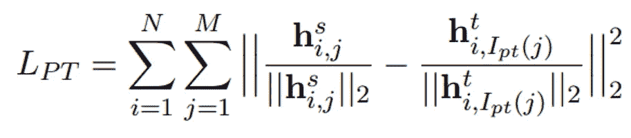
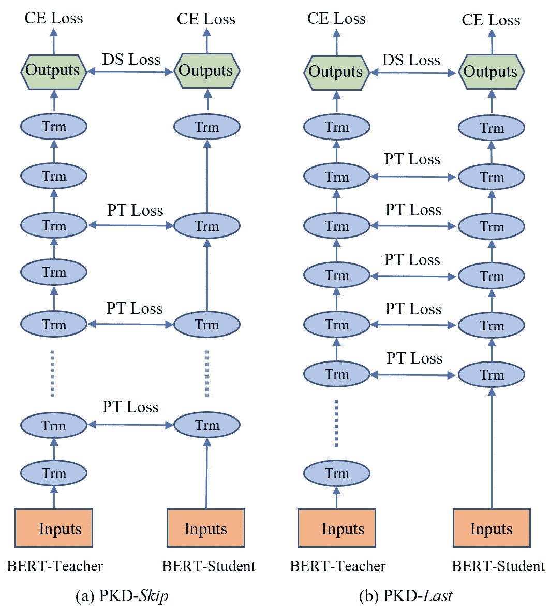

# 病人知识蒸馏

> 原文：<https://towardsdatascience.com/patient-knowledge-distillation-88969fffb4ba?source=collection_archive---------36----------------------->

## 让大型语言模型变得更小，以便在日常设备上使用。

邦内瓦尔·塞巴斯蒂安在 [Unsplash](https://unsplash.com?utm_source=medium&utm_medium=referral) 上拍摄的照片

随着深度学习的出现，更新更复杂的模型正在不断提高各种任务的性能。然而，这种改进是以计算和存储资源为代价的。这些模型中的大多数都有数百万或数十亿个参数，需要花费数天时间用具有几个 GPU 的极其强大的机器来训练。例如，Krizhevsky 等人的工作在 2012 年的 ImageNet 挑战赛中使用包含 6000 万个参数的网络取得了突破性的结果，该网络具有五个卷积层和三个全连接层。

这带来了一个新的挑战:将这些模型放在手机等设备上，这些设备的内存和计算资源通常比训练模型的服务器少得多。为了解决这个问题，研究人员开始探索模型压缩的想法，这种想法专注于在不损失太多准确性的情况下减少模型大小。为此设计了几种通用技术，包括量化(减少存储每个权重所需的位数)、参数共享(这减少了模型所需的总参数)和知识提取(创建一个新的“学生”模型，其层数较少，但精度与原始“教师”模型相似)。

在这项工作中，微软 Dynamics 365 AI 研究团队主要专注于压缩像 GPT 和伯特这样的艺术语言模型，这些模型虽然庞大，但构成了大多数 NLP 模型的基础。例如，BERT-base 有 1.09 亿个参数，BERT-large 有大约 3.3 亿个参数。为了使这些模型更小，他们提出了一种新的知识蒸馏(KD)方法来压缩模型，从而节省运行时间和内存，而不会损失太多的准确性。

当一个语言模型被传统的知识发现技术压缩时，当应用于下游任务如句子分类时，它会失去很多准确性。这是因为以前的 KD 方法集中于教导学生模型教师预测的最终概率 logit，而没有考虑任何隐藏层值。这类似于现实生活中的一个场景，一个孩子知道一个问题的最终答案是什么，但不知道他们是如何得到这个答案的，当面对一个稍微不同的问题时，孩子更有可能犯错误。使用传统的 KD 方法学习的学生模型也是如此。基于这一假设，本文提出了一个损失函数，该函数不仅试图将学生模型的最终概率与教师模型的最终概率相匹配，而且试图将它们的隐藏表示相匹配，从而使学生模型的泛化能力更强。这种模式被称为“病人知识蒸馏”(PKD)。

这项工作特别关注用于句子分类的 BERT 语言模型。在此设置中，模型的预测基于每一层的[CLS]字符(一种捕获上下文句子编码的特殊字符)的特征表示，例如向该特征添加两层完全连接。因此，PKD 提出了一种新的损失函数，使模型能够同时学习每一层[CLS]角色的特征表示:

其中 M 是学生的层数(如 3，6)，N 是教师模型的层数(如 12，24)，h 是模型中【CLS】隐层的表示，I，j 代表学生-教师，隐层的对应关系如下图所示。例如，当使用 12 层教师模型训练 6 层学生模型时，学生模型可以学习教师模型的每个交替隐藏层(在这种情况下是 2、4、6、8、10)的表示，称为 PKD-跳过，或者它可以学习教师模型的最后几层(在这种情况下是 7、8、9、10、11)的表示，称为 PKD-最后。我们不考虑学习教师模型的最终(第 12)层，而是直接学习最终概率预测，这也包括最终层的隐藏表示。

我们的方法，PKD-斯基普和 PKD-如何学习他们的层的可视化表示。

该团队应用这种技术，使用上述两种方法将 12 层 BERT 基础模型压缩为 6 层和 3 层 BERT 模型。他们发现 PKD-斯基普方法优于 PKD-拉斯特方法，所以所有讨论的结果都使用 PKD-斯基普方法。在 GLUE benchmark 上测试这两个压缩模型表明，PKD 击败了传统的 KD，并且不会导致准确率大幅下降。根据任务的不同，6 层 BERT 比 12 层 BERT 低 0.2%到 3.6%，而 3 层 BERT 低 2.8%-11.9%。这种下降是意料之中的，因为较小模型中的参数明显较少，这使得它们更难捕捉 12 层模型能够捕捉的所有信息。

在 RACE benchmark 上进行测试时，PKD 再次明显优于传统的 KD，6 层模型的准确性仅比 12 层模型低 5%。这种技术的最大好处是加快了预测流水线的速度(6 层快 1.94 倍，3 层快 3.73 倍)，并减少了模型所需的存储(6 层少 1.64 倍内存，3 层少 2.4 倍)。因此，通过 PKD，大型语言模型可以变得更小、更快，以便在笔记本电脑和手机等小型设备上使用。

如果你想了解更多关于 PKD 的细节，这里有一个[链接](https://arxiv.org/pdf/1908.09355.pdf)到论文，点击[这里](http://aka.ms/mmai)查看更多出版物和团队的其他工作。

**参考文献**

1.  [于成](https://arxiv.org/search/cs?searchtype=author&query=Cheng%2C+Y)，[王铎](https://arxiv.org/search/cs?searchtype=author&query=Wang%2C+D)，[周磐](https://arxiv.org/search/cs?searchtype=author&query=Zhou%2C+P)，[张涛](https://arxiv.org/search/cs?searchtype=author&query=Zhang%2C+T)，**深度神经网络模型压缩与加速综述** (2017)，arXiv 预印本 arXiv:1710.09282
2.  A.Krizhevsky，I. Sutskever，G. Hinton，**使用深度卷积神经网络的 Imagenet 分类**，神经信息处理系统，NeurIPS 2012
3.  孙思齐，于成，甘哲，，**病人进行 BERT 模型压缩**，自然语言处理中的经验方法，EMNLP 2019