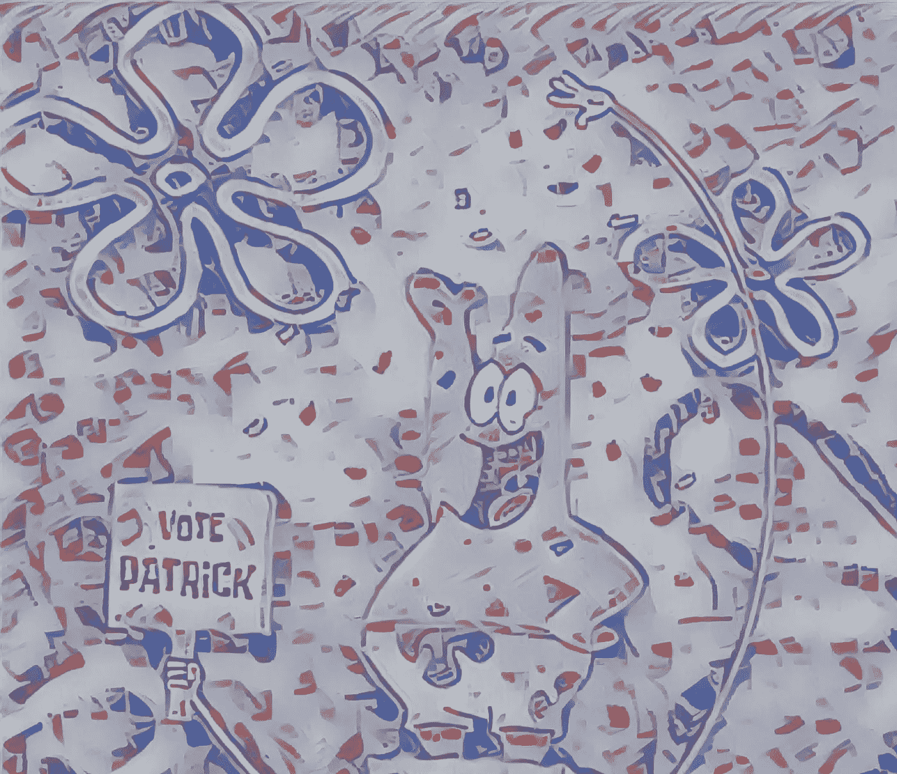
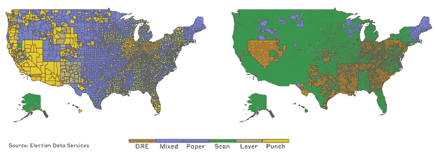
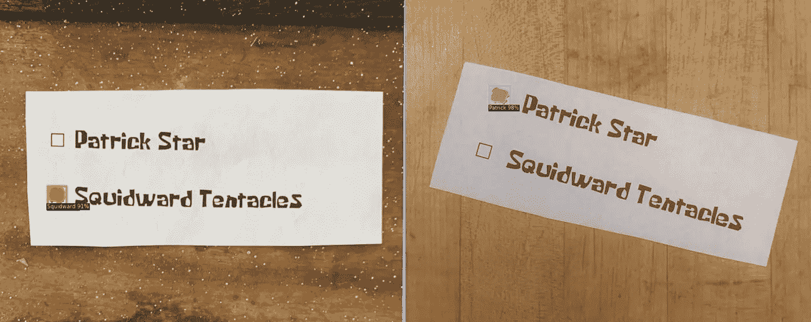
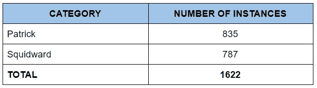
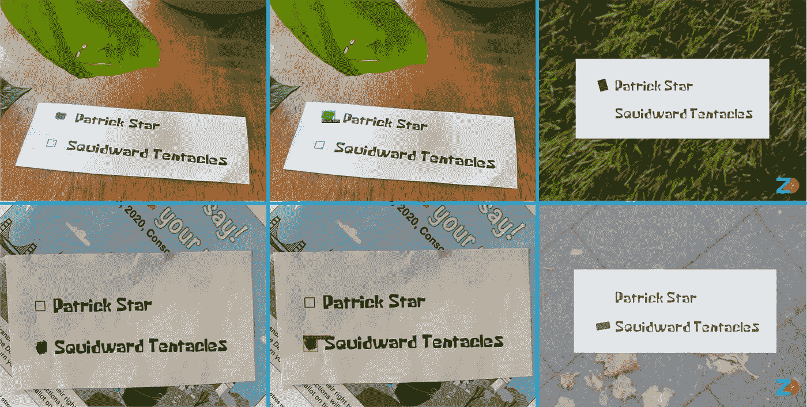
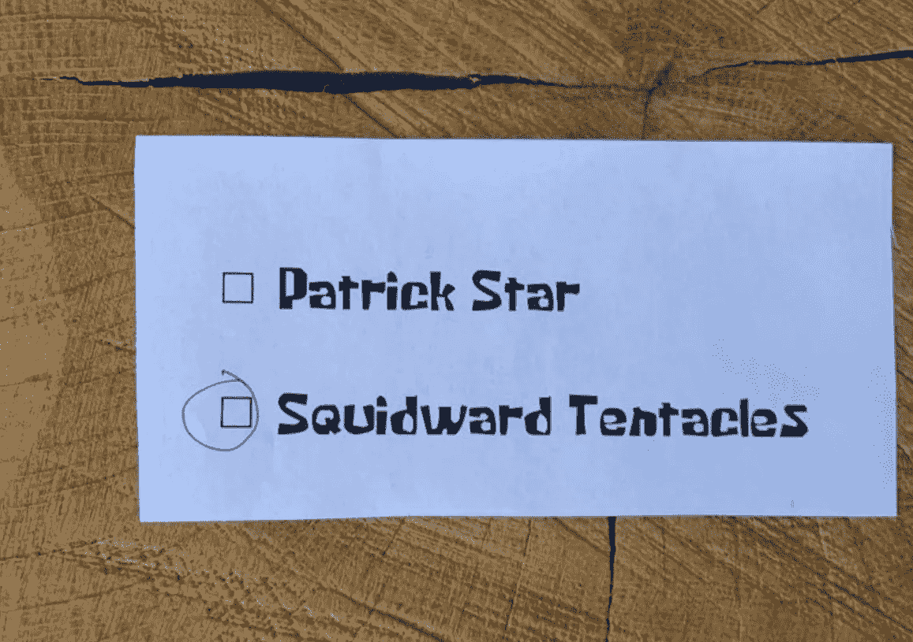
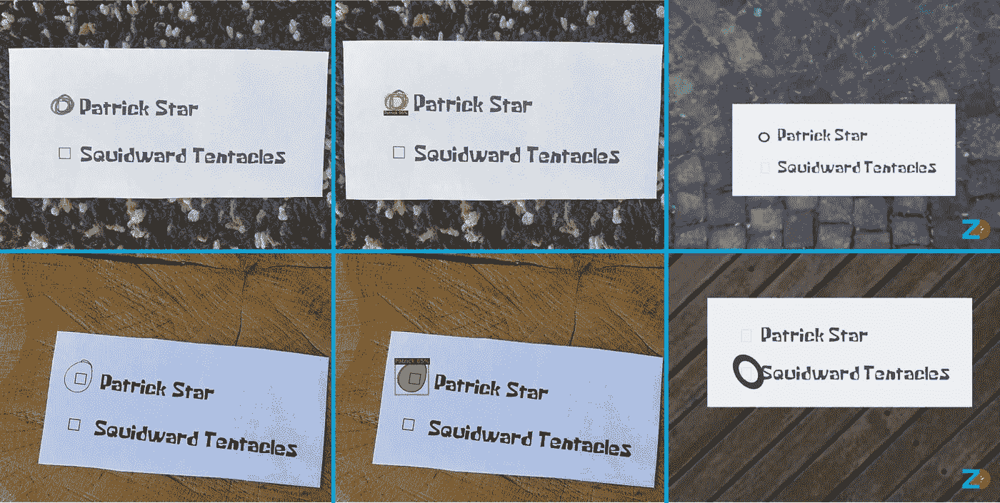

# 帕特里克 vs 斯奎沃德:用合成数据训练投票检测人工智能

> 原文：<https://towardsdatascience.com/patrick-vs-squidward-training-vote-detection-ai-with-synthetic-data-d8e24eca114d?source=collection_archive---------29----------------------->

我们训练了一个 CV 模型，仅使用合成数据来检测投票，以实现更加可靠和安全的投票。

帕特里克·波斯特风格转移艺术(图片由作者提供)

**投票问题**

现在是 2020 年 11 月，美国正在投票。

人们在讨论投票过程，而且并不赞成[1]。随着邮寄投票可能达到历史最高数字，我们的投票系统受到了更多的审查。这些担忧的来源集中在当前最先进的投票方法的准确性和速度上。这导致了选民对投票技术的不信任:即使你去投票，你的选票是否被正确计算？

我们决定解决光学扫描选票带来的问题。光学扫描纸质选票系统仍被广泛用于统计选票(见下图 1)。不幸的是，就目前的情况来看，光学扫描选票是出了名的不可靠。当其中一台机器出现故障时，将使用人工来验证结果(即有人查看)。

图 1:1980 年和 2016 年美国投票技术的变化(来源:www.electiondataservices.com)

**我们的想法**

我们提出的解决问题的想法是:一个简单的 CV(计算机视觉)模型来计算光学扫描选票。在 Zumo 实验室，我们正在创建合成数据来训练下一代 CV 模型，因此我们一直在寻找 CV 模型的酷用例。在理想的世界里，人类会检查每一张选票。但这并不可行。历史上，视觉计算系统一直被要求将技术提高到类似人类的精确度。

作为工程师，我们相信系统中的故障保险越多，系统设计就越好。该系统可以与现有系统一起使用，甚至可以取代现有系统。

计算光学扫描选票是一个很好的用例。模型不应受到烧蚀或光学扫描仪校准问题的影响。更重要的是:我们训练的模型可以部署在任何带有 RGB 摄像头的设备上，因此不需要昂贵的定制硬件。

可靠、安全的投票是可能的，下面是我们是如何做到的。

**实验**

在这个实验中，我们模拟了比基尼岛的一次选举，章鱼哥与现任的帕特里克·斯达进行了较量。

(请注意，在本文中，我们的目的只是展示这种系统可能拥有的能力，而不是完全封闭完整系统的外观。)

对于这个模型，我们决定使用一个带有**雷斯内特-FPN** 主干的**屏蔽 R-CNN** 。该模型配置来自脸书研究中心提供的 Detectron2，它为流行的架构提供了示例配置[3]。我们从头开始训练这个模型，以执行 Patrick 和 Squidward 两个类别的实例分割和包围盒检测。我们在合成数据上充分训练了这个模型，为每个填写的选票提供了边界框和分段掩码。

图 2:我们的综合训练模型在真实图像上的检测

**数据**

我们使用的数据集大致分为两半，一半是 Squidward 的投票，另一半是 Patrick 的投票。请注意，在本文中，我们没有将重复投票或无效投票考虑在内。

图 3:(左)实像(中)预测(右)合成像

你可能会注意到背景不同的视觉外观:这是一种叫做*域随机化的技术。*域随机化允许模型忽略背景，专注于重要的事情(即投票)。

我们的数据是使用流行的 Blender 软件和一些内部工具的组合生成的，我们希望在未来开源这些工具(注意！).该数据集可在我们的网站 [app.zumolabs.ai](http://app.zumolabs.ai) 上获得。

**模型训练:失败与学习**

让我们回到我们的海底村庄，我们实验的试验场。比基尼岛的选举开始后，投票委员会开始意识到选民们还不明白他们应该如何投票。不知情的选民不明白他们应该填充气泡，并决定在选票上画圈。

图 4:比基尼岛的投票者正在围着盒子打转！

回实验室去！我们当前的模型(上面训练的那个)不能检测这些圆，因为它只在填充的盒子上训练。简单快捷的解决方案:我们能够在创纪录的时间内生成一批新的合成数据，涵盖这个案例。

这是合成数据的巨大优势之一:一旦检测到边缘情况，就可以轻松生成数据集并训练模型来解决边缘情况。下面你可以看到改进的模型能够检测不正确的格式，显示了合成数据在帮助解决你尚未遇到的问题方面的力量。

图 5:我们根据添加的合成数据训练的模型现在可以识别投票者的选择

**需要考虑的事项:隐私**

选民希望他们的投票是秘密和安全的。在我们生活的世界里，人们对自己的隐私和数字足迹更加关注。许多 CV 系统使用以前收集的数据进行训练，这通常会引起许多隐私问题，因为最终用户和公司通常不知道后果和问题。

我们在 100%合成数据上训练上述模型。这意味着不需要记录投票，因此模型可以根据收集的真实数据进行训练。我们相信 CV 模型不仅可以使计票过程更加可靠，而且当 CV 模型在 100%合成数据上训练时，CV 模型还可以确保秘密和安全的投票。

**关闭思路**

我们希望现在我们已经建立了一些信任，关于计算机视觉模型如何被用作投票过程中的一个组成部分。最重要的是，我们希望展示合成数据如何让我们训练这些模型来适应不断变化的条件(快速捕捉所有边缘情况！)并把所有隐私问题抛到脑后。

如果你有自己的理论，或者你想用一个模型来测试你自己的直觉，但缺乏训练数据，或者如果你不同意我们关于投票过程的想法和结论，请通过 [norman@zumolabs.ai](mailto:norman@zumolabs.ai) 告诉我！很乐意聊天。

感谢您的阅读，并在今年 11 月通过投票发出您的声音！[4]

参考资料:

[1]帕姆·费斯勒。"为解决(选票)问题而战:解决缺席选票问题的竞赛."(2020 年 10 月)，NPR。([https://www . NPR . org/2020/10/19/924705412/race-for-a-ballot-cure-the-scramble-to-fix-minor-absent-ballot-problems](https://www.npr.org/2020/10/19/924705412/race-for-a-ballot-cure-the-scramble-to-fix-minor-absentee-ballot-problems))。

[2]投票技术。麻省理工学院选举实验室。([https://electionlab.mit.edu/research/voting-technology](https://electionlab.mit.edu/research/voting-technology))。

[3]检测器 2。([https://github.com/facebookresearch/detectron2](https://github.com/facebookresearch/detectron2))。

[4]去投票吧！([https://www.vote.org](https://www.vote.org))。