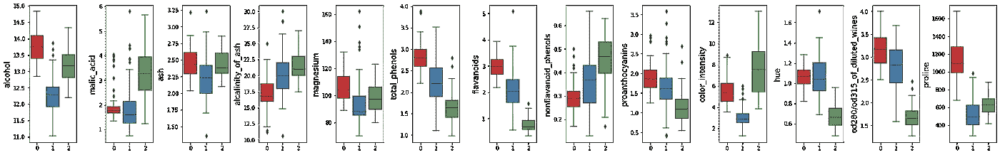
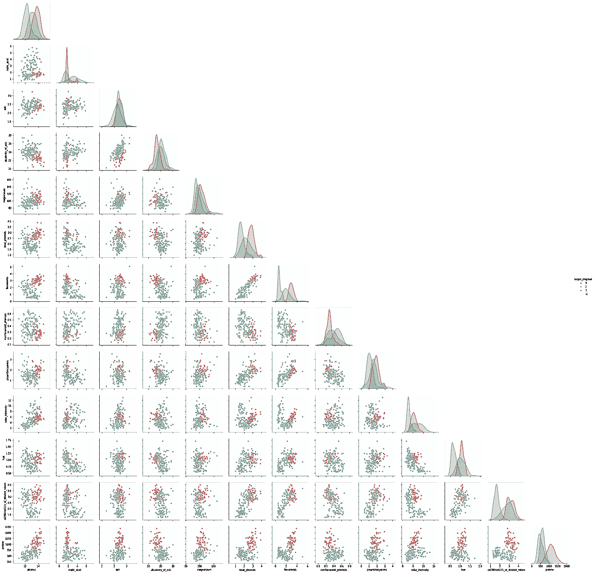
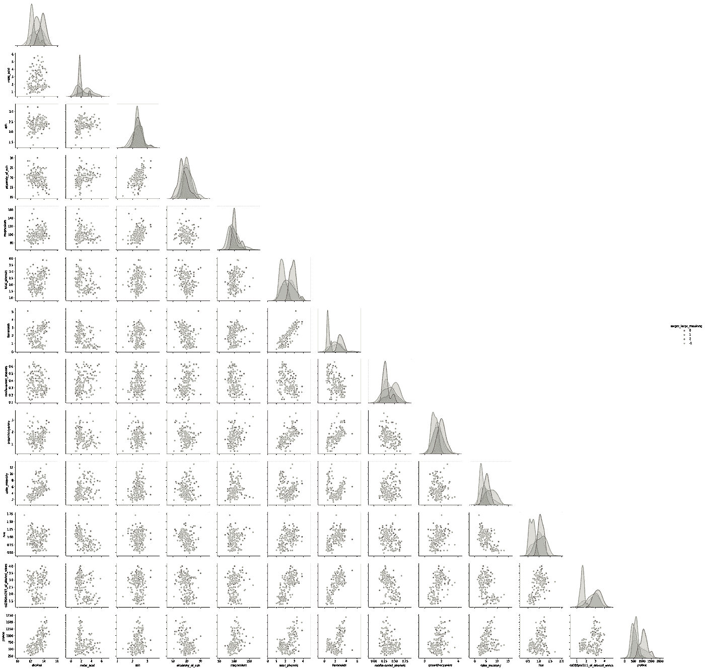
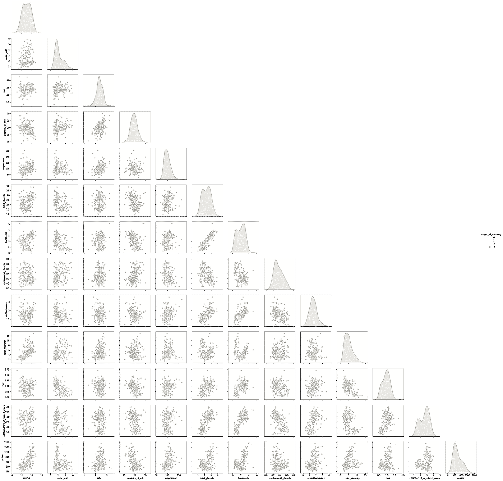
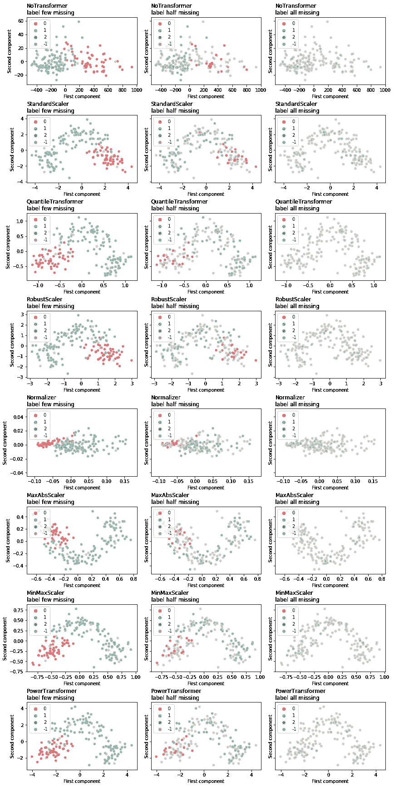
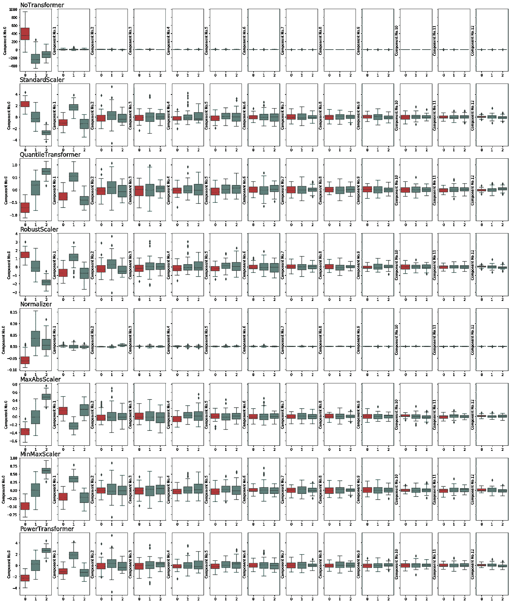
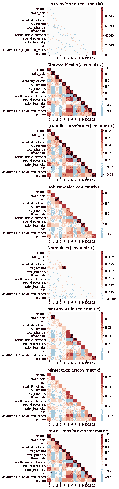
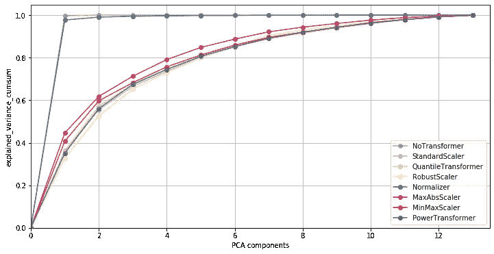
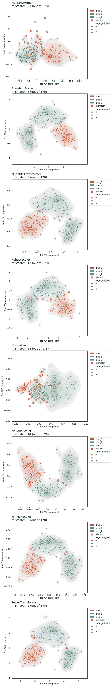

# 动手 PCA 数据预处理系列。第一部分:缩放变压器

> 原文：<https://towardsdatascience.com/pca-a-practical-journey-preprocessing-encoding-and-inspiring-applications-64371cb134a?source=collection_archive---------21----------------------->

## 尝试使用 PCA 却卡在处理阶段？看看这个。


[王思韵](https://medium.com/u/9377014bd7ca?source=post_page-----64371cb134a--------------------------------)。树枝上毛茸茸的小鸟【水彩】(2020)。我们用低聚艺术来表示 PCA 的感觉，就是降维。但是 PCA 能做的不止这些。

# 系列介绍

在本系列中，我们将探索缩放数据和 PCA 的结合。我们希望看到，每当我们遇到新的数据集时，我们如何才能更好地为机器学习任务准备数据。旅程由三部分组成。

*   第一部分:定标器和 PCA
*   第二部分:认识离群值
*   第三部分:分类数据编码

# 我们将在这篇文章中做什么

1.  简要回顾定标器和 PCA 的背景
2.  介绍要处理的数据集和任务
3.  对数据集执行缩放变换
4.  对缩放变换后的数据集进行主成分分析并评估性能

# 你将学到什么

*   理解定标器的重要性及其与 PCA 的密切关系
*   明智选择定标器
*   使相关和漂亮的可视化:)

> 在你开始阅读之前，我们明确建议你先玩一下笔记本(在 Colab 和 Github 上都有。请在这篇文章的末尾找到链接。)

# 定标器和 PCA

众所周知，PCA 对数据集的规模很敏感，因此将每个要素调整到合理的规模对 PCA 至关重要。在这一部分，我们将了解不同的定标器如何影响 PCA 结果。

> 这篇文章的灵感来自 Scikit-Learn 文档中的这个[教程](https://scikit-learn.org/stable/auto_examples/preprocessing/plot_scaling_importance.html#sphx-glr-auto-examples-preprocessing-plot-scaling-importance-py)。您将看到我们使用相同的[葡萄酒数据集](https://scikit-learn.org/stable/modules/generated/sklearn.datasets.load_wine.html)测试不同的定标器，并将不同定标的数据传递到 PCA 步骤。这款小玩具展示了 scaler + PCA 组合的强大功能，也许你想把它放在自己的工具箱里。

# 主成分分析简介

在深入了解更多细节之前，为了让我们的旅程更加完整，我们想先简单介绍一下 PCA。已经理解了后面的数学知识的读者可以直接跳到下一部分。


**术语警告**

> PCA 是“主成分分析”的缩写，其主要功能之一是降低数据集的维度(列)。并且是通过线性代数的[奇异值分解](https://en.wikipedia.org/wiki/Singular_value_decomposition) (SVD)来完成的。直观上，数据是以矩阵的形式出现的，矩阵的列是高维空间的轴。用这样的轴表示的数据点有时对于机器学习模型来说很难探索。SVD 所做的是找到数据集的更智能的表示(通过原始轴的线性组合)。新的抽象轴表示的数据更加模型友好。
> 
> 再多说几句:新的一组轴是相互正交的(甚至更好，正交)。这个属性对于基于树的模型来说尤其可爱。新的一组轴按照它们表示数据集信息或可变性的能力排序

# 数据缩放器


**总体思路**

> **我们为什么需要定标器？**想象一个房价数据集，包含房间数量、面积和单个公寓的价格等特征。这三列的可变性有很大的差异:房间数的最大差异很难超过 10 个房间，即数量级为 1；公寓面积的最大差异可以是 100 平方英尺的数量级；价格的差异很容易达到 10K 订单。
> 
> **scaler 和 PCA 有什么关系？**如果我们要对这样一个列的可变性按顺序不同的数据集应用 PCA，那些相对“平滑”的特征的效果将被最激烈的特征(本例中的价格)完全淹没。为了解决这个问题，我们对数据进行了缩放。

SciKit-Learn 中的一行代码提供了许多不同的定标器，如最常用的标准定标器和最小-最大定标器，以及其他非线性定标器。在这篇博文中，我们感兴趣的是在应用 PCA 之前测试所有这些可用的定标器，并看看它们如何与 PCA 一起工作。如果你有兴趣，这里有一个详细的[演示](https://scikit-learn.org/stable/auto_examples/preprocessing/plot_all_scaling.html#sphx-glr-auto-examples-preprocessing-plot-all-scaling-py)在这篇文章中测试的所有定标器。

# 开始测试吧！

让我们开始吧。首先，我们需要一些准备代码。我们将如下使用葡萄酒数据。

[**葡萄酒数据集**](https://scikit-learn.org/stable/modules/generated/sklearn.datasets.load_wine.html) 是一个图例数据集。这些数据是对意大利同一地区三个不同种植者种植的葡萄酒进行化学分析的结果。对于三种类型(产地)的葡萄酒中发现的不同成分，有十三种不同的测量方法。数据集仅包含数字要素。**我们的目标是使用 13 种不同的测量方法，找出目标标签(原点)。**首先，我们来快速看一下数据。

```
# note: the code in this post is mainly for illustration purpose. More details, please refer to the original notebook. link at the end of the blog.df_wine.head()
```

```
df_wine.describe()
```

我们诚挚地邀请您注意特征可变性顺序的差异:“非类黄酮 _ 酚类”的标准偏差为 0.4，而“脯氨酸”的标准偏差为 746。我们将在后面看到，如果不对数据集进行任何缩放，PCA 的结果将会因那些具有巨大差异的特征而产生很大偏差。

## 关于任务

数据集的目标列包含三个标签，因此它可以是一个多类分类任务。在这里，我们通过屏蔽不同数量的真实标签来模拟半监督和无监督的学习情况。我们做这个额外步骤的原因很快就会清楚了。让我们首先将数据可视化，以便获得一些见解。

## 探索性数据分析

数据非常干净。所有的特征都是数字变量。所以我们没有任何繁琐的数据清理工作要做。使用 seaborn 的 [pairplot](https://seaborn.pydata.org/generated/seaborn.pairplot.html) 和 box plot 可以很好地揭示数据集。

```
fig, axes = plt.subplots(nrows=1, ncols=len(df_features.columns), figsize=(len(df_features.columns)*2,4))
for index, col in enumerate(df_features.columns):
    ax = axes[index]
    sns.boxplot(y=df_wine.loc[:,col], x=df_wine.loc[:,'target_original'], palette=customer_palette, ax=ax)
    ax.set_ylabel(ax.get_ylabel(), fontsize='x-large')
    ax.set_xlabel("")plt.tight_layout(pad=0.5)
plt.show()
```



(提示:在单独的窗口中打开以获得更好的视图)

```
g = sns.pairplot(data=df_wine, 
                 vars=df_features.columns, 
                 hue='target_original',            
                 corner=True, palette=customer_palette,   
                 hue_order=target_order)
```



(提示:在单独的窗口中打开以获得更好的视图)

```
# target_large_missinng
g = sns.pairplot(data=df_wine, 
                 vars=df_features.columns, 
                 hue='target_large_missinng', 
                 corner=True, 
                 palette=customer_palette, 
                 hue_order=target_order)
```



(提示:在单独的窗口中打开以获得更好的视图)

```
# target_all_missinng
g = sns.pairplot(data=df_wine, 
                 vars=df_features.columns, 
                 hue='target_all_missinng', 
                 corner=True, 
                 palette=customer_palette, 
                 hue_order=target_order)
```



(提示:在单独的窗口中打开以获得更好的视图)

您可能想知道为什么用不同的颜色将相同的数据可视化三次。


**思考时间**

> 我们要求你在三种情况下区分三种不同的目标类别。

*   场景 1:使用颜色辅助(第一对图)
*   场景 2:使用弱颜色辅助(第二对图)
*   场景三:没有颜色辅助(最后一对图)。

这里的要点是，在没有目标标签或只有有限数量的标签的情况下，人眼区分不同的目标类别变得非常困难(注意:没有目标标签的场景类似于无监督学习的情况；标签数量有限的情况类似于半监督学习情况)。

虽然人类可能看不到特征之间更高维的交互，但机器学习模型可能会发现一些模式。然而，为什么不尝试以一种更智能的方式来表示数据呢？例如，在 PCA 之后加上一个适当的定标器。

# 比较不同的缩放器

## 第一眼

在这里，我们将使用 SciKit-Learn 的预处理子类中所有八种不同的缩放器来转换数据集。我们没有太注意调整定标器的超参数。我们绘制变换数据集的 PCA 的前两个分量的散点图，始终保持逐渐减少颜色辅助的精神。

```
# customer visualization function
# show scatter of 1st and 2nd PCA component
pca_scatter_plot(X_pca_dict, y_train.iloc[:,1:])
```



不要迷失在大量的散点图中。让我们仔细看看那些有助色的。我们的结论是，有了这个数据集，无论我们选择哪种定标器，都最好对数据进行定标。但是有一个例外:标准化器。规格化器以一种奇怪的方式缩放数据:按行而不是按列。我们不确定这种定标器何时有用，但我们很乐意与您讨论何时使用它。

如果您想知道为什么缩放的数据集比未缩放的数据更容易区分每个类。我们很高兴你问了。原因是缩放后的变量可以同等比较。相反，机器学习模型所看到的未缩放特征的重要性受其缩放比例的影响很大。


**思考时间**

> 这里有一个小练习，供有 PCA 数学知识的读者参考。不同类别的集群并不总是以相同的顺序出现，比如从左到右是红色、蓝色和绿色；它可以是绿色、蓝色和红色。为什么会出现这样的排列现象？

让我们继续深入研究 PCA 对不同规模数据集的作用。以下是 PCA 后每个特征的箱线图，不同的定标器按行区分。

```
# customer visualization function show PCA components
pca_box_plot(X_pca_dict, df_target.loc[:,'target_original'])
```



(提示:在单独的窗口中打开以获得更好的视图)

同样，在没有任何转换的情况下，几乎所有有趣的信息都集中在第一个组件上，给空间的其余部分留下很少的变化。我们认为第一个成分中最重要的成分是原始数据中的“脯氨酸”。实际上，这些框的行为几乎与使用上述原始特征空间为“脯氨酸”绘制的框的行为相同。

如果我们看看其他缩放器(除了规格化器)，我们可以看到当从第一个分量(即，最有信息的分量)到最后一个分量(即，最没有信息的分量)时，盒子反弹越来越少的趋势。更有趣的是，几乎所有的定标器都会对第三个分量产生截止效应。在这个阶段，我们可能有足够的信心，前两个组件是有代表性的。

我们可以更深入地研究一下协方差矩阵。因为 PCA 直接作用于协方差矩阵并输出主成分。这是故事的开头。

让我们通过 Seaborn 的热图函数来可视化协方差矩阵。


**警告注释**

> 一个重要提示:我们通常用热图来表示皮尔逊相关系数矩阵(CC 矩阵)，但这两个矩阵有一个关键区别:一个协方差矩阵中的值不一定在(-1，1)之间，对角线上的值也不一定都是 1。这就是为什么我们使用下方的三角形热图来绘制对角线值。

```
trans_heat_plot_abs(X_trans_dict, y_axis_labels=df_features.columns)
```



此时，与散点图和/或盒状图相比，热图可能不是很直观，因为标签信息没有进入热图。此外，一些颜色条的精细渐变使得一些热图彼此非常相似。

然而，我们确实从这些热图中得到了一个线索，即矩阵如何适应 PCA。**经验法则是，热图越丰富多彩，PCA 结果越好。通常，PCA 不喜欢看起来简单的热图，并且会输出不太有趣的主成分。**在我们的例子中，由于“脯氨酸”是最突出的，PCA 将会关注它。这和我们之前的分析是一致的。另一个简单的方法是归一化转换数据。根据热图，我们可能会猜测五氯苯甲醚中的一种成分主要来自“镁”；因此，标准化器+ PCA 给出了沉闷的结果。

```
# plot the explained_variance cumsum using previously calculated PCA instances.
pca_plot_cumsum(instance_pca_dict)
```



## 聚类算法如何喜欢我们处理过的矩阵？

通过观察由 PCA 发现的特征空间的新方面的前两个维度，我们或多或少对预处理结果感到满意。然而，能够看到更高维度相互作用的聚类算法会像我们一样偏爱相同的变换矩阵吗？让我们使用机器学习聚类模型对数据进行聚类。

我们在标记数据集上执行聚类任务的一个优势是，我们知道正确的类数。接下来，我们将看到 k 均值与真实标签的吻合程度。

> 这里我们采用了博客的第一个度量标准: [**V-measure score**](https://scikit-learn.org/stable/modules/generated/sklearn.metrics.v_measure_score.html) 。我们不会详细讨论这个指数；你只需要知道:
> V-measure 得分有界在[0，1]范围内:接近 0 的值是不好的，1.0 代表完全匹配。

```
df_scores
```

我们比较了三个场景:两个原始特征的聚类，两个信息量最大的主成分分析，以及整个特征集。我们选择了两个特征或组件来保持与之前散点图的一致性。虽然更多的列可能会更彻底地揭示数据集的信息，但我们认为至少从一开始，两个维度就足够了。

让我们仔细看看上表。

*   **首先是**，让我们关注最后一列，它包含使用整个数据集的 V-measure 得分。无论我们选择哪种缩放器，缩放数据总是更好。(除了“规格化器”)
*   **其次**，对于特征空间的原始方面，使用整个数据集总是更好。选择“似乎”能更好地说明聚类的特征子集似乎不是一个好主意。(只看第一列和第三列的对比)。
*   另一方面，对于 PCA 变换的数据，情况就不同了。有时，只使用几个组件比使用所有组件会产生更合理的集群。(看一下第二列和第三列的对比)。即使在某些测试中，前两个组成部分的选择并没有超过总体，但两个选择之间的 V-measure 得分非常接近。(因为这里我们比较的是 2 列矩阵和 13 列矩阵的计算来源。)
*   **最后是**，查看第二列，我们发现最适合这项任务的定标器是两个非线性定标器和标准定标器。因此，在直接应用最常用的标准定标器之前，您可能希望通过简单的测试来尝试更多的定标器。

我们想就 PCA 显示的少即是多现象多说几句。人们经常争论说，丢弃原始数据集中的信息是不明智的；这样做有时非常危险。然而，主成分分析揭示了数据矩阵中最重要的模式，同时过滤掉了一些细节。这些细节可能只是噪音。因此，采用前几个 PCA 组成部分不仅有助于减少条件性，还可以使信息更加顺畅，使事情更加清晰。

```
kmeans = KMeans(n_clusters=3, random_state=RANDOM_STATE)pca_cluster_contour_plot(X_pca_dict,y_train, kmeans)
```



# 摘要

在本帖中，我们通过展示散点图，比较了 PCA 作用于不同尺度数据的结果。从视觉上我们可以看到，这种组合确实比没有预处理的数据集的模式更清晰。在应用 PCA 之前，外卖将始终检查数据集中每个要素的方差，如果方差之间存在较大差距，则使用适当的缩放器缩放数据。根据你的任务，“适当”的定义可以有所不同。

下一次，我们将通过引入合成异常值和分类特征来扩展这种定标器+ PCA 组合的限制。

**我希望你喜欢这篇文章。请随时留下评论。**

> 声明:该系列由莫克菲和王思韵[王思韵](https://medium.com/u/9377014bd7ca?source=post_page-----64371cb134a--------------------------------)合作。第一次发布:2020 年 6 月 8 日。

# 笔记本链接:

 [## blog-PCA-part I _ kefei _ 0608 . ipynb

### 合作笔记本

drive.google.com](https://drive.google.com/file/d/1UQ-f7e1ImdLX7mJuxY-pY1RWkXDwn-cc/view?usp=sharing) [](https://github.com/kefeimo/DataScienceBlog/blob/master/1.%20PCA/blog-PCA-part%20I_kefei_0608.ipynb) [## kefeimo/数据科学博客

### permalink dissolve GitHub 是超过 5000 万开发人员的家园，他们一起工作来托管和审查代码，管理…

github.com](https://github.com/kefeimo/DataScienceBlog/blob/master/1.%20PCA/blog-PCA-part%20I_kefei_0608.ipynb)