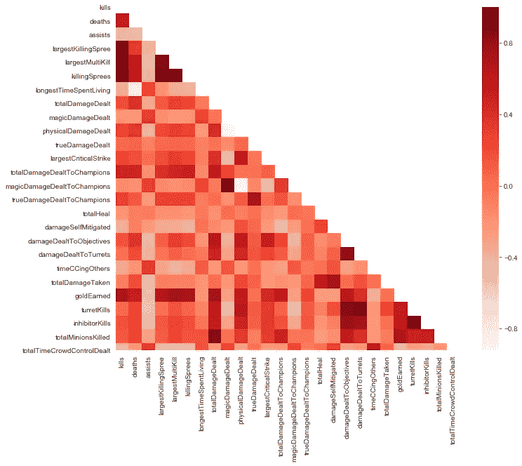
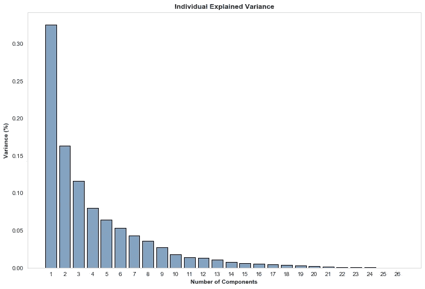
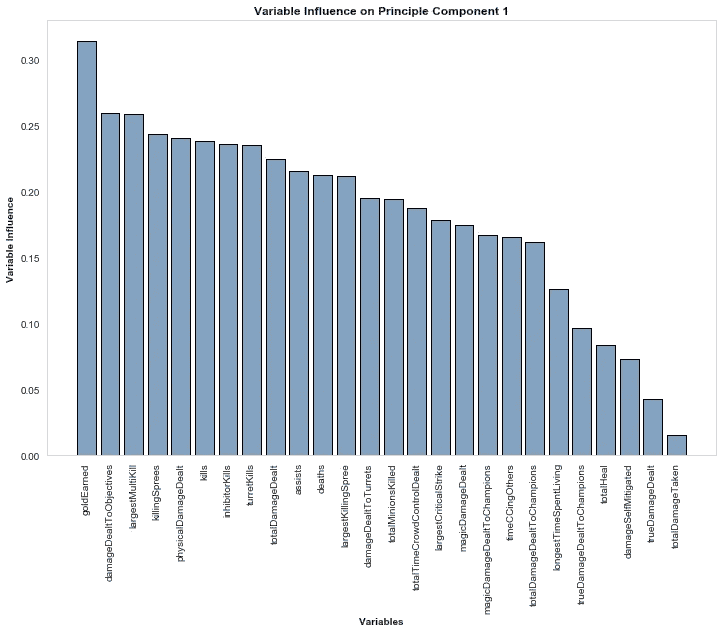
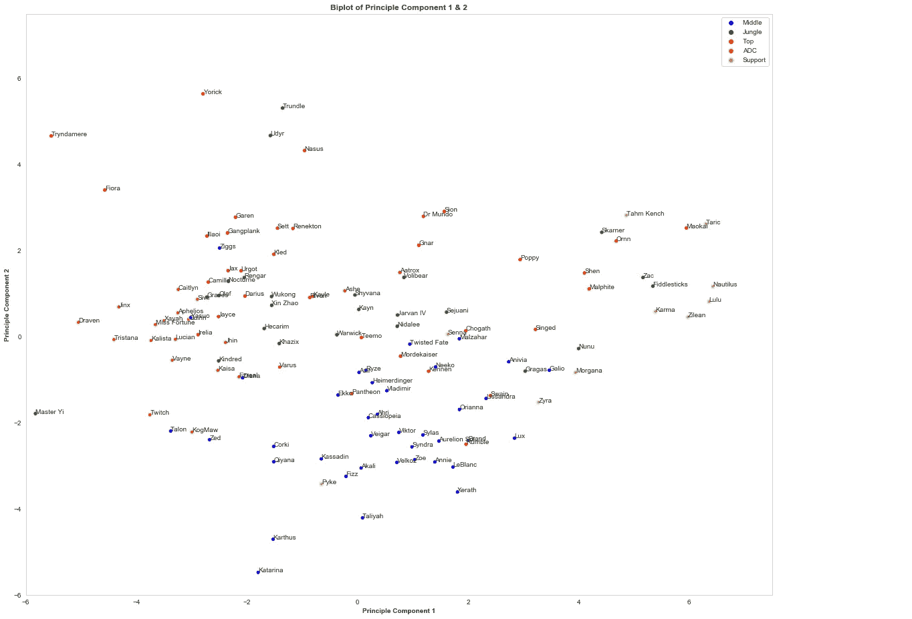

# 用于冠军推荐的基于内容的 PCA 建模(英雄联盟)

> 原文：<https://towardsdatascience.com/pca-and-content-based-modelling-for-champion-recommendation-league-of-legends-80e909e56672?source=collection_archive---------32----------------------->

照片由 [Pexels](https://www.pexels.com/photo/abstract-art-blur-bright-373543/?utm_content=attributionCopyText&utm_medium=referral&utm_source=pexels) 的 [Pixabay](https://www.pexels.com/@pixabay?utm_content=attributionCopyText&utm_medium=referral&utm_source=pexels) 拍摄(免费使用)

**注:**以下所有代码可在[这里](https://github.com/JackWillz/Projects/blob/master/Champ%20Recommendation%20and%20PCA.ipynb)找到。

之前我写了一篇文章关于我们如何在游戏《英雄联盟》中使用图形网络来帮助提供冠军推荐。这种技术被称为**“用户-用户协同过滤”**，我们利用我们所知道的关于一个人的信息来寻找相似的用户，然后根据我们所知道的他们喜欢什么来进行推荐。

为了帮助说明这一点，我们将使用经典的亚马逊例子。想象一下，你已经在你的亚马逊购物篮中添加了一款 PS4 和最新的 FIFA 游戏，该算法会查看之前一起购买了 PS4 和 FIFA 的所有用户，然后找到他们倾向于在他们的购物篮中添加哪些其他项目，即最新的 NFL 游戏 Madden，然后向你推荐。

今天，我们来看一种不同形式的推荐算法，称为**“基于内容的模型”。**相反，这种技术会根据物品的相似性将它们联系在一起，例如，如果你正在购买 EA 制作的 PS4 体育游戏，那么这里有一些 EA 制作的其他 PS4 体育游戏。当你没有关于用户偏好的信息时，比如刚刚发布产品时，这种技术是有利的。

然而，有将近 150 个 LoL 冠军，我们不想把所有的时间都花在给他们贴上我们需要的各种标签上。因此，相反，我们要做的是使用他们的游戏内统计数据来“描述”冠军，例如他们每场比赛的平均杀伤数或他们造成的客观伤害。

为此，我们可以分析 150，000 个钻石游戏。请注意，我将这一点仅限于顶级、中级和 ADC 玩家，只是考虑到他们的统计数据中固有的差异支持和 junglers(即小黄人的低黄金)。

对所有冠军的数据进行平均后，首先要注意的是许多统计数据之间有一些非常明显的相关性。“杀戮优先”和“杀戮”等属性几乎完全相关，这并不奇怪(前者表明玩家已经疯狂杀戮了多少次，后者是该游戏中总共杀戮了多少次)。

图表说明了如此大量的属性所产生的多重共线性问题。

处理这种程度的多重共线性的常用方法是排除(挑选 kills，删除 killing prees)或聚合(kills * killingSprees)。然而，有一个更好的解决方案，称为主成分分析(PCA)，它能够提取这些属性之间的核心关系，而无需人工干预或删除潜在的关键驱动因素。

PCA 是一个相当复杂的主题，需要理解特征向量/值，并且有很多关于它的很好的文章，所以我在这里不赘述。相反，我会说，主成分分析试图做的是尽可能多地捕捉数据中的差异，同时尽量减少变量的使用。

每个成分解释的原始数据的方差百分比，总和为 100%。

在将 PCA 拟合到数据集之后，我们发现超过 30%的数据方差可以拟合到单个分量中，然后在第二个分量中找到超过 16%的方差，在第三个分量中找到大约 11%的方差，以此类推..

但是这些组件是什么呢？为了帮助理解它们是由什么组成的，它们来自哪里，请看下图，它说明了哪些变量是第一个组成部分的一部分。很明显，除了客观伤害、最大的多重杀戮、疯狂杀戮的数量、造成的伤害和总杀戮数之外，金钱是最大的贡献者。可以肯定地说，这个组件正在捕捉与跺脚车道相关的变量。如果我们加上“物理”伤害被指定的事实，你几乎可以看到菲奥拉/瑞文/Trynd one 的把戏出现在你的眼前。

说明哪些原始变量与第一个成分高度相关的图形。

第二个组成部分包含了两个主要属性:占领塔和伤害自缓解(格挡/格挡/免疫/减少等)..).然而，您可能会想这与基于内容的推荐模型有什么关系！嗯，我们现在有两个组成部分，包含了冠军之间超过 50%的差异。这些可以被认为是描述的代理，在那里我们有“杀死所有人的冠军”而不是“运动游戏”，并且“由 EA 生产”变成了“高炮塔伤害”！然后，我们可以在 2D 空间中绘制出这些描述性的组件，我们可以开始看到它们是如何组合在一起的(警告，大的旧图形向您展示):

前两个组件的 2D 表示，可用作推荐引擎的基础。冠军的颜色取决于他们的主要角色，但数据不一定是从那个位置的球员那里收集的。

*注意:尽管“支持”冠军在这里以黄色显示，但数据实际上仅来自农场。也就是说，你在上面看到的基兰数据是冠军在顶级、中级或 APC 比赛时的数据。*

那些关注的人会注意到组件 1 是颠倒的，在 X 轴上**高**伤害/死亡被记为**低**。组件 2 不反转，因此 Y 轴上的**高**数字表示炮塔获取和伤害减轻的**批次**。为了确保它像预期的那样工作，看看左上方的冠军(即，造成大量物理伤害，占领塔和减轻伤害)；菲奥拉& Tryndamere (Trynd 的 ult 算作伤害减轻)。在底部中间我们可以看到卡塔琳娜和卡瑟斯，他们在伤害和杀戮上得分相对较高，但是不能击碎炮塔和减轻伤害。我觉得不错。

接下来的步骤很简单，推荐基于与他们当前比赛的冠军欧氏距离(直线)最短的冠军。你经常玩宝石骑士吗？试试毛凯。暗影之拳？汽水怎么样？不死的蒙多博士？你会喜欢我们的儿子西昂的。

如果我们想在这方面有所发展，我们就要向更高维度发展。如果你回到显示每个组件中有多少差异的图表，我会说有一个论点是基于 3 维，甚至 5 维来构建模型。其余的工作是一样的，但是考虑到观想变得棘手，我们现在就把它留在那里！

我希望这为潜在的推荐类型提供了另一种见解，可能值得探索，PCA 提供的好处，虽然我使用英雄联盟作为我的领域，但这些可以很容易地应用于任何其他领域。我建议回到大图，找到你的主要部分，看看你是否同意它周围的那些是类似的玩法——让我在下面的评论中知道！

你已经看到文章的结尾了！我叫 Jack J，是一名将人工智能应用于竞技游戏和电子竞技的专业数据科学家。我是 [**iTero 的创始人。GG**T3](https://itero.gg/)[和**jung . GG**。你可以在](https://www.jung.gg/) [**Twitter**](https://twitter.com/JackJGaming) 上关注我，加入 [**iTero Discord**](https://discord.gg/hZmk3z6adP) 或者给我发邮件 **jack@itero.gg** 。下一场见。

*最初发表于:*[【https://itero.gg/blog】T21](https://itero.gg/blog)