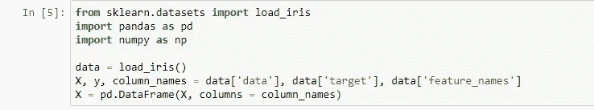
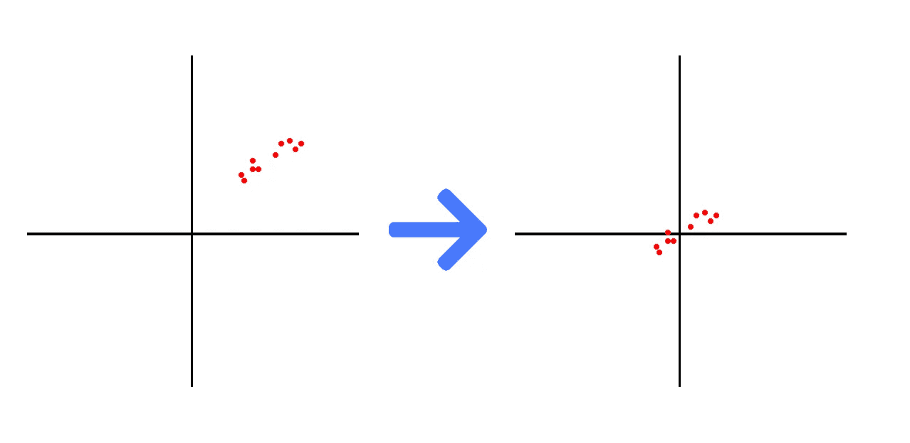
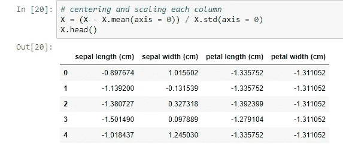
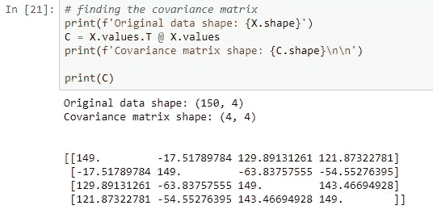
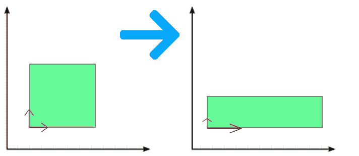
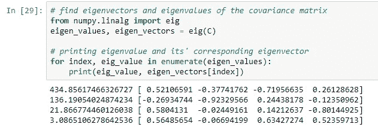
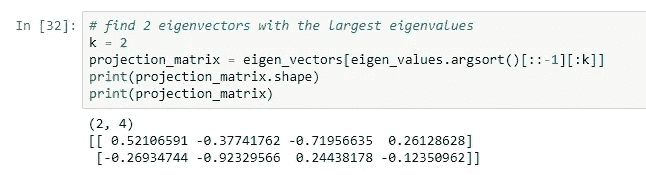
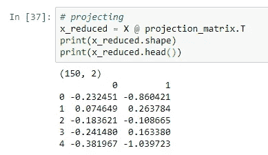
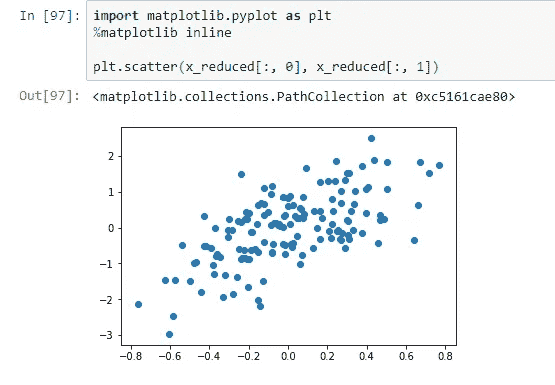

# 在 2 分钟内解释并实施 PCA

> 原文：<https://towardsdatascience.com/pca-explained-and-implemented-in-2-minutes-e024c832bb9c?source=collection_archive---------33----------------------->

## 【警告】超级容易！

[图像来源](https://unsplash.com/photos/8P4TXHFB-Vo)

PCA 或主成分分析是最著名的降维算法之一。它的主要目的是减少给定数据的大小，根据需要保留尽可能多的信息。在本文中，我将简要解释 PCA 算法并实现它。我们走吧！

1.  作为第一步，让我们准备数据。我将使用 Iris 数据集作为一个玩具示例。

2.现在，让我们将数据集居中，如下所示:

在代码中，它看起来就像这样(我不仅从相应的列中减去了每一列的平均值，还除以标准偏差以标准化数据)。

3.现在，我们应该找到数据的协方差矩阵。

协方差只是两个特征之间的线性相关性度量。因此，我们正在计算每对特征之间的线性相关性度量。

4.已知协方差矩阵，让我们找到它的特征分解(即找到它的特征值和相应的特征向量)

特征向量是一个向量，当应用线性变换时，它不会改变方向。在下图中，你可以看到两个红色的特征向量。

同样，每个特征向量有一个相应的特征值，它等于特征向量的大小。

让我们借助 numpy.linalg 模块来寻找特征分解。

从协方差矩阵中找到的特征值越大，对应的特征向量的方差就越大。因此，为了选择 k 个最佳分量，我们需要选择 k 个具有最大特征值的特征向量。

5.我现在将选择协方差矩阵的前 2 个特征值。

6.最后一步是将初始数据集投影到这两个向量所跨越的子空间上。

注意，得到的 x_reduced 值是数据集初始列的某种线性组合，这导致了方差最大的两个分量。

7.最后，让我们画出我们的 2 个分量，来检验结果。

希望，这篇短文对你有帮助。感谢您的阅读！

**你可以在我的** [**网站**](http://artkulakov.com) 上查看其他帖子