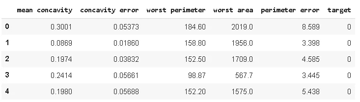
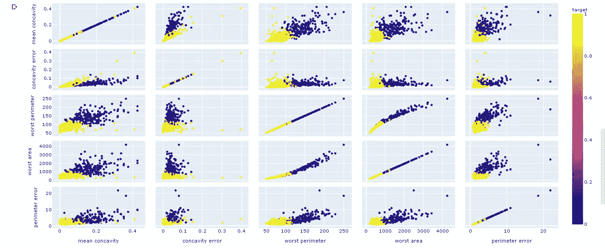
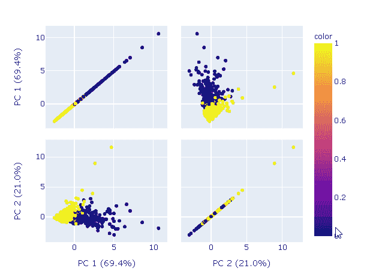
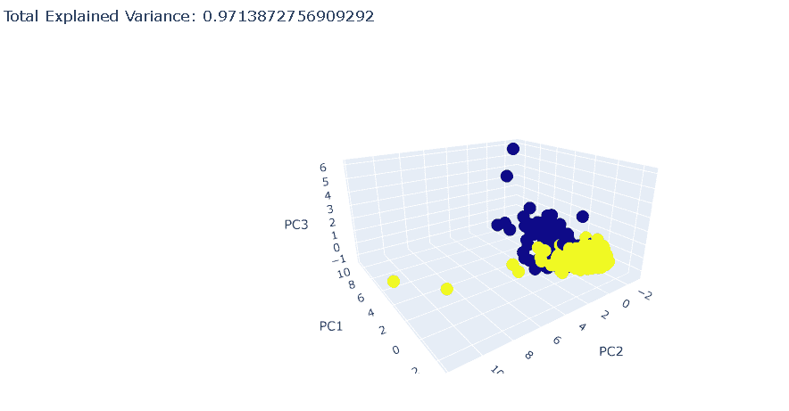

# 用动态图形可视化解释主成分分析

> 原文：<https://towardsdatascience.com/pca-explained-with-dplotly-visualizations-7ae2f6685e01?source=collection_archive---------27----------------------->

## PCA 和 Plotly 实用指南。

PCA(主成分分析)是一种无监督的学习算法，它在数据集中寻找特征之间的关系。它也被广泛用作监督学习算法的预处理步骤。

使用 PCA 的目的是通过找到尽可能解释数据集中差异的主成分来减少特征的数量。主成分是原始数据集特征的线性组合。

PCA 的优点是使用比原始数据集少得多的特征保留了原始数据集的大量差异。主成分是根据它们所代表的方差来排序的。

在这篇文章中，我们将首先实现一个 PCA 算法，然后用 Plotly 创建动态可视化来更清楚地解释 PCA 背后的思想。

这篇文章更实际一些。如果你想更深入地了解 PCA 实际上是如何工作的，这里有更详细的理论方面的[帖子](/principal-component-analysis-explained-d404c34d76e7)。

**Plotly Python** (plotly.py)是一个基于 plotly javascript (plotly.js)构建的开源绘图库，它提供了一个高级 API ( **plotly express** )和一个低级 API ( **graph objects** )来创建动态和交互式可视化。使用 plotly express，我们可以用很少的代码行创建一个很好的情节。另一方面，我们需要用图形对象编写更多的代码，但是对我们创建的内容有更多的控制。

让我们从导入相关的库开始:

```
import numpy as np
import pandas as pd
from sklearn.decomposition import PCA
from sklearn.datasets import load_breast_cancer
```

我将使用乳腺癌数据集，它包含 30 个特征和一个指示细胞是恶性还是良性的目标变量。为了简化可视化，我将随机选择 5 个特征。

```
dataset = load_breast_cancer()
X, y = load_breast_cancer(return_X_y = True)df = pd.DataFrame(X, columns=dataset.feature_names)
df = df.sample(n=5, axis=1)
df['target'] = ydf.head()
```



让我们创建一个 scatter_matrix 来显示特征对的散点图。我们得到了特征对在分离目标类方面有多成功的概述。

```
import plotly.express as pxfig = px.scatter_matrix(df, dimensions=df.columns[:-1], color='target', title='Scatter Matrix of Features', height=800)
```



有些特征更能区分目标阶层。

让我们应用主成分分析来用 2 个主成分表示这 5 个特征。

```
X = df.drop(['target'], axis=1)#Normalize
from sklearn.preprocessing import StandardScaler
sc = StandardScaler()
X_normalized = sc.fit_transform(X)#Principal components
pca = PCA(n_components=2)
components = pca.fit_transform(X_normalized)
```

PCA 类的一个属性是**explained _ variance _ ratio _**，顾名思义，它告诉我们每个主成分解释了总方差的多少。

```
pca.explained_variance_ratio_
array([0.69369623, 0.20978844])
```

原始数据集中 90%的方差由两个主成分解释。

让我们用主成分创建一个散布矩阵。

```
labels = {
str(i): f"PC {i+1} ({var:.1f}%)" 
for i, var in enumerate(pca.explained_variance_ratio_ * 100)
}fig = px.scatter_matrix(components, labels=labels, dimensions=range(2), color=df['target'])fig.show()
```



Plotly 还提供了 3D 散点图，当我们有 3 个主要组成部分时，它会很有用。为了实验 3D 图，我们首先需要再次对数据集应用 PCA 以创建 3 个主成分。

```
pca = PCA(n_components=3)
components = pca.fit_transform(X_normalized)
```

我们现在可以创建一个 3D 散点图。

```
var = pca.explained_variance_ratio_.sum()fig = px.scatter_3d(components, x=0, y=1, z=2, color=df['target'],title=f'Total Explained Variance: {var}',
labels={'0':'PC1', '1':'PC2', '2':'PC3'})fig.show()
```



两个主成分的总解释方差为%90。当添加第三个主成分时，它增加了%7。

出于演示目的，我们使用了乳腺癌数据集的子集。随意使用整个集合，看看主成分解释了总方差的多少。

绘制主要成分将有助于深入了解数据集中的结构以及要素之间的关系。

感谢您的阅读。如果您有任何反馈，请告诉我。