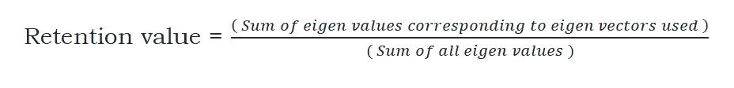
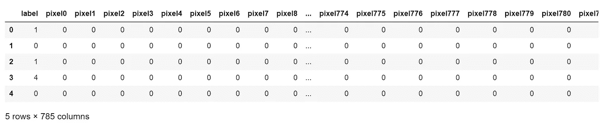
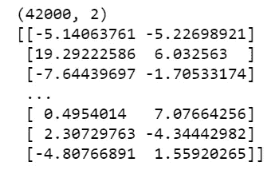
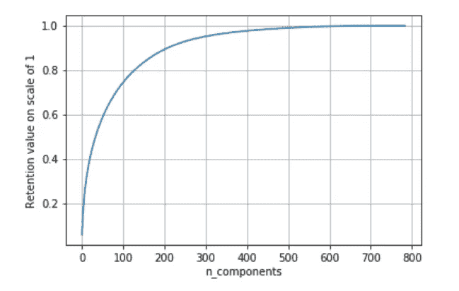

# 一行代码中的 PCA。

> 原文：<https://towardsdatascience.com/pca-in-a-single-line-of-code-ed79ae42059b?source=collection_archive---------32----------------------->


复杂问题的简单解决方案！图片来自 [Pixabay](https://pixabay.com/photos/hiking-trail-trail-single-trail-336603/)

利用主成分分析进行维数约简

在真实世界的数据中，有大量的要素，很难分析或可视化这些海量的数据。因此，我们在数据预处理阶段使用降维来丢弃冗余特征。

***降维*** 是将数据投影到一个更低维度的空间，这样更容易对数据进行分析和可视化。然而，维度的减少需要在准确性(高维)和可解释性(低维)之间进行权衡。

但关键是保留最大方差特征，减少冗余特征。

PCA 代表 ***主成分分析*** 。以下是维基百科对五氯苯甲醚的描述。

> 给定[二维、三维或更高维空间](https://en.wikipedia.org/wiki/Real_coordinate_space)中的点的集合，可以将“最佳拟合”线定义为最小化从点到该线的平均平方距离的线。可以类似地从垂直于第一条线的方向中选择下一条最佳拟合线。重复这个过程产生一个[正交](https://en.wikipedia.org/wiki/Orthogonal) [基](https://en.wikipedia.org/wiki/Basis_(linear_algebra))，其中数据的不同维度是不相关的。这些基向量称为**主成分**，几个相关的程序**主成分分析** ( **PCA** )。

从广义上讲，PCA 就是找出有效的成分(特征)，丢弃多余的特征。于是，我们计算**主成分**来实现降维。

说到这里，首先，让我们理解 PCA 背后的数学原理，然后进入那行神奇的代码。

假设我们有一个数据集 X，有“n”个数据点和“d”个列/特征。我们想把这个 d 维转换成 d `，比 d 小很多。

***PCA 降维背后的数学:***

**1。标准化数据:**

*   数据标准化意味着使数据的均值为 0，标准差或方差为 1。
*   标准化有助于数据归入相同的范围，并且不受单位/度量的限制。
*   这可以使用 sklearn.preprocessing 轻松完成

**2。计算数据的协方差矩阵:**

*   协方差矩阵是通过基于每列对每个元素应用方差来形成的。
*   协方差矩阵是列数大小的正方形对称矩阵。

**3。矩阵的特征分解:**

*   *特征向量:*特征向量是当对其应用线性变换时，其方向保持不变的向量。
*   *特征值:*特征值是变换过程中使用的比例因子。
*   求协方差矩阵 s 的特征值和对应的特征向量。
*   对于大小为 dxd 的协方差矩阵，我们得到‘d’个特征值和‘d’个特征向量。

**4。对协方差矩阵进行特征值分解**

*   将 d '个特征向量中的每一个排列成向量 v 中的列。现在，向量 v 的形状是，dxd '
*   数据集 X(nxd)和 v (dxd `)的点积产生大小为 nxd `的降维数据集。让我们称之为 x`。

现在，数据集，X 个 n 个数据点和 d 个特征被简化为 X’个 n 个数据点和 d’个特征的数据集。

然而，降维对数据的保留几乎没有什么好处。

为了计算保留百分比，我们使用特征值。这里有 d 个特征向量，在这 d 个特征向量中，我们使用了 d 个特征向量。

这是一个简单但非常有用的公式，用于在降维后保留数据。



保留值的数学公式

到了实现部分，我们可以使用 python 来执行这些步骤。然而，sckit-learn 提供了一个以更简单的方式执行 PCA 的库。

本文使用的数据集是 Kaggle 著名的 [**MNIST 数字识别器**](https://www.kaggle.com/c/digit-recognizer) 数据集。

***数据描述:***

*   数据文件包含手绘数字的灰度图像，从 0 到 9。
*   每幅图像高 28 像素，宽 28 像素，总共 784 像素。每个像素都有一个与之关联的像素值，表示该像素的亮度或暗度，数字越大表示越暗。该像素值是 0 到 255 之间的整数，包括 0 和 255。
*   训练数据集(train.csv)有 785 列。第一列称为“标签”，是用户绘制的数字。其余的列包含相关图像的像素值。
    数据集中的每个像素列都有一个类似 pixelx 的名称，其中 x 是 0 到 783 之间的整数，包括 0 和 783。为了在图像上定位这个像素，假设我们将 x 分解为 x = i * 28 + j，其中 I 和 j 是 0 到 27 之间的整数，包括 0 和 27。那么 pixelx 位于 28×28 矩阵的第 I 行和第 j 列(由零索引)。

***加载数据:***

```
import pandas as pd
mnist_data = pd.read_csv("mnist.csv")
```

使用 Pandas 将 CSV 格式(逗号分隔值)的数据文件加载到数据框中。

```
mnist_data.shape
```

输出:(42000，785)

查看数据，我们发现有 42，000 个数据点和 785 个特征。

```
mnist_data.head()
```

输出:



head()对数据的输出

Head()给出了数据的前 5 个数据点。

第一列标签是目标变量。剩下的 784 列是特征。

```
target_variable = mnist_data["label"]
features_variable=mnist_data.drop("label",axis=1)
```

将标签列分配给 target_variable，其余列分配给 features_variable。

```
print(target_variable.shape)
print(features_variable.shape)
```

输出:(42000，)
(42000，784)

现在，让我们看看如何使用 PCA 来减少这个维数为 42000 个数据点和 784 个特征的特征变量。

***利用 PCA 实现降维的分步实现:***

1.  ***数据标准化:***

```
from sklearn.preprocessing import StandardScaler
standarized_data = StandardScaler().fit_transform(features_variable)
```

fit()执行数学运算，transform()将这些值设置为数据，并将数据转换为标准形式。

**②*。使用 sckit 的 PCA-learn:***

Sckit-learn 提供了分解，通过它可以处理 PCA 的所有数学运算。

```
from sklearn import decomposition
pca = decomposition.PCA(n_components=2)
```

从 sckit-learn 导入分解并为 PCA()创建一个对象。这里 n_components 是我们期望降维后的特征数。

这是降低数据维度的一行代码:

```
pca_data = pca.fit_transform(standarized_data)
```

输入是标准化数据，输出应该是降维数据。

现在，让我们打印输出并查看减少的数据，

```
print(pca_data.shape)
print(pca_data)
```

输出:



使用 PCA 降维后的 MNIST 数据

**观察:**

*   pca_data 中的每一列都是我们感兴趣的主要成分之一。
*   对于 42，000 个数据点，使用一行代码可以将特征的数量从 784 个减少到 2 个。

剩下的问题是，如何确定要保留的特征的数量。Scree 阴谋来拯救。

scree 图用于确定探索性因子分析(FA)中要保留的因子数或主成分分析(PCA)中要保留的主成分数。

```
import numpy as np
pca.n_components = 784
pca_data = pca.fit_transform(standarized_data)retention_value = pca.explained_variance_ / np.sum(pca.explained_variance_);
cumulative_retention = np.cumsum(retention_value) 
```

这里，我们将 n_components 设置为 784，即数据点的总数，以便查看用于约束每个值的保留值。

***标图*标图**

```
import matplotlib.pyplot as plt
plt.plot(cumulative_retention)
plt.grid()plt.xlabel('n_components')
plt.ylabel('Retention value on scale of 1')
```



碎石图

**观察:**

从 Scree 图中，我们观察到，对于约 90%的保留率(这对数据分析非常有用),需要限制 200 个特征。
然而，为了数据可视化，建议减少到二维。

谢谢你的阅读。我也将在未来写更多初学者友好的帖子。请在[媒体](https://medium.com/@ramyavidiyala)上关注我，以便了解他们。我欢迎反馈，可以通过 Twitter [ramya_vidiyala](https://twitter.com/ramya_vidiyala) 和 LinkedIn [RamyaVidiyala](https://www.linkedin.com/in/ramya-vidiyala-308ba6139/) 联系我。快乐学习！