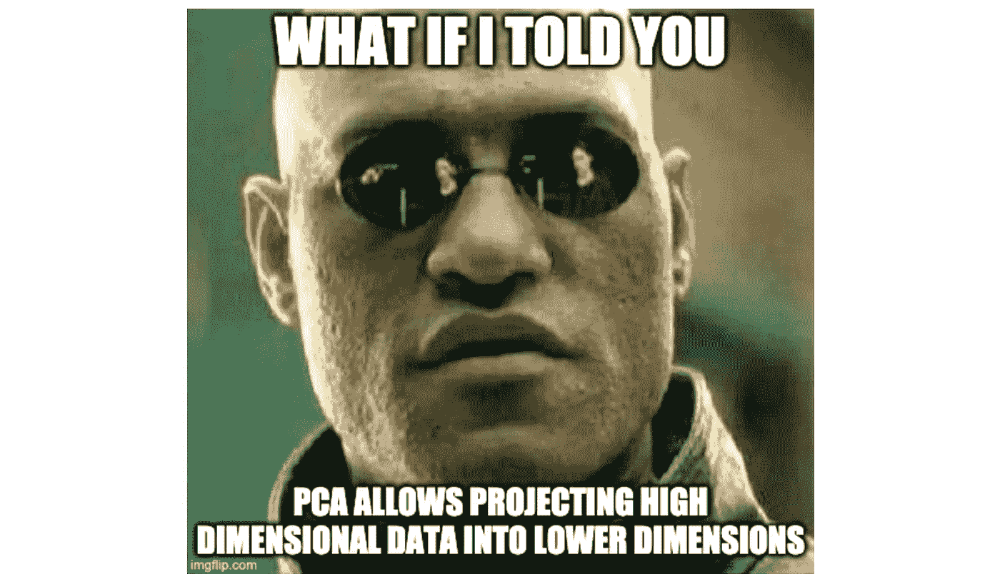
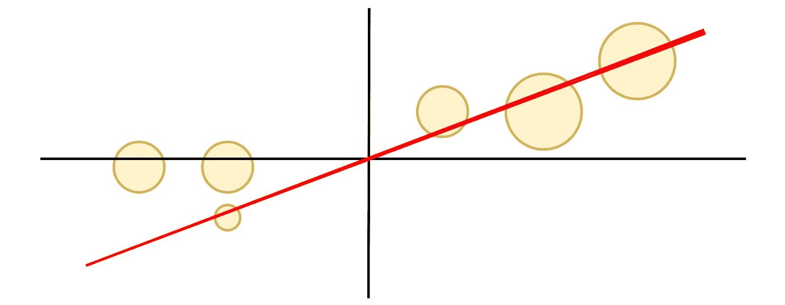

# PCA(主成分分析)5 分钟直观讲解

> 原文：<https://towardsdatascience.com/pca-principal-component-analysis-explained-visually-in-5-minutes-20ce8a9ebf0f?source=collection_archive---------23----------------------->

## 当你有 3 个以上的维度时，创建 2D 图

照片由[斯蒂夫·约翰森](https://www.pexels.com/@steve?utm_content=attributionCopyText&utm_medium=referral&utm_source=pexels)从[派克斯](https://www.pexels.com/photo/multicolored-abstract-painting-1269968/?utm_content=attributionCopyText&utm_medium=referral&utm_source=pexels)拍摄

每个人都明白一个好的图表。

但是我们如何显示 4+维的数据呢？

在 **1 维**中可视化星团是小菜一碟。

太容易了

在二维空间**中寻找星团**很容易。

容易的

看到三维的星团开始吮吸。我们可以编辑节点大小或不透明度来区分第三维。

没那么容易

**5 尺寸**？别提了。

但是……PCA 可以把你的 5 维投射到 2 维，而不会丢失(太多)信号。

[https://imgflip.com/i/45be7u](https://imgflip.com/i/45be7u)

# 5 秒钟 PCA 是什么？

PCA 通过将相关特征组合成新特征，将高维数据投影到低维中。

相关特征在视觉上模糊了聚类，无助于训练模型，并且增加了复杂性。所以没什么大不了的。

# 使用 PCA 在图片中 3D 到 2D

比起 3D 图表，我更喜欢 2D 图表。

**我们将使用 PCA** 将 3D 数据转换成 2D 数据。无论是 10 维还是 100 维，这个过程都是一样的。

我们将跳过数学，试着直观地理解它。

## 1.绘图数据

假设我们的数据如下所示。左侧是要素 x、y 和 z。右侧标绘了这些点。

*假设绘制的数据点被缩放。*

## 2.找到数据的中心

这是每个特征的平均值:x、y 和 z。

## 3.移动数据点，使中心现在位于(0，0)

*注意数据点的相对位置不变。*

## 4.找到最适合的线

最佳拟合线称为 PC1(主成分 1)。

PC1 **最大化**点与最佳拟合直线以直角相交的距离的平方和。

PC1 是 x、y 和 z 的线性组合[,意味着它包含 x、y 和 z 的每个部分。](https://en.wikipedia.org/wiki/Linear_combination#:~:text=From%20Wikipedia%2C%20the%20free%20encyclopedia,a%20and%20b%20are%20constants).)

## 5.查找 PC2

PC2 是与 PC1 垂直(以直角相交)的最佳拟合直线。

PC2 也是每个 x、y 和 z 的线性组合。

PC1 和 PC2 现在都解释了我们功能中的一些差异。

*可以通过计算“加载分数”来测量每个 PC 中的相对重要性 x、y 和 z。*

## 6.旋转图表，使 PC1 为 x 轴，PC2 为 y 轴

旋转后，我们的数据现在只是二维的！集群很容易被发现。

## 如果你一开始就有 3 个以上的维度会怎样？

在您的数据集中，PC 的数量与特征或示例的数量一样少。

你可以通过比较[特征值](https://en.wikipedia.org/wiki/Eigenvalues_and_eigenvectors)(到原点的距离的平方和)并构建 [scree plot](https://en.wikipedia.org/wiki/Scree_plot) 来计算每个 PC 的解释方差。根据定义，PC2 解释的方差小于 PC1，PC3 解释的方差小于 PC2。

决定保留多少台电脑。在我们的例子中，我们决定不考虑 PC3。

剩余 PC 的数量将决定最终图表的维度数量。

# 结论

就是这样。我试着让它尽可能的平易近人。

研究数学有助于你对它如何工作有更深的直觉，但我不认为这应该是在 Sklearn 中使用 PCA 的先决条件。

你现在已经有了一个非常基本的了解。