# 基于 NumPy 的主成分分析

> 原文：<https://towardsdatascience.com/pca-with-numpy-58917c1d0391?source=collection_archive---------7----------------------->

## 只使用 NumPy 库中的函数实现 PCA 的关键步骤

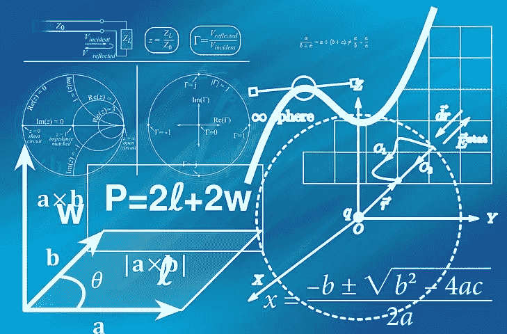

由 [Pixabay](https://pixabay.com/service/terms/#license) 授权

# 主成分分析

这是一种常用于线性降维的技术。PCA 背后的思想是找到尽可能保留更多信息的数据的低维表示。

让我们开始遵循接下来的步骤。

# 加载库

```
%matplotlib inline
import pandas as pd
import matplotlib.pyplot as plt
import numpy as np
import seaborn as sns
```

# 资料组

这是模式识别文献中的经典数据库。数据集包含 3 类，每类 50 个实例，其中每类涉及一种鸢尾植物。从 [UCI 机器学习库](https://archive.ics.uci.edu/ml/machine-learning-databases/iris/iris.data)中检索。

```
iris = pd.read_csv("https://archive.ics.uci.edu/ml/machine-learning-databases/iris/iris.data",
                  header=None)
iris.columns = ["sepal_length","sepal_width",
                'petal_length','petal_width','species']
iris.dropna(how='all', inplace=True)
iris.head()
```

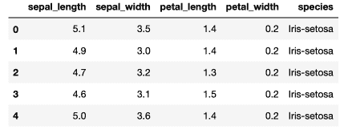

# 可视化数据

```
# Plotting data using seabornplt.style.use("ggplot")
plt.rcParams["figure.figsize"] = (12,8)
sns.scatterplot(x = iris.sepal_length, y=iris.sepal_width,
               hue = iris.species, style=iris.species)
```

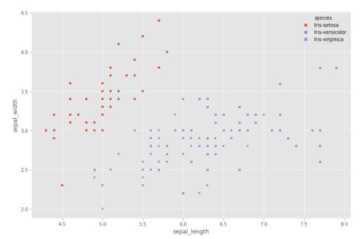

# 标准化数据

在应用 PCA 之前，变量将被标准化为平均值为 0，标准差为 1。这一点很重要，因为所有变量都经过原点(所有轴的值都是 0)并共享相同的方差。

```
def standardize_data(arr):

    '''
    This function standardize an array, its substracts mean value, 
    and then divide the standard deviation.

    param 1: array 
    return: standardized array
    '''    
    rows, columns = arr.shape

    standardizedArray = np.zeros(shape=(rows, columns))
    tempArray = np.zeros(rows)

    for column in range(columns):

        mean = np.mean(X[:,column])
        std = np.std(X[:,column])
        tempArray = np.empty(0)

        for element in X[:,column]:

            tempArray = np.append(tempArray, ((element - mean) / std))

        standardizedArray[:,column] = tempArray

    return standardizedArray
```

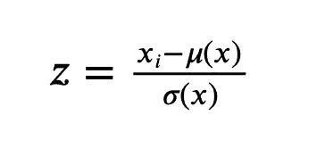

```
# Standardizing dataX = iris.iloc[:, 0:4].values
y = iris.species.valuesX = standardize_data(X)
```

# 计算特征向量和特征值

1.  计算协方差矩阵

现在，我将通过将特征矩阵乘以其*转置*来找到数据集的协方差矩阵。它是衡量每个维度相对于彼此偏离平均值的程度。像相关矩阵一样，协方差矩阵包含关于变量对之间共享的方差的信息。

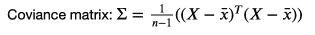

```
# Calculating the covariance matrixcovariance_matrix = np.cov(X.T)
```

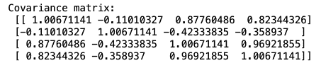

2.协方差矩阵的特征分解

```
# Using np.linalg.eig functioneigen_values, eigen_vectors = np.linalg.eig(covariance_matrix)
print("Eigenvector: \n",eigen_vectors,"\n")
print("Eigenvalues: \n", eigen_values, "\n")
```

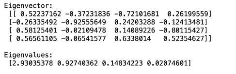

特征向量是主成分。第一个主成分是值为 0.52、-0.26、0.58 和 0.56 的第一列。第二个主成分是第二列，依此类推。每个特征向量将对应于一个特征值，每个特征向量可以根据其特征值进行缩放，特征值的大小表示数据的可变性有多少是由其特征向量解释的。

# 使用解释的方差选择主成分

我想看看这些成分中的每一个能解释多少数据差异。习惯上使用 95%的解释方差

```
# Calculating the explained variance on each of componentsvariance_explained = []
for i in eigen_values:
     variance_explained.append((i/*sum*(eigen_values))*100)

print(variance_explained)
```

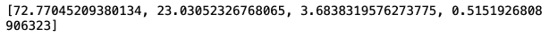

第一主成分解释了我们数据中 72.77%的方差，第二主成分解释了 23.03%的数据。

# 确定有多少组件

选择要保留的组件数量的一些指导原则:

*   保留特征值大于 1 的分量，因为它们会增值(因为它们包含的信息比单个变量更多)。这个规则倾向于保留比理想情况更多的组件
*   按照从高到低的顺序将特征值可视化，用一条线将它们连接起来。目视检查时，保持所有特征值落在直线斜率变化最剧烈的点(也称为“弯头”)上方的部件
*   包括方差截止值，我们只保留解释数据中至少 95%方差的成分
*   Keep 归结于做 PCA 的原因。

```
# Identifying components that explain at least 95%cumulative_variance_explained = np.cumsum(variance_explained)
print(cumulative_variance_explained)
```

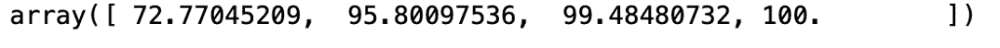

如果我用第一个特征，它会解释 72.77%的数据；如果我使用两个特征，我能够捕获 95.8%的数据。如果我使用所有特征，我将描述整个数据集。

```
# Visualizing the eigenvalues and finding the "elbow" in the graphicsns.lineplot(x = [1,2,3,4], y=cumulative_variance_explained)
plt.xlabel("Number of components")
plt.ylabel("Cumulative explained variance")
plt.title("Explained variance vs Number of components")
```

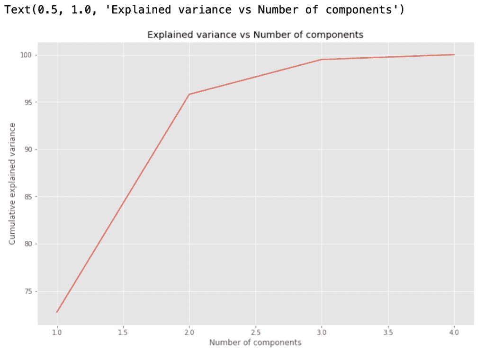

# 将数据投影到低维线性子空间

在最后一步中，我将计算原始数据集的 PCA 变换，得到原始标准化 X 和从特征分解中得到的特征向量的点积。

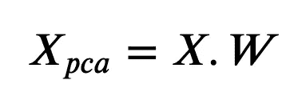

```
# Using two first components (because those explain more than 95%)projection_matrix = (eigen_vectors.T[:][:2]).T
print(projection_matrix)
```

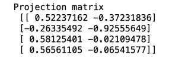

```
# Getting the product of original standardized X and the eigenvectors X_pca = X.dot(projection_matrix)
print(X_pca)
```

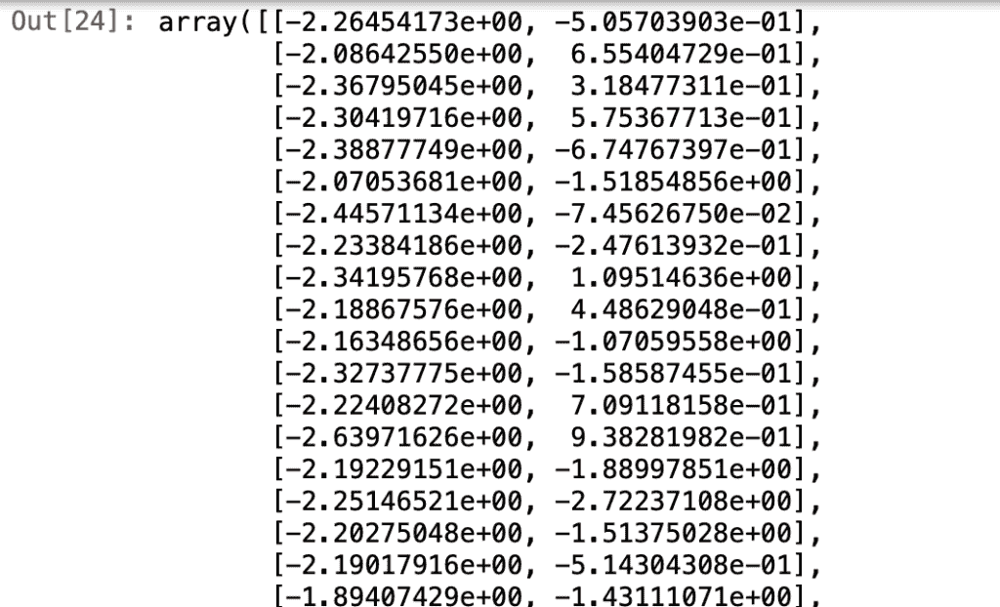

现在，我可以像使用变量一样，在任何分析中使用组件。

# 结论

*   PCA 变换是使用这些 NumPy 函数实现的:np.cov、np.linalg.eig、np.linalg.svd(它是获得特征值和特征向量的替代方案)、np.cumsum、np.mean、np.std、np.zeros、np.empty 和 np.dot
*   主成分分析的好处是分量比变量少，从而简化了数据空间，减轻了维数灾难
*   当数据是线性的时，PCA 也是最好的使用方法，因为它将数据投影到由特征向量构成的线性子空间上
*   使用主成分分析，它将把我们的数据投射到使沿轴的方差最大化的方向
*   当然，Scikit-learn 也有应用 PCA 的库

完整代码在我的 [**GitHub 资源库**](https://github.com/mwpnava/Data-Science-Projects/tree/master/PCA_numpy) **。**

*原载于 2020 年 5 月 24 日 https://wendynavarrete.com**[*。*](https://wendynavarrete.com/principal-component-analysis-with-numpy/)*