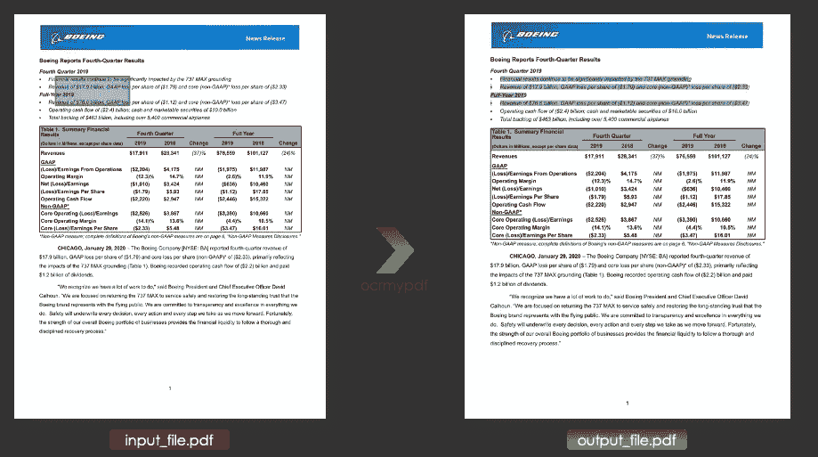
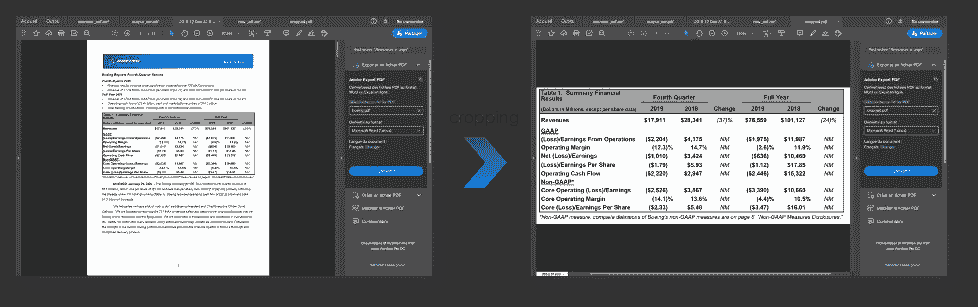
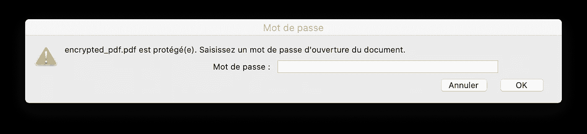
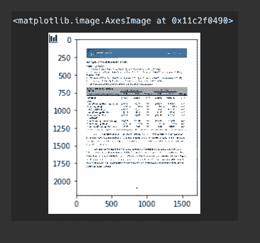
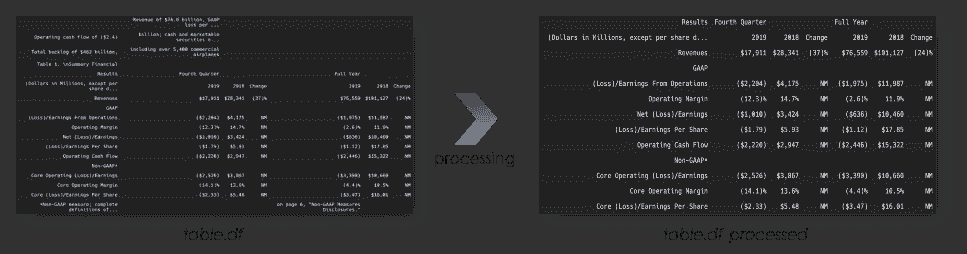
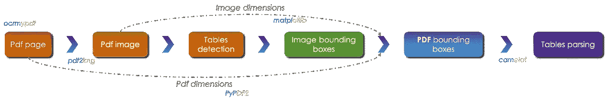
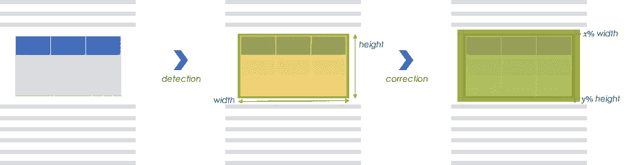
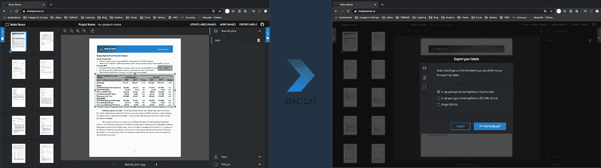
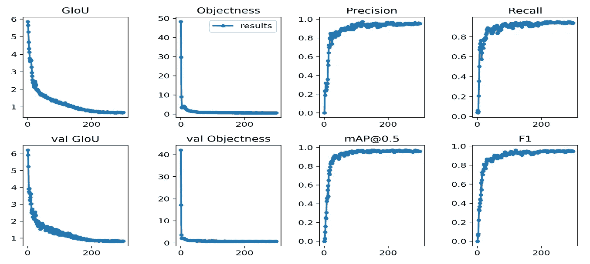
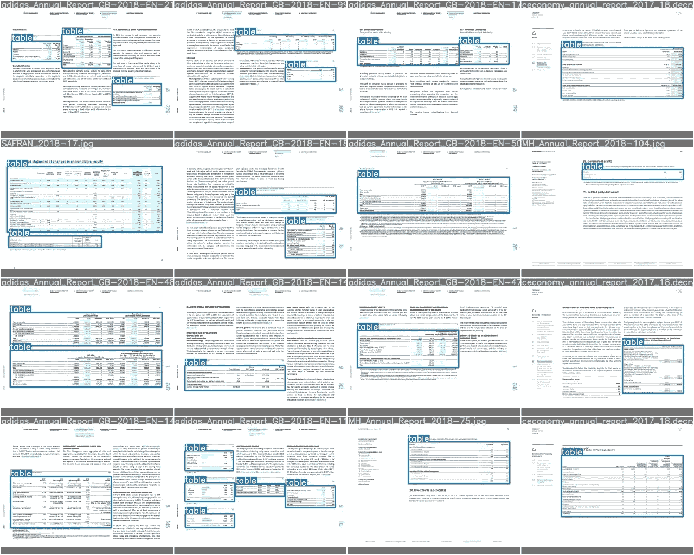

# 使用 YOLOv3 解析 PDF 表格

> 原文：<https://towardsdatascience.com/pdfs-parsing-using-yolov3-987c85c639dc?source=collection_archive---------15----------------------->


[乔·塞拉斯](https://unsplash.com/@joaosilas?utm_source=unsplash&utm_medium=referral&utm_content=creditCopyText)在 [Unsplash](https://unsplash.com/s/photos/information?utm_source=unsplash&utm_medium=referral&utm_content=creditCopyText) 上的照片

## 用 python 解析 pdf 文件内容(包括表格)的最佳工具

PDF 文件或表格是 Adobe 开发的一种文件类型，目的是创建各种形式的内容。特别地，它允许关于其内容变化的一致的安全性。一个 PDF 文件可以包含不同类型的数据:文本、图像、媒体等等。它是一个标签结构的文件，这使得它很容易解析，就像一个 HTML 页面。

也就是说，出于结构的考虑，我们可以将 PDF 文件分为两类:

*   **文本文件**:包含可复制粘贴的文本
*   **基于图像的文件**:包含扫描文件等图像

在本文中，我们将通过主要的`python libraries`功能来解析基于文本和基于图像的 PDF 文件，这些文件将被 **OCR** 化，然后作为基于文本的文件进行处理。我们还将在最后一章介绍如何使用对象检测算法 YOLOV3 来解析表格。

# 目录表

摘要如下:

1.  **基于图像的 pdf 文件** *1.1。OCRMYPDF*
2.  **基于文本的 pdf 文件** *2.1。PyPDF2
    2.2。PDF2IMG
    2.4。卡梅洛特
    2.5。卡米洛特与约洛夫 3*

为了便于本文的说明，我们将使用[这个](https://s2.q4cdn.com/661678649/files/doc_financials/2019/q4/4Q19-Press-Release.pdf) pdf 文件。

# 1.基于图像的 pdf 文件

## 1.1.OCRMYPDF

Ocrmypdf 是一个 python 包，它允许将基于图像的 pdf 转换为基于文本的 pdf，可以选择、复制和粘贴文本。
为了安装 ocrmypdf，您可以使用命令行对 macOS 和 Linux 使用`brew`:

```
brew install ocrmypdf
```

安装软件包后，您可以通过运行以下命令行来 ocrise 您的 pdf 文件:

```
ocrmypdf input_file.pdf output_file.pdf
```

其中:

*   **ocrmypdf** :路径变量
*   **input_file.pdf** :基于图像的 pdf 文件
*   **output_file.pdf** :输出文本文件



作者图片

一旦 pdf 转换成基于文本的格式，就可以使用下面详述的所有库进行处理。
有关`ocrmypdf`的更多详情，请访问以下官方[网站](https://ocrmypdf.readthedocs.io/en/latest/introduction.html)。

# 2.基于文本的 pdf 文件

在这一节中，我们将主要关注三个 python 库，它们允许提取基于文本的 pdf 文件的内容。

## 2.1.PyPDF2

PyPDF2 是一个 python 工具，它使我们能够解析 PDF 文件的基本信息，如作者、标题等。它还允许在假设有密码的情况下获取给定页面的文本，以及拆分页面和打开加密文件。
PyPDF2 可以使用`pip`通过运行以下命令行来安装:

```
pip install PyPDF2
```

我们总结了以下 python 脚本中列出的所有功能:

*   **读取 pdf 文件:**

```
from PyPDF2 import PdfFileWriter, PdfFileReader
PDF_PATH = "boeing.pdf"
pdf_doc = PdfFileReader(open(PDF_PATH, "rb"))
```

*   **提取文档信息:**

```
print("---------------PDF's info---------------")
print(pdf_doc.documentInfo)
print("PDF is encrypted: " + str(pdf_doc.isEncrypted))
print("---------------Number of pages---------------")
print(pdf_doc.numPages)*>> ---------------PDF's info---------------
>> {'/Producer': 'WebFilings', '/Title': '2019 12 Dec 31 8K Press Release Exhibit 99.1', '/CreationDate': 'D:202001281616'}
>> PDF is encrypted: False
>> ---------------Number of pages---------------
>> 14*
```

*   **逐页分割文件:**

```
#indexation starts at 0
pdf_page_1 = pdf_doc.getPage(0)
pdf_page_4 = pdf_doc.getPage(3)
print(pdf_page_1)
print(pdf_page_4)*>> {'/Type': '/Page', '/Parent': IndirectObject(1, 0), '/MediaBox': [0, 0, 612, 792], '/Resources': IndirectObject(2, 0), '/Rotate': 0, '/Contents': IndirectObject(4, 0)}
>> {'/Type': '/Page', '/Parent': IndirectObject(1, 0), '/MediaBox': [0, 0, 612, 792], '/Resources': IndirectObject(2, 0), '/Rotate': 0, '/Contents': IndirectObject(10, 0)}*
```

*   **从页面中提取文本:**

```
text = pdf_page_1.extractText()
print(text[:500])*>> '1Boeing Reports Fourth-Quarter ResultsFourth Quarter 2019 Financial results continue to be significantly impacted by the 737 MAX grounding Revenue of $17.9 billion, GAAP loss per share of ($1.79) and core (non-GAAP)* loss per share of ($2.33) Full-Year 2019 Revenue of $76.6€billion, GAAP loss per share of ($1.12) and core (non-GAAP)* loss per share of ($3.47) Operating cash flow of ($2.4)€billion; cash and marketable securities of $10.0 billion Total backlog of $463 billion, including over 5,400'*
```

*   **逐页合并文档:**

```
new_pdf = PdfFileWriter()
new_pdf.addPage(pdf_page_1)
new_pdf.addPage(pdf_page_4)
new_pdf.write(open("new_pdf.pdf", "wb"))
print(new_pdf)*>> <PyPDF2.pdf.PdfFileWriter object at 0x11e23cb1****0****>*
```

*   **裁剪页面:**

```
print("Upper Left: ", pdf_page_1.cropBox.getUpperLeft())
print("Lower Right: ", pdf_page_1.cropBox.getLowerRight())

x1, y1 = 0, 550
x2, y2 = 612, 320

cropped_page = pdf_page_1
cropped_page.cropBox.upperLeft = (x1, y1)
cropped_page.cropBox.lowerRight = (x2, y2)

cropped_pdf = PdfFileWriter()
cropped_pdf.addPage(cropped_page)
cropped_pdf.write(open("cropped.pdf", "wb"))
```



作者图片

*   **加密和解密 PDF 文件:**

```
PASSWORD = "password_123"
encrypted_pdf = PdfFileWriter()
encrypted_pdf.addPage(pdf_page_1)
encrypted_pdf.encrypt(PASSWORD)
encrypted_pdf.write(open("encrypted_pdf.pdf", "wb"))

read_encrypted_pdf = PdfFileReader(open("encrypted_pdf.pdf", "rb"))
print(read_encrypted_pdf.isEncrypted)
if read_encrypted_pdf.isEncrypted:
    read_encrypted_pdf.decrypt(PASSWORD)
print(read_encrypted_pdf.documentInfo)*>> True
>> {'/Producer': 'PyPDF2'}*
```



作者图片

关于`PyPDF2`的更多信息，请访问官方[网站](https://pypi.org/project/PyPDF2/)。

## 2.2.PDF2IMG

PDF2IMG 是一个 python 库，允许将 PDF 页面转换成可以处理的图像，例如，通过计算机视觉算法。
通过运行以下命令行，可以使用`pip`安装 PDF2IMG:

```
pip install pdf2image
```

我们可以将**第一页**和**最后一页**设置为从 pdf 文件转换成图像。

```
from pdf2image import convert_from_path
import matplotlib.pyplot as pltpage=0
img_page = convert_from_path(PDF_PATH, first_page=page, last_page=page+1, output_folder="./", fmt="jpg")print(img_page)*>> <PIL.PpmImagePlugin.PpmImageFile image mode=RGB size=1700x2200 at 0x11DF397D****0****>*
```



作者图片

## 2.3.卡默洛特

[Camelot](https://camelot-py.readthedocs.io/en/master/) 是一个专门解析 pdf 页面表格的 python 库。可以通过运行下面的命令行使用`pip`来安装它:

```
pip install camelot-py[cv]
```

解析的输出是一个`pandas dataframe`，这对数据处理非常有用。

```
import camelot
output_camelot = camelot.read_pdf(
    filepath="output_ocr.pdf", pages=str(0), flavor="stream"
)
print(output_camelot)
table = output_camelot[0]
print(table)
print(table.parsing_report)*>> TableList n=****1****>
>> <Table shape=(18, 8)>
>> {'accuracy': 93.06, 'whitespace': 40.28, 'order': 1, 'page': 0}*
```

当 pdf 页面包含文本时，Camelot 的输出将是一个数据框，第一列中包含文本，随后是所需的表格。通过一些基本的处理，我们可以将它提取如下:



作者图片

卡梅洛特提供两种口味**格子**和**流**，我建议使用`stream`，因为它对表格结构更灵活。

## 2.4.卡米洛特混有约洛夫 3

Camelot 提供了通过变量`table_areas="x1,y1,x2,y2"`指定要处理的区域的选项，其中(x1，y1)是 PDF 坐标空间的左上,( x2，y2)是右下。填写后，解析的结果会显著增强。

**解释基本想法**

自动解析表的一种方法是训练一种算法，该算法能够返回环绕表的边界框的坐标，如下面的管道中所详述的:



作者图片

如果原始的 pdf 页面是基于图像的，我们可以使用`ocrmypdf`转换成基于文本的页面，以便能够在表格中获取文本。然后，我们执行以下操作:

*   使用`pdf2img`将 pdf 页面转换成图像页面
*   使用经过训练的算法来检测表的区域。
*   使用*图像尺寸*标准化边界框，这使得能够使用通过`PyPDF2`获得的 *pdf 尺寸*获得 pdf 空间中的区域。
*   将区域反馈给`camelot`并获得相应的熊猫数据帧。

检测 pdf 图像中的表格时，我们扩展边界框以保证其完全包含，如下所示:



作者图片

**表格检测**

允许检测表格的算法是 yolov3，我建议你阅读我以前的关于对象检测的文章。
我们微调算法，检测表格，重新训练所有架构。为此，我们执行以下步骤:

*   使用`[Makesense](https://www.makesense.ai/)`工具创建一个培训数据库，该工具能够以 YOLO 格式进行标记和导出:



作者图片

*   训练 a `[yolov3](/object-detection-face-recognition-algorithms-146fec385205)` `[repository](https://github.com/ultralytics/yolov3)`被修改以适应我们在 AWS EC2 上的目的，我们得到以下结果:



作者图片

**插图**

检测结果如下所示:



作者图片

# **结论**

当混合标准 python 库和深度学习算法时，有可能显著增强 PDF 文档的解析。事实上，按照相同的步骤，我们可以训练 YOLOV3 算法来检测 pdf 页面中的`any other object`，例如可以从图像页面中提取的图形和图像。

你可以在我的 [GitHub](https://github.com/ismail-mebsout/Parsing-PDFs-using-YOLOV3) 里查看我的项目。

不要犹豫，检查我以前的文章处理:

*   [深度学习的数学](https://medium.com/p/deep-learnings-mathematics-f52b3c4d2576)
*   [卷积神经网络的数学](https://medium.com/p/convolutional-neural-networks-mathematics-1beb3e6447c0)
*   [物体检测&人脸识别算法](/object-detection-face-recognition-algorithms-146fec385205)
*   [递归神经网络](/recurrent-neural-networks-b7719b362c65)

*原载于 2020 年 4 月 30 日 https://www.ismailmebsout.com*[](https://www.ismailmebsout.com/pdfs-parsing/)**。**