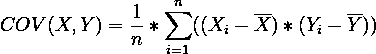

# 皮尔逊和斯皮尔曼等级相关系数—解释

> 原文：<https://towardsdatascience.com/pearson-and-spearman-rank-correlation-coefficient-explained-60811e61185a?source=collection_archive---------22----------------------->


[M. B. M.](https://unsplash.com/@m_b_m?utm_source=medium&utm_medium=referral) 在 [Unsplash](https://unsplash.com?utm_source=medium&utm_medium=referral) 上拍摄的照片

## 随机变量之间的关系。

相关系数是发现两个随机变量之间关系的统计度量。两个随机变量之间的相关性可以用来比较两者之间的关系。通过观察相关系数，可以测量关系的强度。

相关系数的值范围从-1 到+1。

*   接近+1 的值表示高线性关系，随着一个随机变量的增加，第二个随机变量也增加。
*   接近-1 的值表示高线性关系，随着一个随机变量的增加，第二个随机变量减少。
*   接近或等于 0 的值表示两个随机变量之间没有关系。

# 一些先决条件—协方差:

协方差是一种用于确定两个随机变量各自的均值相差多少的度量。它受到尺度变化的影响。协方差系数的值介于-∞和+∞之间。



```
Notation,
X, Y: Two random variables
X_bar: mean of random variable X
Y_bar: mean of random variable Y
n: length of random variable X, Y
```

这里身高与体重的协方差> 0，即 114.24，这意味着随着身高的增加，体重也增加。

因此，协方差根据两个变量与其平均值的偏差来比较它们。

协方差有一个限制，即它的值在-∞和+∞之间，因此

# 皮尔逊相关系数(PCC):

皮尔逊相关是衡量两个随机变量之间相关程度的系数。系数值的范围在+1 到-1 之间。皮尔逊相关是每个随机变量的标准差对协方差的归一化。


```
Notation,
X, Y: Two random variables
COV(): covariance
SD: standard deviation
```

PCC 的局限性:

*   两个变量都需要正态分布
*   变量需要线性和同方差

# 斯皮尔曼等级相关系数(SRCC):

SRCC 涵盖了 PCC 的一些局限性。它不带有任何关于数据分布的假设。SRCC 是一种测试，用于通过给每个随机变量的值分配等级并计算 PCC 来测量两个变量之间的关联程度。


(图片由作者提供)

给定两个随机变量 X，y。计算每个随机变量的秩，使得最小值的秩为 1。然后应用秩(X)和秩(Y)上的皮尔逊相关系数来计算 SRCC。


SRCC 的范围在-1 到+1 之间，适用于单调递增或递减的函数。

[](/4-ways-to-reduce-dimensionality-of-data-8f82e6565a07) [## 4 种降低数据维度的方法

### 降维方法概述-相关，主成分分析，t-SNE，自动编码器及其在…

towardsdatascience.com](/4-ways-to-reduce-dimensionality-of-data-8f82e6565a07) 

# 结论:

SRCC 克服了 PCC 的一些缺点，因此它应该比 PCC 用于计算两个随机变量之间的关系。上面讨论的两个系数只有在两个随机变量都连续时才起作用。

> 感谢您的阅读