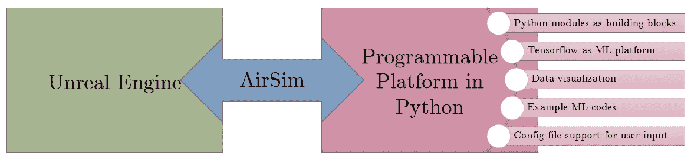
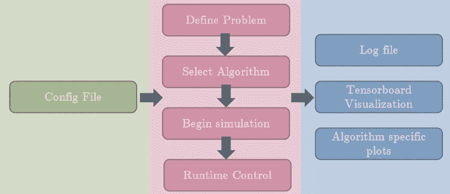
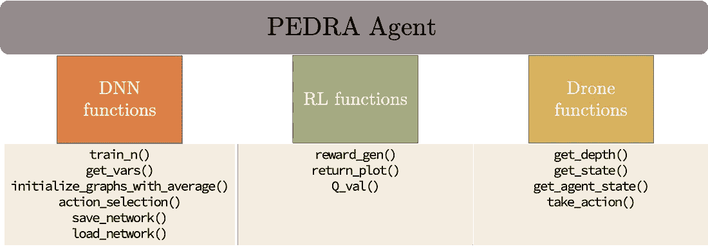
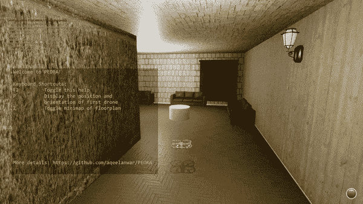
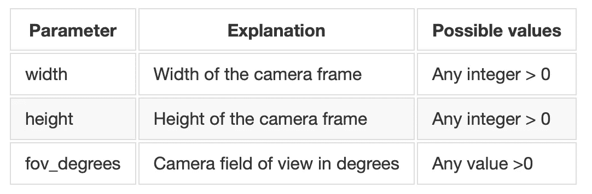
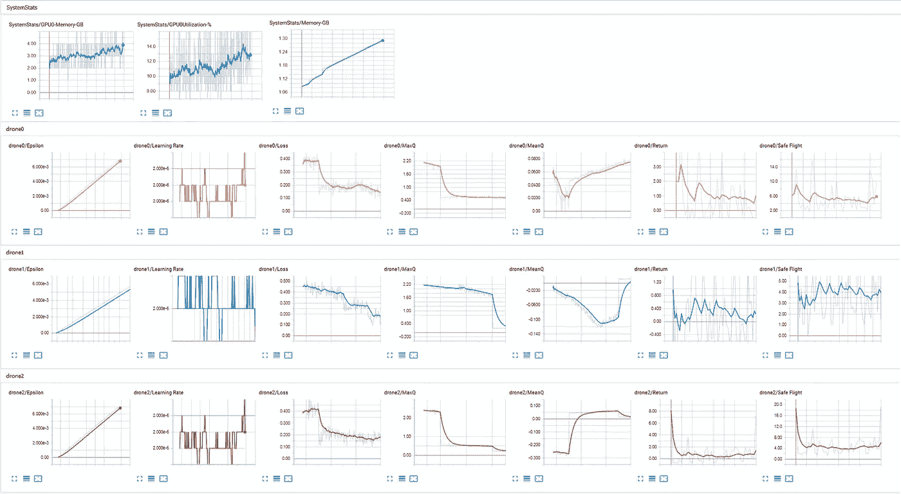
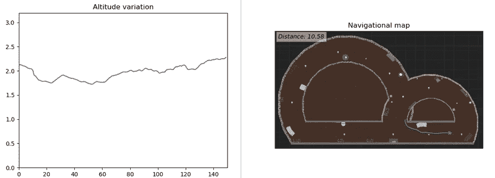

# PEDRA——无人机强化学习应用的可编程引擎

> 原文：<https://towardsdatascience.com/pedra-programmable-engine-for-drone-reinforcement-learning-applications-5b04423a42dd?source=collection_archive---------39----------------------->


## 3D 环境中无人机的 Python 平台

**跳转到代码:** [PEDRA GitHub 库](https://github.com/aqeelanwar/PEDRA)

# PEDRA 是什么？

PEDRA 是用于无人机强化学习(RL)应用的可编程引擎。该引擎是用 Python 开发的，并且是模块式可编程的。PEDRA 主要针对面向目标的无人机 RL 问题，但也可以扩展到其他问题，如 SLAM 等。该引擎使用 AirSim 与虚幻游戏引擎进行交互，以创建完整的平台。下图显示了引擎的完整框图。[虚幻引擎](https://www.unrealengine.com/en-US/)用于为接受训练的无人机创建 3D 逼真环境。可以添加不同级别的细节，以使环境看起来尽可能真实或符合要求。PEDRA 配备了一个可供用户选择的 3D 现实环境列表。一旦选择了环境，它就使用 [AirSim](https://github.com/microsoft/AirSim) 与 PEDRA 连接。AirSim 是微软开发的一个开源插件，它将虚幻引擎与 Python 相接口。它提供基本的 python 功能，控制无人机的感官输入和控制信号。PEDRA 建立在 AirSim 提供的低级 python 模块上，为无人机 RL 应用程序创建更高级别的 python 模块。

# PEDRA 工作流程

PEDRA 的完整工作流程如下图所示。引擎从配置文件(.cfg)。这个配置文件用于定义问题和解决问题的算法。它是算法特定的，用于定义算法相关参数。目前支持的问题是基于相机的自主导航，支持的算法是单无人机香草 RL，单无人机 PER/DDQN 基 RL。更多的问题和相关算法正在被添加。PEDRA 最重要的特性是高级 python 模块，可以用作构建模块来实现面向无人机应用的多种算法。用户可以从上述算法中选择，也可以使用这些构建模块创建自己的算法。如果用户想要定义他们自己的问题和相关算法，可以使用这些构件。一旦设定了这些要求，模拟就可以开始了。PyGame 屏幕可用于控制模拟参数，如暂停模拟、修改算法或训练参数、覆盖配置文件以及保存模拟的当前状态等。PEDRA 生成许多输出文件。日志文件跟踪每次迭代的模拟状态，列出有用的算法参数。这在排除模拟故障时特别有用。Tensorboard 可用于在运行时可视化训练图。这些图对于监控训练参数和在需要时使用 PyGame 屏幕更改输入参数特别有用。



# 安装 PEDRA

当前版本的 PEDRA 支持 Windows，需要 python3。建议[为这个项目创建一个新的虚拟环境](/setting-up-python-platform-for-machine-learning-projects-cfd85682c54b)并安装依赖项。可以采取以下步骤下载 PEDRA 入门

## 1.克隆存储库

为了使事情变得简单和容易，PEDRA 配备了两个版本。

*   **PEDRA:** 单机无人机支援:
*   **D-PEDRA:** 分布式多架无人机支援

每个版本都是存储库中的一个分支，可以按如下方式下载

```
# PEDRA Single Drone
git clone — single-branch — branch PEDRA [https://github.com/aqeelanwar/PEDRA.git](https://github.com/aqeelanwar/PEDRA.git)

# Distributed PEDRA Multiple Drones
git clone — single-branch — branch D-PEDRA [https://github.com/aqeelanwar/PEDRA.git](https://github.com/aqeelanwar/PEDRA.git)
```

## 2.安装所需的软件包

提供的 requirements.txt 文件可以用来安装所有需要的包。使用以下命令

**采用 NVIDIA GPU 的系统**

```
cd PEDRA
pip install –r requirements_gpu.txt
```

**没有 NVIDIA GPU 的系统**

```
cd PEDRA
pip install –r requirements_cpu.txt
```

这将在激活的 python 环境中安装所需的包。

## 3.安装 Epic 虚幻引擎

所提供的模拟环境是使用虚幻游戏引擎创建的。为了运行这些环境，您需要在机器上安装虚幻引擎。您可以按照下面链接中的指导在您的平台上安装虚幻引擎。建议安装虚幻引擎 4.18.3 版。

[安装虚幻引擎的说明](https://docs.unrealengine.com/en-US/GettingStarted/Installation/index.html)

# 跑步 PEDRA

一旦安装了所需的包和软件，就可以执行以下步骤来运行代码

## 1.下载模拟环境

您可以使用虚幻引擎手动创建自己的环境(如果您计划创建自己的环境，请参见下面的常见问题解答来安装 AirSim 插件)，或者您可以从下面的链接下载其中一个环境。

[下载环境](https://gtvault-my.sharepoint.com/:f:/g/personal/manwar8_gatech_edu/EnCc2xWKBCpIkWseegrp1EYB69y0zS3nLqzsaSfE-KAD4g?e=HtI1ck)

以下环境可供下载

**室内环境:**

*   室内长环境
*   室内扭转环境
*   室内通风环境
*   室内技术环境
*   室内金字塔环境
*   室内冰箱环境
*   室内燃气轮机环境
*   室内复杂环境
*   室内上下环境
*   室内云环境

**室外环境:**

*   户外庭院
*   户外森林
*   户外老城

关于环境的更多细节可以在[这里](https://github.com/aqeelanwar/PEDRA/blob/master/unreal_envs/readme.md)找到。

上面的链接将帮助您下载 64 位 windows 环境的打包版本。提取并保存在 unreal_env 文件夹中。

```
# Generic
|-- PEDRA
|    |-- unreal_envs
|    |    |-- <downloaded-environment-folder>

# Example
|-- PEDRA
|    |-- unreal_envs
|    |    |-- indoor_cloud
|    |    |-- outdoor_forest
|    |
```

## 2.编辑配置文件

有两种类型的配置文件可用于控制一般仿真参数和算法特定参数，它们可在 configs 文件夹中找到

## **2a。模拟配置:**

```
|-- PEDRA
|    |-- configs
|    |    |-- config.cfg
```

该配置文件用于设置高级仿真参数。参数及其解释的完整列表如下所示。

**通用参数【通用参数】:**


**摄像机参数【Camera _ params】:**



## 2b。特定于算法的配置:

```
# Example
|-- PEDRA
|    |-- configs
|    |    |-- DeepQLearning.cfg
|    |    |-- DeepREINFORCE.cfg
```

根据在主配置文件(config.cfg)的 general_param 类别中选择的算法，需要为用户提供的参数编辑特定于算法的配置文件。更多细节可以在[这里](https://github.com/aqeelanwar/PEDRA/blob/master/algorithms/readme.md)找到

## 3.运行 Python 代码

一旦根据用户需要编辑了配置文件，就可以使用 main.py 文件开始模拟

```
cd PEDRA
python main.py
```

运行 main.py 会执行以下步骤


*   尝试加载配置文件
*   尝试生成指定环境参数所需的 settings.json 文件
*   尝试启动选定的 3D 环境
*   尝试为用户界面初始化 PyGame 屏幕
*   尝试开始算法

为了加速算法，环境渲染被关闭。关于如何与环境图形交互的详细文档可以在[这里](https://github.com/aqeelanwar/PEDRA/blob/master/unreal_envs/readme.md)看到。为了查看无人机是否在环境中移动，请按环境屏幕上的“Z”键。包含无人机的平面图将出现在右上角。

# 特征

## 1.可用无人机代理:

PEDRA 配备了 3 架无人机

1.  阿德龙
2.  吉马维奇
3.  DJIPhantom

下面可以看到这些无人机的图像。


不同的动作空间可以与这些无人机中的每一个相关联。

## 2.支持的模式:

配置文件可用于选择模拟需要运行的模式。

*   **train** :表示训练模式，作为待执行算法的输入标志
*   **推断**:表示推断模式，作为待执行算法的输入标志。通过设置以下参数，可将自定义砝码加载到网络中

```
custom_load_path: True
custom_load_path: <path_to_weights>
```

*   **move_around** :当模式设置为 move_around 时，模拟以自由模式启动环境。在这种模式下，键盘可用于在环境中导航。这种模式可以帮助用户了解环境动态。键盘按键 **a、w、s、d、左、右、上、下**可用于导航。这也有助于确定无人机的初始位置。更多详情[此处](https://github.com/aqeelanwar/PEDRA/blob/master/unreal_envs/readme.md)

## 3.使用 tensorboard 查看学习参数

在模拟过程中，可以在张量板上查看张量流参数，如ε、学习率、平均 Q 值、损耗和返回。张量板日志文件的路径取决于配置文件中设置的环境类型、环境名称和训练类型，由下式给出

```
custom_load_path: True
custom_load_path: <path_to_weights>
```

一旦确定了日志文件的存储位置，就可以在终端上使用以下命令来激活 tensorboard。

```
custom_load_path: True
custom_load_path: <path_to_weights>
```

终端将显示可以在任何浏览器上打开的本地 URL，并且 tensorboard 显示器将在运行时显示 DRL 参数。



## 4.使用 PyGame 屏幕的运行时控件

可以使用 PyGame 屏幕定义和访问特定算法的控件。更多信息可在[这里](https://github.com/aqeelanwar/PEDRA/blob/master/algorithms/readme.md)找到

## 5.输出图表

该模拟实时更新两个图形。第一张图是无人机的高度变化，而另一张图是映射到环境平面图上的无人机轨迹。轨迹图还报告了无人机在坠毁前行驶的总距离。



通过利用环境提供的平面布置图，可以添加更多特定于算法的图形。

## GitHub:

[](https://github.com/aqeelanwar/PEDRA) [## aqeelanwar/PEDRA

### GitHub 复位器— PEDRA

github.com](https://github.com/aqeelanwar/PEDRA) 

## 网址:

[](http://icsrl.ece.gatech.edu/pedra/) [## 佩德拉

### 3D 环境中基于 python 的无人机平台

icsrl.ece.gatech.edu](http://icsrl.ece.gatech.edu/pedra/) 

如果这篇文章对你有帮助，欢迎鼓掌、分享和回复。如果你想了解更多关于机器学习和数据科学的知识，请关注我@[**Aqeel an war**](https://medium.com/u/a7cc4f201fb5?source=post_page-----5b04423a42dd--------------------------------)**或者在**[***LinkedIn***](https://www.linkedin.com/in/aqeelanwarmalik/)***上与我联系。***