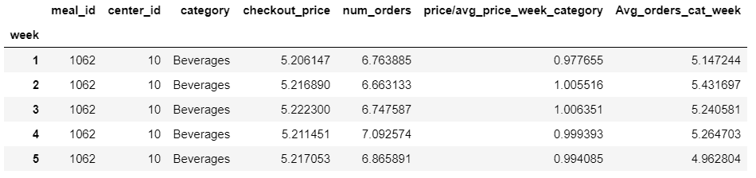
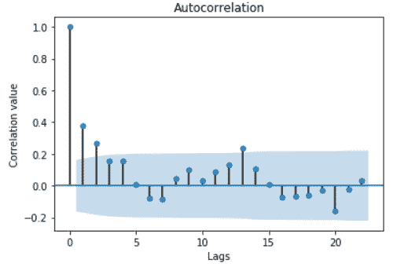
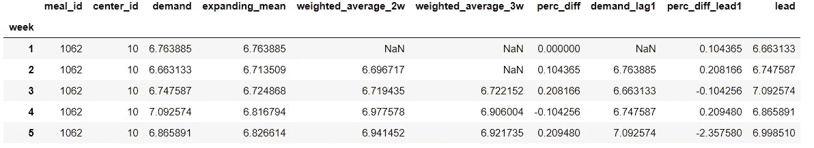
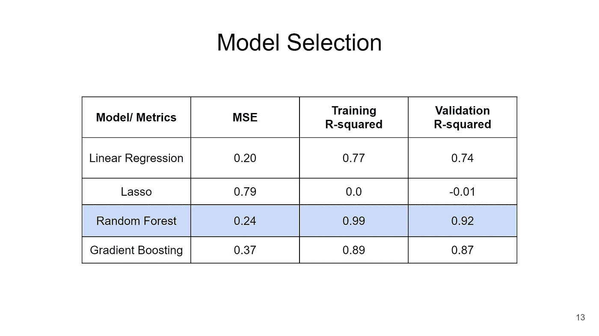
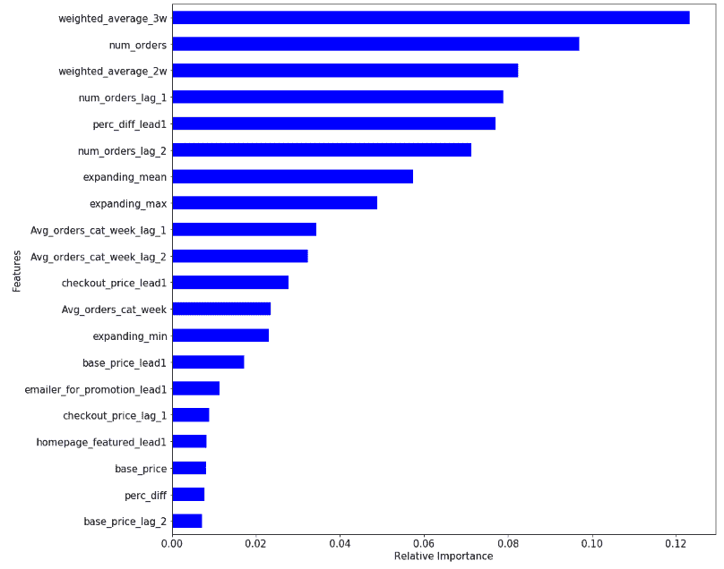
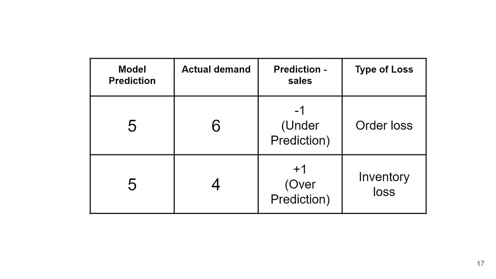
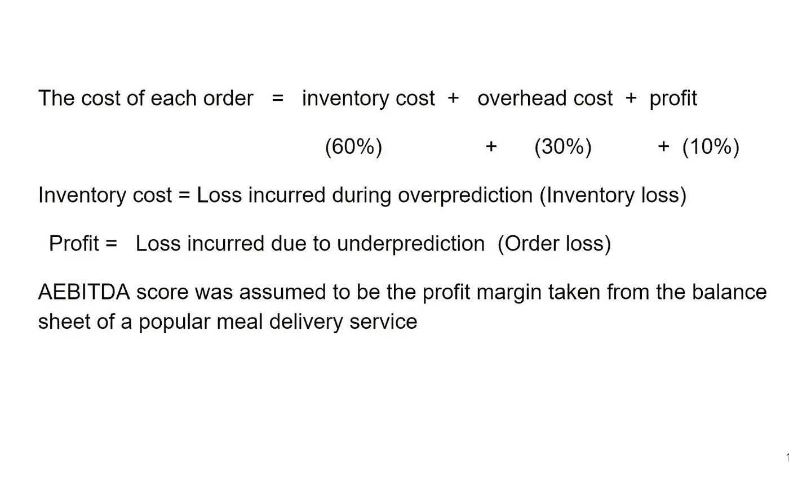
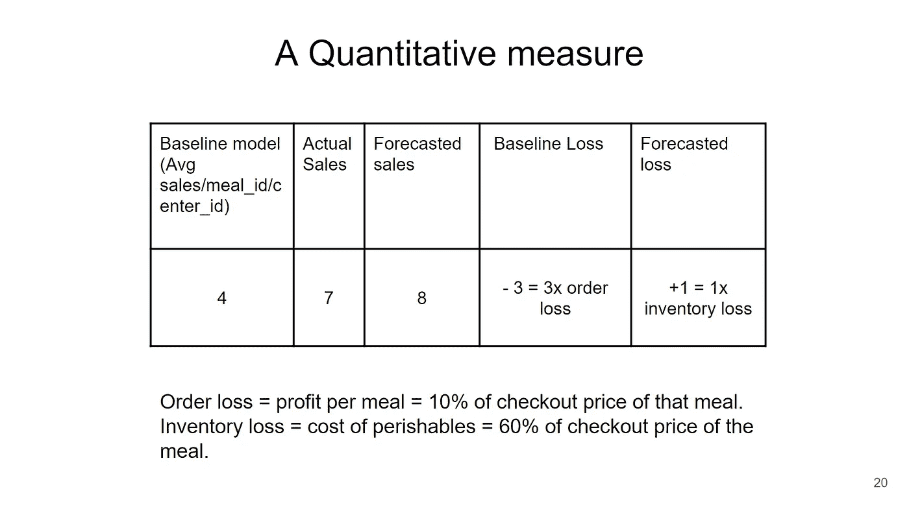
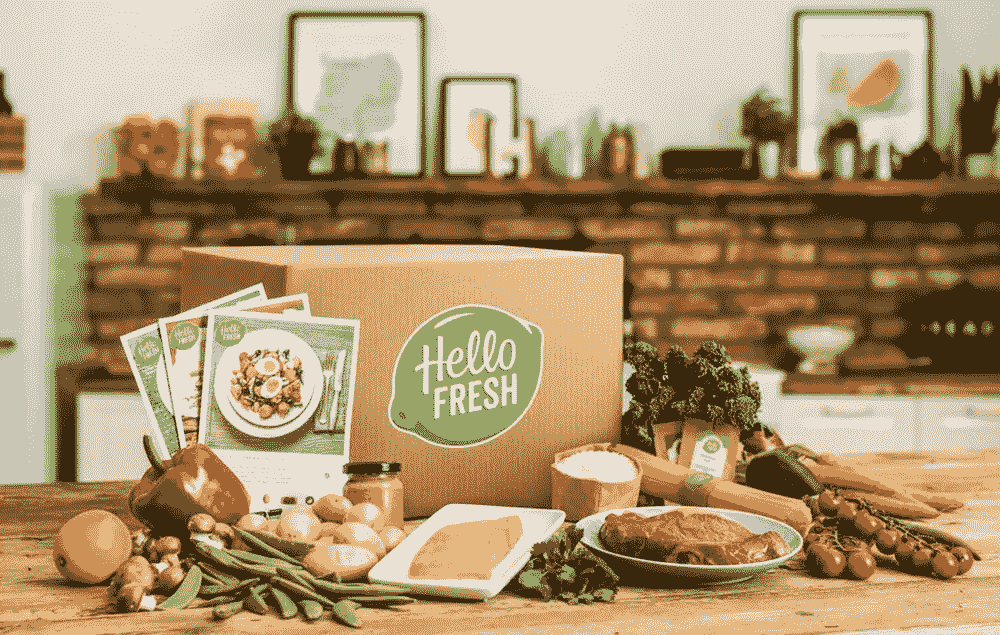

# 从峰值到峰值:时间序列预测，以预测餐包的需求

> 原文：<https://towardsdatascience.com/peek-to-peak-time-series-forecasting-to-predict-demand-for-meal-kits-53c055e77bfd?source=collection_archive---------29----------------------->

> 这个项目是由 Aditi Khandelwal，Amrita Dutta，Aneesh Goel 和 Simran Kalera 完成的，他们参加了哥伦比亚大学的 MS 商业分析项目。

窥视过去(来源:[剪贴画](https://clipartart.com/images/peeking-clipart-2.jpg))

解决了“晚饭吃什么”这个长期存在的问题套餐配送服务为消费者提供了一种在家做饭的便捷方式，而不必进行膳食计划和食品杂货店购物。[餐包递送是一个 15 亿美元的市场，并且还在增长](https://www.packagedfacts.com/Meal-Kit-Delivery-10037319/)。据报道，每四个美国人中就有一个订购了套餐。

让你的利润达到顶峰(来源: [Iconfinder](https://www.iconfinder.com/icons/3814596/bar_chart_data_data_science_graph_information_positive_icon)

我们的目标是通过使用机器学习的历史数据来预测每周需求。我们的目标是开发一个模型，帮助减少套餐服务的“损失”。这是通过量化货币损失实现的，每周可节省数千美元。

数据字典

首先，我们有一个流行的餐包服务的 3 个数据集:

1.  每周需求数据表示从第 1 周到第 145 周的每周订单
2.  履行中心包含关于每个 center_id 的数据
3.  膳食数据包括订购膳食的类型和类别

第一步包括合并三个数据集并寻找缺失值。在时间序列中，丢失的数据可能被隐藏，因为数据可能在时间步长(1 周)上不一致，并可能在构建模型时导致问题。数据被分组为每个膳食 id-中心 id 组合。其中一些组合不是每周都订购/提供，而是通过将这些周的需求视为 0，并将价格视为该组合的平均价格来估算。我们的假设是，这顿饭是在失踪的几周内提供的，但是没有人买。

在研究了餐包市场后，人们意识到大部分成本来自易腐商品。对于一个企业来说，站在本周的立场上了解下周的需求是非常理想的。这将帮助他们订购/安排新的库存，并为下周的订单管理物流。

来源: [Giphy](https://media.giphy.com/media/ggzTLwA6f45DMxyUfe/giphy.gif)

# 特征工程

在执行基本的探索性数据分析后，价格和需求列被转换成对数标度，以得到正态分布。该数据有许多分类列，因此设计了捕捉这些变量的每周平均需求的特性。下面显示一个: **Avg_orders_cat_week** 。

制定了反映不同类别每周价格波动的比率。例如，比率**价格/avg_price_week_category** 指示第 1 周的膳食 1062 的价格比同一周所有饮料的平均价格低 **0.977** 。这里的想法是，价格低的饭菜可能有高需求。

我们提出的第二种特征是超前和滞后特征，它们是时间序列预测的核心。

一个显而易见的问题是，我们的数据滞后了多少时间步？

需求的自相关图显示滞后的最佳数量是 2(如果值在圆锥之外，则相关性在统计上是显著的，否则可能是偶然的)

在选择了最佳滞后之后，我们创建了超前-滞后特征并为建模设置了数据。下图中的每一行都是进入模型的内容。假设我们处于第 4 周，我们希望预测第 5 周的需求，即标签( **lead** )。我们使用了第 4 周的几个特性，第 3 周的几个特性和第 5 周的一些特性(餐费、提供的折扣等，假设它会在一周前固定下来)。

一些特点是:

1.  第 4 周的需求(**需求**)
2.  第 3 周的需求( **demand_lag1** )
3.  前几周的平均需求(**扩大 _ 平均**
4.  第 4 周和第 3 周订单的加权平均值( **weighted_average_2w**
5.  第 4 周、第 3 周和第 2 周订单的加权平均值( **weighted_average_3w**
6.  第 4 周提供的折扣( **perc_diff** )
7.  第 5 周提供的折扣( **perc_diff_lead1** )。

数据被分成训练集、验证集和测试集。在去除空值之后，训练数据是从第 3 周到第 142 周；第 144 周验证，第 145 周测试。下面的代码片段显示了不同型号的性能。

随机森林是选择的模型，它给出了均方误差和 R 平方的可比结果，并且可以进一步调整。

调整最大深度参数后，我们在整个训练集和验证集上重新训练模型，并在测试集上获得以下结果:

1.  均方差: **0.31**
2.  r 平方: **0.89**

特征重要性图显示滞后特征是下周需求的最重要预测因素，这是直观的。

来源: [giphy](https://media.giphy.com/media/9HQRIttS5C4Za/giphy.gif)

# 言归正传！

该行业亏损的主要原因是易腐食品的保质期有限。如果需求预测不准确，可能会导致订单预测过高或过低。

假设我们的随机森林回归器预测了 5 个订单，而观察到的实际销售额是 6，我们对需求的预测值低了 1，因此错过了一个订单，我们称之为“订单损失”。同样，如果我们的模型预测 5 个订单，实际销售额是 4，这是一个过度预测的情况，会导致我们所说的“库存损失”,并会因变质易腐品而出现。

[我们做了几个假设](https://www.hellofreshgroup.com/download/companies/hellofresh/Quarterly%20Reports/DE000A161408-Q1-2020-EQ-E-00.pdf)看看左边展示的这个商业模式。参考该图，
**库存损失**将是我们超额预测的情况下，由于**库存成本**而导致的损失。另一方面，**订单损失**是由于**低于预测**而导致的损失，我们无法满足需求，因此损失了利润。

***如果一个公司没有预测模型会怎样？***

*基线比较:*如果一家公司根本没有任何预测模型，那么我们假设他们会取第 1 周到第 144 周订单的平均值，并预测下一周的订单。
如果基准模型预测需求为 4，而实际需求为 7，我们将会得到-3 的基准损失，这是我们利润的 3 倍。如果我们的集合模型预测需求为 8，那么这将导致 1 倍的库存损失。然后，通过对所有膳食 id 和中心 id 的损失进行累积求和，计算总基线损失和预测损失。

# 我们的模型真的有助于预测需求并节省一些钱吗？

资料来源:[吉菲](https://media.giphy.com/media/qzeCF4ymrgFXy/giphy.gif)

基线损失:

**386，015 美元**

集合模型损失:

279，384 美元

# 该分析为公司节省了每周 106，631 美元！

# 额外的用例:测量价格变化的需求弹性。

现在我们已经达到了尽量减少损失的目标，我们探索的另一个用例是:

如果成本增加 25%,我们的模型能预测需求的变化吗？

在一个理想的世界里，我们想要一个模型，它给出一个完美的预测，不会给我们带来损失，但是这样一个理想的场景是不存在的。考虑到我们的模型的预测是准确的，我们运行我们的预训练模型，结帐价格增加了 25%。这使得需求每周减少 46，000 个订单，这很直观，因为这些客户可能都是对价格敏感的客户。

同样，如果我们推出 50%的黑色星期五促销，我们预计每周需求将增加 40，524 个订单。

似乎我们的模型比我们想象的有更多定量和定性的答案。

我们研究了餐包市场；应用机器学习为公司带来利润，并展示了这种模式如何为这一独特的行业带来利润。

> 你可以在我们的 GitHub Repo 上访问我们的代码:【https://github.com/aditi310896/Demand-Forecasting 

来源: [hellofresh](https://www.zdnet.com/article/how-hellofresh-harnesses-big-data-to-cook-up-millions-of-custom-meals/)