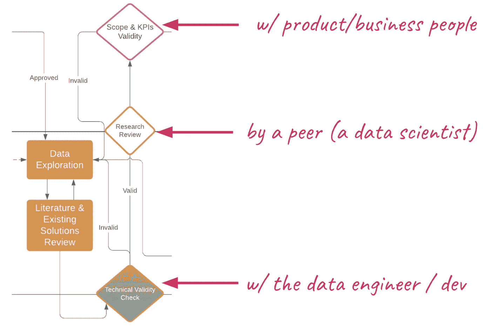
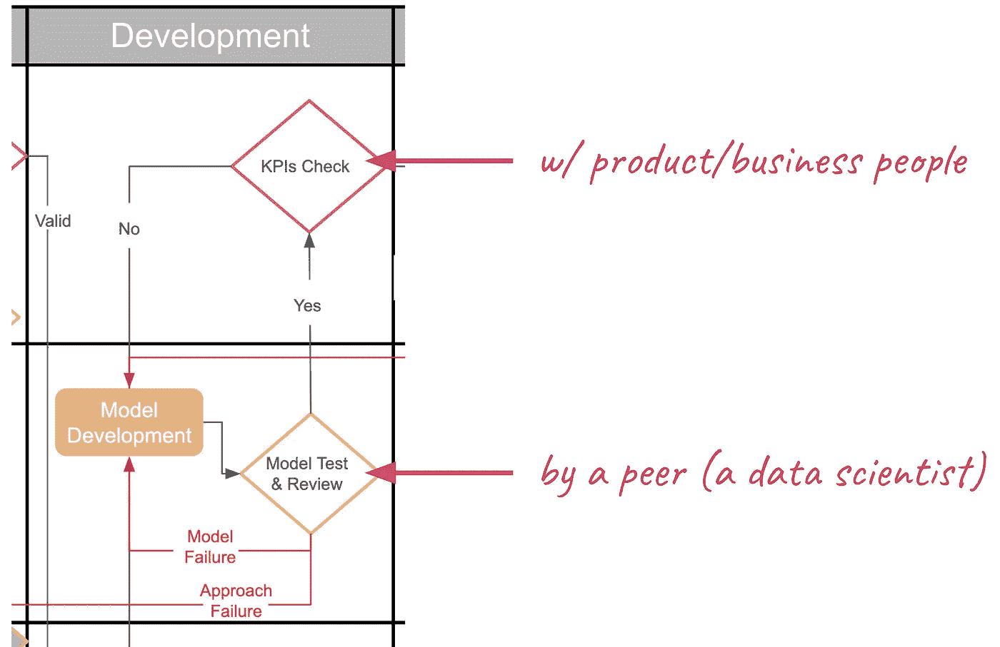

# 同行评审数据科学项目

> 原文：<https://towardsdatascience.com/peer-reviewing-data-science-projects-7bfbc2919724?source=collection_archive---------14----------------------->

## 使用同行审查使您的工作更加防错

同行评审是任何创造性活动的重要组成部分。它用于研究——包括学术界内部和外部——以确保结果的正确性、对科学方法的坚持和产出的质量。在工程中，它用于提供外部审查，并在技术开发过程的早期发现代价高昂的错误。它在任何地方都被用来改善决策。

我们这些在技术行业工作的人都熟悉同行评审的一个特殊且非常重要的实例——代码评审过程。如果你曾经收到过评论，你应该知道，尽管有点不舒服——因为我们的作品总是受到审查——但它可能非常有价值。这一过程迫使我们做好准备，结果，甚至在审查之前就发现了许多需要改进的地方。这通常会提出一些小而重要的问题，这些问题逃过了我们的关注，但对于一个局外人来说却很容易发现，有时它可以提供非常深刻的见解。

因此，这篇文章的目标是为数据科学项目提供一个执行类似功能的流程布局建议。它是我个人关于小规模数据科学项目应该如何运行的观点的一部分，我在以前的博客文章中已经提到过这个话题:[初创公司的数据科学项目流程](/data-science-project-flow-for-startups-282a93d4508d?source=friends_link&sk=7c29bb9683e4c3564d92d89d31a666d1)。您可以在下面找到该工作流程的图表。

> **编辑:**关于实施这种方法一年来的收获，请参见我的博客文章:[回顾:初创公司数据科学同行评审的一年](https://shay-palachy.medium.com/postmortem-a-year-of-data-science-peer-review-in-startups-7e9cc2862ed9)

这个框架也是基于我作为首席数据科学家、团队领导以及最后作为独立顾问的经历，见证了我咨询过的各种公司所遵循的工作模式。我也依赖于我的许多领导数据科学家团队的朋友的经验。

图 1:数据科学项目流程(来源:作者)

根据我对项目流程的看法，我建议两个不同的同行评审过程，因为我觉得最需要同行审查的两个阶段是:研究阶段和模型开发阶段。

因此，目标是为两个阶段的同行评审过程提供一个总体框架，该框架将:

1.  正式化流程并提供结构。
2.  鼓励数据科学家提问并提供同行评审。
3.  降低代价高昂的错误风险。

我将讨论这两个过程的动机、目标和结构，并附带一个独特的问题清单。

与项目流程类似，这些流程是由应用数据科学领域的小团队编写的。然而，更大的团队甚至研究小组可能会发现下面的一些想法很有用。

> **演职员表:**模型开发[评审清单](https://medium.com/@ptannor/checklist-for-data-science-research-review-8a817b50697b)是 [Philip Tannor](https://medium.com/@ptannor) 的创造，他是一位令人敬畏的数据科学家，也是一个更好的人。

# 数据科学研究阶段回顾

为了唤起你的记忆，我们称之为“研究阶段”,在这个过程中，我们在数据探索和文献回顾之间反复执行(可以包括回顾现有的代码和实现)。这一阶段还包括规划可能的方法空间，以构建和解决手头的问题，并形成我们对最佳前进方式的建议，通过列出每种选择固有的优势和风险来补充这一建议。

图 2:研究阶段的三个检查(来源:作者)

请注意，在此阶段执行三种类型的检查，以验证方法的自然影响选择:

1.  **技术有效性检查**，通常与支持项目的数据/软件工程师一起完成，旨在确保建议的方法可以成功部署并得到工程支持。
2.  **研究评审**，同行帮助数据科学家验证其流程和建议。我们一会儿将深入研究这个问题。
3.  **范围和 KPI 有效性检查**，由产品负责人完成，以确保推荐的方法保持在项目范围内，并且似乎满足项目的 KPI。

## 动机

我认为，数据科学家在项目的研究阶段获得同行评审的主要动机是防止他们在项目的早期阶段选择错误的方法或方向。这些错误——在 DS 工作流程中被称为*方法失败*——制造起来*非常昂贵，并且它们在项目的剩余生命周期中阻碍了项目。*

如果幸运的话，我们会在几次模型开发迭代后发现方法失败，并且我们会失去数据科学家几周的宝贵工作。当使用我们选择跟踪和优化的指标来衡量时，这是方法失败导致性能下降的情况。

然而，在某些情况下，由方法失败导致的性能差异要微妙得多，在使用大量生产数据验证模型性能之前，甚至在用户/客户对该行为的反馈时，可能极难识别，导致只有在模型投入生产后才发现失败。并且成本明显更高:数据科学家、工程师和产品人几个月的工作，客户满意度下降，潜在的流失甚至收益减少。

这就是为什么模型基准不能是我们希望在过程和决策中发现方法错误的唯一方法；我们必须明确地假设它们可能通过这些手段逃脱检测，并试图通过检查过程本身、其逻辑和支持它们的主张和数据，从方法上发现它们。

## 目标

显然，这里的主要目标是在早期捕捉代价高昂的错误，如上所述，通过明确地将过程的核心方面置于检查之下，同时还对几个捕获对象执行基本的健全性检查。

然而，两个额外的子目标可以在这里陈述:首先，提高数据科学家在即将到来的产品/业务评审过程中解释和维护其决策的能力。第二，更好地准备向团队的其他成员展示研究阶段的成果，这在大多数数据科学团队/小组中是一种极其常见和重要的做法。

## 结构

准备评审的三个步骤是:

1.  接受审查的数据科学家准备一份他所经历的研究过程的演示文稿(不一定是幻灯片)。
2.  接受审查的数据科学家安排了一次长时间的会议(至少 60 分钟；上次花了我们两个小时)和评审。
3.  评审者(在会议前)检查了清单。

接受审查的数据科学家在演讲中试图触及以下七点:

1.  提醒:项目范围和产品需求。
    *总是从这里开始，因为评审的一个要点是评估遵循的过程和做出的选择如何服务于项目范围和需求。*
2.  初始指导方针和 KPI。
    *在许多情况下，这将是负责审查的 DS 第一次看到将产品需求转化为技术 KPI 的过程，这也是向同行展示这一过程的好机会。涵盖问题特征和约束。*
3.  做出的假设。我们都会对数据格式、可用性、可接受的错误和常见的产品使用模式做出强有力的假设。让他们明白。
4.  使用的数据，以及如何探索。

5.  达成的可能方法/解决方案列表。
    *研究阶段的第一个主要成果:解决方案前景图，详细说明每个方案的优缺点，包括假设，如果相关的话，还可能描绘出起源和它们之间的关系。*
6.  选定的前进方法和理由。
    *您的推荐。这是这个阶段最显著的成果，但是记住，要绘制一条路线，你必须首先有一张地图。解决方案前景提供的背景应该使您能够向评审者解释选择，同时排除备选方案。*
7.  哪些可能的失败会导致替代选择？
    *我相信这个研究阶段经常被忽视的产品的重要性不亚于你的推荐。你现在用应急计划来支持它，明确地分享如何对冲和解释一个研究驱动的项目的内在风险。*

最后，以下是审查会议的建议结构:

1.  *审查中的 DS*:研究阶段演示
2.  *审核人*:一般反馈
3.  *审核人*:查看检查表*(见下文)*
4.  *审核人*:批准或拒绝
5.  *一起*:结果动作点

## 清单

该列表重点关注在研究阶段应该解决的问题。我把它分成十类:

1.  数据属性
2.  接近假设
3.  过去的经验
4.  目标对准
5.  履行
6.  缩放比例
7.  合成/断裂能力
8.  信息要求
9.  领域适应
10.  噪声/偏差/缺失数据弹性

让我们检查一下问题。记住，这只是我想出来的一个初步建议，并不能全面涵盖需要考虑的一切。

**数据属性**

关于初始数据集:

*   是如何产生的？是怎么采样的？更新了吗？
    *例如，从现有的五个客户端中的每一个客户端统一抽取上月数据的 10%。*
*   这引入了什么噪声、采样偏差和缺失数据？
    *例如，其中一个客户两周前才集成了我们的服务，在数据集中引入了他的数据的下采样偏差。*
*   你能修改采样/生成以减少或消除噪声吗？抽样偏差？缺失数据？
    *例如，要么将欠采样的客户端向上采样两倍，要么对所有客户端仅使用最近两周的数据。*
*   你能独立于一种方法明确地模拟噪声吗？
*   如果数据集被标记，它是如何被标记的？
*   这引入了什么标签偏见？可以测量吗？标签可能来自半专注的用户。使用专家/分析师手动标记一个非常小的(但有代表性的)集合可能是容易处理的，并且将使我们能够测量这个集合上的标记偏差/误差。
*   你能修改或增加标签过程来补偿现有的偏见吗？
*   初始数据集在生产、结构和模式方面与预期的输入数据有多相似？
    *例如，某些项目的内容在生产中动态变化。或者可能是不同的字段丢失了，这取决于创建的时间或源域，并且是后来完成的或推断的。*
*   生产数据的初始数据集有多大代表性？
    *例如，客户端之间的数据分布不断变化。或者可能它是在春季的两个月中被采样的，但是当冬季开始时，模型会上升。或者它可能是在集成主要的客户端/服务/数据源之前收集的。*
*   你希望的最好的训练数据集是什么？非常明确地定义它。
    -估计:性能会提高多少？
    -生成的可能性和成本如何？
    *例如，使用三个标注器标记 20，000 个帖子的情感，并给出模式/平均分作为每个帖子的标签。这将需要 400 个工时，预计花费 2000 或 3000 美元，并预计将精确度提高至少 5%(这个数字通常很难提供)。*

**接近假设**

*   每种方法对数据/数据生成过程/正在研究的现象做了什么假设？
*   对你的问题做这些假设合理吗？到什么程度？
*   你如何期望适用性与这些假设的违反相关联？例如，10%的违规→ 10%的性能下降？
*   这些假设可以独立验证吗？
*   是否有违反这些假设的边缘/角落案例？

> **示例:**要确定机票价格的变化是否会推动您的服务使用量激增，您可能需要使用一些经典的因果推断统计方法来分析两个值的时间序列。或者，您可以使用 ARIMA 这样的通用模型来预测下个月的机票价格。
> 
> 许多这样的方法不仅——有时是隐含的——假设输入时间序列是[平稳随机过程](/stationarity-in-time-series-analysis-90c94f27322)的实现，而且它们既没有提供时间序列平稳程度的度量，也没有提供时间序列违反这一假设的程度。最后，当这个假设在任何程度上被违反时，它们没有提供错误的上限——或者说犯错误的概率。
> 
> 因此，这是这些方法的一个显著缺点，应该明确地提出和说明。在这种情况下，[平稳性**实际上可以独立地对**](/detecting-stationarity-in-time-series-data-d29e0a21e638)进行测试，而不考虑所使用的方法，因此在做出选择之前可以确定某些方法的有效性。

以下是一些方法做出的非常强且通常隐含的假设的例子:

*   每个特征遵循高斯分布。
*   时间序列是平稳过程的实现。
*   特征是严格独立的(例如朴素贝叶斯假设这一点)。
*   被测系统中不同部件测量值的可分性。

**过往经历**

*   你有什么应用这种方法的经验，无论是在一般情况下还是在类似的问题上？
*   您是否发现了任何已发表的(例如在博客帖子或文章中)将此方法应用于类似问题的成功/失败案例？
*   你有没有向同龄人请教他们的经验？
*   从上面可以学到什么教训？
*   如果这个项目是一个迭代和改进现有解决方案的尝试:到目前为止使用了什么解决方案来解决这个问题？他们的优势是什么？他们遭遇了什么问题？

**物镜校准**

对于基于优化的监督学习方法:

*   拟合模型参数时可以使用哪些损失函数？它们与项目 KPI 有什么关系？
*   哪些指标可用于模型选择/超参数优化？它们与项目 KPI 有什么关系？
*   应该添加哪些硬约束来反映 KPI？

对于无监督学习方法:

*   方法优化什么措施？
*   它与 KPI 有什么关系？
    *例如，最大化平均词向量的可分性在多大程度上可以近似地找到一组捕捉到关于某个主题的不同观点的文章？*
*   有哪些很好地满足了度量标准但却不满足 KPI 的边缘案例？

对于无监督表示学习:

*   为什么假任务(例如预测 *Word2Vec* 中一个单词的邻居)有望促进输入表示的学习，这将有利于试图执行实际任务的模型？

**实施**

*   在您的生产环境中是否有当前使用的语言的方法实现？
*   实现是最新的吗？一贯支持？广泛使用？
*   与贵公司类似的公司/组织是否成功运用了这一具体实施方案？和你类似的问题？

**缩放**

*   计算/训练时间如何与数据点数量成比例？
*   与特征的数量？
*   存储如何随数据点/功能扩展？

**合成/断开能力**

*   如果需要的话，不同领域(类别/客户/国家)的模型能以合理的方式组合吗？
*   或者，他们的结果能以一种有意义的方式整合吗？
*   一个通用模型可以被分解成每个领域的模型吗？可以识别和利用这种模型的每个域相关的内部组件吗？

图 3:模型可组合性可能是一个需求，并且有不同的形式(来源:作者)

> 例:假设我们正在开发一个主题动态播放列表生成系统，作为音乐流媒体服务的一部分。这意味着我们希望围绕“新独立”、“英国新浪潮”、“女权主义音乐”或“俗气情歌”等主题自动生成和更新播放列表。为了增加复杂性，我们可能还希望允许主题组合的播放列表，如“女权主义新浪潮”或“新阴郁独立”。或者，我们希望能够为听众个性化每个播放列表。最终，如果我们有一个模型可以对包含在主题播放列表中的歌曲进行排序，另一个个性化模型可以根据特定用户喜欢歌曲的可能性对歌曲进行排序，我们可能希望能够将这两个模型的结果结合起来。
> 
> 不同的方法可以以不同的方式支持这些场景。例如，如果我们将每个人/主题建模为所有歌曲的概率分布，其中播放列表是通过重复采样(没有重复)即时生成的，则任何数量的这种模型都可以容易地组合成单个概率分布，然后可以使用相同的过程来生成适应的播放列表。然而，如果我们使用一些使用分数的 ML 模型对歌曲进行排名，我们可能必须设计一种方法来使不同模型的分数具有可比性，或者使用通用方法来整合同一组项目上的几个排名。

**信息需求**

*   每种方法在多大程度上依赖于可用信息量？少量信息对性能的预期影响是什么？
*   这与当前可用的信息量是否一致？未来的可用性？

> 例如，如果不能依赖预先训练的模型或单词嵌入，从头开始训练基于神经网络的文本分类序列模型通常需要大量信息。例如，如果我们正在为代码文件构建一个脚本或模块分类器，这可能正是我们所处的情况。在这种情况下，假设每种编程语言代表一个独立的领域，神经网络模型可能无法很好地适用于非常罕见的编程语言，或者那些我们很少有标签的语言。

**冷启动&域适应**

*   新客户/类别/国家/地区/域预计多快能达到每种方法的最低信息要求？
*   至少作为一个起点，一个通用模型能为他们带来好的表现吗？
*   有没有办法让一个已经适应的模型适应一个新的领域？这有望比从头开始培训产生更好的绩效吗？这能比从头开始训练更快/更便宜吗？

> **举例:**假设我们正在为我们的在线市场中的产品建立一个推荐系统，这个系统被许多商家使用，每天都有新的商家加入并开始销售他们的产品。使用基于神经网络的模型来学习商家和/或其产品在表示它们的一些数据上的嵌入，可以通过将这些新商家映射到嵌入空间中类似的现有商家附近，然后利用已经学习到的关于不同购物者从现有商家购买特定产品的可能性的知识，来对此类新商家表现得令人惊讶地好。

**噪声/偏差/缺失数据弹性**

这种方法能处理数据中的噪音吗？怎么会？

*   它具体建模了吗？
*   如果是这样，考虑:噪声模型在多大程度上适用于您的问题中的噪声生成过程？
*   对于异常/预测/因果关系/动态:该方法是否模拟了系统中的外生变量？

对于监督和半监督方法:

*   每种方法对标签偏见的敏感程度如何？
*   在你的案例中，有偏见的模型意味着什么？
*   一般的偏差修正技术适用于这种方法吗？

对于所有方法:

*   每种方法如何处理丢失的数据，如果有的话？
*   在每种情况下，随着丢失数据的增加，性能预计会下降到什么程度？

# 数据科学模型开发阶段回顾

再次回忆一下，我所说的模型开发阶段是数据科学项目的一部分，在这个阶段完成了大量的数据处理(包括特征生成，如果使用的话)，实际的模型被应用于实际的数据——在受监督的场景中，它们被*训练*或*拟合*——并且使用一些预定的度量标准进行基准测试，通常是在预留的测试/验证集上。

您可以将整个事情看作是一个大的迭代——不管检查了多少方法——但是我更愿意将它看作是几个迭代，每个迭代致力于一个方法。这些要么并行执行，要么按照我们在研究阶段结束时概述的排序顺序执行，其中方法失败(估计模型子性能是由于当前方法对问题的基本不适用性或不匹配)导致新的模型开发迭代超过下一个最佳方法。

图 4:模型开发阶段的两个检查(来源:作者)

与所有其他阶段类似，最后的检查点是与负责的产品经理共同讨论，以验证要部署的模型实际上满足项目 KPI。然而，在此之前，另一个审查是由一个同行。

## 动机和目标

正如在研究综述中，这里的动机是模型开发阶段的错误也可能是昂贵的。这些错误几乎总是在生产中被发现，并且可能需要主动的模型监控来捕捉。否则，它们会在产品化阶段的后期被捕获，同时需要一个开发人员/数据工程师，并暴露关于工程能力或生产环境的隐含假设之间的差距；在研究阶段结束时进行的技术有效性检查是为了减少这些错误。然而，由于它们中的许多是(1)技术性的，(2)基于实现的和(3)特定于模型的，它们通常只能在这个阶段期间和之后被检查，因此模型开发评审也处理它们。

因此，目标是相同的:首先，为模型开发阶段提供一个结构化的审查过程，这将通过正式地将它合并到项目流程中来增加同行审查。第二，通过检查准备好的问题和议题列表来降低代价高昂的错误的风险，这些问题和议题是根据必须解决它们的其他数据科学家的宝贵经验来检查的。

## 结构

在准备评估时，有三个简单的步骤:

1.  接受审查的数据科学家准备模型开发过程的演示文稿(不一定是幻灯片)。
2.  接受审查的数据科学家安排一次彻底的会议(至少 60 分钟。)与审核数据的科学家。
3.  审核 DS(在会议前)检查清单。

接受审查的数据科学家应在演示中涵盖以下几点:

1.  提醒:项目范围和产品需求
2.  研究阶段后选择的方法
3.  模型选择的度量+软硬约束
4.  使用的数据、预处理和特征工程
5.  模型检查，训练制度，超参数优化。
6.  选定的模型、备选方案以及每种方案的优缺点。
7.  下一步:自动化、产品化、性能优化、监控等。

此处建议审查会议采用相同的结构:

1.  *审阅 DS* :模型开发阶段演示
2.  *审核人*:总体反馈
3.  *审核人*:查看清单*(见下文)*
4.  *审核人*:批准或拒绝
5.  *一起*:结果动作点

## 清单

同样， [Philip Tannor](https://medium.com/@ptannor) 创建了一个问题清单，在评审*模型开发阶段时使用，*分为以下几类:

*   数据假设
*   预处理
*   渗漏
*   因果关系
*   损失/评估指标
*   过度拟合
*   运行时间
*   愚蠢的虫子
*   琐碎的问题

在这里复制这个列表是没有意义的，特别是因为 Philip 计划维护他的列表，所以去看看他的博客吧。

# 最后的话

类似于我建议的[初创公司数据科学项目流程](/data-science-project-flow-for-startups-282a93d4508d)，这只是一个早期草案。我们正在我的一个客户团队中测试 DS 同行评审的这种方法，我保证会报告结果。此外，我希望听到其他团队尝试实施这种方法或相关方法的反馈——我相信你们中的许多人都经历过类似的过程，并提出了自己的方法。

和往常一样，我把这个放在这里是为了听听我错过或做错的事情，并得到你诚实的反馈。通过你在[我的个人网站](http://www.shaypalachy.com/)底部找到的任何联系方式联系我。此外，请随时联系我，让我成为你的顾问。:)

> **编辑:**关于实施这种方法一年来的收获，请参见我的博客文章:[回顾:初创公司数据科学同行评审的一年](https://shay-palachy.medium.com/postmortem-a-year-of-data-science-peer-review-in-startups-7e9cc2862ed9)