# 观察黑盒内部——如何欺骗神经网络

> 原文：<https://towardsdatascience.com/peering-inside-the-blackbox-how-to-trick-a-neural-network-757c90a88a73?source=collection_archive---------23----------------------->

## 在本教程中，我将向您展示如何使用梯度上升来找出如何错误分类的输入。

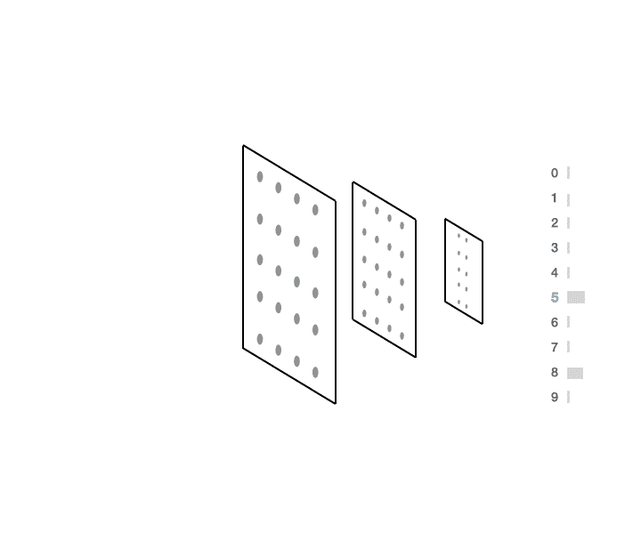

使用梯度上升来计算如何将输入分类为 5。(所有图片均为作者本人，版权所有)。

神经网络因为是黑盒而声名狼藉。虽然理解他们的决策肯定需要创造力，但他们真的不像人们想让你相信的那样不透明。

在本教程中，我将向您展示如何使用反向传播来更改输入，以便根据您的喜好对其进行分类。

使用这个[按钮](https://colab.research.google.com/drive/16HVAJHdCkyj7W43Q3ZChnxZ7DOwx6K5i?usp=sharing)跟随。

(这部作品是与[阿尔弗雷多·坎齐阿尼](https://twitter.com/alfcnz)在一个即将到来的视频之前共同创作的)

# 人类是黑匣子

让我们考虑一下人类的情况。如果我给你看下面的输入:

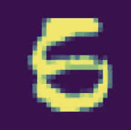

很有可能你不知道这是 5 还是 6。事实上，我相信我甚至可以说服你这个*可能也是一个 8。*

现在，如果你问一个人，他们必须做些什么才能让一些东西变得更像 5，你可能会这样做:

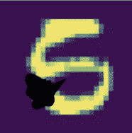

如果我想让你把这个打成 8 分，你可以这样做:

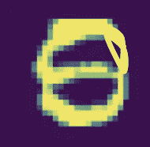

现在，这个问题的答案不容易用几个 if 语句或者看几个系数来解释(是的，我在看你回归)。不幸的是，对于某些类型的输入(图像、声音、视频等)，可解释性肯定变得更加困难**但并非不可能**。

# 询问神经网络

神经网络将如何回答我在上面提出的同样的问题？为了回答这个问题，我们可以用梯度上升来做。

下面是神经网络如何认为我们需要修改输入，使其更接近 5。

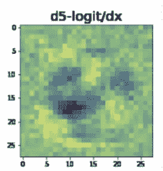

由此得出两个有趣的结果。首先，黑色区域是我们需要去除像素密度的地方。其次，黄色区域是它认为我们需要增加更多像素密度的地方。

我们可以通过给原始图像添加渐变来在渐变方向上前进一步。我们当然可以一遍又一遍地重复这个过程，最终将输入转化为我们所希望的预测。

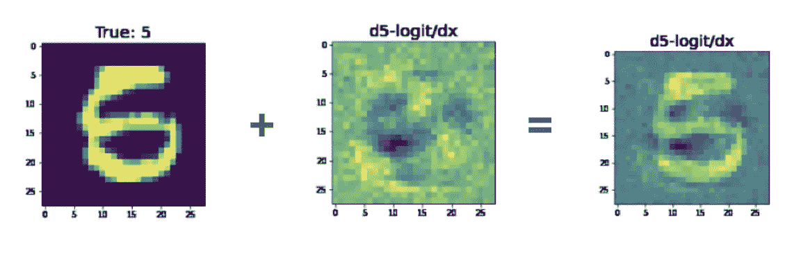

你可以看到图像左下方的黑色斑块**与人类可能认为要做的事情**非常相似。

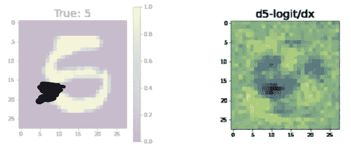

人类在左上角添加黑色。网络显示同样的情况

让输入看起来更像 8 怎么样？这是网络认为你必须改变输入的方式。

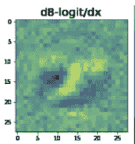

值得注意的是，在左下方有一团黑色，中间有一团明亮。如果我们将此与输入相加，我们会得到以下结果:

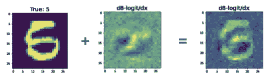

在这种情况下，我并不特别相信我们已经把这个 5 变成了 8。然而，我们少做了一个 5，并且使用右边的图像而不是左边的图像来说服你这是一个 8 的论点肯定会更容易获胜。

# 渐变是你的向导

在回归分析中，我们通过系数来了解我们学到了什么。在随机森林中，我们可以查看决策节点。

在神经网络中，这归结于我们在使用梯度方面有多有创造力。为了对这个数字进行分类，我们生成了一个可能预测的分布。

这就是我们所说的*向前传球。*

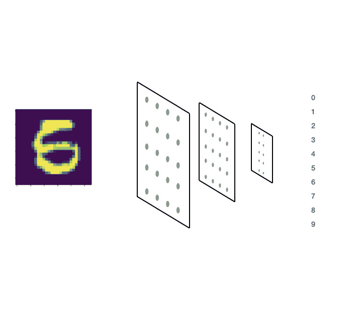

在向前传递期间，我们计算输出的概率分布

代码看起来是这样的([使用 colab](https://colab.research.google.com/drive/16HVAJHdCkyj7W43Q3ZChnxZ7DOwx6K5i?usp=sharing) 跟随):

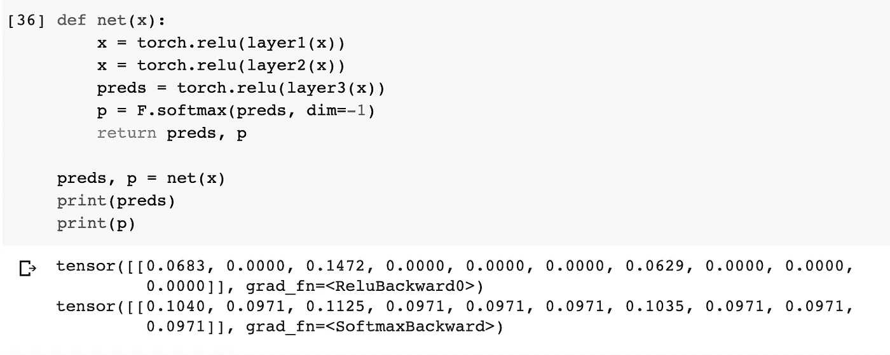

现在，假设我们想要欺骗网络预测输入 x 为“5”，那么方法是给它一个图像(x)，计算图像的预测，然后**最大化**预测标签“5”的概率。

为此，我们可以使用梯度上升来计算第 6 个索引(即:label = 5) ( **p** )处的预测相对于输入 **x** 的梯度。

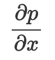

为了在代码中做到这一点，我们将输入 x 作为参数馈送给神经网络，选择第 6 个预测(因为我们有标签:0，1，2，3，4，5，…)，第 6 个索引意味着标签“5”。

这看起来像是:


“5”相对于输入的预测梯度。

在代码中:

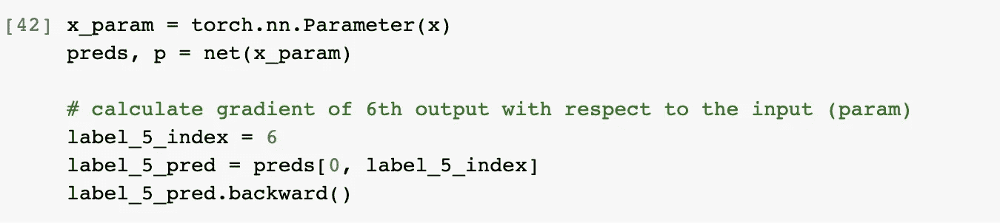

当我们打电话时。backward()发生的过程可以通过前面的动画形象化。

既然我们已经计算了梯度，我们可以将它们可视化并绘制出来:

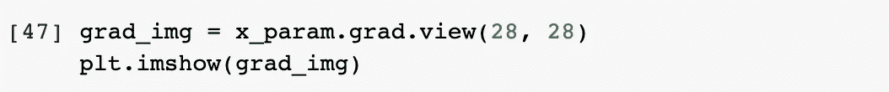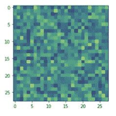

上面的梯度看起来像随机噪声，因为网络还没有被训练…但是，一旦我们训练了网络，梯度将提供更多信息:

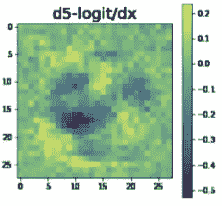

# 通过回调实现自动化

这是一个非常有用的工具，有助于说明你的网络在训练时发生了什么。在这种情况下，我们希望自动化这一过程，以便在培训中自动进行。

为此，我们将使用 PyTorch Lightning 来实现我们的神经网络:

自动绘制我们在这里描述的内容的复杂代码可以抽象成 Lightning 中的回调。回调是一个小程序，在您可能关心的培训部分调用。

在这种情况下，当处理一个训练批次时，我们希望生成这些图像，以防某些输入被混淆。

但是…我们用 pytorch-lightning-bolts 让它变得更简单，你可以简单地安装它

```
pip install pytorch-lightning-bolts
```

并将回调导入到训练代码中

# 把所有的放在一起

最后，当逻辑“混乱”时，我们可以训练我们的模型并自动生成图像

tensorboard 会自动生成这样的图像:

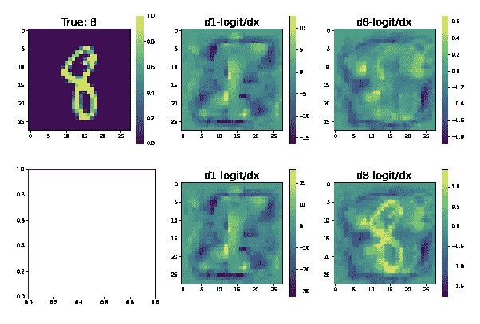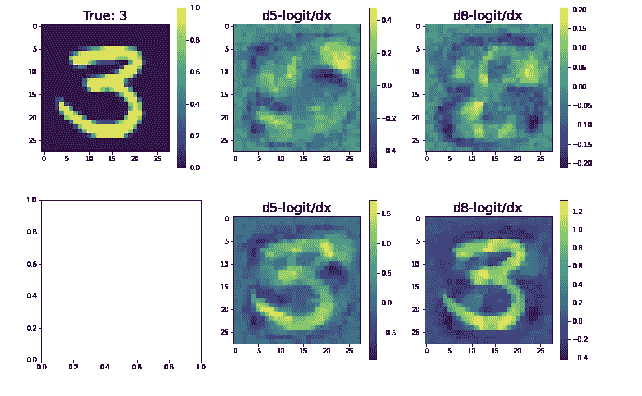

# 摘要

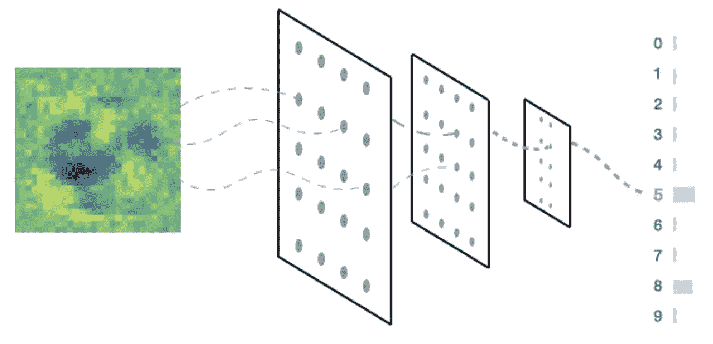

总之:您学习了如何使用 PyTorch 查看黑盒内部，学习了直觉，在 PyTorch Lightning 中编写了一个回调函数，并自动获得 Tensorboard 实例来绘制可疑的预测

用 [PyTorch 闪电](https://github.com/PyTorchLightning/pytorch-lightning)和 [PyTorch 闪电](https://github.com/PyTorchLightning/pytorch-lightning-bolts)自己试试。

(这篇文章是在一个即将到来的视频之前写的，在这个视频中，我(威廉)和[阿尔弗雷多·坎齐安](https://twitter.com/alfcnz)将向你展示如何从头开始编码)。