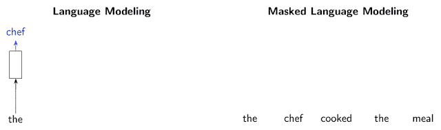
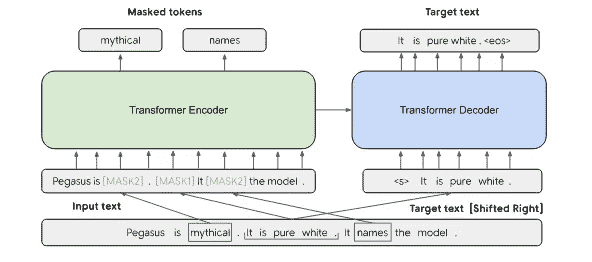
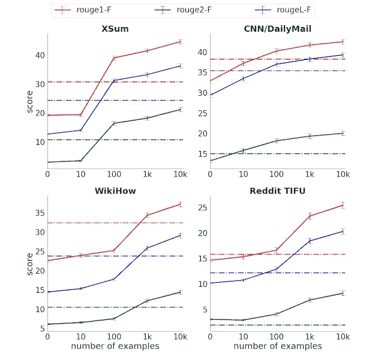
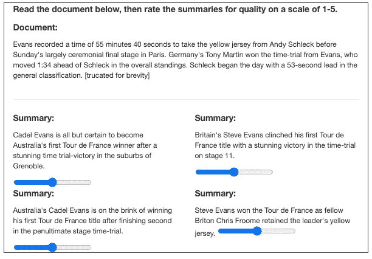

# PEGASUS: Google 最先进的抽象摘要模型

> 原文：<https://towardsdatascience.com/pegasus-google-state-of-the-art-abstractive-summarization-model-627b1bbbc5ce?source=collection_archive---------16----------------------->

## 谷歌人工智能如何生成人类级别的摘要

苏丹欧阳在 [Unsplash](https://unsplash.com?utm_source=medium&utm_medium=referral) 上的照片

总结的能力评估一个人对一篇给定的文章或一种语言的理解。

> 也许对一个人智力的最好测试是他做总结的能力
> 
> —李顿·斯特雷奇

因此，摘要在自然语言处理中是一个相当重要的概念。在[这篇文章](https://medium.com/swlh/abstractive-text-summarization-using-transformers-3e774cc42453)中，我已经介绍了作为一个整体的摘要和抽象摘要以及它的实现。如果你有兴趣了解这项任务的简要背景，可以考虑读一读；飞马模型是在变形金刚架构上训练的。

在这篇文章中，我们将讨论谷歌人工智能最近提出的一篇论文，“ [PEGASUS:使用提取的间隙句子进行抽象概括的预训练](https://arxiv.org/abs/1912.08777)，该论文预计将在 [ICML 2020](https://icml.cc/Conferences/2020) 上发表。

# PEGASUS:用提取的间隔句进行抽象摘要的预训练

像任何其他序列转换任务一样，PEGASUS 也实施 seq2seq 体系结构。然而，这种架构的新颖之处在于其自我监督的预训练目标。

自我监督学习是深度学习的新亮点。它基本上消除了数据对标记样本的依赖，并使大量未探索、未标记的数据可用于训练。

> 基于转换器的模型与自我监督的预训练(例如，[伯特](https://ai.googleblog.com/2018/11/open-sourcing-bert-state-of-art-pre.html)、 [GPT-2](https://openai.com/blog/better-language-models/) 、[罗伯塔](https://arxiv.org/abs/1907.11692)、 [XLNet](https://arxiv.org/abs/1906.08237) 、[艾伯特](https://ai.googleblog.com/2019/12/albert-lite-bert-for-self-supervised.html)、 [T5](https://ai.googleblog.com/2020/02/exploring-transfer-learning-with-t5.html) 、[伊莱克特拉](https://ai.googleblog.com/2020/03/more-efficient-nlp-model-pre-training.html))的组合，已经被证明在整体语言建模任务中非常有效。

## 间断句生成(GSG):自动监督的摘要目标

谷歌人工智能博客[在 PEGASUS 进行的自我监督预培训](https://ai.googleblog.com/2020/06/pegasus-state-of-art-model-for.html)

> 这个目标背后的主要思想是假设预训练自我监督目标越接近最终的下游任务，微调性能越好

因此，在 PEGASUS 中，**完整的句子被从文档中删除**(即它们被“屏蔽”)，并且**模型被训练来预测这些句子**，如图所示。作者承认，这项任务似乎几乎不可能完成，事实上对人类来说也是如此。但是这种训练对于具有原始文档实例的句子的生成引起了更高的理解感；从而支持他们的假设。这项任务被称为**间隙句子生成(GSG)。**

除此之外，作者声称从文档中选择最重要的句子来屏蔽效果最好。这是通过根据称为 [ROUGE](https://www.aclweb.org/anthology/W04-1013/) (通常用于评估摘要任务中摘要的质量)的度量来找到与完整文档最相似的句子来完成的。

## 掩蔽语言模型(MLM)

虽然飞马座的主要贡献是 **GSG** (上一节讨论过)，但它的基础架构由一个编码器和一个解码器组成；因此，将编码器预先训练为屏蔽语言模型是有意义的。

语言建模 v/s Masked 语言建模 by [Google AI 博客](https://ai.googleblog.com/2020/03/more-efficient-nlp-model-pre-training.html)

在这项任务中，我们随机屏蔽序列中的单词，并使用序列中的其他单词来预测这些被屏蔽的单词。GSG 任务可以被理解为一个文档级的 MLM，并且就是从这个概念中派生出来的。

因此，正如 [BERT 论文](https://arxiv.org/abs/1810.04805)中所建议的，序列中 15%的单词被随机屏蔽，模型被训练来预测这些被屏蔽的单词。

## 综合训练

前面几节中讨论的两种方法都被合并，并且以组合的方式训练转换器。

MLM(左)+ GSG(右)一起在飞马训练来自[论文](https://arxiv.org/abs/1912.08777)

> GSG 和 MLM 作为预训练目标同时应用于此示例。本来有三句话。一个句子用[MASK1]屏蔽，用作目标生成文本(GSG)。其他两个句子保留在输入中，但是一些单词被[MASK2] (MLM)随机屏蔽。
> 
> — [飞马纸业](https://arxiv.org/abs/1912.08777)

# 结果

该模型在 12 个公共摘要数据集上进行了微调。在其中 6 个数据集上，它已经超过了之前的技术水平，令人惊讶的是，它只在很少的样本上进行训练。

## 微调

谷歌人工智能博客[对选定的 4 个数据集(虚线是未经预训练的完全监督模型的结果)的各种 ROUGE 指标](https://ai.googleblog.com/2020/06/pegasus-state-of-art-model-for.html)

可以清楚地看到，在最少 1000 个训练样本的情况下，PEGASUS 在这些数据集上已经超越并达到了最先进的水平。

## 人的素质总结

谷歌人工智能博客进行的人类评级测试

PEGASUS 还在 3 个数据集上取得了人类水平的结果。评估是通过对人工摘要和模型生成的摘要进行评级来完成的，而不知道哪一个是哪一个。

> “我们用 3 个不同的数据集进行了实验，结果发现，与我们的模型相比，人类评分者并不总是更喜欢人类摘要”

## 清点船只

这是飞马座取得的另一个有趣的结果:

来自 Xsum 数据集的一篇文章提出了 4 艘船的名字，即。英国皇家海军舰艇坎伯兰号、坎伯敦号、查塔姆号和康沃尔号。该模型正确地将其抽象为*、【四艘皇家海军护卫舰】、*、*，尽管这里没有提到样本中的数字“四”。*

考虑到这是一种侥幸，作者通过从名单中增加或删除名字来测试这一点。如果有 2-5 个名字，该模型可以正确地提取数字。然而，它将 6 艘船误算为“7 艘”，这表明它只能提取列表中的一小部分名称。

演示可以在[这里](https://ai.googleblog.com/2020/06/pegasus-state-of-art-model-for.html)找到。

> **有趣的事实:该模型仅使用 T5 的 5%的参数数量就取得了比 T5 等同类模型更好的结果。**

# 结论

我们已经讨论了 Google 的抽象摘要模型的工作状态。我们还看到了在一个与下游任务相对相似的任务上进行预训练如何极大地增强了模型在微调上的性能。这为比一般情况更具体地模拟自我监督预训练目标提供了可能性。

代码和检查点是开源的，可以在这里找到。

# 参考

 [## PEGASUS:用提取的间隔句进行抽象摘要的预训练

### 最近的工作预训练变压器与自我监督的目标对大型文本语料库显示了巨大的成功…

arxiv.org](https://arxiv.org/abs/1912.08777)  [## PEGASUS:抽象文本摘要的最新模型

### 学生的任务通常是阅读一份文件并编写一份摘要(例如，读书报告)来展示…

ai.googleblog.com](https://ai.googleblog.com/2020/06/pegasus-state-of-art-model-for.html)  [## 使用变压器的抽象文本摘要

### 对谷歌 Transformer 模型的详尽解释；从理论到实施

medium.com](https://medium.com/swlh/abstractive-text-summarization-using-transformers-3e774cc42453)