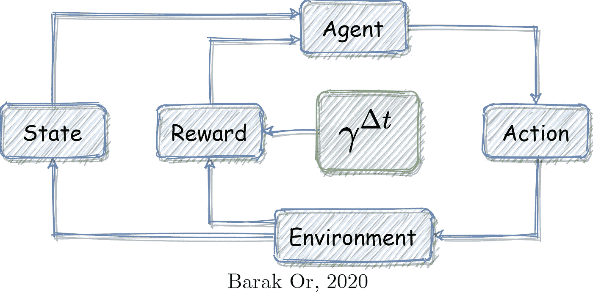
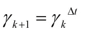
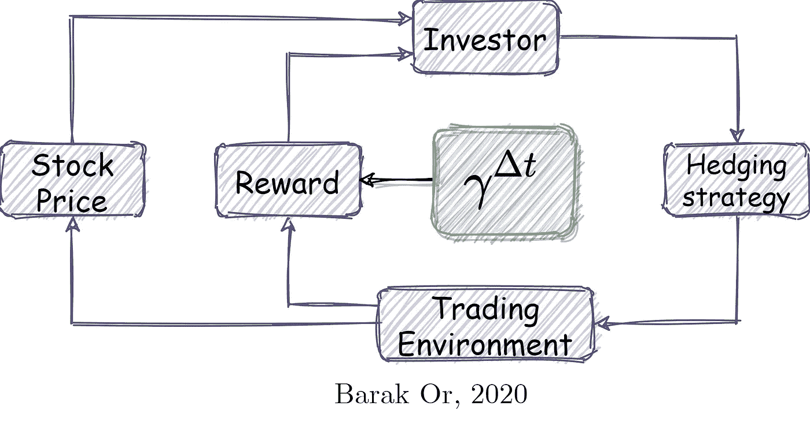

# 强化学习中折扣因子的惩罚

> 原文：<https://towardsdatascience.com/penalizing-the-discount-factor-in-reinforcement-learning-d672e3a38ffe?source=collection_archive---------30----------------------->

## 强化学习领域用于许多机器人问题，具有独特的机制，奖励应该通过行动来积累。但是，这些动作之间的时间呢？

作者形象

这篇文章讨论了我发现影响很大的一个关键参数:折扣因子。讨论了基于时间的惩罚以获得更好的性能，其中折扣因子被相应地修改。

我假设如果你看到这篇文章，你已经熟悉 RL 术语了。如果不是这样，那么在你继续之前，我强烈推荐这些提供了很好背景的博客: [Intro1](/introduction-to-various-reinforcement-learning-algorithms-i-q-learning-sarsa-dqn-ddpg-72a5e0cb6287) 和 [Intro2](/reinforcement-learning-demystified-markov-decision-processes-part-1-bf00dda41690) 。

# 折扣因子在 RL 中的作用是什么？

贴现因子**𝛾**是一个实值∈ [0，1]，关心代理人在过去、现在和未来获得的回报。换句话说，它将奖励与时间域联系起来。让我们来探讨以下两种情况:

1.  如果 **𝛾** = 0，代理只关心他的第一个奖励。
2.  如果 **𝛾** = 1，代理关心所有未来的奖励。

一般来说，设计师应该预先定义场景情节的折扣系数。这可能会引起许多稳定性问题，并且可能在没有达到预期目标的情况下结束。然而，通过探索一些参数，许多问题可以用收敛的解决方案来解决。要进一步了解折扣系数和为机器人应用选择折扣系数的经验法则，我推荐阅读: [resource3](https://stats.stackexchange.com/questions/221402/understanding-the-role-of-the-discount-factor-in-reinforcement-learning) 。

# 为什么要处罚？

一旦设计者选择了折扣因子，它对于整个场景都是统一的，这对于连续-离散问题(以及更多，但让我们专注于此)来说不是最优的情况。机器人动力学是一个连续的过程，我们通过各种嘈杂的传感器观察，并以离散的方式处理其信息(毕竟是计算机……)。因此，我们通过使用离散的工具来解决一个连续的问题。因为这涉及到数值误差。此外，各种传感器被噪声污染，增加了固有误差。最后，我们假设的动态模型(例如我们定义的状态)也受到不确定性的影响，并且包括额外的误差。

因此，通过假设统一的折扣因子，我们假设这些误差源的统一行为，这些误差源是非统一行为。对这些问题的补偿可以通过惩罚折扣因子并相应地权衡所获得的回报来实现。

# 关于取样时间的处罚

下面的例子解释了一种针对采样时间(定义为两次连续测量之间经过的时间)惩罚折扣因子的常用方法:

作者形象

由于采样间隔很小，在极限情况下，折扣为 1(由于[或 Rivlin](https://medium.com/u/d6ea8553654c?source=post_page-----d672e3a38ffe--------------------------------) 的校正)，当采样间隔很大，以致两次连续测量之间经过很长时间时，采样间隔相应改变。请记住，折扣因子介于 0 和 1 之间，因此大的采样间隔转换为小的折扣因子(反之亦然)。更新折扣系数的公式只是一个演示该想法的建议，因为可以采用许多其他形式。

# 一个算法例子

考虑一个算法交易场景，其中投资者(代理人)在交易市场(环境)中控制他的对冲策略(行动)，其中股票价格(状态)随时间变化。如果最近一次投资已经过去了很长时间，回报就不能保持原样，因为在此期间可能会发生很多变化。因此，修改的折扣因子可能会导致更好的性能，因为它关心事件之间经过的时间。

作者形象

就这样…希望你喜欢读这篇文章！如有任何问题/讨论，请随时联系我。

巴拉克

www.barakor.com

【https://www.linkedin.com/in/barakor/ 