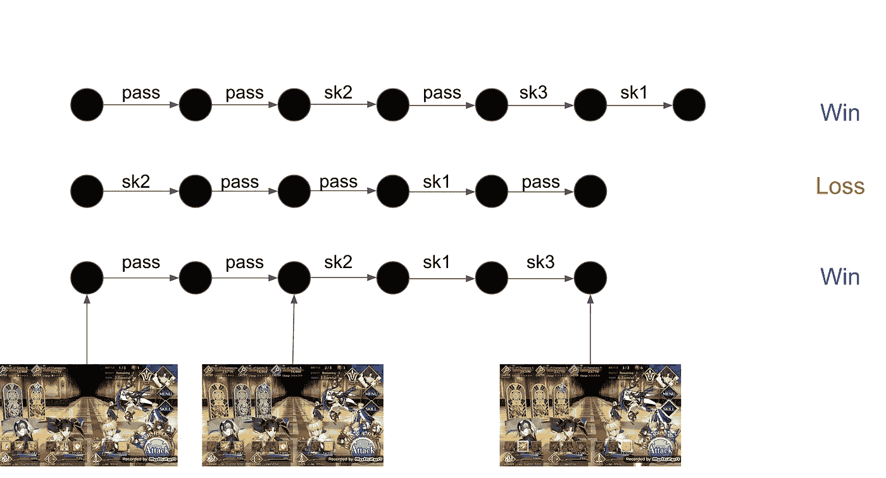
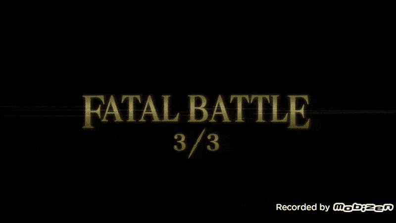

# 潘德雷肯四:多智能体强化学习的训练管道

> 原文：<https://towardsdatascience.com/pendragon-four-training-pipeline-deeper-dive-for-multi-agent-reinforcement-learning-80df2434dd0?source=collection_archive---------39----------------------->

在过去的一年里，我制作了各种版本的神经网络机器人来玩游戏《命运大令》(FGO)，大致称为“潘德雷肯计划”。围绕潘德雷肯项目的工作范围从用一系列神经网络提取特征以获得关于当前游戏状态的信息，到我最近增加的三个神经网络来控制游戏屏幕上活跃的三个角色。这三个和另外一个用于挑选动作卡的机器人是四个强化学习(RL)代理，它们组成了我当前版本的项目，潘德雷肯四。

我最近的一篇介绍[潘德雷肯四人组](/pendragon-four-multi-agent-reinforcement-learning-with-fate-grand-order-80f6254754dd)的帖子涵盖了我为了能够训练我的新特工而必须进行的总体添加和升级，以及一些结果。然而，我想回顾一下我发现有用的培训的一些方面，以及在继续改进我最初的潘德雷肯四管道后学到的一些经验教训。

1.  从 DQN 转向基于政策梯度的培训
2.  处理无效移动
3.  游戏平衡和适当地挑战代理


纯策略梯度机器人，在多次训练中，一个相当一致的事情是机器人会使用 Ishtar(中间角色)的第二技能来立即清除第一波。对于机器人来说，我认为这是一个更稳定的策略，至少让他们有机会进入后期游戏，而不是在他们可能活着也可能不活着的时候保存技能。

# 让代理学习他们自己的游戏方式

我对 RL 的第一次真正尝试是为我最初的[潘德雷肯 Alter](/project-pendragon-part-2-a-reinforcement-learning-bot-for-fate-grand-order-7bc75c87c4f3) 机器人建立我的定制环境，这是一个基于 DQN 的代理，其目标是在任何给定的回合挑选命令卡。基于 DQN 的培训方法的基本流程如下:

1.  代理(在这种情况下是网络)被告知游戏的当前状态。这可能是一款[雅达利乒乓游戏](http://karpathy.github.io/2016/05/31/rl/)的像素，也可能是你选择的任何代表。我的 FGO·潘德雷肯 Alter bot 是 5 张牌中的一张。
2.  代理从动作空间中选择一个动作。在 Pong 的例子中，Andrej Karpathy 把它作为上升的概率。在我的 FGO 游戏中，是 60 种可能的卡槽组合中哪一种最好(有 60 种方法从 5 张卡中选择 3 张)。然而，应该注意的是，在强化学习中，存在探索与利用的概念。本质上是说，有时应该随机选择一个动作，而不是简单地做代理认为最好的事情。这有助于代理探索和发现额外的奖励，否则如果它只是利用它知道的奖励，它将不会发现。
3.  行动被归入环境，任何奖励被收集，环境进入下一个状态、框架或回合。机械地，我这样做是通过将奖励添加到网络输出的卡槽组合中。对于正的奖励，该类别在输出数组中的值增加，并且网络将再次看到给定该输入，该特定类别是有益的。
4.  代理根据其收到的奖励进行更新。在奖励被用于修改输出阵列之后，网络以修改后的输出阵列为目标在初始输入状态上被训练。这有助于巩固好的选择，同时也考虑到坏的选择。
5.  冲洗并重复。

这个过程是有效的，也是合理的，但我发现在我的定制环境中，这意味着我不得不限制代理根据我的观点来玩，因为没有分数或内置的奖励，我可以用它来分配个人行为的价值。所以发生的事情是，我必须奖励机器人我认为好的东西。例如，有了卡牌机器人，它将组合 3 张同类型的卡牌组合，因为有与此相关联的奖金，或者与潘德雷肯四中的角色机器人相关联，它将在合理的时间使用技能。虽然这些奖励可以有效地教会机器人有用的行为…但它并没有真正让它们探索新的游戏风格，它把我的信念印在我的代理身上，而不是让它们自己学习。

因此，在我为潘德雷肯四中进行的下一轮培训中，我的目标之一是成功升级到更多的政策梯度培训方法。而基于 DQN 的训练方法在单个回合分配奖励，政策梯度类型方法的最纯粹形式是基于游戏的输赢分配奖励，例如+1 或-1。

从概念上讲，这对我来说一直是一个相当混乱的概念，因为一个代理人可能在赢和输的时候采取相同的行动，但下一次奖励是积极的，然后是消极的。这是真的，结果证明是好的，因为这个想法是，如果在这种情况下，平均来说，这个移动是一个好的移动，你应该赢的次数多于你输的次数，这应该给这个移动一个净正值。

> 3 场比赛中一个代理人的策略梯度示例:



3 个示例游戏的图表每个圆圈是一个游戏状态，箭头是代理人在该回合选择的动作。底部是三个示例呈现的游戏状态。

在上面的例子中有三场比赛，2 胜 1 负。基本上，我们所做的是对赢的游戏中发生的所有行为给予积极的奖励，对输的游戏中的行为给予消极的奖励。因此，一些结果是，在第 5 回合，两个获胜回合都使用了技能 3 (sk3 ),因此这一步棋在这个子回合中可能会得到相当积极的回报。而在第一回合使用技能 2 是一个只会在失败的游戏中发生的动作，所以它是不利的。一个更有趣的可能是在 1 胜 1 负的第 4 回合使用技能 1。在这个子集之后，它将有 1 个不鼓励的例子和 1 个鼓励的例子。还需要更多的游戏来证明这是否是一个好的举措。

对我来说，这种方法是高度可行的，并产生良好的结果，这有点不可思议。从大数定律的角度来看，这开始变得更有意义了。如果我们平均进行成千上万场游戏，更好的棋步会比更差的棋步出现在更多的胜局中，所以我们最终会让代理人学习如何做出获胜的棋步。

在我之前的潘德雷肯四管道中，我有一个政策梯度管道，我在游戏结束时分配奖励，但我也对我认为好的行为给予中间奖励。所以我仍然把我的一些观点印在代理人身上。因此，本着尽可能将自己从管道中移除的精神，我希望转向一种纯粹的政策梯度方法，在这种方法中，我只根据输赢来分配奖励。为了达到这一点，我发现比我以前做的更多的探索有助于让机器人发现更多的游戏方式。

当我转向使用策略梯度，在游戏完成后应用奖励时，我的另一个想法是将游戏聚合在一起，以创建更大的“数据集”来对代理进行大规模更新，而不是像以前那样一轮一轮地进行更新。我认为这有利于训练，也有利于利用我更多的计算资源。

在我的旧管道中，当我在每回合的基础上接受培训时，我总是发现令人讨厌的是，我真的没有从 GPU 上的培训中受益，因为我认为该设置中的大多数计算都是从 GPU 发送和接收的。所以现在我基本上把几百个游戏收集在一起作为一个“数据集”,然后利用我的 GPU 进行大批量训练。

# 处理无效移动

在我以前做过的强化学习项目中，我为我的代理保留了所有有效动作的动作空间。主要是因为我不知道如何优雅地处理无效的举动。然而，对于最近的潘德雷肯四的迭代，我必须弄清楚如何为我的代理人实现这一点，以处理技能在使用后冷却，不再可供机器人玩。

在这一点上，我只允许我的代理人每回合选择一个动作，当前的角色集每个都有 4 个可能的移动。

```
pass
skill_1
skill_2
skill_3
```

这一套 4 招是因为其中一个机器人拥有可以对其他角色施展的技能，他们的每一招都是针对自己或整个团队的。选择具有这些移动类型的角色是我在原型化我的机器人管道时为了简单而做出的选择。

在未来，我想增加更多的角色，让他们的动作更加多样化，并允许机器人每回合玩不止一个动作。

在处理无效移动的第一次迭代中，我遵循了堆栈溢出的建议:

> “忽略无效动作就好了。”-堆栈溢出

这或多或少仍然是我处理无效移动的方式，但它变得更加微妙了。当我训练我的第一轮潘德雷肯四机器人时，我将网络的最后一层设置为线性激活，当技能冷却时，我会将其设置为低值，如阵列中的最低值。我发现，有时这会导致一种竞相逐底的效应，输出会变得非常负。

为了避免这些大的负输出，我决定在网络的最后一层使用类似 sigmoid 的东西，或者更理想的是 softmax 激活，这至少会将每个节点的可能值限制为等于 0 和 1 之间的某个值。这两次激活意味着我可以把技能的冷却时间设置为 0，而不是一些越来越大的负数。在 sigmoid 和 softmax 之间，softmax 激活是我真正想使用的，但不确定如何应用奖励和零化无效移动，同时仍然创建有效的概率分布。所以我用 sigmoids 做了一些测试。

使用 sigmoid 激活，很容易将它们的值保持在 0 和 1 之间。如果奖励使价值高于或低于这些值，那么你可以把它设置回 1 或 0。因为 sigmoid 将每个节点视为独立的，所以您不必担心重建有效的概率分布。对于我的问题，虽然这种方式建模感觉不真诚，因为动作并不是真正相互独立的，因为我只允许一个机器人每回合采取一个动作(又名 softmax)。

因此，虽然这个系统机械地工作，但对这个问题来说感觉是错误的。这让我回到了如何在这里恰当地使用 softmax 激活的绘图板。

使用 softmax，网络的输出是某种有效的概率分布，我们将具有最高值的动作作为该回合的动作。对一个行为的奖励也意味着其他行为会被抑制，反之亦然。所以对我来说，这在心理上是最有意义的，但我必须弄清楚它的机制，因为修改输出数组的值会破坏这种良好的概率分布。

虽然这花费了我更多的时间，但我最终发现我可以将预测数组的无效索引清零，从选择的移动中增加或减去奖励，然后通过将数组相加并将每个索引除以数组的总和来重新计算概率分布…这是获胜的基本数学！见下文:

```
Game State: Skill 3 has been used and reward of +1Original: [.2, .5, .3] # sample probabilities for networkModified: [.2, 1.5, 0] # added reward to skill 2 and zeroed skill 3Final: [.117, .882, 0] # .2/1.7 and 1.5/1.7
```

虽然这对于环境来说并不是一个巨大的变化，但这有助于使代理人的奖励结构和目标在我的大脑中更加具体，并帮助我解决这个问题的其他部分。总的来说，对我来说这是一件好事，因为它有助于处理其他有趣的 RL 问题，其中可能会有大量的无效移动


机器人在最后一轮中放弃了他们剩余的技能。有趣的是，左边的第一个机器人之前使用了一个技能来增加它的致命伤害，这一次使用了一个技能来大量增加它的伤害，而机器人 3 使用了一个技能来增加致命一击的可能性。然后，第一个机器人受到很大的致命一击，结束这一轮。

# 游戏平衡和培训各种代理

在我开始训练潘德雷肯四人组之前，我从来没有认真考虑过如何平衡游戏环境。我发现，为了让机器人学习有用的行为，我必须非常仔细地考虑我把它们放在什么环境中。

我有几个版本的定制 FGO 环境。我一年前做的第一个可以粗略地认为是 RL 代理人和敌人之间的单轮战斗，他们只是轮流打击对方，直到一个人死亡…我最近的一个有 3 波敌人，代理人必须在代理人的生命值下降到 0 之前击败所有三波。第一个环境大约有 120 点生命值，每回合造成 1 到 3 点伤害。这种设置大致反映了标准的 FGO 农业水平。代理人大约有 30 HP。

在我的潘德雷肯四环境升级后，我开始在一个总 HP 和伤害相似的环境中训练所有 4 个代理，我发现代理有时只是不玩技能，或者其他时候立即玩他们所有的技能而不用担心任何事情。

这两者都不是很有趣，因为它们并没有真正解决任何问题。但是他们胜率并不可怕。在我最初的帖子中，我说过

> 4 个机器人的随机猜测胜率约为 38%，可能在 20-30K 游戏后达到 72%左右的峰值。在做了一些额外的工作和大量的实验后，我的成功率达到了 84%左右。

这 72%的胜率实际上是 3 个角色的代理人做出了不感兴趣的选择，而拾牌机器人学习并基本上艰难地携带 3 个角色的代理人通过环境。让我在当时达到 84%,并在当前版本中接近 88 %- 90%胜率的部分，实际上是我的训练协议的改变。

我发现的是，我训练选卡员代理(不同的角色有不同的卡片组，因此选卡机器人必须学习玩的卡片组根据角色而不同)，然后一旦选卡员代理被训练，我就对各个代理进行一轮训练。这种两步走的方法帮助我进行了最初的开发，并隔离了学习的内容。我认为有助于隔离的另一件事是，如果选卡代理在角色代理学习的同时也在学习，那么角色代理在他们的策略梯度训练中得到的反馈就不那么一致，因为团队的很多损失都是由被选卡造成的。因此，将管道分成几部分也有助于确保角色代理对他们采取的行动获得一致的反馈。

两阶段培训流程:

1.  拾牌代理将在一个版本的游戏环境中接受训练。这主要是为了让它学会如何玩一副给定的牌，它是在 DQN 管道中训练的。
2.  然后，我把经过训练的拣卡员和三个随机初始化的角色代理放入一个更难的游戏环境中。

我提到最初的游戏环境大约有 120HP，分布在 3 波中，每回合造成 1-3 点伤害。我调整了环境，增加了血量和伤害。我的想法是，由于机器人能够在没有真正尝试原始游戏设置的情况下通过，如果我让游戏变得更难，机器人将无法顺利通过，需要真正开始学习有用的信息才能获胜。查看更恶劣环境的示例:

```
Round1: 40 HP 1-3 damage
Round2: 60 HP, 2-5 damage
Round3: 80 HP, 4-6 damage
```

因此，与之前环境中的 120 马力不同，机器人需要额外的 60 马力来对抗，如果它们长时间被困在后面的波中，它们可能会死亡。

在这种更艰难的环境下，机器人的表现看起来并不出色。他们在训练有素的拣卡员和随机初始化的角色机器人的帮助下，开始时胜率约为 35%(4 个随机机器人的胜率约为 3%)，在大约 100K 场游戏后，胜率约为 54%。这个结果并不是我们必须关心的，因为我可以将这些机器人放回到更接近 FGO 农业水平的原始游戏环境中，它们有 88-90%的几率获胜。



机器人保存了第三波的伤害 buffs，并删除它们来帮助清除更难的最终波内容。

# 结束语

我真的没有很多机会同时训练多个神经网络，它们都需要学习和合作才能成功。大多数情况下，如果涉及多个网络，它会以合奏的形式出现，在那里一切都可以如此，所以我在这里必须做的大量基础工作是消除我的心理模型，即我希望所有这些如何运行，并将其隔离开来，以便在给定的时间点具有最少的移动部分。这不是最独特的经验教训，但却是不时重新学习的好经验。

就我目前的培训渠道而言，我看到的是可靠的网络学习策略，但可能不是最有趣的。例如，许多训练在第一波或第二波开始时使用伊师塔的第二技能，因为它让团队立即清除那一波，并使团队受到的早期伤害最小化。

> 和上面一样的 gif


纯策略梯度机器人，在多次训练中，一个相当一致的事情是机器人会使用 Ishtar(中间角色)的第二技能来立即清除第一波。对于机器人来说，我认为这是一个更稳定的策略，至少让他们有机会进入后期游戏，而不是在他们可能活着也可能不活着的时候保存技能。

当我玩的时候，我倾向于把这些技能留到第三轮。然而，我认为这是因为作为一名玩家，我非常清楚我不太可能在我所玩的任务的第三轮之前死去。机器人真的没有这种不死的精神保证。所以对他们来说，如果他们不尽早利用它，他们可能永远没有机会使用他们的技能。这也可能是缺乏基于我的训练协议、环境、建模等的内置于机器人的长期规划。因此，对于机器人团队来说，在数千场比赛中，使用 Ishtar 的第二技能来清除早期波浪而不是保存它似乎是机器人玩的一种可靠方式，因为它至少给了他们到达终点的机会，而不是冒着死在路上的风险。

所以现在我已经为这些机器人解决了更多的训练过程，我在一个更好的位置开始为不同的角色训练一些额外的代理，并致力于融入更多有趣的团队组成。