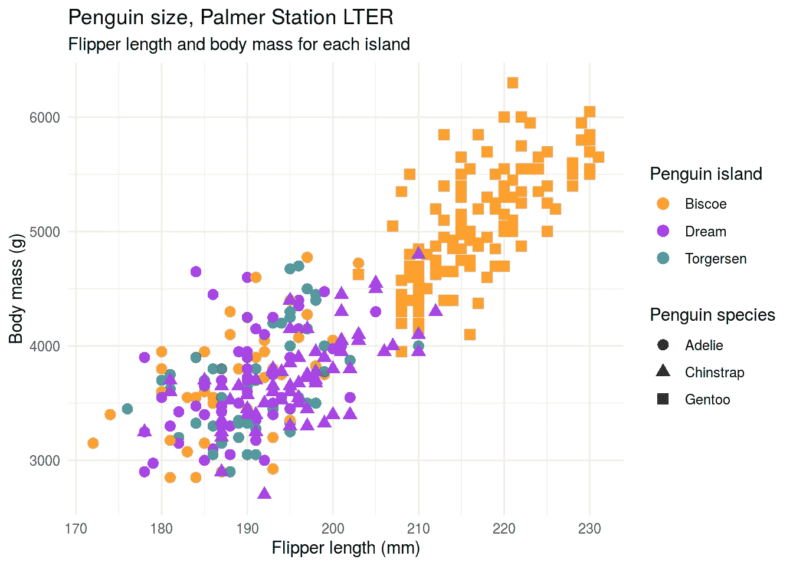
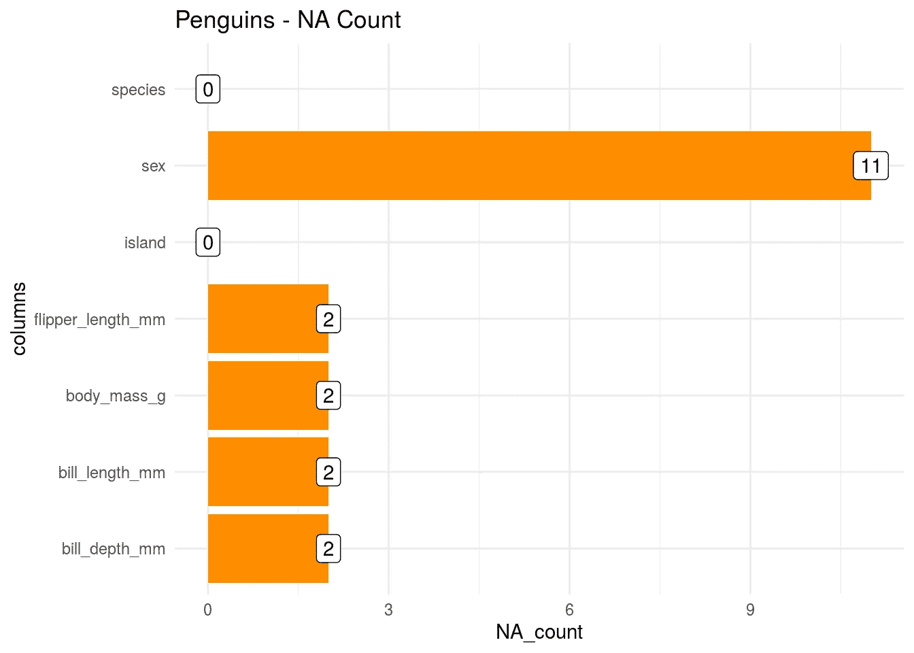
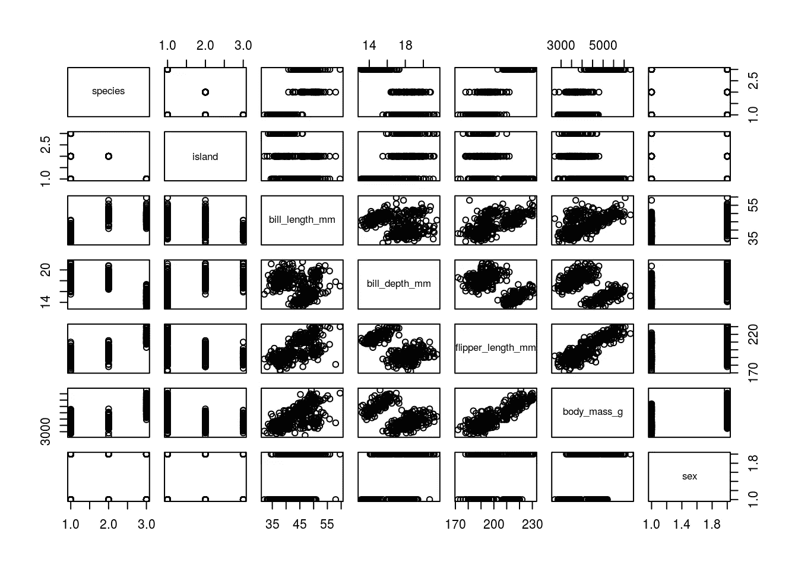
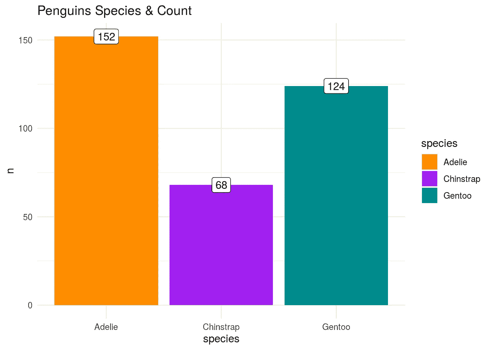
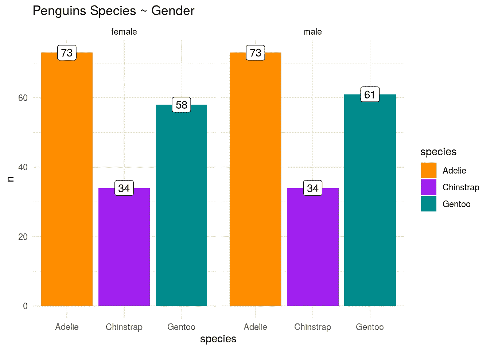
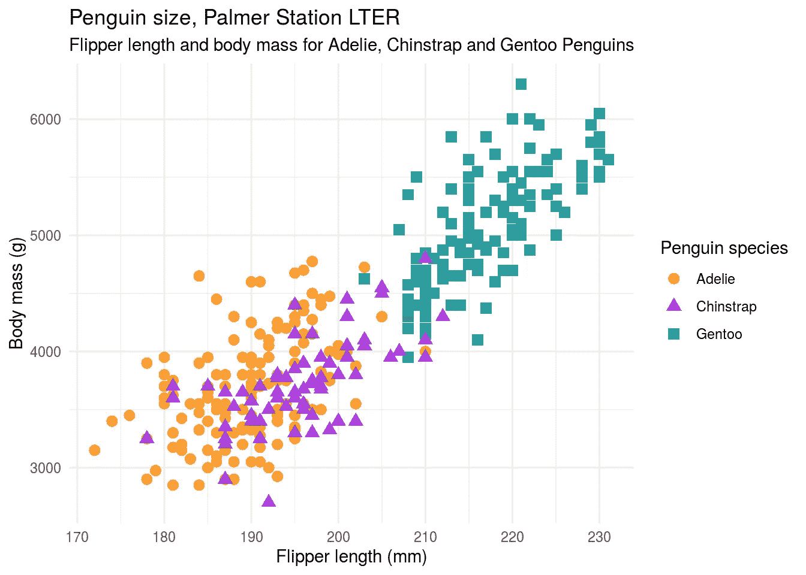

# 企鹅数据集概述— iris 替代方案

> 原文：<https://towardsdatascience.com/penguins-dataset-overview-iris-alternative-9453bb8c8d95?source=collection_archive---------21----------------------->

## 一个简单的类似 iris 的数据集，用于教授数据科学概念



如果有一个数据集是数据科学家/数据分析师在学习或指导某人时使用最多的——它要么是`iris`(更多 R 用户)，要么是`titanic`(更多 Python 用户)。

# [78%的数据营折扣](https://datacamp.pxf.io/c/2888696/1240322/13294?u=https%3A%2F%2Fpromo.datacamp.com)


不使用`iris`数据集仅仅是因为它容易访问。它也可以用来演示许多数据科学概念，如相关性、回归、分类。这篇文章的目的是向您介绍`penguins`数据集，并让您从几个代码片段开始，这样您就可以脱颖而出了！

最近，由于罗纳德·费雪过去的优生学经历，社区里有越来越多的人希望[远离](https://www.garrickadenbuie.com/blog/lets-move-on-from-iris/) `[iris](https://www.garrickadenbuie.com/blog/lets-move-on-from-iris/)` [。](https://www.garrickadenbuie.com/blog/lets-move-on-from-iris/)

此时，我们有幸得到了另一个类似于`iris`的关于`penguins`的数据集。感谢 [Allison Horst](https://twitter.com/allison_horst) 在 CC-0 许可下将其打包为 R 包`[palmerpenguins](https://github.com/allisonhorst/palmerpenguins)`。

YouTube—[https://www.youtube.com/watch?v=4zUmlZg9Dd4](https://www.youtube.com/watch?v=4zUmlZg9Dd4)

# 视频漫游

***请订阅*** [***频道***](https://www.youtube.com/channel/UCpV_X0VrL8-jg3t6wYGS-1g) ***如果有用请留下反馈。很高兴收到你的来信！***

# 装置

`palmerpenguins`尚未发布到 CRAN，因此您可以从 Github 安装它:

`remotes::install_github("allisonhorst/palmerpenguins")`

# 访问数据

成功安装后，您会发现有两个数据集附加到包中— `penguins`和`penguins_raw`。你可以查看他们的帮助页面(`?penguins_raw`)来了解更多关于各自的数据集。

# 加载库

```
library(tidyverse)
library(palmerpenguins)
```

# `penguins`数据集的元一瞥

`penguins`数据集有 7 列 344 行

```
names(penguins)## [1] "species"           "island"            "bill_length_mm"   
## [4] "bill_depth_mm"     "flipper_length_mm" "body_mass_g"      
## [7] "sex"
```

在这 7 列中，3 列是分类列(`species`、`island`、`sex`)，其余是数字列。

```
glimpse(penguins)## Rows: 344
## Columns: 7
## $ species           <fct> Adelie, Adelie, Adelie, Adelie, Adelie, Adelie, Ade…
## $ island            <fct> Torgersen, Torgersen, Torgersen, Torgersen, Torgers…
## $ bill_length_mm    <dbl> 39.1, 39.5, 40.3, NA, 36.7, 39.3, 38.9, 39.2, 34.1,…
## $ bill_depth_mm     <dbl> 18.7, 17.4, 18.0, NA, 19.3, 20.6, 17.8, 19.6, 18.1,…
## $ flipper_length_mm <int> 181, 186, 195, NA, 193, 190, 181, 195, 193, 190, 18…
## $ body_mass_g       <int> 3750, 3800, 3250, NA, 3450, 3650, 3625, 4675, 3475,…
## $ sex               <fct> male, female, female, NA, female, male, female, mal…
```

# 企鹅数据列定义

种类表示企鹅种类的一个因素(阿德利企鹅、下巴颏企鹅和巴布亚企鹅)

表示南极洲帕尔默群岛中岛屿的一个因素

表示钞票长度的数字(毫米)

表示票据深度的数字(毫米)

**脚蹼长度毫米**表示脚蹼长度的整数(毫米)

**身体质量 g** 表示身体质量(克)的整数

性别表示企鹅性别的因素(雌性，雄性)

# 缺少值

`penguins`比`iris`好的一点是，它有`missing values` `NA`。用于教育目的时，在场是一件非常重要的事情！

```
penguins %>%
  #group_by(species) %>%
   select(everything()) %>% 
  summarise_all(funs(sum(is.na(.)))) %>%
  pivot_longer(cols = 1:7, names_to = 'columns', values_to = 'NA_count') %>%
  arrange(desc(NA_count)) %>%
  ggplot(aes(y = columns, x = NA_count)) + geom_col(fill = 'darkorange') +
  geom_label(aes(label = NA_count)) +
#   scale_fill_manual(values = c("darkorange","purple","cyan4")) +
  theme_minimal() +
  labs(title = 'Penguins - NA Count')## Warning: `funs()` is deprecated as of dplyr 0.8.0.
## Please use a list of either functions or lambdas: 
## 
##   # Simple named list: 
##   list(mean = mean, median = median)
## 
##   # Auto named with `tibble::lst()`: 
##   tibble::lst(mean, median)
## 
##   # Using lambdas
##   list(~ mean(., trim = .2), ~ median(., na.rm = TRUE))
## This warning is displayed once every 8 hours.
## Call `lifecycle::last_warnings()` to see where this warning was generated.
```



# 简单散点图

像`iris`一样，你可以简单地用 base-R 的`plot()`做一个散点图

```
plot(penguins)
```



# 条形图

在这个柱状图中，我们可以看到企鹅数据集中每个物种的数量

```
penguins %>%
  count(species) %>%
  ggplot() + geom_col(aes(x = species, y = n, fill = species)) +
  geom_label(aes(x = species, y = n, label = n)) +
  scale_fill_manual(values = c("darkorange","purple","cyan4")) +
  theme_minimal() +
  labs(title = 'Penguins Species & Count')
```



# 每个物种的条形图

在这个柱状图中，我们可以看到每种性别的物种分布(用分面图)

```
penguins %>%
  drop_na() %>%
  count(sex, species) %>%
  ggplot() + geom_col(aes(x = species, y = n, fill = species)) +
  geom_label(aes(x = species, y = n, label = n)) +
  scale_fill_manual(values = c("darkorange","purple","cyan4")) +
  facet_wrap(~sex) +
  theme_minimal() +
  labs(title = 'Penguins Species ~ Gender')
```



# 相关矩阵

```
penguins %>%
  select_if(is.numeric) %>%
  drop_na() %>%
  cor()##                   bill_length_mm bill_depth_mm flipper_length_mm body_mass_g
## bill_length_mm         1.0000000    -0.2350529         0.6561813   0.5951098
## bill_depth_mm         -0.2350529     1.0000000        -0.5838512  -0.4719156
## flipper_length_mm      0.6561813    -0.5838512         1.0000000   0.8712018
## body_mass_g            0.5951098    -0.4719156         0.8712018   1.0000000
```

# 散点图—企鹅大小与物种的关系

在这个散点图中，我们将尝试可视化每个物种的`flipper_length_mm`和`body_mass_g`之间的关系。

```
library(tidyverse)
ggplot(data = penguins, 
                       aes(x = flipper_length_mm,
                           y = body_mass_g)) +
  geom_point(aes(color = species, 
                 shape = species),
             size = 3,
             alpha = 0.8) +
  #theme_minimal() +
  scale_color_manual(values = c("darkorange","purple","cyan4")) +
  labs(title = "Penguin size, Palmer Station LTER",
       subtitle = "Flipper length and body mass for Adelie, Chinstrap and Gentoo Penguins",
       x = "Flipper length (mm)",
       y = "Body mass (g)",
       color = "Penguin species",
       shape = "Penguin species") +
  theme_minimal()
```



# 散点图—企鹅大小与岛屿的关系

```
library(tidyverse)
ggplot(data = penguins, 
                       aes(x = flipper_length_mm,
                           y = body_mass_g)) +
  geom_point(aes(color = island, 
                 shape = species),
             size = 3,
             alpha = 0.8) +
  #theme_minimal() +
  scale_color_manual(values = c("darkorange","purple","cyan4")) +
  labs(title = "Penguin size, Palmer Station LTER",
       subtitle = "Flipper length and body mass for each island",
       x = "Flipper length (mm)",
       y = "Body mass (g)",
       color = "Penguin island",
       shape = "Penguin species") +
  theme_minimal()
```


# 摘要

正如您在上面看到的，来自`palmerpenguins`包的`penguins`数据集是`iris`数据集的完美替代。它可以很好地用于教授数据科学概念关联、回归、分类，也可以用于教授数据可视化。如果你写了很多数据科学文章，并且总是需要挑选一个非常通用的数据集，`penguins`是你应该探索的一个选项。

# 参考

*   [palmerpenguin — Github](https://github.com/allisonhorst/palmerpenguins/)
*   [帕尔梅彭金——文件](https://allisonhorst.github.io/palmerpenguins/)

```
citation('palmerpenguins')## 
## To cite palmerpenguins in publications use:
## 
##   Gorman KB, Williams TD, Fraser WR (2014) Ecological Sexual Dimorphism
##   and Environmental Variability within a Community of Antarctic
##   Penguins (Genus Pygoscelis). PLoS ONE 9(3): e90081.
##   https://doi.org/10.1371/journal.pone.0090081
## 
## A BibTeX entry for LaTeX users is
## 
##   @Article{,
##     title = {Ecological Sexual Dimorphism and Environmental Variability within a Community of Antarctic Penguins (Genus Pygoscelis)},
##     author = {Gorman KB and Williams TD and Fraser WR},
##     journal = {PLoS ONE},
##     year = {2014},
##     volume = {9(3)},
##     number = {e90081},
##     pages = {-13},
##     url = {https://doi.org/10.1371/journal.pone.0090081},
##   }
```

*最初发布于*[*https://www . programmingwithr . com/penguins-dataset-overview-iris-alternative-in-r/*](https://www.programmingwithr.com/penguins-dataset-overview-iris-alternative-in-r/)