# 宾夕法尼亚州自行车与机动车的碰撞

> 原文：<https://towardsdatascience.com/pennsylvania-bicycle-motor-vehicle-collisions-cdfcf176aa0f?source=collection_archive---------38----------------------->

骑自行车的人和想骑自行车的人经常担心受伤的危险。然而，我们对自行车事故和伤害了解多少呢？在本文中，我研究了 30，000 起自行车碰撞事故，以了解发生的碰撞类型(例如，追尾与角度)，并使用逻辑模型来了解使碰撞更加严重的因素。我将这些结果与国家运输安全委员会最近的一项研究进行了比较，我发现该研究过于强调自行车设施，如独立的自行车道，而不太强调用户行为的作用。

伊恩·瓦莱里奥在 [Unsplash](https://unsplash.com?utm_source=medium&utm_medium=referral) 上拍摄的照片

# 项目背景

尽管每个州和美国交通部的国家公路交通安全管理局都保存着警方报告的道路交通事故数据库，但关于骑自行车的数据是有限的，因此有时会产生误导。大多数骑自行车的伤害都被排除在这些数据库之外，因为只有涉及交通工具中的机动车辆的碰撞才是可报告的。骑自行车的人与行人、动物或其他骑自行车的人之间的碰撞，或单车碰撞(摔倒或与固定物体的碰撞)被排除在外，即使医院数据显示它们占骑自行车者急诊的大多数。此外，与汽车驾驶员相比，骑自行车的人在事故报告表或事故数据库中通常受到不同的对待，这意味着关于事故情况和操作者行为的关键字段没有被报告、没有被编码或没有被清楚地编码。

通常我们真正想知道的是与不同地点、道路设计或操作者行为相关的*碰撞风险*。但是风险是结果除以暴露程度，而且很少有公共来源估计不同情况下骑自行车的数量。例如，我们需要知道白天和天黑后骑自行车出行的比例，以了解夜间骑自行车的相对风险。

尽管有这些限制，如果我们找到包含关键属性的数据源，我们可以从碰撞报告中了解很多关于自行车与机动车碰撞的信息。我们可以看看车祸发生率:BMVCs 发生在哪里，在什么情况下发生？一般来说，我们可以假设交通事故的分布主要是自行车使用分布的函数。即使流行率不能提供关于个人撞车风险的信息，但它确实给了我们关于集体问题的位置和环境的信息。

我们还可以看看影响受伤严重程度的因素，假设发生了撞车事故。这与伤害事故发生的建模不是一回事，但它可以帮助我们理解是什么因素使事故更加严重。

我的大型项目利用了美国各州和美国交通部/NHTSA 的几个可用的车祸数据库。当前的分析使用单一来源，宾夕法尼亚州报告的车祸，通过位置类型(限速和城市或农村)、交叉路口或中间街区、碰撞方式和其他特征来查看车祸发生率，并创建伤害严重度模型。

这项研究的最终目的是指导改善骑自行车者安全的对策的实施。这个话题在 2019 年 12 月发布的[国家运输安全委员会自行车报告](https://aashtojournal.org/2019/12/13/ntsb-releases-bike-safety-recommendations-report/)中有所涉及。我将我对碰撞类型、位置和伤害严重程度的研究结果与 NTSB 报告中的一些数据和模型进行了比较，特别是他们对基础设施的建议，如独立的自行车道。

# 数据

这项分析的数据来自 PennDOT，它为宾夕法尼亚州提供了 [20 年的年度车祸数据](https://pennshare.maps.arcgis.com/apps/webappviewer/index.html?id=8fdbf046e36e41649bbfd9d7dd7c7e7e)。我下载了 1999 年到 2019 年的年度档案。(2001 年的档案不见了，多次要求 PennDOT 提供这些档案都没有成功。)PennDOT 为每一年提供了几个文件，代表关系数据库中由关键字段链接的单独的表。这些表包括碰撞、人员、车辆和道路。不同于几乎所有其他州的车祸数据库，骑自行车的人和机动车的人一样被编码。自行车包含在车辆文件中(如 VEH_TYPE =“自行车”或“其他骑自行车的人”)。

我使用的最终数据集包含 29，726 名骑自行车的人和 30，090 名开车的人，涉及 29，489 起车祸。

# 撞车流行率

## 位置特征

宾夕法尼亚州 80%以上的自行车-机动车碰撞(BMVCs)发生在城市地区。三分之二发生在限速 25 英里或更低的地方。虽然低速道路占主导地位，但大约四分之一的 BMVCs 发生在限速 30-35 英里/小时的地方，主要是在城市地区。只有 10%的 BMVCs 发生在限速 40 英里/小时或以上的地方，其中约 40%发生在农村地区。

**按限速和城市/农村划分的车祸发生率:所有车祸**

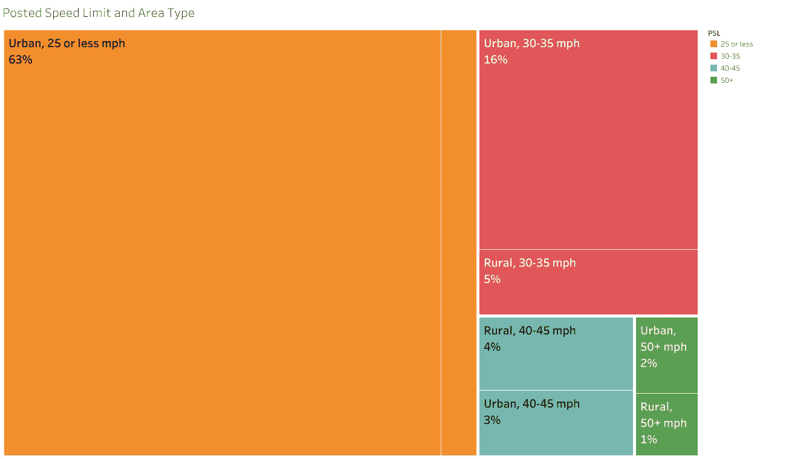

如果我们只考虑导致严重或致命伤害的撞车事故，这种情况会发生显著变化。这些严重或致命的 BMVCs 中只有一半是在限速为 25 英里/小时或更低的街道上，27%的限速为 30-35 英里/小时，另外 27%的限速为 40 英里/小时或更高。与所有撞车事故的分布相比，农村地区也不成比例。致命的撞车事故更倾向于高速街道和农村地区:44%的致命 bmvc 发生在农村地区(占所有 bmvc 的 19%)，66%发生在限速 30 英里/小时或更高的地方(占所有 bmvc 的 32%)。

**按限速和城市/农村划分的车祸发生率:严重和致命伤害车祸**

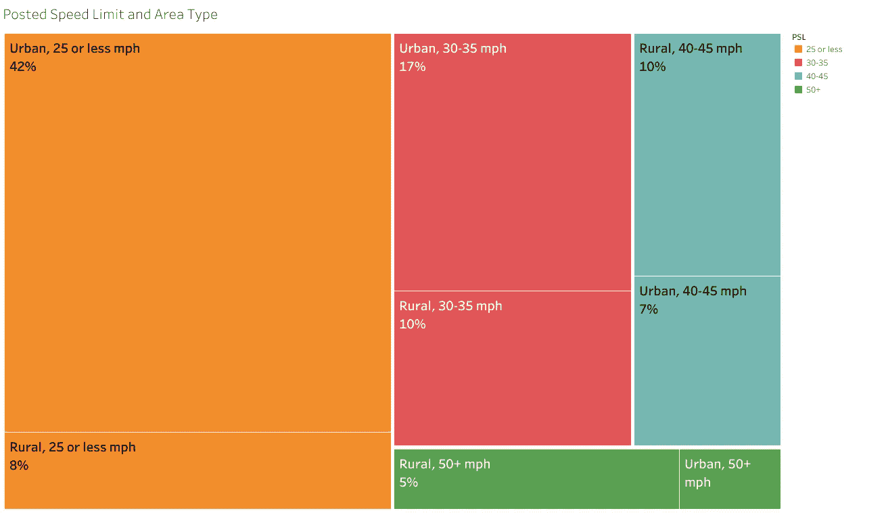

道路系统中撞车的位置呢？宾夕法尼亚州的数据编码区分了发生在交叉路口(多条道路共享的区域)内的碰撞和与交叉路口相关的碰撞(通常发生在实际交叉路口 100 英尺内的与转弯和交叉运动相关的碰撞)。我综合了交叉路口和与交叉路口相关的车祸。车道，即使是有交通信号的大型商业车道，也不算十字路口。我使用了一个单独的特征来识别车道(该类别还包括停车场碰撞)。从功能上来说，车道和十字路口是一样的。

如下图所示，28%的 BMVCs 发生在交叉口之间(“中间阻断”)。其余的 72%发生在十字路口(或与十字路口相关的)或车道上。到目前为止，四向交叉是最常见的，但丁字交叉也是很重要的一部分。

**按交叉口类型/中间街区划分的碰撞发生率**

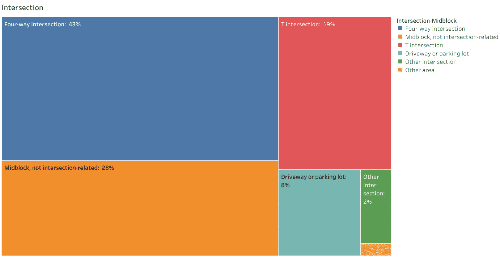

如果我们只考虑造成严重或致命伤害的撞车事故，40%是中撞事故。就致命车祸而言，50%发生在中段。很明显，中段碰撞更有可能是严重的。然而，大多数严重的车祸发生在十字路口或车道上，就死亡事故而言，这两类地点的车祸发生率相当。

## 碰撞类型

如下图所示，近 70%的 BMVCs 是角度碰撞。接下来最常见的是侧撞和追尾。迎面和侧撞-相反方向的碰撞类型意味着骑自行车的人或开车的人在道路的错误一侧。

**碰撞方式:所有碰撞**

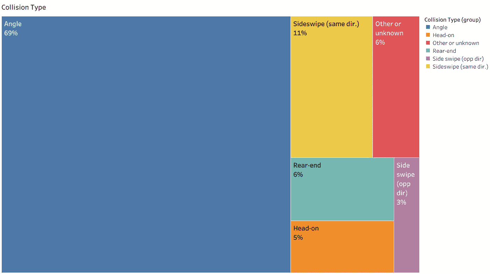

仅考虑下图所示的严重和致命伤害 BMVCs，我们发现角度碰撞仍然占主导地位。追尾事故的重要性增加了，但只占总数的 11%。正面碰撞的重要性也增加了。仅考虑致命伤害，追尾碰撞的重要性上升到 18%，但大多数，58%，仍然是角度碰撞。

**碰撞方式:严重和致命伤害碰撞**

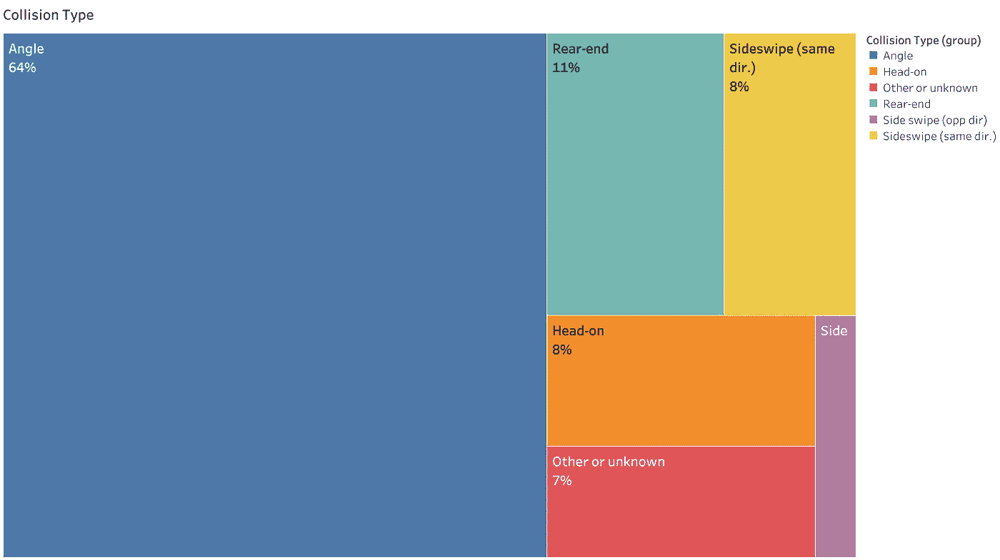

大多数角度 bmvc(83%)发生在十字路口或车道，大多数追尾 bmvc(64%)发生在中间块。然而，只有一小部分中间块碰撞是追尾碰撞:41%是角度碰撞(包括骑自行车的人在十字路口之间过街的情况)，27%是同方向侧撞，14%是追尾，7%是正面碰撞，4%是相反方向侧撞，其余 7%是其他或未知情况。追尾和同方向侧撞碰撞在*严重和致命*bmvc 中所占比例较高(分别为 23%和 17%)，但角度碰撞占这些中间块 bmvc 的 36%。

## 追尾和横炮碰撞的发生率

NTSB 自行车安全报告建议将自行车道分隔作为减少严重碰撞的主要方法，认为它们可以“几乎消除从后面撞上，超车和侧撞事故”然而，在宾夕法尼亚州，追尾和侧撞仅占严重 BMVCs 事故的 18%和致命 BMVCs 事故的 27%。此外，单独的自行车道通常安装在自行车密度最高的地区:限速为 30 英里/小时或更低的城市街道。根据[自行车人库存](https://docs.google.com/spreadsheets/d/11H0gArHxo6kMop1I18yMcq7ArbNrwaGBLmIXgqI1Gjk/edit#gid=3)的数据，截至 2020 年 10 月，宾夕法尼亚州所有现有和拟议的独立自行车道都在费城、匹兹堡和兰开斯特。这些道路上张贴的限速是每小时 25 英里，只有一条道路是每小时 30 英里。在这些低速城市道路上，基础设施针对的碰撞类型在问题中所占的比例甚至更小:只有 12%的严重 BMVCs 和 11%的致命 BMVCs。

在该数据集中的 325 起骑自行车死亡事故中，只有 11 起是在低速(< =30 英里/小时)城市道路上发生的追尾或侧撞事故，其中驾车者是撞击方。其中，五起发生在夜间，当时主要因素是能见度，特别是因为许多骑自行车的人在夜间不使用灯(宾夕法尼亚州的数据记录了使用后反射器，但没有使用尾灯)。在白天发生的六起事故中，有三起涉及危险驾驶的犯罪行为:

*   2006 年 3 月，一名法定盲人司机在州立学院的波尔斯堡路漂移到路肩，杀死了一名骑自行车的人，他也是一名大学教授。
*   2015 年 7 月，一名 21 岁的无证司机快速加速，超过了停在她面前车道上的一辆汽车，费城第二大街的每个方向都有一条狭窄的车道。经过那辆车后，她撞上了停在那辆车前面的一个骑自行车的人。她逃离了现场，拿走了汽车牌照，但是被抓住并被指控谋杀。
*   2015 年 10 月，在匹兹堡的福布斯大道上，一名吸食大麻的驾车者撞上了一辆停下来的汽车，然后又撞上了一名停下来的自行车手，后者是一名大学教授。逃离现场的司机被判 5-10 年徒刑。

其他三起事故似乎不是我们通常认为的追尾事故:

*   2000 年 6 月，一名骑自行车的人在费城的 Frankford 大道和 Ashburner 街的交叉口被杀，这是一个信号控制的 T 型交叉口。一名损伤情况不明的司机在左车道行驶，与一辆停下的汽车追尾。两辆机动车中的一辆撞上了在右车道骑自行车的人的左侧。
*   2003 年 11 月，在费城东豪厄尔街附近的托雷斯代尔大道，一名骑自行车的人在路边停车场旁边的自行车道上被杀害。一辆运动未知的客车卷入了一场“非碰撞”——可能是从停车或开门开始移动。骑自行车的人摔倒在一辆同方向行驶的重型卡车下面。
*   2009 年 8 月，一名骑自行车的人在匹兹堡 Meyran 大道和 Luisa 街的交叉口被一辆大卡车撞死，这是两条狭窄街道的 4 向交叉路口。骑自行车的人的位置、运动和行进方向是未知的。逃离现场的司机被编码为“分心”

## 车辆和操作员特征

BMVCs 涉及哪些类型的机动车辆？大约三分之二是乘用车，30%是轻型卡车(SUV、货车、皮卡和其他小型卡车)。只有 1%是大型卡车，另外 1%是公共汽车(主要是过境公共汽车)。当我们看严重和致命伤害时，小型卡车的份额从 9%上升到 14%，大型卡车的份额从 1%上升到 4%。仅考虑致命 BMVCs，小型卡车份额为 15%，大型卡车份额为 7%，客车份额为 2%。

**机动车类型**

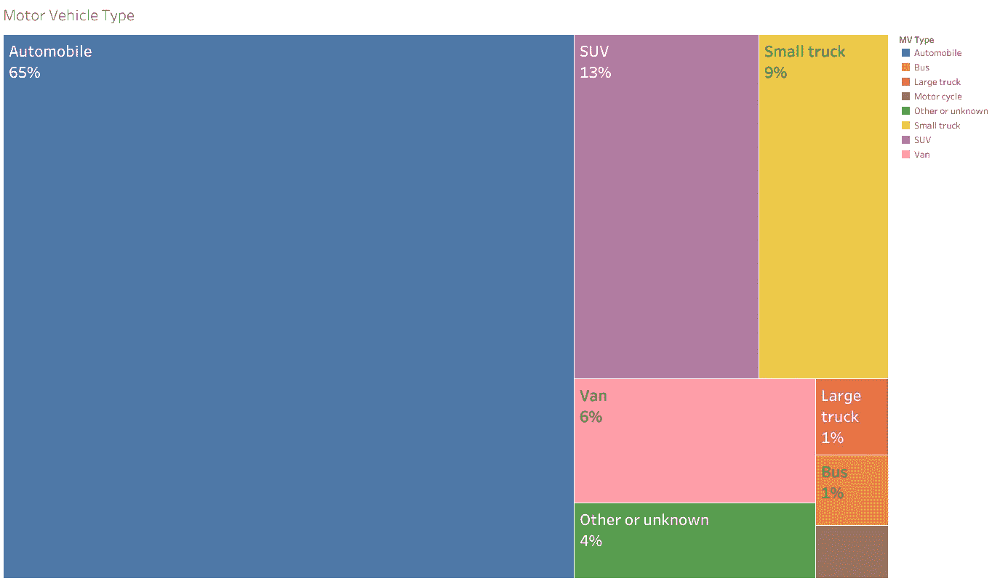

不到 2%的司机受到 BMVCs 的影响(主要是酒精或药物)。当我们看到严重或致命的伤害事故时，这一数字上升到 6%，仅致命事故就上升到 15%。总体而言，只有 1.4%的司机超速行驶，但 4%是严重或致命事故，7%是致命事故。

# 伤害严重度模型

下表显示了该数据集中大约 30，000 名骑自行车的人在撞车事故中的受伤严重程度。由于这些都不是医疗记录，受伤的程度往往是不确定的。将近一半被编码为“可能受伤”，另外 19%被编码为“严重程度未知的受伤”超过 1%的人受到致命伤害，5.5%的人疑似受到严重但非致命的伤害。

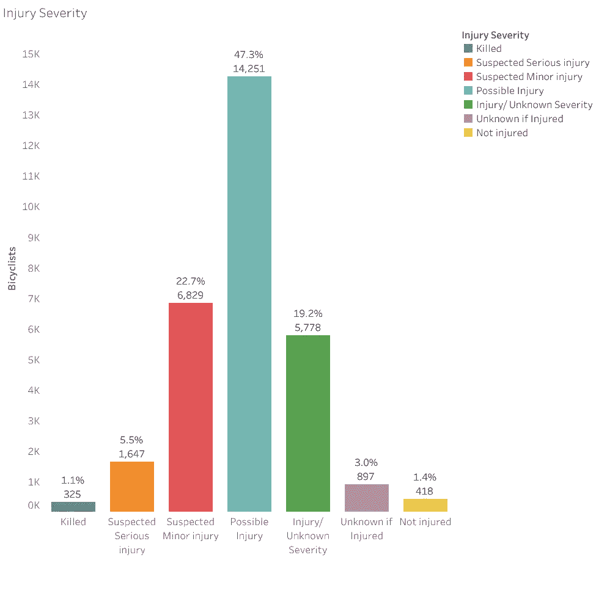

我决定做一个简单的二元模型，将严重或致命伤害的结果与所有其他结果(无伤害或轻微、可能或未知伤害)进行比较。我决定不采用多级模型，原因如下:

*   二元模型更容易解释
*   对致命和严重但非致命的伤害进行单独分类将是有益的，但只有 325 起死亡事故，这使得更难找到具有统计意义的结果
*   在那些不严重或不致命的案例中，有许多是“可能的”或“未知的”伤害严重程度，增加了类别的不确定性。
*   选择的模型与 2019 年 12 月发布的[国家运输安全委员会自行车报告](https://aashtojournal.org/2019/12/13/ntsb-releases-bike-safety-recommendations-report/)中创建的模型相当。

我使用 [statsmodels](https://www.statsmodels.org/stable/index.html) python 库创建了一个逻辑回归模型，以严重或致命伤害(编码为 1)或任何其他伤害状态(编码为 0)为因变量。对每个系数求幂提供了与该特征相关的概率。所有的特征都是分类的，其中一个类别被排除在模型之外，所以优势表示与被排除或“参考”类别相比的优势比率*。比值比为 1 意味着建模类别和参考类别之间没有差异。比值比大于 1 意味着与参考相比，建模的类别具有正面影响，而比值比小于 1 意味着它具有负面影响。我计算了与每个估计比值比相关的 95%置信区间:如果区间包括 1，则没有足够的信息来确定是否有积极或消极的影响。*

尽管效果的方向(积极、消极或无)很容易理解，但优势比的大小没有直观的解释。然而，对于不常见的因素，优势比是相对风险的合理近似值，这确实有一个简单的解释:例如，相对风险为 2，意味着该因素的风险是参考的两倍。使用完整数据集的第一个模型的优势比及其置信区间绘制如下。

**模型 1:完整的数据集**

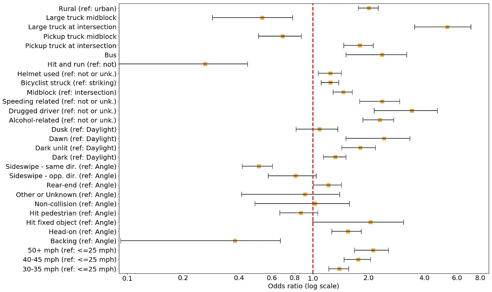

位置特征

*   与城市地区相比，农村地区的优势比为 2.0，这意味着严重或致命伤害的风险高于城市地区，即使控制了模型中的所有其他特征。
*   严重受伤的风险随着张贴的速度限制的提高而增加。最高级别，50+英里/小时，与 25 英里/小时或更低的参考级别相比，OR 值为 2.1。
*   与交叉口相比，中间街区位置的 OR 为 1.5。

车型

*   涉及公共汽车的 OR 值为 2.4。
*   我把小卡车的参与作为一个特征，以及小卡车和中间街区位置之间的相互作用。代表不在街区中部(即在十字路口)的小型卡车碰撞的部分的 OR 值为 1.8。
*   与小型卡车一样，大型卡车和中间块之间的相互作用也包括在内。同样，中间街区部分并不显著，但卡车/交叉口效应的 OR 值为 5.3，是模型中最高的特征。

照明条件

参照类别是日光。相比之下:

*   黑暗条件下(大部分是明亮的，但也有一些未知的照明)的优势比为 1.5
*   黑暗和无光条件下的 OR 值为 1.8
*   黎明时分的撞车事故的 OR 值为 2.4
*   没有证据表明黄昏时的撞车事故比白天更严重。

碰撞类型

与角度碰撞(目前最常见的类型)相比:

*   侧撞(同方向)碰撞不太可能是严重的(或 0.5)
*   侧撞(相反方向)碰撞也不太可能是严重的，但这种影响在统计学上并不显著
*   追尾事故更可能是严重的，OR 值为 1.2
*   正面碰撞更可能是严重的，OR 值为 1.5
*   所有其他类型的碰撞都没有统计学上的显著影响，部分原因可能是因为它们很少发生。

骑自行车的人被撞(而不是撞击)的事故更可能是严重的，OR 值为 1.2。

操作员行为

*   与酒精相关的车祸更可能是严重的(或 2.3 倍)。
*   同样，与超速相关的撞车事故的 OR 值为 2.4。
*   最大的影响是司机使用药物的车祸(or 为 3.4)。
*   与预期相反，骑自行车的人戴头盔更有可能受重伤(或 1.2 倍)。这个结果可能是由于糟糕的编码:12%的骑自行车的人戴着头盔，41%的人没有戴头盔，剩下的 48%的人不知道头盔的用途。因此，参考组(包括“否”和“未知”)可能有许多头盔使用者。
*   与我的预期相反，肇事逃逸事故与严重受伤的几率较低有关。

虽然没有在 OR 图中显示，但是模型也包括了骑车人的年龄和性别。女性骑自行车者受重伤的可能性略低(OR 值为 0.8)。只有三个年龄组在统计上与其他年龄组不同:20-29 岁的人不太可能受到严重伤害(或 0.7)，60-69 岁(或 1.5)和 70 岁及以上(或 1.7)的骑自行车者更有可能受到严重或致命的伤害。

## 城市区域模型

包括 NTSB 自行车研究在内，碰撞对策的大部分重点是在城市地区安装自行车专用基础设施。州数据中三分之二(66%)的 BMVCs 发生在限速 30 英里/小时或更低的城市地区。我为全州范围内的车祸建立了一个独立的模型。包括的特征是相同的，除了我必须排除城市/乡村和速度限制，它们在这个数据子集中没有变化。

**模式 2:城市地区张贴限速< = 30 英里/小时**

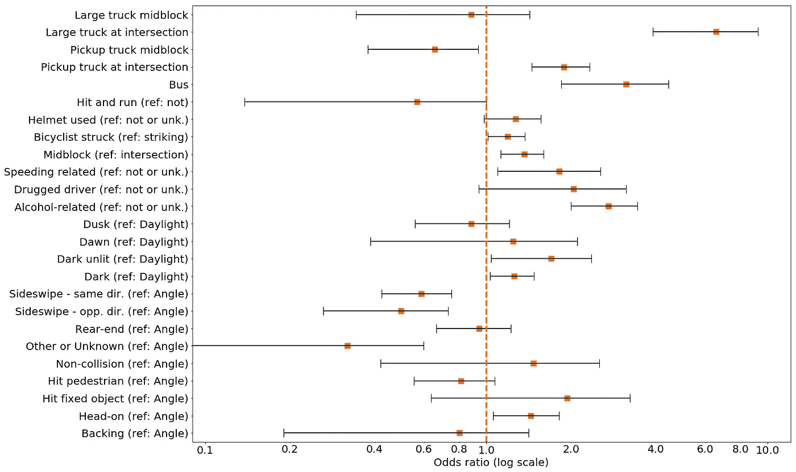

以下是与第一个模型相比的不同之处:

位置特征

*   中段或略有下降，从 1.5 降至 1.4

车型

*   公共汽车或从 2.4 增加到 3.1。
*   小型货车/交叉路口或从 1.8 提高到 1.9。
*   大型货车/交叉路口或从 5.3 增加到 6.6。

照明条件

*   黑暗条件或从 1.5 下降到 1.2。
*   黑暗和无光条件或从 1.8 降至 1.7。
*   黎明时分的撞车和白天不再有什么不同。

碰撞类型

*   侧撞(反方向)碰撞的新的有效 OR 为 0.5
*   追尾碰撞与角度碰撞的严重程度不再不同
*   正面碰撞的优势比略有下降，从 1.5 降至 1.4

操作员行为

*   与酒精相关的车祸的优势比从 2.3 上升到了 2.7。
*   与超速有关的车祸的优势比从 2.4 下降到 1.8。
*   涉毒撞车的 OR 从 3.4 下降到 2.1。
*   骑自行车的人使用头盔没有显著影响。
*   肇事逃逸事故没有显著影响。

女性和老年骑自行车的人与男性骑自行车的人相比，受伤的几率不再有统计学差异。

# 模型结果的讨论

伤害严重程度模型让我们估计控制模型中其他特征的各种特征的独立效果。结果表明，与城市地区相比，由于车速限制较高，农村地区发生严重伤害*的几率会增加*。中部碰撞位置也增加了严重程度。在黑暗的时间里，特别是在没有灯光的道路上和黎明时分，撞车会增加严重的风险。涉及公共汽车和卡车的碰撞更可能是严重的，尤其是在大型卡车在十字路口碰撞的情况下。驾驶障碍对严重程度也有很大的影响。

正面碰撞和追尾比其他类型的碰撞更可能严重，但追尾只是轻微的。与最常见的角度碰撞相比，骑自行车的人和开车的人同向行驶的横炮碰撞*不太可能严重或致命。*

使用城市低速道路碰撞的模型在几个重要方面有所不同。在市区，追尾不太可能比角度碰撞更严重。司机超速，司机吸毒，黑暗是严重性的不太强的预测因素，但仍然是最重要的。司机饮酒成为某种程度上更强的严重程度的预测因素。最重要的预测因素是车辆类型，这在所有类别中都得到了加强——公共汽车、小型卡车和大型卡车。就卡车而言，增加的风险仅针对*交叉路口*的碰撞。

我将这些结果与 NTSB 自行车报告中的伤害严重程度进行了比较，如下表所示。农村的影响实际上是一样的。然而，中块碰撞位置的影响(与十字路口或车道相比)较低，更高速度限制的影响也较低，最显著的是最高速度类别。造成这些差异的一个可能原因是，我的模型中包含了许多其他因素，但 NTSB 模型却忽略了这些因素。然而，当我仅使用这些特征重新评估模型时，限速类别的 ors 略有增加(增加到 1.5、2.2 和 2.2，仍远低于 NTSB ORs)，农村 OR 没有变化，中街区 OR 减少到 1.3。因此，NTSB 模型中遗漏的变量并不是导致结果不同的主要原因。

**与 NTSB 模式对比**

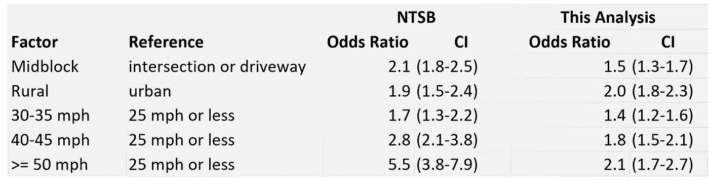

NTSB 模型使用了来自四个州的 2017 年数据:宾夕法尼亚州、明尼苏达州、得克萨斯州和华盛顿州。NTSB 报告这四个州当年共有 6，661 辆 BMVCs。我的数据显示，宾夕法尼亚州占 1150(17%)，得克萨斯州占 3345(51%)。NTSB 的数据偏向得克萨斯州，在得克萨斯州按速度限制的 BMVCs 的分布与宾夕法尼亚州非常不同，如下图所示。得克萨斯州骑自行车的人在街道上使用的速度限制要高得多，这可能是 NTSB 模型与当前模型相比速度效应差异的原因。

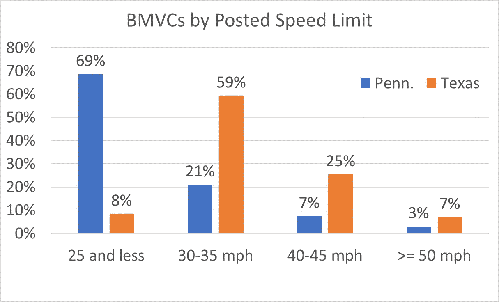

# 结论

与大多数其他美国碰撞数据源不同，宾夕法尼亚州数据库提供了自行车与机动车碰撞(BMVCs)方式的相关信息。近 70%的 BMVCs 是角度碰撞，其中大多数发生在十字路口或车道上——大多数转弯和交叉运动都发生在那里。追尾事故只占总数的 8%。这些数字表明，解决导致角度碰撞的因素将对减少 BMVCs 产生最大的影响。

不幸的是，宾夕法尼亚州的数据缺乏关于骑自行车者行为的关键信息，这些信息可以帮助我们确定角度碰撞的原因:具体来说，碰撞前骑自行车者的位置和方向——在道路上或人行道上，以及是否有交通。这个数据集也没有告诉我们哪一方违反了通行权规则。我将使用其他状态数据库分别处理这些主题。

NTSB 报告主要关注作为潜在对策的道路设计，并强调中间块碰撞比交叉碰撞更有可能导致严重伤害，并假设大多数中间块碰撞可以通过在道路上设置物理屏障来避免。然而，佩恩。数据显示，41%的中间块碰撞实际上是角度碰撞，而不是 NTSB 提出的独立自行车道对策的目标追尾和侧撞碰撞。另外 11%涉及错误方式的操作者。

我的受伤严重程度模型证实了 NTSB 的发现，即中块碰撞更可能是严重的，但在 NTSB 模型中，风险是 1.5 倍，而不是 2 倍。此外，我评估了具体的碰撞类型(追尾和侧撞),这可能会受到 NTSB 提出的自行车道分离的影响。与角度碰撞相比，追尾碰撞更有可能导致严重或致命的伤害，但不是在低速的城市道路上，因为大多数独立的自行车道都是在低速的城市道路上安装的。横炮碰撞比角度碰撞严重得多。

我发现伤害严重程度的风险随着张贴的速度限制的增加而增加，尽管没有 NTSB 模型中那么明显。这种差异可能是由 NTSB 数据中德克萨斯州撞车事故的高比例，以及发生自行车撞车事故的德克萨斯州道路上更高的张贴速度所解释的。在有高速公路的城市地区，有几种选择可以减少骑自行车的风险，例如:道路饮食、环形路和其他旨在减缓交通的道路重新设计，以及提供通过低速街道的替代、连接路线。

我发现 NTSB 模型中忽略了其他几个因素，这些因素在确定伤害严重程度时与街区中心位置同等重要或更重要:卡车或公共汽车卷入，尤其是在十字路口；驾驶障碍；和黑暗。所有这些因素都可以通过非基础设施措施来解决，例如:让骑自行车的人意识到在十字路口和车道上跟在卡车和公共汽车后面而不是旁边的重要性；减少酒后和吸毒后驾车和超速的发生率；以及在夜间增加自行车上的灯的使用。减少逆行自行车可以减少最严重的正面碰撞。所有这些措施除了降低碰撞严重程度之外，几乎肯定会降低碰撞频率。

这个项目的 python 笔记本和数据可以在 [Github](https://github.com/keencyclist/pennsylvania) 上找到。