# 人们对澳大利亚总理的看法

> 原文：<https://towardsdatascience.com/peoples-opinion-on-australian-prime-minister-c8c48cdd827f?source=collection_archive---------44----------------------->

## 使用 Twitter 数据进行情感分析


这张照片是我在访问堪培拉时拍的

> "斯科特·莫里森的假期不是问题，他对森林大火缺乏领导才是问题所在！"
> 
> 凯瑟琳·墨菲
> 
> “澳大利亚对冠状病毒感到恐惧和困惑。在这个严峻的时刻，斯科特·莫里森是我们需要的领袖吗？?"
> 
> 理查德·弗拉纳根

斯科特·莫里森(ScoMo)是澳大利亚第 30 任总理，也是自 2018 年以来的自由党领袖。我不支持任何政党，但是，在我呆在澳大利亚期间，我从来没有听到过关于我们总理的一句好话，我确信大多数人不喜欢他。

我很想知道大多数人对 ScoMo 的看法。但是在哪里可以找到这样的信息呢？我们可以利用一个资源来获取数据。现在是 ***推特*T3。**

**Twitter** 是一个微博客系统，允许你发送和接收被称为 tweets 的简短帖子。推文可以长达 140 个字符，可以包括相关网站和资源的链接。这是一个社交媒体平台，每天有 1 . 45 亿活跃用户和 5 亿条推文。

现在我们知道在哪里可以找到数据。但是，

*   **如何从 twitter 中提取数据？**
*   **如何根据这些数据检查人们的意见？**

这就是我这篇文章*要讨论的内容。*

首先我们需要对 ***情感分析*** 有一个基本的概念。

## 什么是情感分析？

> 本质上，它是确定一系列词语背后的情感基调的过程，用于理解在线提及中表达的态度、观点和情绪。

**好！等够了。让我们深入研究代码，**

点击[这里](https://github.com/hasitha-ranasinghe/twitter-data-analysis-scottmorrison)查看我在 GitHub 上的完整项目。

# 1.提取数据


要提取 twitter 数据，您需要有一个 Twitter API。我将向您展示如何创建一个。

*   申请 [Twitter 开发者账户](https://developer.twitter.com/en/docs/basics/developer-portal/overview)并获得批准。
*   创建一个 [Twitter 开发者应用](https://developer.twitter.com/en/docs/basics/apps/overview)
*   生成您的应用程序的 [API 密钥和用户访问令牌。](https://developer.twitter.com/en/docs/basics/apps/guides/the-app-management-dashboard)

有三种类型的搜索 API，这里我们使用的是**标准搜索 API。**

## 让我们看看如何在代码中使用它

**导入库**

*   tweepy——使用 Twitter APIs。这是这个库的文档。
*   CSV-操作 CSV(逗号分隔值)文件。

```
import tweepy as tw
import csv
```

**设置 API 密钥和访问令牌**

```
consumer_key = "xxxxxxxxxxxxx" 
consumer_secret = "xxxxxxxxxxxxxx"
access_token = "xxxxxxxxxxxxx"
access_token_secret = "xxxxxxxxxxxxxx"
```

**创建到 Twitter API 的连接**

```
auth = tw.OAuthHandler(consumer_key, consumer_secret)
auth.set_access_token(access_token, access_token_secret)
api = tw.API(auth,wait_on_rate_limit=True)
```

**创建并打开一个 CSV 文件以追加数据**

```
file = 'data/raw/scomo.csv'csvFile = open(file, 'w+', newline="",encoding="utf-8")csvWriter = csv.writer(csvFile)csvWriter.writerow(["user_id","tweet_created_time","tweet_text","tweet_length","user_created_at","user_followers_count","user_friends_count", "twitter_source","tweet_likes","tweet_retweets"])
```

*文件头包括我决定从一条推文中提取的十个特征。*

**提取数据并附加到 CSV 文件**

```
tweets = tw.Cursor(api.search,q=search_string,count=200, lang="en",since=date_since)for tweet in tweets.items():

    csvWriter.writerow([tweet.id_str, 
                        tweet.created_at, 
                        tweet.text.encode("utf-8"),
                        len(tweet.text),
                        tweet.author.created_at, 
                        tweet.author.followers_count,
                        tweet.author.friends_count,
                        tweet.source,
                        tweet.favorite_count,
                        tweet.retweet_count
                       ])
```

这里是 [extracted_data.csv](https://github.com/hasitha-ranasinghe/twitter-data-analysis-covid19/blob/master/src/data/raw/extracted_data.csv) 文件。

我在 2014 年 1 月 20 日和 2014 年 9 月 20 日之间收集了 43554 条推文。我用了所有的推文进行分析。Twitter 标准 API 只允许我们回溯十天。如果 tweet 的数量与关键字高度相关，我们将能够收集更多的 tweet。

# 2.预处理数据


当我们处理数据时，这一步至关重要。提取的数据以原始格式存在，这对于分析是不可行的。这就是为什么我们需要清理数据，然后转换成一个干净的数据集。这里我使用以下两个库来完成任务。

[**预处理器**](https://pypi.org/project/tweet-preprocessor/) —预处理器是用 Python 编写的 tweet 数据的预处理库。这个库使得清理、解析或标记 tweets 变得容易。

[**re**](https://docs.python.org/3/library/re.html#) — re 是 Python 的正则表达式(RegEx)库，它负责解析字符串并有效地修改它们，而不必显式地遍历组成特定字符串的字符。

**导入库**

```
#python libraries
import pandas as pd     
import numpy as np#Regular expression and clean data
import preprocessor as p
import re#processing textual data
from textblob import TextBlob
from textblob import Word#nltk library for stopwords
import nltk
from nltk.corpus import stopwords
```

让我们将提取的数据从 extracted_data.csv 读取到 Panda 数据帧中。

```
raw_data = pd.read_csv('data/raw/scomo.csv', usecols=['tweet_text'])
```

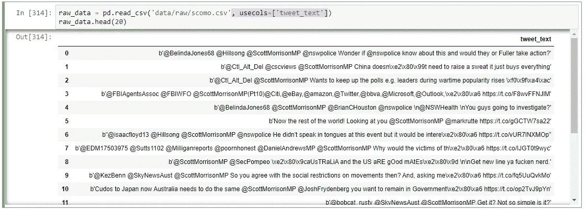

数据集的前 20 行

让我们继续数据清理过程。

## 1.删除网址，提及，标签，保留字，表情符号，笑脸和数字

```
raw_data['tweet_text'] = np.array([ p.clean(tweet) for tweet in raw_data['tweet_text'] ])
```

**预处理程序库中的 clean()函数**删除一条推文中的 URL、标签、提及、保留字(RT、FAV)、表情符号、表情符号和数字。

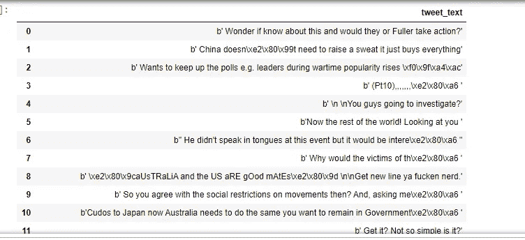

执行 clean()函数后的数据

## 2.删除标点符号

标点符号在分析时没有帮助。最好从文本中删除它们，就像我们使用 clean()函数删除它们一样。

```
raw_data['tweet_text'] = np.array([ re.sub(r'(@[A-Za-z0-9]+)|([^0)-9A-Za-z \t])|(\w+:\/\/\S+)', "", tweet) for tweet in raw_data['tweet_text'] ])
```

## 3.删除第一个字母“b”

正如你在下面看到的，我们可以在每一行前面找到字母‘b’，它没有任何用处。

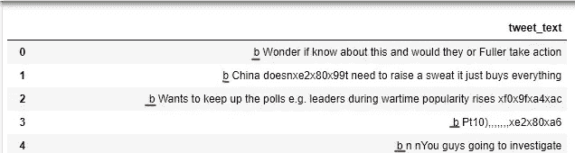

我们可以通过调用下面的代码行来删除它们。

```
raw_data['tweet_text'] = np.array([ tweet[1:] for tweet in raw_data['tweet_text'] ])
```

## 4.小写字母盘

将所有字母转换成小写，使它们更精确。

```
raw_data['tweet_text'] = raw_data['tweet_text'].apply(lambda x: " ".join(x.lower() for x in x.split()))
```

## 5.删除停用词

停用词是英语中常用的词(如“the”、“a”、“an”、“in”)。它们不会给上下文增加价值。我们不希望这些单词占用我们的数据库空间，或者占用宝贵的处理时间。

```
stop_words = stopwords.words('english')raw_data['tweet_text'] = raw_data['tweet_text'].apply(lambda x: " ".join(x for x in x.split() if x not in stop_words))
```

## 6.生僻字去除

有时，您需要删除独特的单词，如名称、品牌、产品名称和一些干扰字符，如 HTML 省略符号。这被认为是一个罕见的词删除。

```
freq = pd.Series(' '.join(raw_data['tweet_text']).split()).value_counts()[-1000:]
freq = list(freq.index)
raw_data['tweet_text'].apply(lambda x: " ".join(x for x in x.split() if x not in freq))
```

## 7.词汇化

词汇化是一个寻求分析一个词的预期意义而不是它的基本形式的过程。

例如；

*   这个男孩的汽车是不同的颜色。
*   男孩可以是不同的颜色。

```
raw_data['tweet_text'] = raw_data['tweet_text'].apply(lambda x: " ".join([Word(word).lemmatize() for word in x.split()]))
```

**清理数据后，推文如下…**

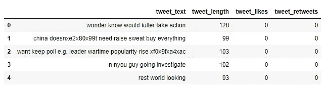

干净的文本

## 将 tweet length、like 和 retweets 列连接到最终数据集

```
data = pd.read_csv('data/raw/scomo.csv', usecols=['tweet_length','tweet_likes','tweet_retweets'])processed_df = pd.concat([raw_data, data], axis=1)
```

## 将处理后的数据帧作为新的 CSV 文件写入

```
processed_df.to_csv('data/processed/processed_data.csv',index=False)
```

# 3.分析并可视化结果


由 [Carlos Muza](https://unsplash.com/@kmuza?utm_source=unsplash&utm_medium=referral&utm_content=creditCopyText) 在 [Unsplash](https://unsplash.com/s/photos/analysis?utm_source=unsplash&utm_medium=referral&utm_content=creditCopyText) 上拍摄的照片

这里我们已经到了工作的最后部分。

我已经设法以比原始版本更有意义的方式清理了推文文本，这将有助于识别文本的情绪。

## 如何进行情感分析

**我们使用**[**text blob**](https://textblob.readthedocs.io/en/dev/index.html)**库**

*TextBlob 是一个用于处理文本数据的 Python (2 和 3)库。它提供了一个简单的 API，用于处理常见的自然语言处理(NLP)任务，如词性标注、名词短语提取、情感分析、分类、翻译等。*

**导入库**

```
import pandas as pd     
import numpy as np#sentiment analysis
from textblob import TextBlob
from textblob import Blobber
from textblob.sentiments import NaiveBayesAnalyzer#for visualizations
import matplotlib.pyplot as plt
import seaborn as sns
%matplotlib inline
```

**将 processed_data.csv 读入数据帧**

```
data = pd.read_csv('data/processed/processed_data.csv')
```

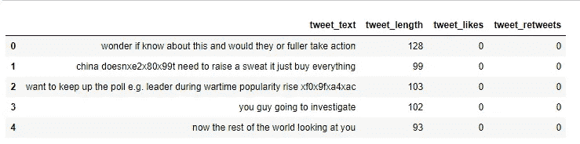

用于分析的已清理数据集

## 找到极性和主观性

**极性**，又称倾向性，是句子中表达的情感。它可以是积极的、消极的或中性的。主观性是指文本是一篇必须在上下文中分析的信息性文章。

极性是一个位于[-1，1]范围内的浮点数，其中 1 表示肯定陈述，而-1 表示否定陈述。主观句一般指个人观点、情感或判断，而客观句指事实信息。主观性也是一个位于[0，1]范围内的浮点数。

textblob 的*情感*函数返回两个属性，**极性，**和**主观性**。

```
data['polarity'] = np.array([ TextBlob(str(tweet)).sentiment.polarity for tweet in data['tweet_text']])data['subjectivity'] = np.array([ TextBlob(str(tweet)).sentiment.subjectivity for tweet in data['tweet_text']])
```

计算的极性和主观性被添加到数据集中。

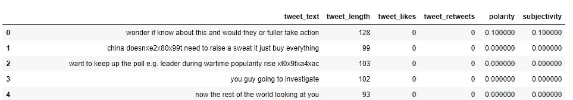

具有极性和主观性的数据集

# 让我们看看一些统计和图形可视化的分析

## 1.生成数据帧的统计数据

让我们看看数据帧的数值的百分位数、平均值和标准差等统计数据是什么。我们可以用*描述熊猫的*功能。


## 2.创建并可视化相关矩阵

相关矩阵是显示变量之间相关系数的表格。表中的每个单元格显示了两个变量之间的相关性。

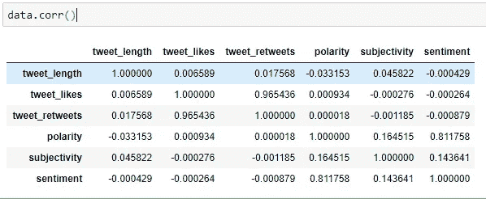

相关矩阵

我们将创建一个**热图**来可视化这种关联。热图是以二维形式表示数据的一种方式。数据值在图表中用颜色表示。

```
plt.figure(figsize=(10,6))
sns.heatmap(data.corr(), annot=True)
plt.title('data correlations')
```

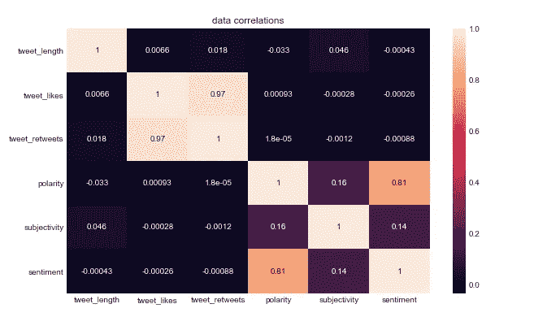

根据热图，

*   **推文点赞**和**转发**显示**最高相关度**
*   **极性**和**情绪**显示**第二高的相关性**

## 3.极性、主观性和微博长度的分布

我们将分别为两个字段创建一个 ***distplot*** 图，以查看数据集中的值是如何分布的。

## 3.1 极性分布

```
plt.figure(figsize=(10,4))
plt.title('Distribution of polarity')
sns.distplot(data['polarity'].dropna(), kde=False, bins=40)
```

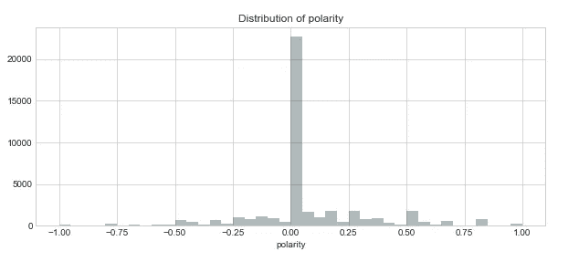

极性分布

## 3.2 主观性分布

```
plt.figure(figsize=(10,4))
plt.title('Subjectivity of polarity')
sns.distplot(data['subjectivity'].dropna(), kde=False, bins=40)
```

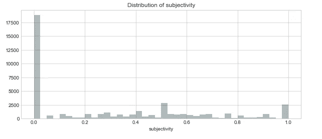

主观性分布

## 3.3 推文长度分布

```
plt.figure(figsize=(10,4))
plt.title('Distribution of tweet length')
sns.distplot(data['tweet_length'].dropna(), kde=False, bins=40)
```

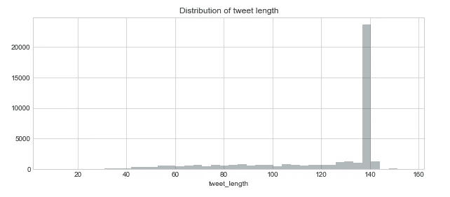

推文长度分布

## 3.4 极性和主观性的组合分布

我们可以创建一个 ***jointplot*** 图来显示两个变量之间的关系。

```
sns.jointplot(x='polarity',y='subjectivity',data=data,kind='scatter')
```

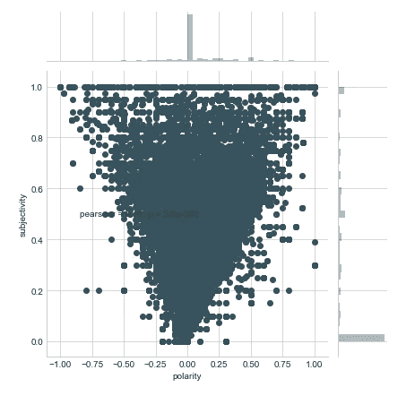

## 4.决定情绪

正如我上面提到的，我们可以通过使用极性值来发现情绪。如果，

*   极性< 0: negative sentiment
*   polarity = 0: neutral sentiment
*   polarity > 0:积极情绪

让我们创建一个函数来计算情绪。

```
def select_sentiment(value):

    if value>0:
        return 1
    elif value==0:
        return 0
    else:
        return -1
```

产生情感价值。

```
data['sentiment'] = np.array([select_sentiment(p) for p in data['polarity']])
```

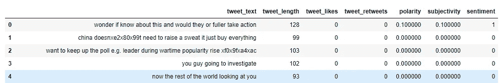

带有情感值的数据集

## 5.想象这种情绪

## 5.1 每个类别中出现的次数

我们可以使用 ***计数图*** 来显示使用条形的每个分类箱中的观察计数。

```
plt.figure(figsize=(6,4))
plt.title('Number of occurence of each category')
sns.countplot(x='sentiment',data=data,)
```

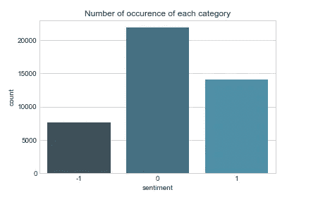

情绪的计数图

根据图表，出现次数最多的是在**空档**类别。

## 5.2 基于情感的推文长度

我们可以使用 ***条形图*** 来显示数据中分类特征的聚合数据。我们可以观察一条推文的长度在每个类别中的指向。

```
plt.figure(figsize=(6,4))
plt.title('Tweet length based on sentiment')
sns.barplot(x='sentiment',y='tweet_length',data=data)
```

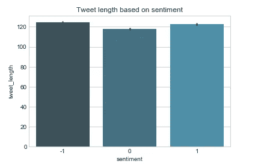

基于情感的推文长度柱状图

## 5.3 基于情感的推文长度分布

我们可以用一个 ***箱线图*** 来显示分类数据的分布。该框显示数据集的四分位数，而触须延伸以显示分布的其余部分。

```
plt.figure(figsize=(10,7))
plt.title('Distribution of tweet length based on sentiment')
sns.boxplot(x="sentiment", y="tweet_length", data=data)
```

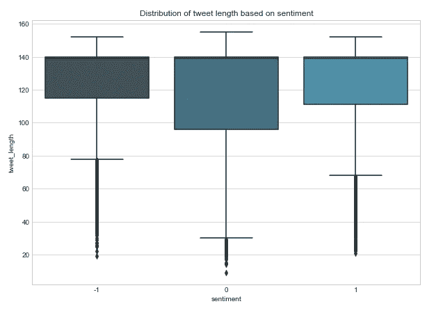

基于情感的推文长度分布箱线图

## 5.3 基于情感类别的百分比

使用以下代码计算每个情感类别的百分比。

```
pos_tweets= [ tweet for index, tweet in enumerate(data['sentiment']) if data['sentiment'][index] == 1]
nue_tweets= [ tweet for index, tweet in enumerate(data['sentiment']) if data['sentiment'][index] == 0]
neg_tweets= [ tweet for index, tweet in enumerate(data['sentiment']) if data['sentiment'][index] == -1]pos_percentage = len(pos_tweets)*100/len(data)
nue_percentage = len(nue_tweets)*100/len(data)
neg_percentage = len(neg_tweets)*100/len(data)
```

根据这些值绘制一个饼图。

```
fig = plt.figure()
percentage = pd.Series([pos_percentage,nue_percentage,neg_percentage], 
                      index=['positive','nuetral','negative'], 
                      name='Sentiment analysis')
percentage.plot.pie(fontsize=9, autopct='%.2f%%', figsize=(8,8));
plt.figure()
```

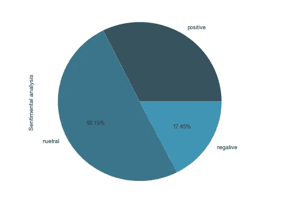

情感类别饼图

## 6.决赛成绩

分析的结果如下。调查显示，50.19%的人对 ScoMo 持中立态度(无论是负面还是正面)，32.36%的人持正面态度，17.45%的人持负面态度。

# 结论

根据分析，更多的人(50%)对 ScoMo 持中立态度。如果我们能够收集更长时间的数据，而不是十天，这个结果是可以改变的。此外，世界当前局势和最近发生的事件等事实会影响推文的行为。

**进一步扩展**

我只用了推文的文字。诸如日期/时间、地理位置等其他属性可用于进一步分析。此外，我们可以观察哪些是经常使用的单词，并寻找模式和训练模型以供将来使用。

感谢您的阅读！


照片由 [Riz Mooney](https://unsplash.com/@rizmooney?utm_source=medium&utm_medium=referral) 在 [Unsplash](https://unsplash.com?utm_source=medium&utm_medium=referral) 上拍摄