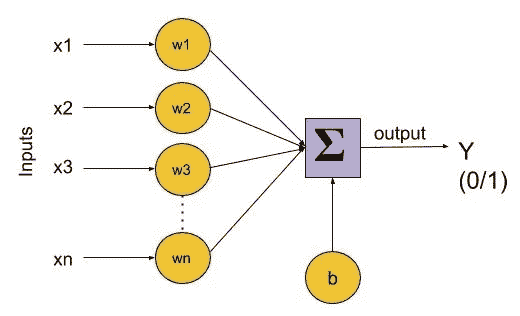
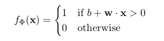
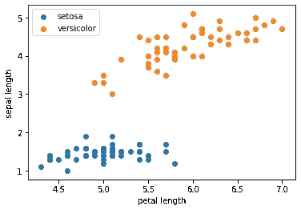
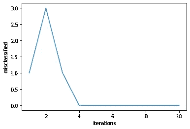

# 感知机学习及其在 Python 中的实现

> 原文：<https://towardsdatascience.com/perceptron-and-its-implementation-in-python-f87d6c7aa428?source=collection_archive---------4----------------------->

本博客涵盖以下主题:

1.  什么是感知器？
2.  算法。
3.  实施。
4.  局限性。

# 什么是感知器？


生物神经元示意图

感知器的概念类似于大脑的基本处理单元——神经元的工作原理。神经元由树突、细胞体携带的许多输入信号和轴突携带的一个输出信号组成。当细胞达到特定阈值时，神经元会发出一个动作信号。这个动作要么发生，要么不发生；神经元的“部分”放电是不存在的。

类似地，感知器有许多输入(通常称为特征)，这些输入被送入一个线性单元，产生一个二进制输出。因此，感知器可以应用于解决二元分类问题，其中样本将被识别为属于预定义的两个类别之一。

# 该算法



感知器示意图

由于感知器是二元分类器(0/1)，我们可以将它们的计算定义如下:



让我们回忆一下，两个长度为 n (1≤i≤n)的向量的点积是

> w。x = ∑ᵢ wᵢ。xᵢ

函数 f(x)=*b+****w****。* ***x*** 是权重和特征向量的线性组合。因此，感知器是一种线性分类器——一种使用线性预测函数进行预测的算法。

权重表示 **x** 中每个特征 xᵢ对模型行为的有效性。要素 xᵢ的权重 wᵢ越高，其对输出的影响就越大。另一方面，偏差“b”就像线性方程中的截距。这是一个帮助模型以最适合数据的方式进行调整的常数。偏置项假设输入特征系数 x₀=1.为虚数

可以使用以下算法来训练该模型:

```
1\. set b = w = 0
2\. for N iterations, or until weights do not change
       (a) for each training example xᵏ with label yᵏ
           i. if yᵏ — f(xᵏ) = 0, continue
           ii. else, update wᵢ, △wᵢ = (yᵏ — f(xᵏ)) xᵢ
```

# 履行

我们考虑用于实现感知器的数据集是[虹膜花数据集](https://www.kaggle.com/anthonyhills/classifying-species-of-iris-flowers)。该数据集包含 4 个描述花的特征，并将它们分类为属于 3 个类中的一个。我们去除属于类‘Iris-virginica’的数据集的最后 50 行，并且仅使用 2 个类‘Iris-setosa’和‘Iris-versicolor ’,因为这些类是线性可分的，并且算法通过最终找到最优权重而收敛到局部最小值。

可视化包含其中两个要素的数据集，我们可以看到，通过在它们之间画一条直线，可以清楚地将数据集分开。

我们的目标是编写一个算法，找到那条线，并正确分类所有这些数据点。



现在我们实现上面提到的算法，看看它是如何工作的。我们有 4 个特征，因此每个特征有 4 个权重。请记住，我们定义了一个偏差项 w₀，它假设 x₀=1 总共有 5 个权重。

我们将迭代次数定义为 10 次。这是*超参数*之一，与算法学习的 w 等系统参数相反。在每次迭代中，该算法计算所有数据点的类别(0 或 1 ),并随着每次错误分类更新权重。

如果样本被错误分类，则权重通过向相反方向移动的增量来更新。所以如果再对样本进行分类，结果是“错的少”。我们将任何≤0 的标签归类为‘0’(Iris-setosa)，其他任何标签归类为‘1’(Iris-versicolor)。

现在，让我们画出每次迭代中错误分类样本的数量。我们可以看到，该算法在第 4 次迭代中收敛。即，所有样本在第四次通过数据时被正确分类。

> 感知器的一个属性是，如果数据集是线性可分的，那么算法保证收敛到某个点！



# 限制

1.  单层感知器只有在数据集是线性可分的情况下才能工作。
2.  该算法仅用于二元分类问题。然而，我们可以通过为每个类引入一个感知器来扩展该算法以解决多类分类问题。即，每个感知器产生 0 或 1，表示样本是否属于该类。

如果你想过来打个招呼，请在[LinkedIn](https://www.linkedin.com/in/pallavirbharadwaj)|[Twitter](https://twitter.com/pallavibharadwj)|[Github](https://github.com/pallavibharadwaj)上与我联系。

[1]尤金·查尔尼亚克，《深度学习导论》(2018)。

[2] R.A. Fisher，[分类问题中多重测量的使用](http://dx.doi.org/10.1111/j.1469-1809.1936.tb02137.x) (1936)。