# 感知器:解释、实现和可视化示例

> 原文：<https://towardsdatascience.com/perceptron-explanation-implementation-and-a-visual-example-3c8e76b4e2d1?source=collection_archive---------1----------------------->

## 理解神经网络的构建模块

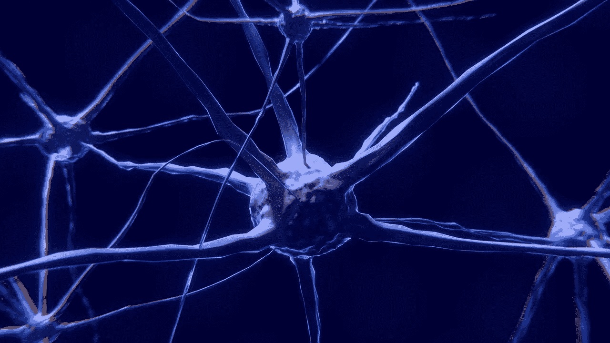

科林·伯伦斯在[皮克斯贝](https://pixabay.com/ro/?utm_source=link-attribution&utm_medium=referral&utm_campaign=image&utm_content=2213009)拍摄的图片

感知器是人工神经网络的构建模块，它是我们大脑中生物神经元的简化模型。感知器是最简单的神经网络，仅由一个神经元组成。感知器算法是弗兰克·罗森布拉特在 1958 年发明的。

下面是一个生物神经元的图示:


[图片](https://commons.wikimedia.org/wiki/File:Neuron.svg)由用户:Dhp1080 / [CC BY-SA](http://creativecommons.org/licenses/by-sa/3.0/) 在[维基共享](https://commons.wikimedia.org/)

神经元的大部分输入信号是通过树突接收的。其他神经元与这些树突之间大约有 1000 到 10000 个连接。来自连接的信号称为突触，通过树突传播到细胞体。细胞体中的电位增加，一旦达到阈值，神经元就会沿着轴突发送一个尖峰，通过轴突末端连接到大约 100 个其他神经元。

感知器是真实神经元的简化模型，试图通过以下过程来模拟它:它获取输入信号，让我们称它们为 x1，x2，…，xn，计算这些输入的加权和 **z** ，然后将其通过阈值函数ϕ并输出结果。

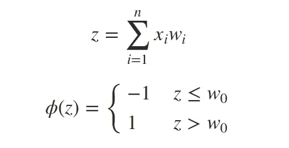

但是将 w0 作为阈值与将 w0 作为偏差加到总和上并且取而代之以阈值 0 是一样的。也就是说，我们考虑一个总是被设置为 1 的附加输入信号 x0。

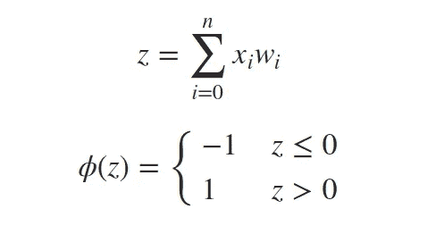

这里代表一个感知器:

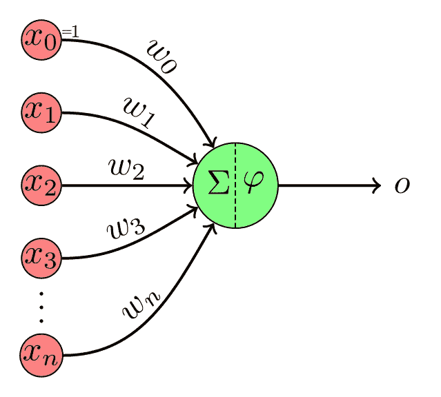

[图片](https://commons.wikimedia.org/wiki/File:Perceptron-unit.svg)由用户:MartinThoma / CC0 在[维基共享](https://commons.wikimedia.org/)

为了使用向量符号，我们可以将所有输入 x0，x1，…，xn 和所有权重 w0，w1，…，wn 放入向量 **x** 和 **w** ，当它们的点积为正时输出 1，否则输出-1。

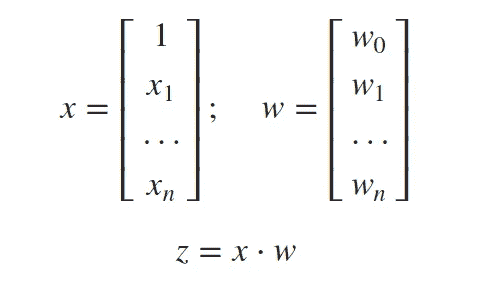

这是一个仅使用两个输入 x1 和 x2 的几何表示，因此我们可以在二维空间中绘制它:

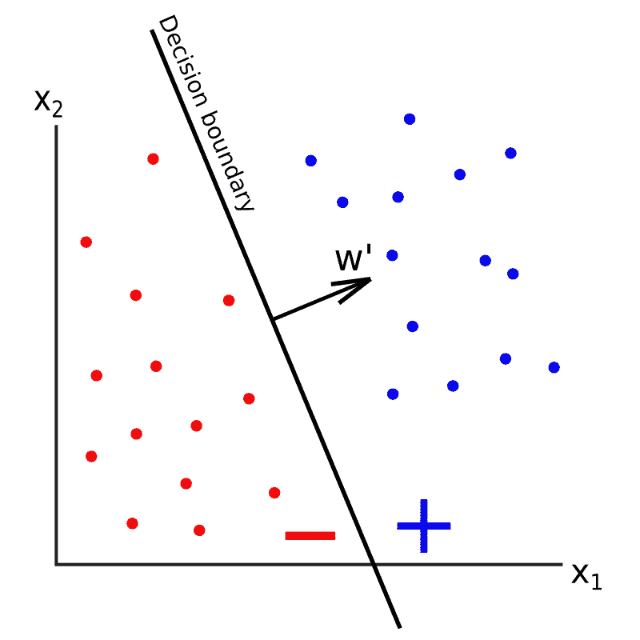

正如你在上面看到的，有两个输入的感知器的决策边界是一条线。如果有 3 个输入，决策边界将是一个 2D 平面。一般来说，如果我们有 n 个输入，则决策边界将是一个称为超平面的 n-1 维对象，该超平面将我们的 n 维特征空间分成两个部分:一个部分中的点被分类为正，一个部分中的点被分类为负(按照惯例，我们将把正好在决策边界上的点视为负)。因此，感知器是一个二元分类器，其权重是线性的。

在上图**中，w’**表示不含偏差项 w0 的权重向量。**w’**具有垂直于决策边界并指向正分类点的性质。该向量确定了判定边界的斜率，并且偏置项 w0 确定了判定边界沿着**w’**轴的偏移。

到目前为止，我们讨论了感知器如何根据输入信号及其权重做出决策。但是感知器实际上是如何学习的呢？如何找到正确的一组参数 w0，w1，…，wn 以便进行良好的分类？
感知器算法是一种基于以下简单更新规则的迭代算法:

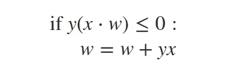

其中 y 是我们当前数据点 **x** 的标签(-1 或+1 ),而 **w** 是权重向量。

我们的更新规则说了什么？点积 x⋅w 只是感知器基于当前权重的预测(其符号与预测标签的符号相同)。只有当真实标签 y 不同于预测标签ϕ(x⋅w).时，表达式 y(x⋅w 才能小于或等于 0 因此，如果真实标签和预测标签不匹配，那么我们更新我们的权重:**w = w+yx**；否则，我们就听其自然。

那么，为什么 **w = w + yx** 更新规则有效呢？它试图将 if 条件下的 y(x⋅w 的值推向 0 的正侧，从而正确地对 x 进行分类。如果数据集是线性可分的，通过对每个点进行一定次数的迭代来执行这种更新规则，权重将最终收敛到每个点都被正确分类的状态。让我们通过在更新后重新评估 if 条件来看看更新规则的效果:

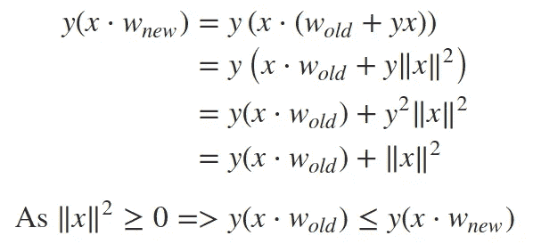

也就是说，在特定数据点的权重更新之后，if 条件中的表达式应该更接近正的，从而被正确分类。

完整的感知器算法伪代码如下:

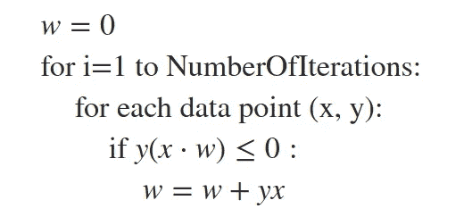

# 现在让我们用 Python 来实现它


现在，我们将使用 numpy 作为矩阵向量运算的外部库，用 python 从头开始实现感知器算法。我们将把它实现为一个类，它的接口类似于 Sci-kit Learn 等常见机器学习包中的其他分类器。我们将为这个类实现 3 个方法:`.fit()`、`.predict()`和`.score()`。

`.fit()`方法将用于训练感知器。它期望 2D numpy 数组 **X** 作为第一个参数。该数组的行是来自数据集的样本，列是特征。第二个参数， **y** ，应该是一个 1D numpy 数组，它包含了 **X** 中每一行数据的标签。第三个参数， **n_iter** ，是算法运行的迭代次数。

```
**def** fit(self, X, y, n_iter**=**100):

    n_samples **=** X.shape[0]
    n_features **=** X.shape[1]

    *# Add 1 for the bias term*
    self.weights **=** np.zeros((n_features**+**1,))

    *# Add column of 1s*
    X **=** np.concatenate([X, np.ones((n_samples, 1))], axis**=**1)

    **for** i **in** range(n_iter):
        **for** j **in** range(n_samples):
            **if** y[j]*****np.dot(self.weights, X[j, :]) **<=** 0:
                self.weights **+=** y[j]*****X[j, :]
```

`.predict()`方法将用于预测新数据的标签。它首先检查权重对象属性是否存在，如果不存在，这意味着感知器还没有被训练，我们显示一个警告消息并返回。该方法需要一个参数， **X** ，其形状与`.fit()`方法中的相同。然后我们在 **X** 和权重之间做一个矩阵乘法，把它们映射到-1 或者+1。我们使用`np.vectorize()`将该映射应用于矩阵乘法的结果向量中的所有元素。

```
**def** predict(self, X):
    **if** **not** hasattr(self, 'weights'):
        print('The model is not trained yet!')
        **return**

    n_samples **=** X.shape[0]
    *# Add column of 1s*
    X **=** np.concatenate([X, np.ones((n_samples, 1))], axis**=**1)
    y **=** np.matmul(X, self.weights)
    y **=** np.vectorize(**lambda** val: 1 **if** val **>** 0 **else** **-**1)(y)

    **return** y
```

`.score()`方法计算并返回预测的准确性。它期望输入矩阵 **X** 和标签向量 **y** 作为参数。

```
**def** score(self, X, y):
    pred_y **=** self.predict(X)

    **return** np.mean(y **==** pred_y)
```

以下是完整代码:

# 几个例子

我现在想做的是展示几个决策边界如何收敛到一个解的可视化例子。

为此，我将使用 Sci-kit Learn 的`datasets.make_classification()`和`datasets.make_circles()`函数创建几个包含 200 个样本的双特征分类数据集。这是用于创建接下来的 2 个数据集的代码:

```
X, y **=** make_classification(
    n_features**=**2,
    n_classes**=**2,
    n_samples**=**200,
    n_redundant**=**0,
    n_clusters_per_class**=**1
)
```

最后一个数据集:

```
X, y **=** make_circles(n_samples**=**200, noise**=**0.03, factor**=**0.7)
```

对于每个例子，我将把数据分成 150 个用于训练，50 个用于测试。左侧将显示训练集，右侧将显示测试集。当决策边界收敛到一个解时，它将显示在两侧。但是决策边界将仅基于左边的数据(训练集)来更新。

## 示例 1 —线性可分离

我将展示的第一个数据集是线性可分的数据集。下面是完整数据集的图像:

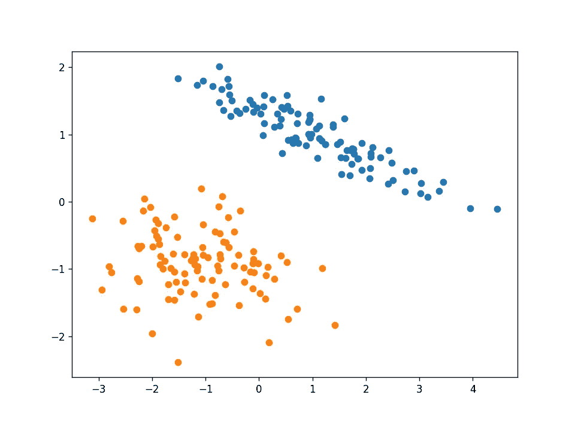

这是一个简单的数据集，我们的感知器算法将在通过训练集进行 2 次迭代后收敛到一个解决方案。因此，每个数据点的动画帧都会发生变化。绿点是算法中当前测试的点。


在这个数据集上，该算法正确地对训练和测试示例进行了分类。

## 示例 2 —噪声数据集

如果数据集不是线性可分的呢？如果正面和反面的例子像下图这样混淆了怎么办？

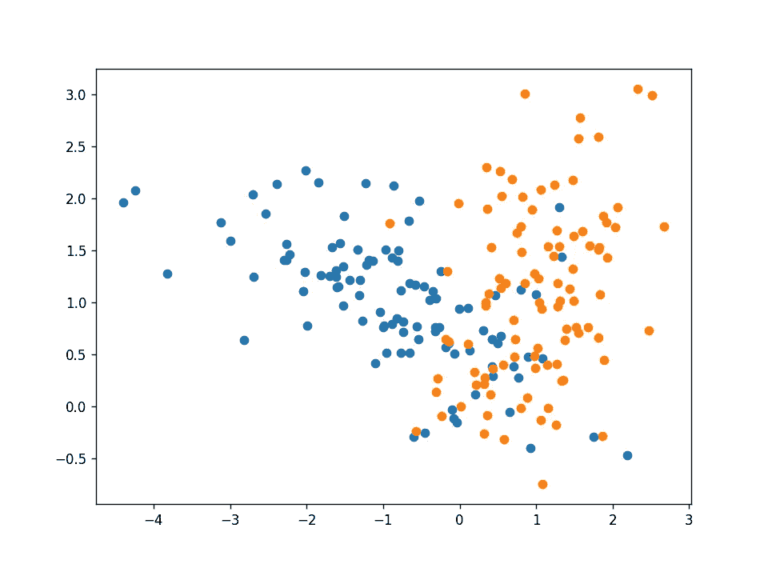

感知器算法不能正确地分类所有的例子，但是它会试图找到一条线来最好地区分它们。在这个例子中，我们的感知机得到了一个 **88%** 的测试准确率。下面的动画帧在所有训练示例的每次迭代后都会更新。

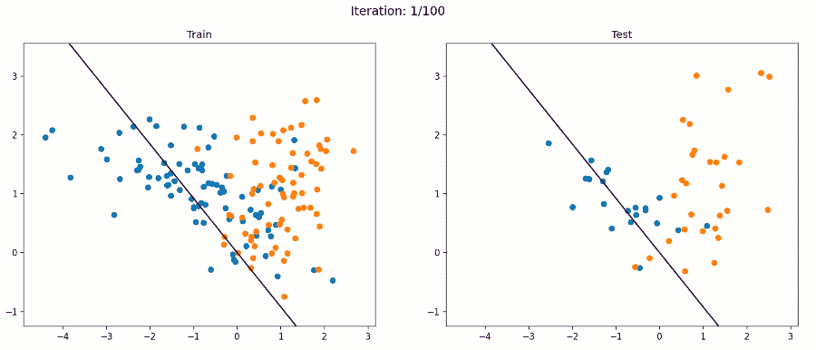

## 示例 3 —非线性数据集

下面的数据集呢？

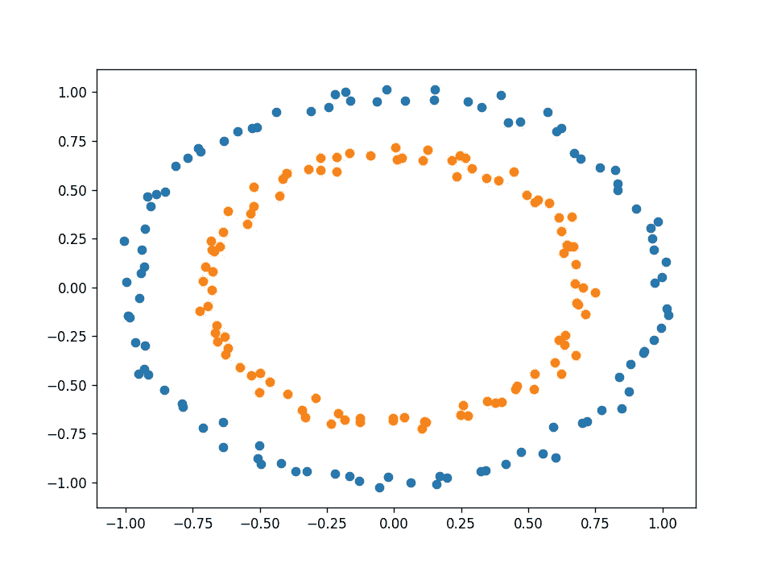

它是可分的，但显然不是线性的。所以你可能认为感知器不适合这个任务。但是关于感知器的事情是，它的决策边界在**权重**方面是线性的，不一定在输入方面。我们可以增加我们的输入向量 **x** ，使它们包含原始输入的非线性函数。例如，除了原始输入 x1 和 x2 之外，我们还可以添加 x1 的平方、x1 乘以 x2 和 x2 的平方。

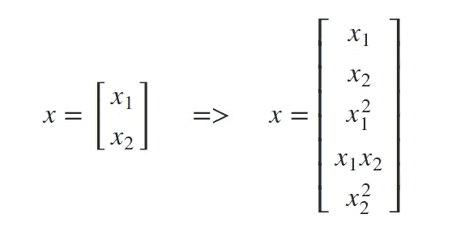

下面的`polynomial_features(X, p)`函数能够将输入矩阵 **X** 转换成一个矩阵，该矩阵包含作为特征的次数为 **p** 的多项式的所有项。它利用了`polynom()`函数，该函数计算代表要相乘以获得 p 阶项的列的索引列表。

```
**def** polynom(indices_list, indices, a, b, p):
    indices **=** [*****indices]
    **if** p **==** 0:
        indices_list.append(indices)
        **return**
    **for** i **in** range(a, b):
        indices.append(i)
        polynom(indices_list, indices, i, b, p**-**1)
        indices **=** indices[0:**-**1]

**def** polynomial_features(X, p):
    n, d **=** X.shape
    features **=** []
    **for** i **in** range(1, p**+**1):
        l **=** []
        polynom(l, [], 0, d, i)
        **for** indices **in** l:
            x **=** np.ones((n,))
            **for** idx **in** indices:
                x **=** x ***** X[:, idx]
            features.append(x)
    **return** np.stack(features, axis**=**1)
```

对于我们的示例，我们将在 **X** 矩阵中添加 2 度项作为新特性。

```
X **=** polynomial_features(X, 2)
```

现在，让我们看看在使用转换后的数据集进行训练的过程中会发生什么:

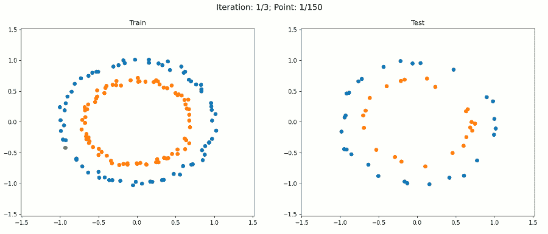

注意，为了绘图，我们只使用原始输入，以保持 2D。在扩充的特征空间中，即现在的 5D 中，决策边界仍然是线性的。但是当我们绘制投影到原始特征空间上决策边界时，它具有非线性形状。

通过这种方法，我们的感知器算法能够正确地分类训练和测试示例，而无需对算法本身进行任何修改。我们只改变了数据集。

使用这种特征增强方法，我们能够通过使用原本只是线性的算法来模拟数据中非常复杂的模式。

但是，这种方法不是很有效。想象一下，如果我们有 1000 个输入要素，并且我们想用最多 10 次多项式项来扩充它，会发生什么情况。幸运的是，使用一种叫做**内核**的东西可以避免这个问题。但这是另一篇文章的主题，我不想让这篇文章太长。

*我希望这些信息对你有用，感谢你的阅读！*

这篇文章也贴在我自己的网站[这里](https://www.nablasquared.com/perceptron-explanation-implementation-and-a-visual-example/)。随便看看吧！