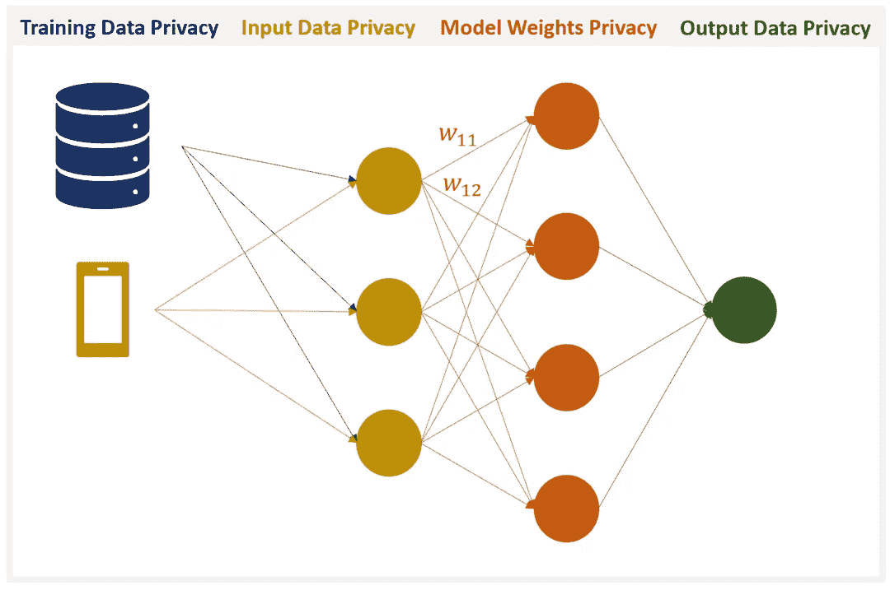
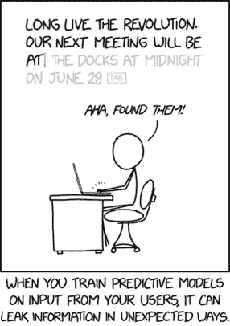
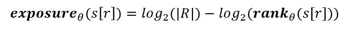

# 完全保护隐私的人工智能

> 原文：<https://towardsdatascience.com/perfectly-privacy-preserving-ai-c14698f322f5?source=collection_archive---------4----------------------->

## [数据隐私](https://towardsdatascience.com/tagged/data-privacy)

## 它是什么，我们如何实现它？

数据隐私被称为“[未来十年最重要的问题](https://www.forbes.com/sites/marymeehan/2019/11/26/data-privacy-will-be-the-most-important-issue-in-the-next-decade/#3211e2821882)”，并由于像欧盟一般数据保护条例(GDPR)和加州消费者隐私法(CCPA)这样的立法而占据了中心位置。公司、开发者和研究人员正在[争先恐后地跟上需求](https://www.theverge.com/2019/12/31/21039228/california-ccpa-facebook-microsoft-gdpr-privacy-law-consumer-data-regulation)。特别是，“[设计隐私](https://www.ipc.on.ca/wp-content/uploads/resources/7foundationalprinciples.pdf)”是 GDPR 不可或缺的一部分，在这十年里可能只会越来越受欢迎。当使用隐私保护技术时，立法突然变得不那么令人生畏了，因为确保数据安全是维护用户信任的核心。

数据隐私是训练和测试人工智能模型的核心问题，特别是那些根据敏感数据进行训练和推断的模型。然而，据我们所知，还没有关于拥有完全保护隐私的人工智能意味着什么的指南出版。我们介绍了实现完全保护隐私的人工智能所需的四个支柱，并讨论了可以帮助解决每个支柱的各种技术。我们用快速增长的隐私保护机器学习子领域中相对新的研究来支持我们的说法。

完美隐私保护人工智能的四大支柱

# 完美隐私保护人工智能的四大支柱

在我们的研究中，我们确定了保护隐私的机器学习的四个支柱。这些是:

1.  **训练数据隐私**:保证恶意参与者无法对训练数据进行逆向工程。
2.  **输入隐私**:保证用户的输入数据不会被其他方观察到，包括模型创建者。
3.  **输出隐私**:保证一个模型的输出除了被推断数据的用户之外，任何人都不可见。
4.  **模型隐私**:保证模型不被恶意方窃取。

1–3 处理保护数据创建者，而 4 意味着保护模型创建者。

# 培训数据隐私

虽然从明文(未加密的技术术语)输入和输出数据中收集有关训练数据和模型权重的信息可能会稍微困难一些，但最近的研究表明，重建训练数据和逆向工程模型并不像人们希望的那样是一个巨大的挑战。

来源:https://xkcd.com/2169/

***证据***

在[1]中，Carlini 和 Wagner 计算了生成序列模型(例如，字符语言模型)可以多快地记住训练集中的稀有信息。Carlini 和 Wagner 在 Penn Treebank 上训练了一个字符语言模型，其中插入了一次“秘密”:“随机数是 oooooooooooo ”,其中 oooooooo 是一个(假的)社会安全号码。他们展示了隐藏在他们的宾夕法尼亚树库数据集(PTD)中的秘密是如何暴露的。他们在 5%的 PTD 上训练一个字符语言模型，并计算网络的记忆量。当测试集损失最低时，记忆达到峰值。这与秘密暴露的高峰期相吻合。

***度量***

那么，我们如何量化一个秘密被模型输出逆向工程的可能性呢？[1]开发了一个称为*暴露*的指标:

*给定一只金丝雀 s[r]，一个带参数θ的模型，随机空间 R，曝光度 s[r]为*

等级是给定模型对输入的困惑时，真实秘密(或金丝雀)在所有可能秘密中的索引。索引越小，序列出现在训练数据中的可能性越大，因此目标是最小化秘密的暴露，这是 Carlini 和 Wagner 所做的事情。通过使用差分私有梯度下降来实现(参见下面的 ***解决方案*** )。

在[2]中给出了另一个暴露度量，其中作者计算了通过不安全通道发送的私有数据的潜在表示会泄露多少信息。虽然本文更多地属于输入数据隐私分析的范畴，但仍然值得查看提议的指标，以将其与[1]中提出的指标进行比较。事实上，他们提出了两个隐私度量标准。一个用于人口统计变量，如情感分析和博客文章主题分类，一个用于命名实体，如新闻主题分类。他们的隐私指标是:

1.  人口统计变量:“1*X*，其中 *X* 是攻击者对性别和年龄预测的平均准确度，”
2.  命名实体:" 1*F*，其中 *F* 是在 **z** 中的一组二进制变量上计算的 F 分数，其指示输入示例中命名实体的存在，"其中" **z** 是包含在[自然语言文本]中的私有信息的向量。"

在查看证据时，重要的是要记住，人工智能(保护隐私的人工智能)的这个子领域是全新的，因此可能有很多潜在的利用尚未分析，甚至尚未想到。

***解决方案***

对于训练数据记忆的问题，提出了两种主要的解决方案，它们不仅保证了隐私，还提高了机器学习模型的可推广性:

1.  差分隐私随机梯度下降(DPSGD) [3，4]:虽然差分隐私最初是为了允许人们在不透露数据集中任何个人的任何个人信息的情况下对数据集进行归纳，但该理论已被用于在深度学习系统中保护训练数据隐私。
    关于在机器学习中使用差分隐私的详细讨论，请阅读[这篇采访](https://medium.com/privacy-preserving-natural-language-processing/differentially-private-natural-language-processing-4f18912c5de0)Parinaz sob Hani 博士，他是加拿大领先的风险投资公司之一 Georgian Partners 的机器学习主管。
2.  Papernot 的 PATE[5]:paper not 教授创建了 PATE，作为 DPSGD 的更直观的替代方案。PATE 可以被认为是一种集成方法&通过在数据集的 iid 子集上训练多个模型来工作。根据推断，如果大多数模型同意输出，那么输出不会揭示关于训练数据的任何私人信息，因此可以共享。

# 输入和输出隐私

输入用户数据和从该数据推断出的结果模型输出不应该对除用户之外的任何方可见，以符合完全保护隐私的 AI 的四个支柱。保护用户数据隐私不仅有利于用户本身，也有利于处理潜在敏感信息的公司。隐私与安全密不可分。拥有适当的安全性意味着数据泄露的可能性大大降低，从而实现理想的场景:不会失去用户的信任，也不会因为数据管理不当而被罚款。

***证据***

这对于确保私人数据不会:

*   被误用(例如，NYT 中报告的[位置跟踪)](https://www.nytimes.com/interactive/2019/12/19/opinion/location-tracking-cell-phone.html)
*   由于黑客攻击或其他原因落入他人之手
*   习惯于用户没有预料到或明确同意的任务(例如，[亚马逊承认员工监听 Alexa 对话](https://www.independent.co.uk/life-style/gadgets-and-tech/news/amazon-alexa-echo-listening-spy-security-a8865056.html))。

虽然标准做法是在传输过程中对数据进行加密，并且(如果公司有责任的话)静态数据也要加密，但是当数据被解密以进行处理时，就很容易受到攻击。

***方案***

1.  同态加密:同态加密允许对加密数据进行非多项式运算。对于机器学习，这意味着训练和推理可以直接在加密数据上进行。同态加密已经成功地应用于随机森林、朴素贝叶斯和逻辑回归[6]。[7]设计了对加密数据进行分类的低次多项式算法。最近，深度学习模型已经适应了加密领域[8，9，10]。
    参见[这篇文章](https://medium.com/privacy-preserving-natural-language-processing/homomorphic-encryption-for-beginners-a-practical-guide-part-1-b8f26d03a98a)了解同态加密的介绍。
2.  安全多方计算(MPC):MPC 背后的想法是，不信任对方的两方或多方可以将他们的输入转换为“无意义的”，这些输入被发送到一个函数中，该函数的输出只有在使用正确数量的输入时才有意义。在其他应用中，MPC 已用于使用不同医院拥有的基因组数据进行基因组诊断[11]，以及用于分类 MNIST 图像的线性回归、逻辑回归和神经网络[12]。[11]是一个很好的例子，说明了在隐私得到保证的情况下，通过访问敏感数据可以取得什么样的进步。由于缺乏训练分类和生成模型所需的数据，有许多任务无法用机器学习来完成。不是因为数据不在那里，而是因为信息的敏感性意味着它不能被共享，有时甚至不能被收集，包括医疗数据或甚至特定于说话人的元数据，这可能有助于改进自动语音识别系统(例如，年龄组、位置、第一语言)。
    这里有一篇关于 MPC 的精彩介绍。你可以在这里找到 Morten Dahl 博士的私人深度学习用 MPC 教程[。](https://mortendahl.github.io/2017/04/17/private-deep-learning-with-mpc/)
3.  联合学习:联合学习基本上是设备上的机器学习。只有在与差分专用训练(参见上一节中的 DPSGD)和用于安全模型聚合的 MPC[13]相结合时，它才真正成为专用的，因此用于训练模型的数据不能从单个电话输出的权重更新进行反向工程。在实践中，谷歌已经在 Gboard 上部署了联合学习(见他们的[博客文章](https://ai.googleblog.com/2017/04/federated-learning-collaborative.html))，苹果在 [CoreML3](https://developer.apple.com/documentation/coreml) 中引入了联合学习支持。

# 模型隐私

人工智能模型可能是公司的面包和黄油，其中许多通过 API 或最近通过可下载软件向开发人员提供预测能力。模型隐私是必须考虑的四个支柱中的最后一个，也是用户和公司利益的核心。如果竞争对手可以轻松复制他们的模型(这种行为不容易调查)，公司就没有动力提供有趣的产品，也没有动力花钱改善人工智能能力。

***证据***

机器学习模型构成了许多公司的核心产品&知识产权，因此模型被盗是一种严重的威胁，可能会产生重大的负面商业影响。一个模型可以被直接窃取，也可以根据它的输出进行逆向工程[14]。

***解决方案***

1.  在将差分隐私应用于模型输出以防止模型反转攻击方面已经做了一些工作。差分隐私通常意味着损害模型准确性；然而，[15]提出了一种不牺牲准确性来换取隐私的方法。
2.  同态加密不仅可以用于保护输入和输出隐私，如果选择在云中加密模型，还可以保护模型隐私。然而，这带来了巨大的计算成本，并且不能防止模型反演攻击。

# 满足所有四大支柱

从前面几节可以看出，没有一种一揽子技术可以解决所有隐私问题。相反，为了拥有完全保护隐私的人工智能(这是研究界和工业界尚未实现的)，人们必须结合各种技术:

*   同态加密+差分隐私
*   安全多方计算+差分隐私
*   联邦学习+差分隐私+安全多方计算
*   同态加密+补丁
*   安全多方计算+ PATE
*   联邦学习+ PATE +同态加密

其他组合也存在，包括一些替代技术，还没有强大的数学保证；即，(1)安全区域(例如，英特尔 SGX ),允许在甚至系统内核都无法访问的情况下执行计算，(2)数据去识别，以及(3)数据合成。

目前，完美保护隐私的人工智能仍然是一个研究问题，但有一些工具可以解决一些最紧迫的隐私需求。

# 保护隐私的机器学习工具

*   [tensor flow 中的差分隐私](https://github.com/tensorflow/privacy)
*   [py torch 中的 MPC 和联邦学习](https://github.com/OpenMined/PySyft)
*   [张量流中的 MPC](https://github.com/mpc-msri/EzPC)
*   [基于 CoreML3 的设备上机器学习](https://developer.apple.com/documentation/coreml)

# 感谢

非常感谢 Pieter Luitjens 和 Siavash Kazemian 博士对本文早期草稿的反馈，以及 Gerald Penn 教授对本文的贡献。

# 参考

[1] Carlini，Nicholas，等，*秘密分享者:评估和测试神经网络中的非故意记忆(2019)* ，第 28 届 USENIX 安全研讨会(USENIX 安全 19)。

[2]科沃克斯、马希民、沙希·纳拉扬和谢伊·b·科恩，*文本的隐私保护神经表征* (2018)，arXiv 预印本 arXiv:1808.09408。

[3] Song，Shuang，Kamalika Chaudhuri，Anand D. Sarwate，*带差分私有更新的随机梯度下降* (2013) *，* IEEE 全球信号与信息处理会议。

[4] Wu，x .、Li，f .、Kumar，a .、Chaudhuri，k .、Jha，s .和 Naughton，j .， *Bolt-on 差分隐私用于可扩展的基于随机梯度下降的分析* (2017)，载于 2017 年 ACM 数据管理国际会议论文集，1307–1322。ACM。

[5] Papernot，Nicolas，等著，*带 PATE 的可扩展私人学习* (2018)，arXiv 预印本 arXiv:1802.08908 (2018)。

[6]阿斯莱特，路易·JM，佩德罗·m·埃斯佩兰萨，克里斯·c·霍尔姆斯，*加密统计机器学习:新的隐私保护方法* (2015)，arXiv 预印本 arXiv:1508.06845。

[7]格雷佩尔，托雷等，*加密数据上的机器学习* (2012)，ICISC 2012，LNCS 7839。

[8]赫萨米法尔德、埃桑、哈桑·塔卡比和迈赫迪·哈塞米， *CryptoDL:加密数据上的深度神经网络* (2017)，arXiv 预印本 arXiv:1711.05189。

[9] Hesamifard，Ehsan 等人，*隐私保护机器学习即服务* (2018)，《隐私增强技术论文集》。

[10] Gilad-Bachrach，Ran 等， *CryptoNets:将神经网络应用于高吞吐量和高精度的加密数据* (2016)，机器学习国际会议。

[11] Jagadeesh，Karthik A .等人，*在不暴露患者基因组的情况下得出基因组诊断* (2017)，科学 357.6352。

[12]莫哈塞尔，佩曼，张予鹏， *SecureML:一个可扩展的隐私保护机器学习的系统* (2017)，2017 IEEE 安全与隐私研讨会(SP)。

[13] Bonawitz，Keith，等人，*保护隐私的机器学习的实用安全聚合* (2017)，2017 年 ACM SIGSAC 计算机与通信安全会议论文集。

[14] Tramèr，Florian 等人，*通过预测 API 窃取机器学习模型* (2016)，第 25 届 USENIX 安全研讨会(USENIX 安全 16)。

[15]王，岳，，，吴，*差分隐私和模型反演攻击下的回归模型拟合* (2015)，第 24 届国际人工智能联合大会。