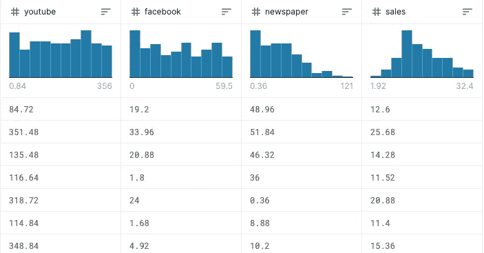
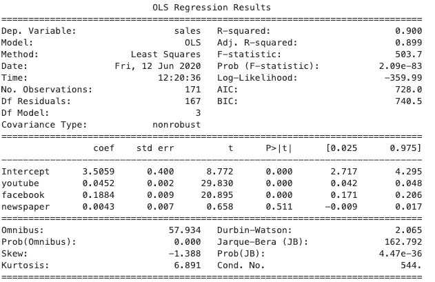
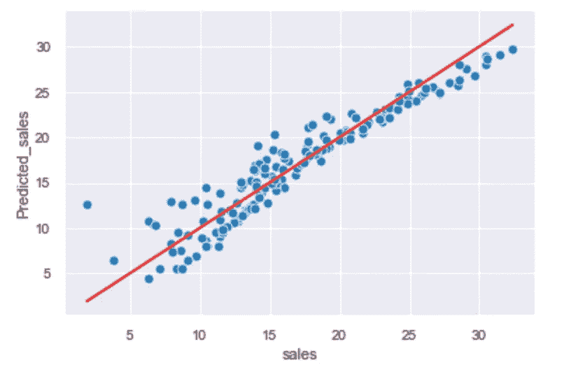
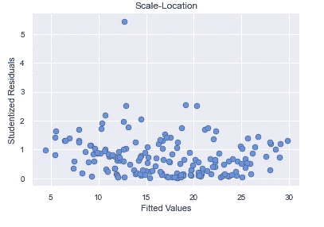
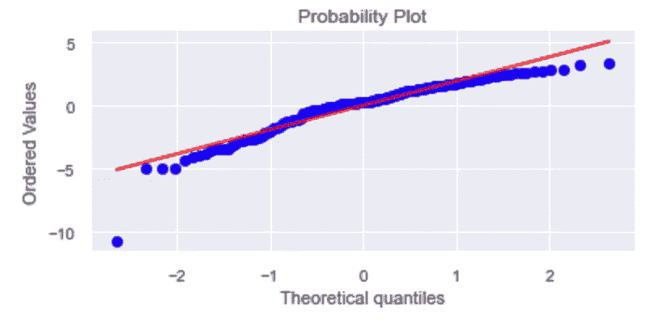
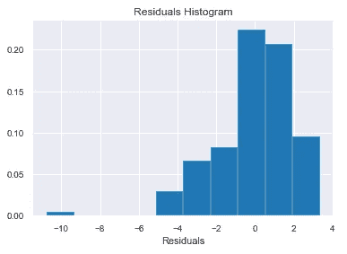
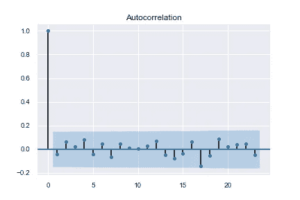
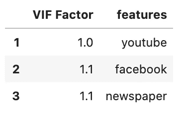
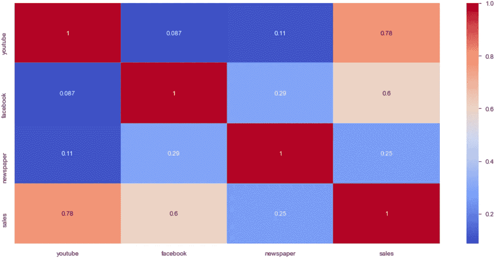
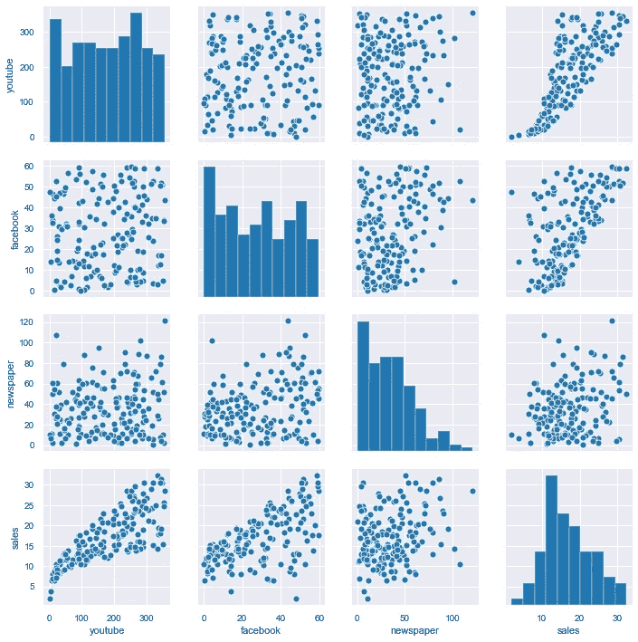

# 如何检查支持线性回归模型的主要假设？

> 原文：<https://towardsdatascience.com/perform-regression-diagnostics-and-tackle-uncertainties-of-linear-models-1372a03b1f56?source=collection_archive---------34----------------------->

## 数据科学

> 大多数认为他们需要高级人工智能/人工智能的公司实际上只需要对清理后的数据进行线性回归

除了这句话的讽刺之外，还有一个事实:在所有的统计技术中，回归分析通常被认为是[商业分析](https://www.techfunnel.com/information-technology/importance-of-regression-analysis-in-business/#:~:text=It%20helps%20businesses%20understand%20the,levels%20and%20supply%20and%20demand.)中最重要的技术之一。大多数公司使用回归分析来解释特定的现象，建立预测或做出预测。这些新的见解对于理解什么可以改变业务非常有价值。

当你作为一名数据科学家工作时，建立一个线性回归模型可能听起来相当枯燥，尤其是当它与你周围的人工智能有关时。但是，我想强调的是，掌握线性回归模型的主要假设比看起来要复杂得多，需要一些扎实的统计学基础。另一件事是，线性回归模型是同一算法家族的一部分，又名[广义线性模型(GLM)。](https://medium.com/@gaoxiangak47/generalized-linear-models-glm-dfadcaddf430) GLM 是数据科学家的一个重要话题，因为它们符合各种各样的现实世界现象。

也许这就是为什么在 2017 年 11 月， [Jame Le](https://www.linkedin.com/in/khanhnamle94/) 将线性回归模型排在科学家需要掌握的统计技术数据的前 [10 位。](https://www.kdnuggets.com/2017/11/10-statistical-techniques-data-scientists-need-master.html)

**既然我们已经清楚为什么要关注线性回归模型，那就让我们开始着手吧。**

您运行了线性回归分析，结果是显著的(或不显著的)。你可能认为你已经完成了。不，还不是我的朋友。

[https://giphy.com/](https://giphy.com/)

运行回归分析后，您应该检查模型对数据的表现是否良好。也许你从回归结果开始，比如斜率、p 值或 R 平方。这些参数可以让您初步了解模型对给定数据的表现。但这并不是全部。

在这篇文章中，我将带你了解如何检查支持线性回归模型的主要假设。

> 但是等等！首先要做的是…

# 四名维和人员

有四个主要假设支持使用线性回归模型进行推断或预测:


第四批维和人员(图片由 [Unsplash](https://unsplash.com?utm_source=medium&utm_medium=referral) 上的 [freestocks](https://unsplash.com/@freestocks?utm_source=medium&utm_medium=referral) 拍摄)

1.  **线性:**听起来很明显！我们的特征和反应之间必须有线性关系。这是我们的估计和预测无偏所必需的。

接下来是关于残差的:

**2。正态性:** 残差必须是正态分布(即*方差趋于 1，均值趋于零*)。这对于一系列的统计检验是必要的，例如 t 检验。由于[中心极限定理](https://sphweb.bumc.bu.edu/otlt/MPH-Modules/BS/BS704_Probability/BS704_Probability12.html#:~:text=of%20Z%20Scores-,Central%20Limit%20Theorem,will%20be%20approximately%20normally%20distributed.)，我们可以在大样本中放宽这个假设。

**3。同方差性:** 是指无论因变量的水平如何，残差都具有恒定的方差。

**4。独立性:**
残差必须完全没有自相关。

# 第五个麻烦制造者


第五个麻烦制造者(照片由 [val Ccrn](https://unsplash.com/@valccrn?utm_source=medium&utm_medium=referral) 在 [Unsplash](https://unsplash.com?utm_source=medium&utm_medium=referral) 上拍摄)

对于多元线性回归，您还需要检查:

**5。多重共线性缺失:** 多重共线性是指当两个(或更多)预测因子提供关于响应变量的相同信息时。这可能是模型的一个问题，因为它会生成:

*   冗余→导致预测系数不可靠(尤其是线性模型)
*   估计器的高方差→倾向于过度拟合，这意味着算法倾向于对训练数据中的随机[噪声](https://en.wikipedia.org/wiki/Noise_(signal_processing))建模，而不是对预期输出建模。
*   一个重要的预测因素可能变得不重要。

# 研究案例:**广告预算和销售预测**

为了说明这篇文章，我们将尝试使用三个预测因素来预测一家公司的销售额:Youtube 广告的预算投入、脸书广告的预算投入和报纸广告的预算投入。所有变量均以千美元表示。使用的数据集可以在 [Kaggle](https://www.kaggle.com/fayejavad/marketing-linear-multiple-regression) 中找到。

## 资料组

```
df.head(7)
```



数据集一瞥(来源:作者)

## Python 库:Statsmodel

对于本文，我选择使用 *StatsModel* 而不是 *Scikit-learn* 。
尽管 *StatsModel* 没有 *Scikit-learn* 提供的各种选项，但它提供了顶级的统计和计量经济学工具，并通过了 Stata 和 r 等其他统计软件的验证。

🚩 ***在这里你可以找到一篇关于这两个库的有趣文章:***

[](https://blog.thedataincubator.com/2017/11/scikit-learn-vs-statsmodels/) [## Scikit-learn vs. StatsModels:哪个，为什么，如何？

### 在数据孵化器，我们为拥有最新的数据科学课程而自豪。我们的大部分…

blog.thedataincubator.com](https://blog.thedataincubator.com/2017/11/scikit-learn-vs-statsmodels/) 

## 输出

我们开始吧！

```
**import statsmodels.formula.api as smf**
reg = smf.ols(‘sales~youtube+facebook+newspaper’,data=df).fit()
print(reg.summary())
```



OLS 摘要(来源:作者)

✅如果我们检查“基础”参数，这里是我们可以看到的:
- R 平方相当高
- Prob (F 统计)非常低
- p 值<阿尔法风险(5%)除了预测因子*报*

**R 平方:**如果你忘了或者不知道，R 平方和调整的 R 平方是经常伴随回归输出的统计数据。他们都应该用从 0 到 1 范围内的值来评估模型性能。

> 通常，您会选择具有较高校正和预测 R 平方值的模型。

现在，我有这个问题要问你:**谁在用 R 平方检验模型的拟合优度？**

[https://giphy.com/](https://giphy.com/)

我愿意。
或者至少，**我做到了。**

直到我看了几篇题目的文章，显示 R 平方确实**而不是**度量拟合优度因为它可以:
-即使模型正确也任意低，
-即使模型错误也危险地接近 1。

我不打算在这篇文章中进一步讨论这怎么可能，但你可以在这里找到一些非常好的信息:

[](https://statisticsbyjim.com/regression/r-squared-too-high/) [## 你的 R 平方可能过高的五个原因——吉姆的统计

### 当你的回归模型有一个高的 R 平方，你认为这是一件好事。你想要一个高 R 平方，对吧…

statisticsbyjim.com](https://statisticsbyjim.com/regression/r-squared-too-high/) [](https://data.library.virginia.edu/is-r-squared-useless/#:~:text=1.,is%20correct%20in%20every%20particular.) [## 弗吉尼亚大学图书馆研究数据服务+科学

### 2015 年 10 月 16 日，星期四，一个不相信的学生在 Reddit 上发帖:“我的统计学教授”开始咆哮……

data.library.virginia.edu](https://data.library.virginia.edu/is-r-squared-useless/#:~:text=1.,is%20correct%20in%20every%20particular.) 

因此，根据上面的 3 个参数，你可以认为你的回归模型可以很好地预测基于广告预算的销售额。然后，您可能希望删除*报纸*预测值，因为它对模型似乎不重要。

> **当然，在这里停止我们的分析是非常错误的。**

首先也是最重要的，你不应该盲目地跟随 R 平方所说的。然后，因为我们不知道这 5 个关键假设是否得到验证。所以我们基本上不知道我们是否在这个模型表现良好的范围内。

是时候让我向你们介绍每一个假设以及如何验证它们了。

# 1.线性

如果您试图用线性模型来拟合非线性或非可加性的数据，您的预测很可能会出现严重错误，尤其是当您的推断超出了样本数据的范围时。例如，为了确认线性，我们可以:

*   **应用哈维-科利尔乘数检验。**

```
**import statsmodels.stats.api as sms**sms.linear_harvey_collier(reg_multi)>> Ttest_1sampResult(statistic=-1.565945529686271, pvalue=0.1192542929871369)
```

✅小 p 值表明 ***存在违反线性度的*** 。
*此处 p 值高于α风险(5%)，意味着线性条件得到验证。*

*   **观察值与预测值的对比**

```
**# Plot Predicted values VS Real values**
df['Predicted_sales'] = reg_multi.predict()
X_plot = [df['sales'].min(), df['sales'].max()]ax = sns.scatterplot(x="sales", y="Predicted_sales", data=df)
ax.set(xlabel='sales', ylabel='Predicted_sales')
plt.plot(X_plot, X_plot, color='r')
plt.show()
```



*看起来数据点沿着对角线分布。意味着线性条件可能被验证。尽管如此，我们可以看到在我们的数据集*中显示潜在异常值的尾部(来源:作者)

✅如果线性条件得到验证，则点应围绕对角线对称分布，方差大致恒定。

*   **学生化残差与拟合值**

[学生化残差](https://online.stat.psu.edu/stat462/node/247/)在检测异常值、检查线性度和评估等方差假设方面比标准化残差更加有效。

```
**# Get the Studentized Residual**
student_residuals = pd.Series(np.abs(reg.get_influence().resid_studentized_internal))**# Plot the Studentized Residual**
fig, ax = plt.subplots()
ax.scatter(fitted, student_residuals, edgecolors = ‘k’)
ax.set_ylabel(‘Studentized Residuals’)
ax.set_xlabel(‘Fitted Values’)
ax.set_title(‘Scale-Location’)plt.show()
```



*看起来残差很小而且没有结构，但是我们可以看到至少一个异常值*(来源:作者)*。*

✅理想情况下，所有残差都应该很小且无结构(即*不形成任何聚类*)。这意味着回归分析已经成功地解释了因变量变化的主要部分。然而，如果残差显示出一种结构或者呈现出任何看起来不是随机的特殊方面，那么它就给回归带来了“不好的影响”。

# **2。**常态

您可以通过验证残差是否正态分布来开始分析残差。严格地说，残差的**非正态性表明模型**不合适。这意味着模型产生的误差在变量和观测值之间是不一致的(即*误差不是随机的*)。

有许多方法来执行这一步，我个人是数据可视化的忠实粉丝，所以我总是从这两个图开始来检查正态性假设:

```
**# Plot residual Q-Q plot****import scipy as sp**
fig, ax = plt.subplots(figsize=(6,2.5))
_, (__, ___, r) = sp.stats.probplot(residuals, plot=ax, fit=True)
```



*良好的拟合表明正态性是一个合理的近似值，即使我们看到了轻微的尾部。由于异常值*，数据尾部可能不是高斯分布的(来源:作者)。

*   **残差分布直方图**

```
**# Get Residuals**
residuals = reg_multi.resid**# Plot Histogram of the residuals** plt.hist(residuals, density=True)
plt.xlabel('Residuals')
plt.title('Residuals Histogram')
plt.show()
```



*在这里我们可以看到，尽管略有偏斜，但并没有严重偏离正态分布。我们可以说这个分布满足正态假设。有时，由于一些大的异常值的存在，误差分布是“扭曲的”*(来源:作者)*。*

✅如果残差呈正态分布，我们应该会看到一个以 0 为中心、方差为 1 的钟形直方图。

**其他参数可用于加深理解:**

*   [**综合**](https://www.accelebrate.com/blog/interpreting-results-from-linear-regression-is-the-data-appropriate) 是对残差的偏度和峰度的检验。高值表示偏态分布，而低值(接近零)表示正态分布
*   **Prob(Omnibus)**执行统计测试，表明残差呈正态分布的概率。我们希望看到接近 1 的东西。

```
Omnibus                         59
Prob(Omnibus):                  0.000
```

*🚩这里，Prob(Omnibus)值= 0，指示残差不是正态分布，并且 Omnibus 是高的，指示已经在直方图上视觉检测到的偏斜度。这些观察结果可能是由于异常值的影响。*

*   **Jarque-Bera 统计量**表示残差是否正态分布。这个检验的零假设是残差是正态分布的。当该测试的 p 值(概率)较低(< 5%)时，残差不是正态分布，表明潜在的模型设定错误(即模型中缺少一个关键变量)。

```
Prob(JB):                     1.47e-38
```

*🚩JB 统计表明残差不是正态分布的。同样，这可能是由于离群值的影响。*

*   **偏斜系数**反映了数据的对称性，可以表示正态性。我们希望看到接近于零的东西，说明残差分布是正态的。[负偏斜](https://www.investopedia.com/terms/s/skewness.asp#:~:text=These%20taperings%20are%20known%20as,be%20greater%20than%20the%20median.)是指分布左侧的尾巴更长或更胖，而正偏斜是指右侧的尾巴更长或更胖。

```
Skew:                          -1.411
```

*🚩我们可以清楚地看到左侧直方图中已经检测到的偏斜度。非常偏斜的分布很可能在偏斜方向上有异常值。*

关于正态性还有各种各样的**统计测试**，包括[科尔莫戈罗夫-斯米尔诺夫](http://en.wikipedia.org/wiki/Kolmogorov%E2%80%93Smirnov_test)测试、[夏皮罗-维尔克](http://en.wikipedia.org/wiki/Shapiro%E2%80%93Wilk_test)测试和[安德森-达林](http://en.wikipedia.org/wiki/Anderson%E2%80%93Darling_test)测试。这些测试都是比较“挑剔”的。真实数据很少有完全正态分布的误差，并且可能无法用误差在 5%显著性水平下不违反正态假设的模型来拟合您的数据。

> 通常更好的做法是更多地关注对其他假设的违反和/或离群值的影响，它们可能是违反正态性的主要原因。

# 3.同方差性

同方差假设是所有预测的因变量得分的残差相等。换句话说，这意味着回归线周围的方差对于预测变量(X)的所有值都是相同的。

> 当因变量的**值似乎作为自变量的函数增加或减少时，违反同异方差假设会导致异方差。**

通常，当一个或多个被调查的变量不是正态分布时，会发生同方差违规。要检查同质性，您可以从以下内容开始:

*   **学生化残差与拟合值**

我们以前已经使用过这个图，在这种情况下，我们希望看到残差对称地分布在一条水平线上。


*在我们的示例中，相应的残差图似乎合理地分布在水平带上。但我们至少可以看到一个离群值*(来源:作者)*。*

*   **布鲁什-帕甘试验**

该测试测量误差如何在[解释变量](https://www.statisticshowto.com/explanatory-variable/)中增加。

```
**import statsmodels.stats.api as sms
from statsmodels.compat import lzip**name = ['Lagrange multiplier statistic', 'p-value',
        'f-value', 'f p-value']test = sms.het_breuschpagan(reg_multi.resid, reg_multi.model.exog)
lzip(name, test)>> [('Lagrange multiplier statistic', 4.231064027368323),
 ('p-value', 0.12056912806125976),
 ('f-value', 2.131148563286781),
 ('f p-value', 0.12189895632865029)]
```

✅如果检验统计量的 p 值*低于α风险(例如 0.05)，则拒绝同向异方差的零假设，并假设异方差。*在我们的例子中，我们验证了同方差假设。**

还有许多其他方法来测试[异方差](https://www.researchgate.net/post/Heteroskedasticity_Which_test_should_you_choose)的条件，在这个长长的列表中，我想提一下[白色测试](https://www.statisticshowto.com/white-test/)，它特别适用于大型数据集。

# 4.独立性ˌ自立性

残差的独立性通常被称为完全没有自相关。即使不相关的数据不一定意味着独立，如果随机变量的[互信息](https://en.wikipedia.org/wiki/Mutual_information)趋向于 0，人们也可以检查随机变量是否独立。

*   这种假设在时间序列模型或[纵向数据集](https://www.investopedia.com/terms/l/longitudinaldata.asp)中尤其危险，因为残差中的序列相关性意味着模型有改进的空间。
*   这个假设在非时间序列模型或[横截面数据集](https://www.investopedia.com/terms/c/cross_sectional_analysis.asp)的情况下也很重要。如果残差在特定条件下总是具有相同的符号，这意味着模型系统地低估/高估了发生的事情。

为了验证该条件，我们可以使用 ACF(自相关函数)图和 Durbin-Watson 测试。

*   **ACF 图**

我们想看看 ACF 的值对任何滞后是否有意义。在我们的例子中，我们使用非时间序列数据，所以我们可以使用行号来代替。在这种情况下，应以(仅)取决于要素值的方式对行进行排序。

```
**import statsmodels.tsa.api as smt**
acf = smt.graphics.plot_acf(reg_multi.resid, alpha=0.05)
```



除了第一行，所有值都在置信区间内。我们没有统计意义上的偏自相关(来源:作者)。

*   **德宾-沃森**

测试将输出 0 到 4 之间的值。下面是如何解读测试结果:
—值= 2 表示样本中不存在自相关，
—值< 2 表示正自相关，
—值> 2 表示负自相关。

```
**import statsmodels.stats.stattools as st**
st.durbin_watson(residuals, axis=0)>> 2.0772952352565546
```

✅ *我们可以合理地考虑残差的独立性。*

# 5.多重共线性

最后但同样重要的是，对于多元线性回归，检查多重共线性是一个好主意。当您的模型包含多个不仅与响应变量相关，而且彼此相关的因素时，就会出现多重共线性。换句话说，当你有一些多余的因素时，它就会产生。

> 你要记住，好的模型是简单的模型。

**你可以想到足球比赛中的多重共线性:**

https://giphy.com/

如果一名球员铲球了对方的四分卫，很容易把功劳归于该得到荣誉的那一袋。但是，如果三名球员同时处理四分卫，就很难确定三人中谁对麻袋做出的贡献最大。

> 多重共线性使得一些本应显著的变量在统计上变得不显著。

您可以使用**方差膨胀因子(VIF)检查两个或多个变量之间是否存在共线性。**它是多元回归中预测变量之间共线性的度量。

> 我们通常认为 VIF 为 5 或 10 及以上(取决于业务问题)表示多重共线性问题。

```
**from statsmodels.stats.outliers_influence import variance_inflation_factor
from statsmodels.tools.tools import add_constant**# For each X, calculate VIF and save in dataframe
df.drop(['sales'],axis=1,inplace=True)
X = add_constant(df)vif = pd.DataFrame()
vif["VIF Factor"] = [variance_inflation_factor(X.values, i) for i in range(X.shape[1])]
vif["features"] = X.columnsvif.round(1) #inspect results
```



每个变量的方差膨胀因子(来源:作者)。

✅ *在这里，我们可以看到我们没有多重共线性问题。*

除此之外，预测值的相关矩阵可能表明多重共线性的存在。如果不总是如此，相关矩阵可以很好地指示多重共线性，并突出进一步调查的需要。

```
plt.subplots(figsize=(15,7))
sns.heatmap(df.corr(), annot = True, cmap='coolwarm')
```



我们可以看到解释变量之间并不相关(来源:作者)。

```
sns.pairplot(data = df)
```



同样，我们也没有发现解释变量之间有任何强有力的联系(来源:作者)。

# 结论

运行线性回归模型并获得一些重要结果后，您应该检查支持模型有效性的假设是否得到验证:

*   X(*解释变量*)和 Y ( *因变量*)之间的关系是线性的。
*   残差呈正态分布。
*   残差具有恒定的方差(即*同方差*
*   残差是独立的。
*   不存在多重共线性。

在本文中，我们使用数据集根据广告预算来预测销售额。我们认为条件已经满足，但是(当然！)模型是可以改进的。

事实上，我们现在可以着手于:
*——评估离群值的影响并去除最大的影响者；
-添加相关解释变量
-转换解释变量(fx。这在我们的例子中是相关的，因为 X 和 Y 之间的关系看起来非常接近多项式回归。*

最后，如果您正面临一个条件未被验证的数据集，您可以在这里找到一些关于如何修复它的好提示:

[](http://people.duke.edu/~rnau/testing.htm) [## 检验线性回归的假设

### 线性回归分析注释(pdf 文件)线性回归分析介绍回归实例啤酒…

people.duke.edu](http://people.duke.edu/~rnau/testing.htm) 

*感谢阅读！如果你喜欢这篇文章，一定要按住按钮鼓掌支持我的写作。也可以关注我在* [*Linkedin*](https://www.linkedin.com/in/aureliegiraud9000/) *上的工作。*

[](https://agiraud.medium.com/membership) [## 通过我的推荐链接加入 Medium-aurélie Giraud

### 不要错过我的下一篇文章，阅读 Medium 上成千上万的其他作者的文章！我写的是如何使用数据科学…

agiraud.medium.com](https://agiraud.medium.com/membership)