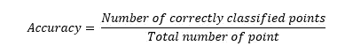
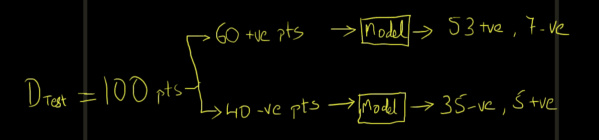
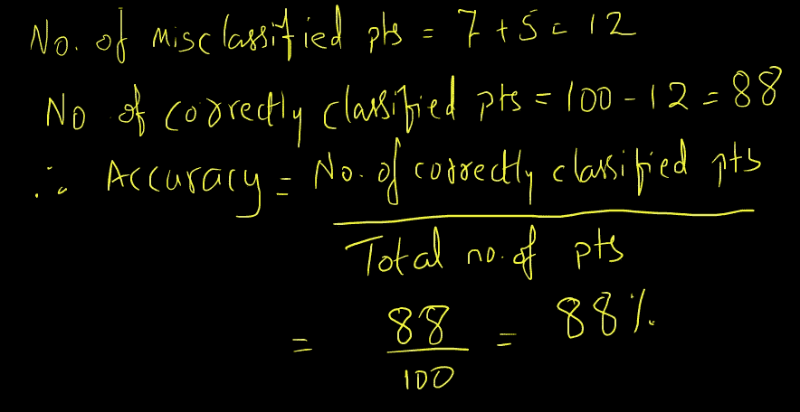
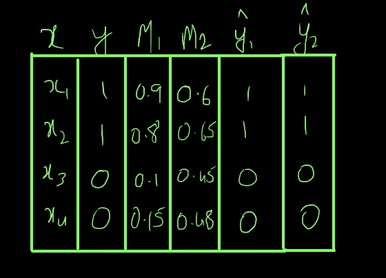

# 模型的性能测量

> 原文：<https://towardsdatascience.com/performance-measures-of-models-51aee741a36f?source=collection_archive---------23----------------------->

学校和大学定期进行测试。这背后的基本思想是衡量学生的表现。要明白哪个是自己的强项，哪里需要再努力。以类似的方式，我们也测试我们的机器学习模型来衡量他们的表现，并基于这种表现，我们试图了解模型做得对的地方以及它需要更加努力的地方(基本上我们需要更加努力)

在机器学习领域，除了建立模型，衡量模型的性能同样重要。基本上，我们检查我们的模型做出的预测有多好。

在这一系列文章中，我们将试图理解模型的各种性能度量是什么。

## 准确(性)

这可能是最简单的性能指标。它被定义为:

作者图片

精确度值介于 0 和 1 之间。如果该值接近 0，则认为性能差，而如果该值接近 1，则认为性能好。这是最简单和容易理解的度量之一。

让我们用一个例子来理解这个指标:

假设我们已经使用训练数据训练了我们的模型。现在，我们想使用测试数据并检查预测的准确性。假设我们的测试数据集中有一个 100 个数据点的分类问题。目标是分类该点是正的还是负的。假设满分 100 分，我们有 60 个正分，40 个负分(注意这是原始/实际的班级标签)。现在，当我们将这个测试数据输入到我们的模型中时，假设我们得到下面的输出:

作者图片

因此，根据上面的例子，我们的模型将 7 个点误分类为负面，将 5 个点误分类为正面。所以总体误分类点= 7+5 = 12。

因此，模型的精度可以计算为:

作者图片

现在我们已经了解了如何计算精度，让我们了解一些与之相关的问题。

## 不平衡数据集

假设我们有一个返回负类作为输出的模型。现在，假设我们有一个不平衡的数据集，也是我的测试数据集，假设总测试数据集的 90%是负的。现在，当我们将这个测试数据输入到我们的模型中时，我们将获得 90%的正确分类，因为我的模型返回负的类标签，而我的测试数据集的 90%是负的。在这种情况下，即使是哑模型也能给我 90%的准确率。所以当你有一个不平衡的数据集时，远离准确性。

## 准确性不考虑概率分数

考虑下面的例子来理解这一点:

作者图片

x ➜数据点

y ➜实际类别标签

模型 M1 的 M1➜概率得分

M2 模型 M2 的➜概率得分

Y1 ➜预测模型 M1 的类别标签

Y2 ➜预测模型 M2 的类别标签

让我们假设我们通过两个模型 M1 和 M2 运行我们的数据，这些模型返回概率得分。所以给定一个数据点，我们得到概率 P(y=1)。

M1 可以被解读为当通过模型 M1 运行时，y1=1 的 x1 的概率得分是 0.9。类似地，具有 y3=1 的 x3 的概率得分是 0.1，这意味着当运行模型 M1 时，y3=1 的概率非常小(意味着 P(y3=0) = 0.9)。

考虑 x1。对于 x1，实际的类标签是 1。我们的模型 M1 给出了 P(y=1) = 0.9 的概率分数，并且被预测为属于类标签 1。另一方面，在模型中，M2 给出了概率分数 P(y=1) = 0.6，因此它也被分类为类标签 1。但如果我们考虑概率得分，很明显我的模特 M1 比我的模特 M2 表现得更好。类似地，对于 x2、x3 和 x4，模型 M1 的概率得分比模型 M2 好得多。但是，它们的预测类标签在两个模型中保持不变。准确性作为一种衡量标准并不能区分哪个模型更好，因为它不使用概率得分。它只能使用预测的类别标签，由于它使用预测的类别标签来计算精度，它会说模型 M1 和 M2 具有相同的精度，但从概率得分来看，很明显 M1 比 M2 好。

## 混淆矩阵

为了理解混淆矩阵，让我们进行一个二进制分类任务，目标是将类别标签分类为 0(负)或 1(正)。让我们构建同样的混淆矩阵。

TN ➜真阴性
FN ➜假阴性
FP ➜假阳性
TP ➜真阳性
N ➜总阴性点数
P ➜总阳性点数

让我们来理解上述每个术语:

*   **真负**当实际值为 0 且模型预测值也为 0 时的➔
*   **假阴性** ➔当实际值为 1 而模型预测值为 0 时
*   **实际值为 1 且模型预测值也为 1 时的真正** ➔
*   **实际值为 0 而模型预测值为 1 时的误报** ➔

现在我们已经了解了如何构建混淆矩阵及其基本术语，让我们了解一些与之相关的关键指标。

真阳性率(TPR) = #的 TP /总的 P

真实负比率(TNR) = #总人数/总人数

假阳性率(FPR)= FP 的数量/N 的总数

假阴性率(FNR) = # of FN / Total # of P

Precision = TP / (TP + FP)
这意味着，在模型预测为正的所有点中，有多少%实际上是正的。准确地说，我们并不担心负类。我们唯一关注的是正面的阶级标签。

Recall = TPR = TP / Total # of P
这意味着，在“实际上”属于类标签 1 的所有点中，有多少个模型被预测为类标签 1。

对于一个好的模型，我们总是希望精确度和召回率的值很高。

f1-得分:
它是指标精度和召回率的组合，给出如下:

## 结论

到目前为止，我们已经介绍了准确性和混淆矩阵，并且了解了混淆矩阵下的各种术语。在本系列的第二部分，我们将了解 ROC 和 AUC、对数损失、测定系数和误差的中值绝对偏差。

直到那时，快乐学习！

# 迪帕克·贾恩

*   *如果你喜欢这个，* [*跟着我*](https://deepak-jain.medium.com/) *上媒求更*
*   *我们来连线上* [*LinkedIn*](https://www.linkedin.com/in/deepakjain20/)