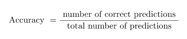

# 绩效指标:准确性

> 原文：<https://towardsdatascience.com/performance-metrics-accuracy-118f728d328f?source=collection_archive---------36----------------------->

## 你的机器学习模型有多好？

图片由 Pexels 的 Engin Akyurt 提供

机器学习模型是使用训练数据(具有输入和输出)构建的。使用相同的模型对测试数据(没有输出标签的看不见的数据)进行预测。**但是你如何判断这个模型的有效性呢？**必须有一些措施来评估模型的性能。

评价模型性能的性能指标有很多，如准确率、精确度、召回率、F1 值、ROC 曲线等。每一种都有其优点和缺点。在本文中，我们将讨论**准确性性能指标**。它只与分类任务相关。

有人可能想知道什么是分类？

当机器学习模型将数据分类成类(输出属于一个有限集)时，该任务被称为分类。分类任务的示例有:欺诈交易的识别、患者任何疾病的检测等。

性能度量总是在测试数据集上评估模型的性能。在本文中，我们将使用二进制分类(这里只有两个类),因为它很容易理解。

# 准确(性)

它是正确分类的点(预测)与预测总数的比率。其值介于 0 和 1 之间。

**例子**

实际值和预测值

上面例子中的精度是多少？

因为 4 个预测中有 2 个是正确的，所以准确度=2/4 = 0.5 或 50%。**我们是否可以得出这样的结论:如果模型的精度是好的，那么模型就是充分的？**

图片由 Pexels 的 cottonbro 提供

准确性性能指标中存在一些漏洞:

1.  不平衡数据
2.  当模型给出概率分数时

## 1.不平衡数据

上面讨论的例子是两个类具有相等比例的数据点。这种类型的数据集称为平衡数据集，其中两个类的数据点大致相等。

如果我们有一个不平衡的数据集(其中一个类的点数远远大于另一个类)，该怎么办？不平衡的数据集在现实世界的例子中非常常见。罕见疾病的数据集与阴性人群相比，阳性人群非常少。

**示例**

患者总数为 100 人，其中 95 人呈阳性(这是一个不平衡的数据集)。假设机器学习模型是哑的，它只给出正输出。

现在，精确度是多少？

该模型将正确分类 100 分中的 95 分。我们将获得 95%的准确率。

图片由来自 Pexels 的 Andrea Piacquadio 提供

**别太激动**；记住，模型是愚蠢的。

**在处理不平衡的数据时，准确性可能会产生误导。**因此，最好不要使用带有不平衡数据的准确性性能指标。

## 2.当模型给出概率分数时

假设我们有三个模型 A，B，C，用于二进制分类，所有这三个模型都以概率得分的形式给出输出。在本例中，我们将阈值设为 0.5，即如果概率> 0.5，则预测值为 1，否则为 0。

具有概率得分和基于阈值 0.5 的预测的 a、B 和 C 模型

基于阈值，所有三个模型都给出了 100%的准确性。**但是你能根据预测的准确性推断出哪个模型是最好的吗？**

**否**

因此，当模型给出概率作为输出时，精确度不足以比较模型。

## 结论

在本文中，我们已经看到了分类任务中准确性性能度量的使用。当处理不平衡数据时，以及当模型给出概率得分时，准确性度量是不合适的。这些准确性问题可以通过其他性能指标来解决，如混淆矩阵、精确度、召回率和 F1 分数，这些将在下一篇文章中讨论。

感谢阅读！