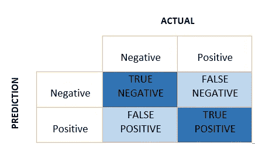

# 性能指标:混淆矩阵、精确度、召回率和 F1 分数

> 原文：<https://towardsdatascience.com/performance-metrics-confusion-matrix-precision-recall-and-f1-score-a8fe076a2262?source=collection_archive---------1----------------------->

## 解开困惑矩阵背后的困惑

图片由乔恩·泰森拍摄，来自 Unsplash

在处理不平衡数据时，准确性性能指标可能是决定性的。在这篇博客中，我们将学习混淆矩阵及其相关术语，这些术语看起来令人困惑，但却很琐碎。与准确性相比，混淆矩阵、精确度、回忆和 F1 分数给出了更好的预测结果的直觉。为了理解这些概念，我们将把本文仅限于二进制分类。

## 什么是混淆矩阵？

它是一个大小为 2×2 的矩阵，用于二进制分类，实际值在一个轴上，而预测值在另一个轴上。

混淆矩阵

让我们来理解混淆矩阵中容易混淆的术语:**真阳性、真阴性、假阴性、假阳性**并举例说明。

**举例**

训练机器学习模型来预测患者中的肿瘤。测试数据集由 100 人组成。

用于肿瘤检测的混淆矩阵

**真正** **(TP)** —模型正确预测正类(预测和实际均为正)。在上面的例子中， **10 个患有肿瘤的人**被模型预测为阳性。
**【真负(TN)】**—模型正确预测负类(预测和实际均为负)。在上面的例子中， **60 个没有肿瘤的人**被模型预测为阴性。
**假阳性(FP)** —模型给出了阴性类别的错误预测(预测阳性，实际阴性)。在上面的例子中， **22 个人**被预测为患有肿瘤的阳性，尽管他们没有肿瘤。FP 也被称为**类型 I** 错误。
**【假阴性(FN)** —模型错误预测阳性类别(预测-阴性，实际-阳性)。在上面的例子中，8 个患有肿瘤的人被预测为阴性。FN 也被称为**类型 II** 错误。

借助这四个值，我们可以计算真阳性率(TPR)、假阴性率(FPR)、真阴性率(TNR)和假阴性率(FNR)。

即使数据不平衡，我们也能判断出我们的模型是否运行良好。为此，**TPR 和 TNR 的值应该高，FPR 和 FNR 的值应该尽可能低。**

在 TP、TN、FN 和 FP 的帮助下，可以计算其他性能指标。

## 精确度，回忆

精确度和召回率对于信息检索都是至关重要的，其中正面类别比负面类别更重要。**为什么？**

当在网络上搜索某些东西时，模型不关心与**无关的**和**未被检索到的**(这是真正的否定情况)。因此，只有 TP、FP、FN 用于精度和召回。

**精度**

在所有积极的预测中，真正积极的占百分之几。

精度值介于 0 和 1 之间。

**回忆**

在全部阳性中，有多少百分比被预测为阳性。与 TPR(真阳性率)相同。

**精确和召回有什么用？**我们通过例子来看。

**示例 1-信用卡欺诈检测**

用于信用卡欺诈检测的混淆矩阵

我们不想**错过任何欺诈交易**。因此，我们希望假阴性尽可能低。在这些情况下，我们可以向低精度妥协，但召回率应该很高。同样，在医疗应用中，我们也不想漏掉任何一个患者。因此，我们注重高召回率。

到目前为止，我们已经讨论了什么时候召回比精确更重要。**但是，什么时候精度比回忆更重要？**

**示例 2 —垃圾邮件检测**

垃圾邮件检测的混淆矩阵

在垃圾邮件的检测中，如果有任何垃圾邮件未被检测到(假阴性)，这是可以的，但是如果我们错过了任何重要的邮件，因为它被归类为垃圾邮件(假阳性)，那该怎么办呢？在这种情况下，**假阳性**应该尽可能的低。在这里，精确比回忆更重要。

当比较不同的模型时，将很难决定哪个更好(高精度和低召回或反之亦然)。因此，应该有一个将这两者结合起来的指标。一个这样的指标是 F1 分数。

## F1 分数

这是精确和回忆的调和平均值。它同时考虑了假阳性和假阴性。因此，它在不平衡数据集上表现良好。

F1 分数给予回忆和精确相同的权重。

有一个**加权 F1 分数**，其中我们可以给召回率和精确度不同的权重。正如上一节所讨论的，不同的问题给召回率和精确度不同的权重。

**Beta 代表多少次回忆比精度更重要**。如果召回的重要性是精确的两倍，那么 Beta 的值就是 2。

## 结论

与准确性性能指标相比，混淆矩阵、精确度、召回率和 F1 分数为预测提供了更好的见解。精确度、召回率和 F1 分数的应用是在信息检索、分词、命名实体识别和许多其他方面。