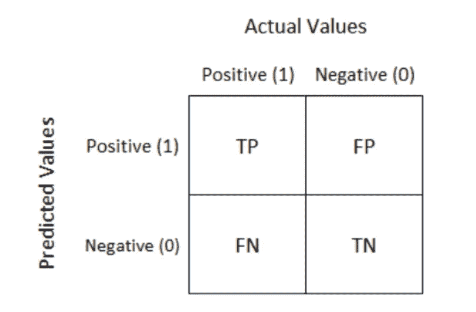
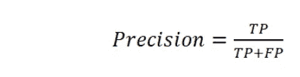
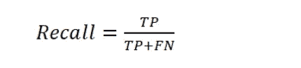
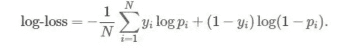
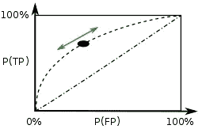

# 分类机器学习问题的性能度量

> 原文：<https://towardsdatascience.com/performance-metrics-for-classification-machine-learning-problems-97e7e774a007?source=collection_archive---------7----------------------->


有大量的性能指标，并且每一个指标都有变化(图片由 [Unsplash](https://unsplash.com?utm_source=medium&utm_medium=referral) 上的 [Cesar Carlevarino Aragon](https://unsplash.com/@carlevarino?utm_source=medium&utm_medium=referral) 拍摄)

## 准确度、精确度、召回率、F1 分数、ROC AUC、对数损失

已经提出了许多学习算法。评估算法的有效性通常是有价值的。在许多情况下，这种评估是相对的，即评估几个备选算法中的哪一个最适合特定的应用。

人们甚至最终会创建适合应用程序的指标。在本文中，我们将看到问题分类设置中一些最常见的指标。

分类问题最常用的性能度量如下:

*   准确(性)
*   混淆矩阵
*   精确度、召回率和 F1 分数
*   ROC AUC
*   原木损失

# 准确(性)

准确度是正确分类的点数与总点数之间的简单比率。

为了计算精度，scikit-learn 提供了一个实用函数。

```
**from** **sklearn.metrics** **import** accuracy_score#predicted y values
y_pred = [0, 2, 1, 3]#actual y values
y_true = [0, 1, 2, 3]accuracy_score(y_true, y_pred)
0.5
```

精确度计算起来很简单，但有其自身的缺点。

## 准确性的限制

*   如果数据集是高度不平衡的，并且模型将所有的数据点分类为多数类数据点，则准确率会很高。这使得准确性对于不平衡数据来说不是一个可靠的性能指标。
*   根据精确度，可以推导出模型预测的概率。所以从精度上，我们无法衡量模型的预测有多好。

# 混淆矩阵

混淆矩阵是特定表格布局中预测结果的总结，其允许对二分类问题(2 类)或多分类问题(多于 2 类)的机器学习模型的性能测量进行可视化



二元分类的混淆矩阵

*   TP 表示**真正**。它可以被解释为模型预测的正类并且是真实的。
*   FP 表示**假阳性**。它可以被解释为模型预测的正类，但它是假的。
*   FN 表示**假阴性**。它可以被解释为模型预测的负类，但它是假的。
*   TN 表示**真负**。它可以被解释为模型预测的负类并且它是真实的。

> 对于一个合理的模型，主对角线元素值将是高的，而非对角线元素值将是低的，即 TP，TN 将是高的。

为了在现实世界的问题中找到一个合适的例子，考虑一个诊断测试，它试图确定一个人是否患有某种疾病。在这种情况下，当这个人测试呈阳性，但实际上并没有患病时，就会出现假阳性。另一方面，当一个人测试结果为阴性时，就会出现假阴性，表明当他们实际上患有疾病时，他们是健康的。

对于具有“c”类标签的多类分类问题，混淆矩阵将是(c*c)矩阵。

为了计算混淆矩阵，sklearn 提供了一个效用函数

```
**from** **sklearn.metrics** **import** confusion_matrix
y_true = [2, 0, 2, 2, 0, 1]
y_pred = [0, 0, 2, 2, 0, 2]
confusion_matrix(y_true, y_pred)
array([[2, 0, 0],
       [0, 0, 1],
       [1, 0, 2]])
```

## 混淆矩阵的优点:

*   混淆矩阵提供了分类的详细结果。
*   混淆矩阵的导数被广泛使用。
*   使用热图可以增强对结果的直观检查。

# 精确度、召回率和 F-1 分数

**精度**是正确分类的实例占总分类实例的比例。**召回**是正确分类的实例占总分类实例的比例。精度和召回率给出如下:



利用混淆矩阵计算查准率和查全率的数学公式

例如，考虑一个搜索查询产生 30 个页面，其中 20 个是相关的。并且结果未能显示 40 个其他相关结果。所以精度是 20/30，召回率是 20/60。

> 精确度有助于我们理解结果有多有用。回忆帮助我们理解结果有多完整。

但是为了减少两次口袋检查，使用 F1 分数。F1 分数是精确度和召回率的调和平均值。它被给定为，


## 何时使用 F1 分数？

*   F-score 通常用于信息检索领域，用于测量搜索、文档分类和查询分类性能。
*   F-score 在自然语言处理文献中得到了广泛的应用，如命名实体识别和分词的评价。

# 原木损失

对数损失(或对数损失)衡量分类模型的性能，其中预测是介于 0 和 1 之间的概率值。随着预测概率偏离实际标签，测井曲线损失增加。日志损失是一个广泛用于 Kaggle 比赛的指标。



这里‘N’是数据集中数据点的总数，yi 是 y 的实际值，pi 是 y 属于正类的概率。

> 对数损失值越低，模型的预测就越好。

为了计算日志损失，scikit-learn 提供了一个实用函数。

```
**from** **sklearn.metrics** **import** log_losslog_loss(y_true, y_pred)
```

# ROC AUC

**通过在各种阈值设置下绘制真阳性(TP)对假阳性(FP)来创建接收器工作特性曲线**或 **ROC 曲线**。ROC 曲线通过绘制 y 轴上真阳性的[累积分布函数](https://medium.com/towards-artificial-intelligence/pdf-cdf-in-machine-learning-5a10f7abeef6)与 x 轴上假阳性的累积分布函数来生成。



虚曲线是 ROC 曲线

ROC 曲线下的面积(ROC AUC)是用于评估性能的单值度量。

> AUC 越高，模型区分类别的性能越好。

一般来说，0.5 的 AUC 表明没有歧视，0.5-0.7 之间的值是可以接受的，任何高于 0.7 的值都是可以使用的模型。然而，医学诊断模型，通常 AUC 为 0.95 或更高被认为是良好的模型。

## 什么时候用 ROC？

*   ROC 曲线被广泛用于比较和评估不同的分类算法。
*   当数据集不平衡时，ROC 曲线被广泛使用。
*   ROC 曲线也用于验证气象学中的预测

谢谢你的阅读。以后我会写更多初学者友好的帖子。请在[媒体](https://medium.com/@ramyavidiyala)上关注我，以便了解他们。我欢迎反馈，可以通过 Twitter [ramya_vidiyala](https://twitter.com/ramya_vidiyala) 和 LinkedIn [RamyaVidiyala](https://www.linkedin.com/in/ramya-vidiyala-308ba6139/) 联系我。快乐学习！