# 性能指标:受试者操作特征(ROC)-曲线下面积(AUC)

> 原文：<https://towardsdatascience.com/performance-metrics-receiver-operating-characteristic-roc-area-under-curve-auc-79d6d5b0b977?source=collection_archive---------36----------------------->

## 通过示例了解 ROC-AUC 性能指标

图片来自 Unsplash 的 Issac Smith

## 受试者工作特征曲线

接收器工作特性(ROC)曲线明确用于二元分类。但是，它可以扩展为多类分类。

在二元分类中，当一个模型给出概率得分作为输出时，我们用 0.5 作为最简单模型的阈值。如果查询点的概率大于 0.5，则模型会将其分类为第 1 类(即肯定的)，否则为第 0 类(否定的)。为了衡量模型的性能，我们可以使用准确度、混淆矩阵、精确度、召回率和 F1 分数。

**这里出现的一个问题是，使用 0.5 作为阈值会给每个模型带来显著的结果吗？**

**否**

选择产生显著结果的阈值取决于具体问题。例如，在癌症检测问题中，如果我们保持低阈值，模型将会预测更多的人为阳性。此外，如果我们设置一个高得令人难以置信的阈值，就有可能遗漏实际患者。

**我们应该如何决定合适的阈值？**

**ROC** 是一种可以给出最佳阈值的技术。

让我们举一个微不足道的例子

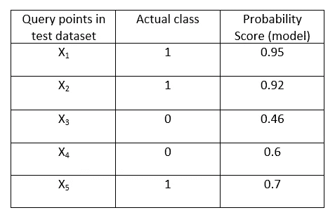

## 步伐

1.  将唯一概率分数(按降序)作为阈值，并预测类别标签。如果我们有 k 个唯一的概率得分，就会有 k 个阈值。
2.  对于每个阈值，我们测量所有查询点的类别标签。

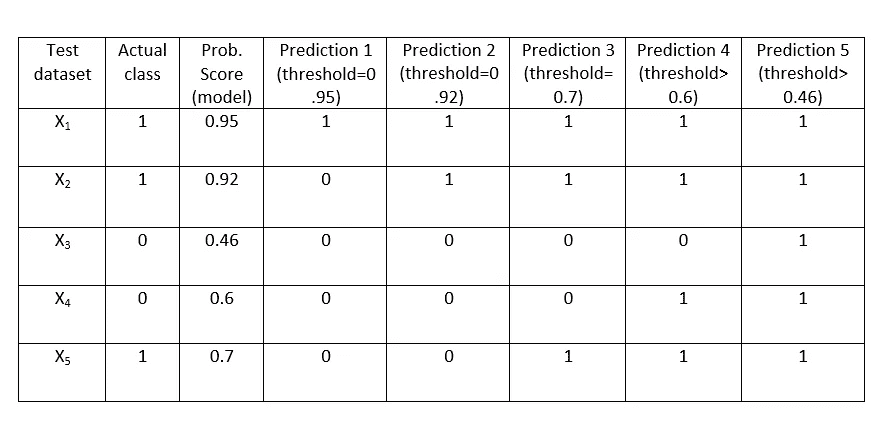

对于每个预测，我们计算真阳性率(TPR)和假阳性率(FPR)。
我们来看混淆矩阵。

混淆矩阵

真阳性率衡量实际阳性总数中的真阳性(真阳性(TP) +假阴性(FN))。

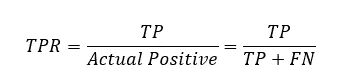

假阴性率衡量实际阴性总数中的假阳性(真阴性(TN) +假阳性(FP))。

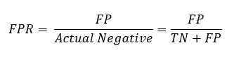

如果我们有 k 个唯一的概率得分，我们将有 k 个不同的预测。因此，我们将有 k 对(TPR，FPR)。
在上面的例子中，我们有 5 个预测，所以会有 5 个 TPR，FPR 对。

**预测 1(阈值= 0.95)**

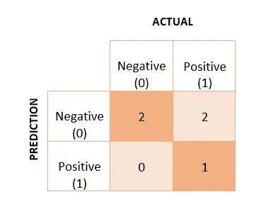

预测 1 的混淆矩阵(阈值= 0.95)

TP R1 = 1/(1+2)= 1/3
FP R1 = 0/2 = 0

**预测 2(阈值=0.92)**

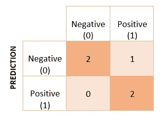

预测 2 的混淆矩阵(阈值= 0.92)

TPR 2 = 2/(2+1)= 2/3
FPR 2 = 0/2 = 0

**预测 3(阈值= 0.7)**

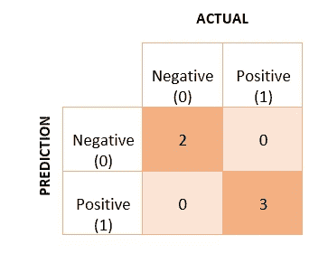

预测 3 的混淆矩阵(阈值= 0.7)

TPR3 = 3/3 = 1
FPR3 = 0/2 = 0

**预测 4(阈值= 0.6)**

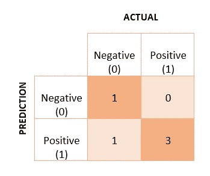

预测 4 的混淆矩阵(阈值= 0.6)

TP R4 = 3/3 = 1
FP R4 = 1/(1+1)= 1/2

**预测 5(阈值= 0.46)**

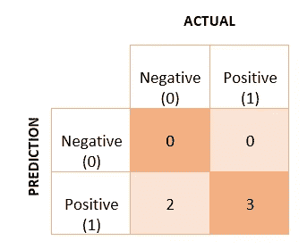

预测 5 的混淆矩阵(阈值= 0.46)

TPR5 = 3/3 = 1
FPR5 = 2/2 = 1

3.绘制 FPR 对 TPR 曲线，y 轴为 TPR，x 轴为 FPR。

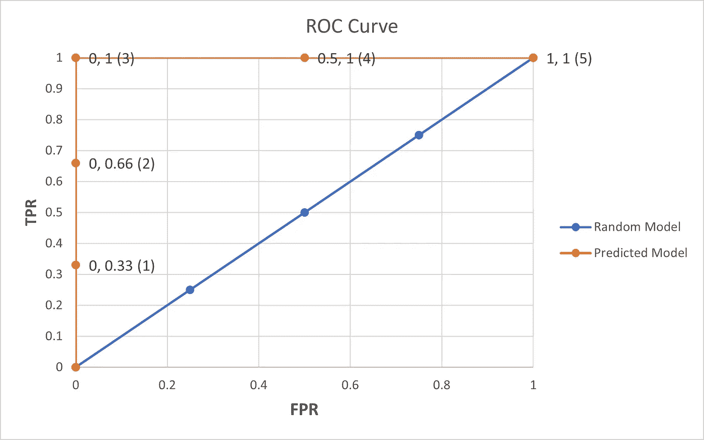

具有 5 个(FPR，TPR)对的 ROC 曲线。括号中的数字表示预测数。

蓝线显示了随机模型，这意味着模型给出了随机输出(无法对查询点进行分类)。**适当的阈值将是 TPR 最大的点** **和 FPR 最小的点**，因为我们希望真阳性和真阴性多于假阳性和假阴性。

对于我们的示例，最佳阈值将是**预测 3，**，即 **0.70** 。

## 罗马纪元

TPR-FPR 曲线下的面积将给出模型有效性的概念。AUC 分数越高，模型越好。 **AUC 分数用于比较不同的模型**。

AUC 的最大值可以是 1。**为什么？**

因为 TPR 和 FPR 的最大值分别是 1。所以，最大面积是 1。

分类器正确地预测了这两个类别。在上面的例子中，我们有一个完美的分类器，因为橙色曲线下的面积是 1。

如果 **AUC =0.5** 我们可以推断出什么？

这意味着分类器不能将两个类分开。该模型给出随机输出。

从 **AUC < 0.5** 可以推断出什么？

这意味着模型预测了相反的值，即实际的阳性标签被预测为阴性，反之亦然。

下图显示了两个模型。**我们如何决定哪一个更好？**

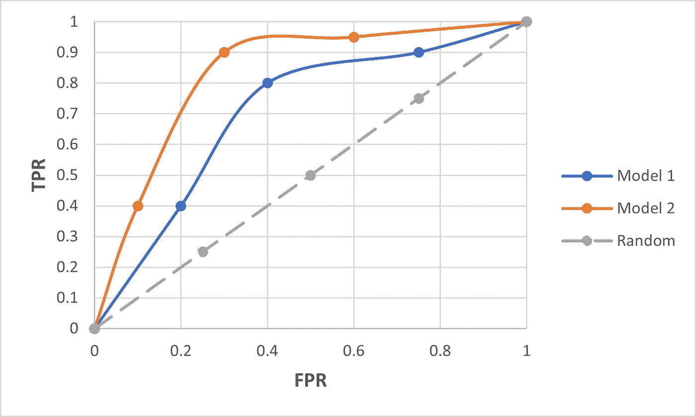

两个模型的 ROC 曲线

模型 2 的曲线下面积(AUC)大于模型 1。因此，**模型 2 是比模型 1** 更好的分类器。

AUC 分数的一个**限制**是它们对不平衡的数据**敏感。**如果模型是哑的，AUC 分数可以很高。

# 结论

**接收器工作特性(ROC)** 曲线用于确定模型的适当阈值，其给出概率得分作为二进制分类的输出。**曲线下面积(AUC)** 分数用于比较不同模型。但是，它们会受到不平衡数据集的影响。

感谢阅读！