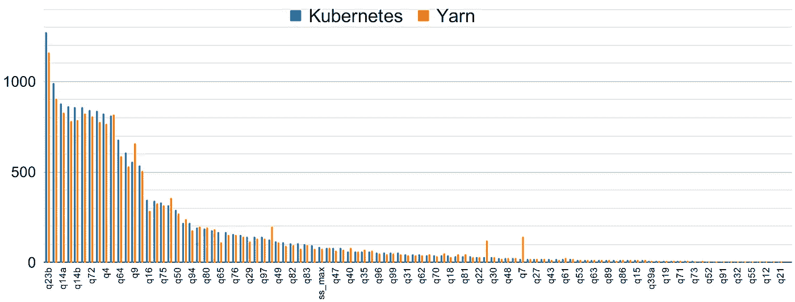

# Apache Spark 在 Kubernetes 上的表现已经赶上了 YARN

> 原文：<https://towardsdatascience.com/performance-of-apache-spark-on-kubernetes-has-caught-up-with-yarn-73730878a792?source=collection_archive---------15----------------------->

## 了解我们的基准设置、结果和关键技巧，以便在 Kubernetes 上运行时将洗牌速度提高 10 倍！



Apache Spark 是一个开源的分布式计算框架，但是它并不管理运行它的机器集群。为此，您需要一个[集群管理器](http://spark.apache.org/docs/latest/cluster-overview.html#cluster-manager-types)(也称为*调度器*)。最常用的是 [Apache Hadoop YARN](https://hadoop.apache.org/docs/current/hadoop-yarn/hadoop-yarn-site/YARN.html) 。在 2.3 版本中增加了对在 Kubernetes 上运行 Spark 的支持，此后 Spark-on-k8s 的采用一直在加速。

如果你对 Spark-on-Kubernetes 的核心概念、与 Yarn 的区别以及优缺点感到好奇，请阅读我们之前的文章:[在 Kubernetes 上运行 Spark 的利弊](https://www.datamechanics.co/blog-post/pros-and-cons-of-running-apache-spark-on-kubernetes)。要深入了解，您还可以观看我们在 Spark Summit 2020 上的会议:[在 Kubernetes 上运行 Apache Spark:最佳实践和陷阱](https://databricks.com/session_na20/running-apache-spark-on-kubernetes-best-practices-and-pitfalls)。

在本文中，我们展示了在 Kubernetes 和 Yarn 上部署 Spark 的性能比较基准。**我们的结果表明 Kubernetes 已经赶上了 Yarn——两者之间不再有显著的性能差异**。特别是，我们将比较 YARN 和 Kubernetes 之间的 shuffle 性能，并为您提供在 Kubernetes 上运行 Spark 时提高 shuffle 性能的关键技巧。

# 基准协议

## TPC-DS 基准测试

我们使用著名的 [TPC-DS](http://www.tpc.org/tpcds/) 基准来比较 Yarn 和 Kubernetes，因为这是 [Apache Spark](https://www.datamechanics.co/apache-spark) 和一般分布式计算的最标准基准之一。TPC-DS 基准由两部分组成:数据和查询。

*   这些数据是合成的，可以在不同的尺度上生成。它是倾斜的——意味着一些分区比其他分区大得多——以便代表真实世界的情况(例如:7 月的销售额比 1 月多得多)。对于这个基准测试，我们使用一个 **1TB** 数据集。
*   大约有 100 个 SQL 查询，旨在涵盖一般零售公司的大多数用例(TPC-DS 表是关于商店、销售、目录等)。因此，查询有不同的资源需求:一些查询有很高的 CPU 负载，而另一些查询是 IO 密集型的。

## 我们优化是为了什么？

分布式计算框架的性能是多维的:应该考虑成本和持续时间。例如，一个持续 10 小时、花费 10 美元的查询和一个 1 小时、花费 200 美元的查询，哪一个最好？这个要看你公司的需求。

在这个基准测试中，我们给 Yarn 和 Kubernetes 分配了固定数量的资源。因此，查询的成本与其持续时间成正比。这允许我们在一个维度上比较两个调度器:持续时间。

## 设置

该基准测试比较了 Spark 运行[数据机制](https://www.datamechanics.co/blog-post/video-tour-of-data-mechanics-the-serverless-spark-platform)(部署在[谷歌 Kubernetes 引擎](https://cloud.google.com/kubernetes-engine))和 Spark 运行在 [Dataproc](https://cloud.google.com/dataproc) (GCP 的托管 Hadoop 产品)。

驱动程序:N2-标准-4 实例

*   4 个虚拟 CPU
*   16GB 内存

n2-highmem-4 实例上的 5 个执行器

*   4 个虚拟 CPU
*   32GB 内存
*   375GB 本地固态硬盘

我们将每个查询运行 5 次，并报告平均持续时间。

我们在这个基准测试中使用了最近发布的 Spark 3.0 版本。与 Spark 2.4 相比，它带来了显著的性能提升，我们将在以后的博客文章中展示这些。

# Kubernetes 上的火花赶上了纱线

下图显示了 Kubernetes 和 Yarn 的所有 TPC-DS 查询的性能。总体而言，它们表现出非常相似的性能。对于几乎所有的查询，Kubernetes 和 YARN 查询都在对方的+/- 10%范围内完成。从视觉上看，纱线似乎以微弱优势占据上风。


比较 Kubernetes 上的火花与纱线上的火花的性能，逐个查询。

汇总结果证实了这一趋势。使用两个调度程序运行基准测试的总持续时间非常接近，YARN 的优势为 4.5%。


当对所有查询的持续时间求和时，Kubernetes 和 YARN 也得到类似的结果，YARN 稍有优势(平均快 4.5%)。

由于每个查询我们只运行了 5 次，这 5%的差异在统计上并不显著。一般来说，与您可以获得的其他收益相比，5%的差异是很小的，例如，通过做出智能基础架构选择(实例类型、集群大小、磁盘选择)，通过优化 Spark 配置(分区数量、内存管理、随机调优)，或者通过从 Spark 2.4 升级到 Spark 3.0！

因此，Kubernetes 在性能方面已经赶上了 YARN 这对 Kubernetes 上的 Spark 来说是一件大事！这意味着，如果您需要在下一个项目的两个调度器之间做出决定，您应该关注性能以外的其他标准(阅读[在 Kubernetes 上运行 Apache Spark 的利弊](https://www.datamechanics.co/blog-post/pros-and-cons-of-running-apache-spark-on-kubernetes)以了解我们的看法)。

在下一节中，我们将重点介绍 shuffle 的性能，这是一个可怕的全对全数据交换阶段，通常会占用 Spark 作业的大部分。我们将看到，对于 shuffle 来说，Kubernetes 也赶上了 YARN。更重要的是，我们会给你一些关键的配置技巧，让 shuffle 在 Kubernetes 上的 Spark 中表现出色。

# 如何在 Kubernetes 上用 Spark 优化 shuffle

TPC-DS 基准测试的大多数长查询都是无序的。下图显示了 Kubernetes 上 TPC-DS 查询的持续时间，它是混洗数据量的函数。当混洗数据量很大时(向右)，混洗成为查询持续时间的主要因素。在这个区域中，洗牌和性能之间有明显的相关性。


每个 TPC-DS 查询的持续时间是被混洗的数据量的函数，两者都是对数标度。无序播放量和查询持续时间之间的关系是显而易见的(“性能墙”)。

为了减少混洗时间，调整基础设施是关键，以便尽可能快地交换数据。混洗性能取决于机器对机器数据交换的网络吞吐量，以及磁盘 I/O 速度，因为混洗数据块被写入磁盘(映射端)并从磁盘中取出(缩减端)。

更复杂的是，云提供商的大多数实例类型都使用远程磁盘(AWS 上的 EBS 和 GCP 上的持久磁盘)。这些磁盘与实例不在同一位置，因此对它们的任何 I/O 操作都将计入实例网络限制上限，并且通常会更慢。


这和 Spark shuffle 没关系。

当你的 Spark 应用程序遭遇长时间随机播放时，这里有一些简单但重要的建议:

*   **尽可能使用本地固态硬盘**。在 GCP 上添加本地磁盘是一个简单的切换功能。在 AWS 上，将实例类型从 r5.2xlarge 更改为 r5d.2xlarge。这些磁盘的较高成本通常在很大程度上通过整体性能的提高得到补偿。
*   如果本地磁盘不可用，**增加磁盘的大小**，因为磁盘延迟和吞吐量几乎与磁盘大小成正比。

在下图中，我们展示了错误选择磁盘的影响。我们使用标准持久磁盘(GCP 的标准非 SSD 远程存储)来运行 TPC-DS。它显示了当磁盘大小从 500GB 减少到 100GB 时，不同查询的持续时间增加了。对于混乱的查询，持续时间要长 4 到 6 倍！


该图显示了两种设置下的标准化 TPC-DS 查询持续时间，一种是 500GB，另一种是 100GB 持久(远程)磁盘。我们可以看到，对于大量混排的查询，性能提高了 4-6 倍。

# 如何在 Kubernetes 上的 Spark 中挂载本地磁盘

正如我们所展示的，本地 SSD 性能最好，但是在 Kubernetes 上运行 Spark 时，这里有一个小配置问题。

简单地定义一个本地磁盘并将其附加到您的 Kubernetes 是不够的:它们将被挂载，但默认情况下，Spark 不会使用它们。在 Kubernetes 上，需要一个 hostPath 来允许 Spark 使用挂载的磁盘。

下面是一个配置示例，在 [Spark 操作符](https://github.com/GoogleCloudPlatform/spark-on-k8s-operator) YAML 清单风格中:

```
executor:
  ...
  volumeMounts:
    - mountPath: /tmp/spark-local-dir-1/
      name: spark-local-dir-1
volumes:
  - name: spark-local-dir-1
    hostPath:
      path: /mnt/disks/ssd0/  # GCP specific
  ...
sparkConf:
  ...
  spark.local.dir: /tmp/spark-local-dir-1/
...
```

# 结论

⚠️免责声明: [Data Mechanics](https://www.datamechanics.co/blog-post/video-tour-of-data-mechanics-the-serverless-spark-platform) 是一个无服务器的 Spark 平台，自动调整基础设施和 Spark 配置，使 Spark 尽可能简单和高效。在幕后，它部署在我们客户的云帐户中的 Kubernetes 集群上。

所以我们偏向于 Kubernetes 上的 Spark——事实上我们确信 Kubernetes 是 [Apache Spark](https://www.datamechanics.co/apache-spark) 的未来！在本文中，我们用一个标准基准测试证明了 Kubernetes 的性能已经赶上了 Apache Hadoop YARN 的性能。我们还与您分享了我们认为最重要的 I/O 和 shuffle 优化，以便您可以重现我们的结果，并在 Kubernetes 上成功使用 Spark。

如何更进一步:

*   2021 年 3 月: [Apache Spark 3.1 发布版现在宣布 Spark-on-Kubernetes 正式上市，并准备好投入生产！](https://datamechanics.co/blog-post/apache-spark-3-1-release-spark-on-kubernetes-is-now-ga)
*   2021 年 4 月:[使用我们优化的 Docker 映像，通过 Kubernetes 上的 Spark 获得最佳 I/O 性能](https://www.datamechanics.co/blog-post/optimized-spark-docker-images-now-available)
*   2021 年 4 月:检查我们的[开源监控工具 Delight](https://www.datamechanics.co/blog-post/delight-the-new-improved-spark-ui-spark-history-server-is-now-ga) 来解决 Spark 的性能问题(在 Kubernetes 上，或者在任何 Spark 平台上)