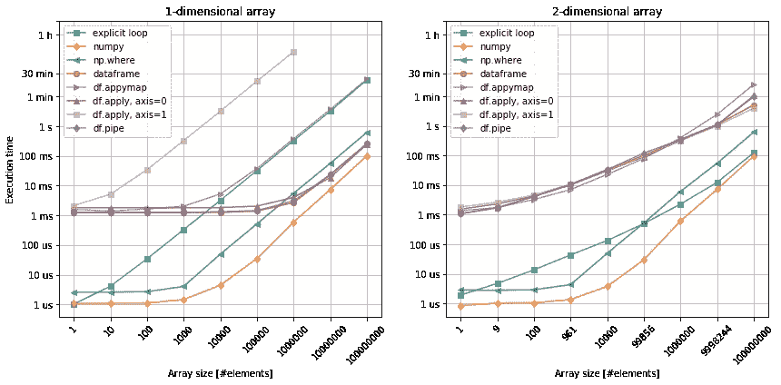
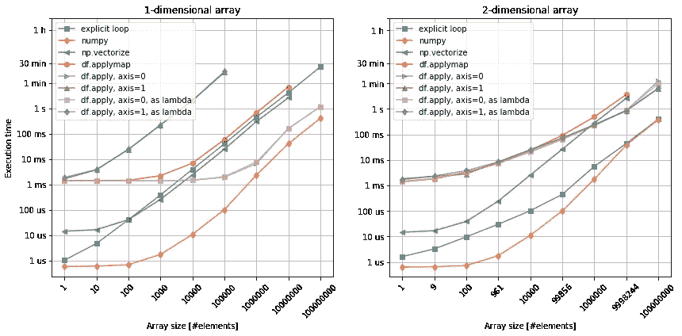
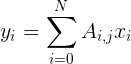
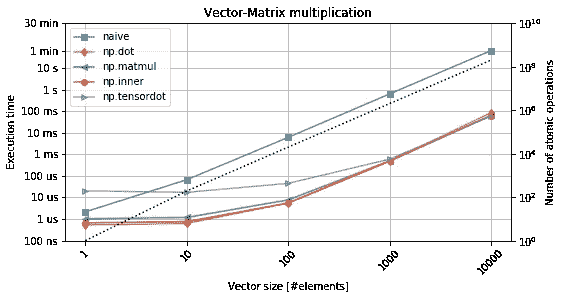

# 熊猫和熊猫的性能比较

> 原文：<https://towardsdatascience.com/performance-of-numpy-and-pandas-comparison-7b3e0bea69bb?source=collection_archive---------30----------------------->

## 用 python 实现算法时的常见错误及 pandas 和 numpy 中常用方法的效率分析。

# 介绍

没有 **numpy** 和 **pandas** ，Python 中似乎就没有数据科学。(这也是 Python 在数据科学领域如此受欢迎的原因之一)。然而，将库转储到数据上很难保证性能。那到底怎么了？

让我们从根本问题开始。在设计算法时，许多涉及计算的任务可以归纳为以下几类:

*   给定条件下数据子集的选择，
*   对每个数据/表格条目应用数据转换函数，
*   向量矩阵乘法(也称为典型的线性代数)。

在本帖中，我们将尝试对这三种最常见的操作进行更多的阐述，并尝试理解发生了什么。对于所有的性能评估，我们使用了:

*   Python 版本 3.6.7，
*   Numpy 1.16.4 和熊猫 0.24.2，
*   Ubuntu 16.04，
*   电脑:英特尔酷睿 i5–7200 u CPU @ 2.50 GHz，
*   IPython 和`%timeit`命令。

# 性能测试

## 案例 1:数据子集的选择

对于第一种情况，我们从均匀随机生成的数据中选择一个正值子集。此外，我们以 *numpy* 数组和 *pandas* 数据帧的形式组织数据，作为大小为`1 x N`的一维对象或大小为`sqrt(N) x sqrt(N)`的二维数组，其中`N`是元素的数量。对于每个`N`，我们测试以下操作:

```
if DIM == 1:
    npx = np.random.randn(N)
else:
    N = int(N**0.5)
    npx = np.random.randn(N, N)
dfx = pd.DataFrame(npx)# explicit loop (DIM == 1)
%timeit [x > 0 for x in npx]
# explicit loop (DIM == 2)                
%timeit [x > 0 for x in [y for y in npx]]   

%timeit npx > 0                             # numpy
%timeit np.where(npx > 0, True, False)      # np.where
%timeit dfx > 0                             # dataframe
%timeit dfx.applymap(lambda x: x > 0)       # applymap
%timeit dfx.apply(lambda x: x > 0, axis=0)  # apply, axis=0
%timeit dfx.apply(lambda x: x > 0, axis=1)  # apply, axis=1
%timeit dfx.pipe(lambda x: x > 0)           # pipe
```



图一。选择数据子集。左图:一维数组。右图:二维数组。

首先，`numpy`无论如何是最快的。原因是它是 C 编译的，并且存储相同类型的数字(参见[这里的](https://en.wikipedia.org/wiki/Locality_of_reference))，与显式循环相反，它不对指向对象的指针进行操作。`np.where`函数是在 numpy 数组上实现元素条件的常用方法。它经常派上用场，但是它的性能代价很小，这与函数调用的开销有关。

当谈到 pandas dataframes 时，它们的主要优势是能够存储不同类型的关联数据，这改进了数据分析过程和代码可读性。同时，这种灵活性也是 dataframes 在性能方面的主要缺点。查看图 1，我们可以看到，无论数组大小如何，调用计算都需要付出 1 毫秒的初始代价。然后，剩下的就只看数组大小和…它的元素排列了！

`x > 0`是一个非常简单的条件，可以应用于任何数值数据。因为我们所有的日期元素都是数字，所以可以在所有行(`df.apply(..., axis=0)`、列(`df.apply(..., axis=1)`)、元素方式(`df.applymap`)或整个数据帧(`df.pipe`)上应用它，因此它给了我们一个很好的测试方法。比较一维数组和二维数组，我们可以立即发现`apply`方法中`axis`参数的重要性。虽然我们的数据可能不总是允许我们在这些方法之间进行选择，但是我们应该尝试沿着最短的轴(在这个例子中是列)对*进行矢量化。如果列数和行数相当，那么`df.applymap`或`df.pipe`是更好的选择。*

最后但同样重要的是，可以注意到阵列的形状也会影响缩放比例。除了 numpy(在初始常数之后)，数据帧上的执行时间不是线性的。尽管如此，与 numpy 和 pandas 方法相关的执行时间之间可能的交叉似乎发生在至少有`1e15`个元素的区域，这就是云计算的用武之地。

## 案例 2:对数据应用原子函数

现在，让我们看看应用一个简单的原子计算需要什么:对每个数求平方根。为了避免陷入复数，让我们只使用正数。此外，我们引入了`vsqrt`——`sqrt`函数的矢量化版本(但不等同于`np.sqrt`),以便考虑将外来函数引入 numpy 的情况。最后，我们来看看直接通过`.apply`调用`sqrt`，还是通过一个`lambda`调用`sqrt`的区别。

我们测试以下功能:

```
if DIM == 1:
    npx = np.random.random((N, 1))
else:
    N = int(N**0.5)
    npx = np.random.random((N, N))
dfx = pd.DataFrame(npx)

def sqrt(x):
    return x**0.5

vsqrt = np.vectorize(sqrt)
# explicit loop (DIM == 1)
%timeit [sqrt(x) for x in npx]
# explicit loop (DIM == 2)                  
%timeit [sqrt(x) for x in [y for y in npx]]

%timeit sqrt(npx)                               # numpy
%timeit vsqrt(npx)                              # np.vectorize
%timeit dfx.applymap(sqrt(x))                   # df.applymap
%timeit dfx.apply(sqrt, axis=0)                 # df.apply, axis=0
%timeit dfx.apply(sqrt, axis=1)                 # df.apply, axis=1
%timeit dfx.apply(lambda x: sqrt(x), axis=0)    # df.apply, axis=0, as lambda
%timeit dfx.apply(lambda x: sqrt(x), axis=1)    # df.apply, axis=1, as lambda
```



图二。对数据应用函数。左图:一维数组。右图:二维数组。

同样，基本 numpy 击败了所有其他方法。与前一种情况相比，我们还可以看到 pandas dataframe 对象的类似行为。

然而，有趣的是，与显式循环相比，平方根函数的矢量化形式似乎表现不佳。虽然对于 1 维阵列几乎相同，但对于 2 维情况，它的性能远不如 loop，甚至不如 pandas。如果原始函数相对更复杂，包含多个循环和条件，也许它确实有意义？无论如何，构造可以直接应用于 numpy 数组的函数似乎更有效。

最后，图 2。显示了使用`lambda`或直接调用`df.apply`方法之间没有实际区别。匿名函数确实提供了更多的灵活性(当`x`变成行或列时)，但是这里没有损失。

## 案例 3:向量矩阵乘法

最后，本文的最后一个案例涉及到最常见的数字运算之一:计算向量和矩阵之间的点积。数学上，这个操作可以定义为`y = A x`，其中`y`的每个元素都是通过取



`M`次，对于`N x M`数组，产生`NM`乘法和`N(M — 1)`加法。

暂时把熊猫放在一边，numpy 已经提供了一堆功能可以做同样的事情。

*   [np.dot](https://docs.scipy.org/doc/numpy/reference/generated/numpy.dot.html) —两个数组的类属点积，
*   [np.matmul](https://docs.scipy.org/doc/numpy/reference/generated/numpy.dot.html) —将所有数组的元素视为矩阵，
*   [np.inner](https://docs.scipy.org/doc/numpy/reference/generated/numpy.dot.html) —替代`np.dot`，但灵活性降低，
*   [np.tensordot](https://docs.scipy.org/doc/numpy/reference/generated/numpy.tensordot.html) —最一般的(一般化到张量)点积。

为简单起见，我们使用一个方阵，并计算以下维度的乘积`(N x M) x (N x 1)`，产生`N(2N — 1)`运算。

```
A = np.random.randn(N, N)
X = np.random.randn(N)

def naive(A, X):
    Y = np.zeros(A.shape[1])
    for i in range(A.shape[0]):
        for j in range(A.shape[1]):
            Y[j] += A[i, j]*X[i]
    return Y

%timeit naive(A, X)
%timeit np.dot(A, X)
%timeit np.matmul(A, X)
%timeit np.inner(A, X)
%timeit np.tensordot(A, X, axes=1)
```



图 3。向量矩阵乘法。黑色虚线表示操作次数。

从图 3 中可以明显看出，定制的基于循环的实现甚至要差三个数量级。同时，上面列出的点积的不同变体之间没有真正的区别。最初的平坦特征可以用与函数调用本身相关联的惩罚来解释。函数越复杂(如`np.tensordot`)，它就变得越高。然而，一旦数字相对较大，执行时间就由实际计算时间决定，而实际计算时间对于初始函数来说是不可知的。

# 结论

研究了这三个案例后，以下建议是有意义的:

*   数学永远用 numpy，避免“幼稚计算”。
*   如果存在 numpy 本地方法，最好使用它们。
*   如果没有，至少尝试将数据封装在 numpy 数组中。
*   如果使用熊猫数据帧，使用`apply`、`applymap`和`pipe`。
*   但是，请记住，数据帧的形状会强烈影响特别是`apply`方法的性能。

那么…你的代码还是运行缓慢吗？再找找看！也许现在还不是从 python 转向 C 的时候？也许还有一两种方法可以让整个事情慢下来，或者你甚至已经进行了计算[切腹自杀](https://en.wikipedia.org/wiki/Seppuku)？

# 还会有更多…

我计划把文章带到下一个层次，并提供简短的视频教程。

如果您想获得关于视频和未来文章的更新，**订阅我的** [**简讯**](https://landing.mailerlite.com/webforms/landing/j5y2q1) **。你也可以通过填写[表格](https://forms.gle/bNpf9aqZJGLgaU589)让我知道你的期望。回头见！**

*原载于*[*https://zerowithdot.com*](https://zerowithdot.com/python-numpy-and-pandas-performance/)*。*