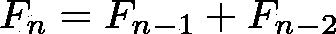

# R 中的性能优化:并行计算和 Rcpp

> 原文：<https://towardsdatascience.com/performance-optimization-in-r-parallel-computing-and-rcpp-6b541cd5ccf6?source=collection_archive---------70----------------------->

## R 中性能优化的快速介绍:并行和 Rcpp 包。


图片由 [alan9187](https://pixabay.com/users/alan9187-2347/?utm_source=link-attribution&utm_medium=referral&utm_campaign=image&utm_content=534120) 来自 [Pixabay](https://pixabay.com/?utm_source=link-attribution&utm_medium=referral&utm_campaign=image&utm_content=534120)

## “平行”包装

通过使用并行计算，R 中的许多计算可以变得更快。一般来说，并行计算是在多个计算处理器或核心上同时执行较大计算的不同部分。

`parallel`包可用于将任务(编码为函数调用)并行发送到机器上的每个处理核心。

`mclapply()`函数本质上是将对`lapply()`的调用并行化。`mclapply()`的前两个参数与`lapply()`的参数完全相同。然而，`mclapply()`有更多的参数(必须命名)，其中最重要的是`mc.cores`参数，您可以使用它来指定您想要将计算划分到多少个处理器/内核上。例如，如果您的机器上有 4 个内核，您可以指定`mc.cores = 4`来中断您的跨 4 个内核的并行化操作(尽管如果您正在后台运行除 R 之外的其他操作，这可能不是最好的主意)。

你可能想用`parallel`包检查的第一件事是你的计算机实际上是否有你可以利用的多个内核。

```
require(parallel)

cores <- detectCores()
cores## [1] 8
```

`mclapply()`函数(以及相关的`mc*`函数)通过 Unix 风格的操作系统上的 fork 机制工作。由于使用了 fork 机制，Windows 操作系统的用户通常无法使用`mc*`功能。

```
mclapply(1:7, FUN = function(x) return(x), mc.cores = cores-1)## Error in mclapply(1:7, FUN = function(x) return(x), mc.cores = cores - : 'mc.cores' > 1 is not supported on Windows
```

在您的计算机上使用分叉机制是执行并行计算的一种方式，但它不是并行包提供的唯一方式。另一种使用计算机上的多核构建“集群”的方法是通过*插槽*。

用 R 中的`makeCluster()`函数构建一个套接字集群很简单。

```
cl <- makeCluster(cores-1)
```

`cl`对象是整个集群的抽象，我们将使用它向各种集群函数表明我们想要进行并行计算。

为了在套接字集群上执行`lapply()`操作，我们可以使用`parLapply()`函数。

```
# sample function
test <- function(){
  Sys.sleep(2)
  return(TRUE)
}

# call "test" in parallel apply
parLapply(cl = cl, 1:7, fun = function(x) {
  test()
})## Error in checkForRemoteErrors(val): 7 nodes produced errors; first error: could not find function "test"
```

不幸的是，您会注意到在运行这段代码时有一个错误。原因是，虽然我们已经将硫酸盐数据加载到 R 会话中，但是这些数据对于由`makeCluster()`函数生成的独立子进程是不可用的。数据，以及子进程执行代码所需的任何其他信息，需要通过`clusterExport()`函数从父进程导出到子进程。需要导出数据是“多核”方法和“套接字”方法之间行为的一个关键区别。

```
# export "test" to the cluster nodes
clusterExport(cl, "test")

# call "test" in parallel apply
parLapply(cl = cl, 1:7, fun = function(x) {
  test()
})## [[1]]
## [1] TRUE
## 
## [[2]]
## [1] TRUE
## 
## [[3]]
## [1] TRUE
## 
## [[4]]
## [1] TRUE
## 
## [[5]]
## [1] TRUE
## 
## [[6]]
## [1] TRUE
## 
## [[7]]
## [1] TRUE
```

需要多长时间？

```
# parallel
t0 <- proc.time()
xx <- parLapply(cl = cl, 1:7, fun = function(x) {
  test()
})
t1 <- proc.time()
t1-t0##    user  system elapsed 
##    0.03    0.00    2.05# serial
t0 <- proc.time()
xx <- lapply(1:7, FUN = function(x) {
  test()
})
t1 <- proc.time()
t1-t0##    user  system elapsed 
##    0.02    0.00   14.14
```

`clusterEvalQ()`计算每个集群节点上的文字表达式。它可以用于将包加载到每个节点中。

```
# load the zoo package in each node
clusterEvalQ(cl = cl, require(zoo))## [[1]]
## [1] TRUE
## 
## [[2]]
## [1] TRUE
## 
## [[3]]
## [1] TRUE
## 
## [[4]]
## [1] TRUE
## 
## [[5]]
## [1] TRUE
## 
## [[6]]
## [1] TRUE
## 
## [[7]]
## [1] TRUE# call zoo functions in parallel apply 
parLapply(cl = cl, 1:7, fun = function(x) {
  is.zoo(zoo())
})## [[1]]
## [1] TRUE
## 
## [[2]]
## [1] TRUE
## 
## [[3]]
## [1] TRUE
## 
## [[4]]
## [1] TRUE
## 
## [[5]]
## [1] TRUE
## 
## [[6]]
## [1] TRUE
## 
## [[7]]
## [1] TRUE
```

一旦您完成了集群的工作，最好清理并停止集群子进程(退出 R 也会停止所有子进程)。

```
stopCluster(cl)
```

## “Rcpp”包

`Rcpp`包提供了 C++类，使用 R 提供的`.Call()`接口极大地方便了 R 包中 C 或 C++代码的接口。它在 R 之上提供了一个强大的 API，允许 R 和 C++之间直接交换丰富的 R 对象(包括 S3、S4 或引用类对象)。

将 C++代码保存在自己的源文件中有几个好处(推荐)。然而，也可以进行 C++代码的内联声明和执行，这将在下面的示例中使用。

让我们用 R 和 C++实现斐波那契数列:



与 *F₀=1* 和 *F₁=1* 。

```
fibR <- function(n){
  if(n==0) return(0)
  if(n==1) return(1)
  return(fibR(n-1) + fibR(n-2))
}Rcpp::cppFunction("
int fibC(const int n){
  if(n==0) return(0);
  if(n==1) return(1);
  return(fibC(n-1) + fibC(n-2));
}")
```

比较性能:

```
require(microbenchmark)
microbenchmark(fibR(20), fibC(20))## Unit: microseconds
##      expr     min       lq      mean   median       uq     max neval
##  fibR(20) 11354.8 13077.50 16629.646 14720.85 18781.75 33800.5   100
##  fibC(20)    35.6    39.05    68.486    51.10    57.10  1224.5   100
```

## 参考

[1][https://book down . org/rd Peng/rprogdatascience/parallel-computation . html](https://bookdown.org/rdpeng/rprogdatascience/parallel-computation.html)

[2][http://heather.cs.ucdavis.edu/~matloff/158/RcppTutorial.pdf](http://heather.cs.ucdavis.edu/~matloff/158/RcppTutorial.pdf)