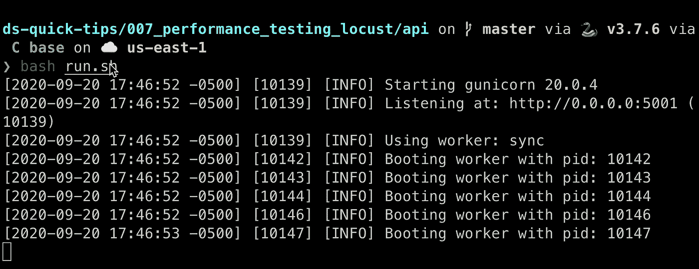
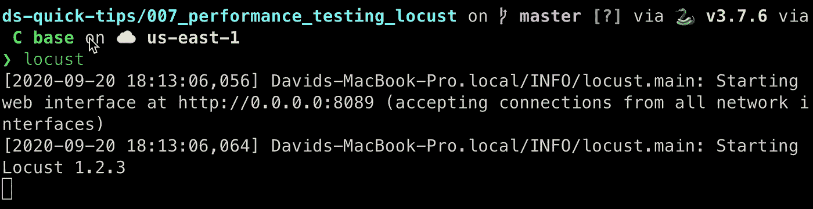
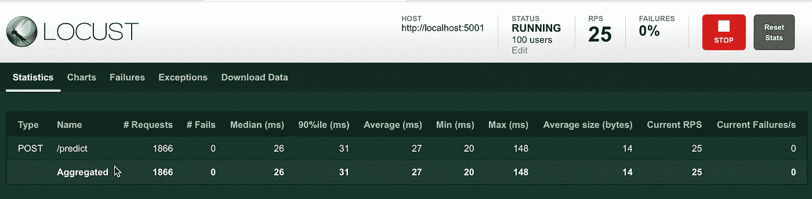
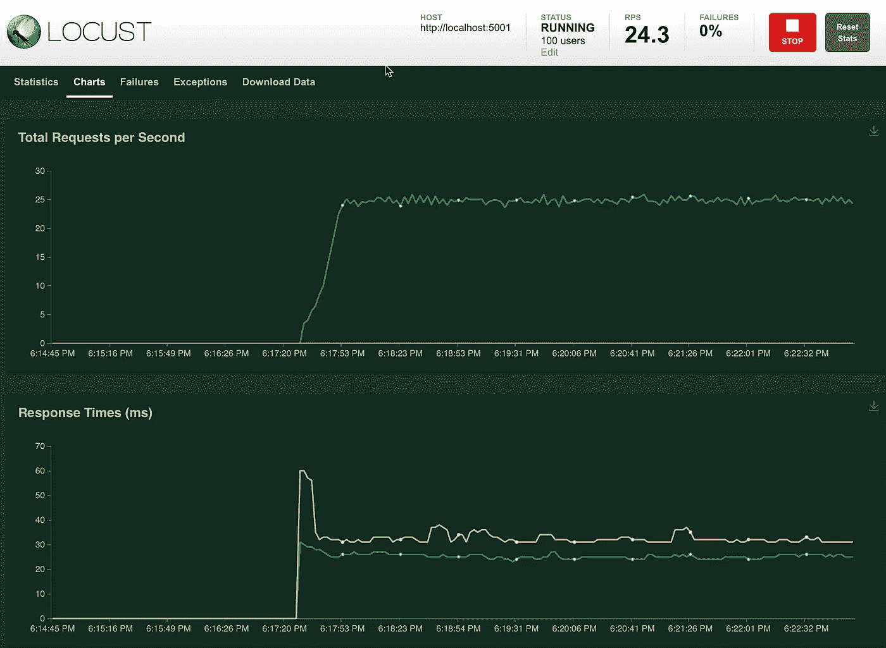

# 用 Locust 对 ML 服务 API 进行性能测试！

> 原文：<https://towardsdatascience.com/performance-testing-an-ml-serving-api-with-locust-ecd98ab9b7f7?source=collection_archive---------15----------------------->


## 确保您的 ML-serving API 在生产中使用时能够处理适当的预期性能负载

朋友们，又见面了！欢迎回到另一个数据科学快速技巧。现在，当谈到数据科学的整个领域(从发现到生产)时，这篇文章肯定会落在这个领域的末端。事实上，一些公司可能认为这是机器学习工程师的工作，而不是数据科学家的工作。作为一名机器学习工程师，我可以证明我的情况确实如此。

尽管如此，我相信有许多数据科学家负责部署他们自己的机器学习模型，这篇文章有望为如何使用这个名为 Locust 的简洁工具进行简单的性能测试提供一些启示。

在我们开始性能测试之前，让我们花一点时间讨论一下 API 本身。使用我们在以前的一篇文章中创建的虚拟模型，我们将使用 Flask 和 Gunicorn 来服务 API 端点后面的模型。用户将向端点发布适当的 JSON 数据，并从机器学习模型接收回预期的预测。现在，这篇文章不是关于创建一个 ML-serving API，所以我很快为我们的目的创建了一个。为了使用它，您需要做的就是[从 GitHub](https://github.com/dkhundley/ds-quick-tips/tree/master/007_performance_testing_locust) 下载我的代码，导航到“api”文件夹，并在您的终端中运行以下命令:

```
bash run.sh
```

这将做的是在本地主机:5001 的一个 Gunicorn 服务器后面运行您的 API。如果你看到这个屏幕，你就在正确的轨道上。



在终端中保持该标签打开，并打开一个新标签。只是为了验证 API 是否真的在工作，我创建了一个单独的小测试，它将通过 API 快速运行 2 次观察。在同一个代码库中，导航到“test_data”目录并运行以下命令:

```
bash tests.sh
```

如果 API 正常工作，您应该会看到下面的屏幕:


好了，我们准备进入这篇文章的核心部分:性能测试！当机器学习模型在生产环境中的 API 上下文中使用时，确保它能够处理适当的请求负载是非常重要的。如果你有太多的用户或太多的请求，你可能会遇到一些大问题。你不想成为导致产量下降的人吧！

幸运的是，人们制作了这个叫做 Locust(或 Locust.io)的工具来帮助解决这个问题。起初，代码可能看起来很奇怪，但是我们将在这里简单地解释一下，这样您就可以很快开始运行了。

首先，你可能需要第一次在你的机器上安装 Locust。简单到可以做！只需运行以下 pip 命令从 PyPi 下载 Locust:

```
pip install locust
```

好了，现在我们准备好构建我们的 Locustfile 了！Locustfile 是一个简单的 Python 脚本，我们将调用它来启动 Locust，它的用户界面非常方便。默认情况下，Locust 命令行工具会查找一个名为“locustfile.py”的文件，但是您可以随意命名它(只要您用-f 标志指定它)。为了简单起见，我们将我们的文件命名为默认的 locustfile.py，这是我们要放入的所有内容。

```
from locust import HttpUser, task, between
import json# Loading the test JSON data
with open('test_data/test_1.json') as f:
    test_data = json.loads(f.read())# Creating an API User class inheriting from Locust's HttpUser class
class APIUser(HttpUser):
    # Setting the host name and wait_time
    host = '[http://localhost:5001'](http://localhost:5001')
    wait_time = between(3, 5) # Defining the post task using the JSON test data
    [@task](http://twitter.com/task)()
    def predict_endpoint(self):
        self.client.post('/predict', json = test_data)
```

这是一个非常小的脚本，但它将为我们做一些强大的事情！现在，您第一次看到这个语法时，可能会有点奇怪，所以让我们一点一点地分解它，以便您理解这里发生了什么。从这第一点开始…

```
from locust import HttpUser, task, between
import json# Loading the test JSON data
with open('test_data/test_1.json') as f:
    test_data = json.loads(f.read())
```

我们只是从 Locust 和 JSON 中导入我们需要的东西，并加载我已经提供的测试 JSON 数据。到目前为止，这可能不是你不熟悉的。但是事情开始变得有点棘手了。我们会慢慢来。

```
# Creating an API User class inheriting from Locust's HttpUser class
class APIUser(HttpUser):
```

好的，所以你可能熟悉 Python 类。这是在创建一个新类，它继承了由 Locust 创建的父类“HttpUser”的内容。我不打算深入探讨那个类的属性/方法，但可以说，这就是我们很快将在用户界面中使用的 Locust。

向前移动…

```
 # Setting the host name and wait_time
    host = '[http://localhost:5001'](http://localhost:5001')
    wait_time = between(3, 5)
```

这里的主机可能非常简单:我们只是提供 API 当前服务的基本 URL。(回想一下，我的 Gunicorn 脚本服务于 localhost:5001。)这段“等待 _ 时间”可能对你来说是新的。与“between()”方法一起，它记录了 Locust 在产生更多用户之前应该等待多长时间。“between()”以秒为单位，所以在我们的例子中，新用户每 3 到 5 秒就会产生一段时间。

我们剧本的最后一部分:

```
 # Defining the post task using the JSON test data
    [@task](http://twitter.com/task)()
    def predict_endpoint(self):
        self.client.post('/predict', json = test_data)
```

那个“@task()”装饰器告诉我们的 APIUser 类，当 Locust 启动时，它需要采取什么行动。您实际上可以有多个任务，甚至可以适当地对它们进行加权，但这超出了我们在这里的范围。对于我们的目的，一个任务就可以了。我们的任务需要做的就是调用“/predict”API 端点，并将我们在脚本顶部加载的 JSON 测试数据传递给它。

现在有趣的部分来了！在我们的 API 仍在运行的情况下，在您的终端中打开一个新标签。导航到包含 locustfile.py 的目录，并运行以下命令:

```
locust
```

记住，默认情况下，Locust 会查找 locustfile.py 文件，这就是为什么我们不需要在命令行中指定任何其他内容。你应该看到的是这样的东西。



值得注意的是，Locust 已经在一个特定的端口号上启动了一个 web 用户界面。在我的例子中，您会注意到 Locust UI 在 localhost:8089 之后提供。打开你选择的浏览器，导航到那里。您应该会看到下面的屏幕。


其实用户数和产卵率都会是空的。在这个例子中，我在这里指定的是我想要测试总共 100 个用户。在最开始，蝗虫将只开始测试 5 个用户的 API。然后每隔 3-5 秒(我们在脚本中指定为 wait_time)，Locust 将添加另外 5 个用户，直到用户总数达到 100。来吧，点击“开始蜂拥”按钮，观看蝗虫工作的魔力。这是您将看到的第一个屏幕。



您可以看到，当我拍摄这个截图时，Locust 已经达到了 100 个用户，并且有 1866 个请求被传递给它。您还可以看到，每个请求的平均运行时间为 26 毫秒，API 每秒可以有效地处理 25 个请求(RPS)。整洁！但是你是一个视觉的人吗？导航到图表！



正如您在这些图表中看到的，很明显我们的 API 正在以非常稳定的速度运行。显然，在达到 100 个用户的上限之前，我们的 RPS 较低，但一旦我们达到 100 个用户的上限，一切都基本持平。(可能是少数几个你真的想看到扁平化的案例之一！)在这个页面上实际上还有第三个图表，它也将以图形方式显示不同种子点的用户数量，但是我已经没有截图的空间了。我们不会涉及其他选项卡，但您可能会猜到它们是做什么的。

这就是蝗虫的全部！如果您的性能与预期的用户数量持平，那么您就可以开始了。如果没有，您可能需要探索不同的部署选项。也许您可能需要扩展更多的 API 实例，或者您可能需要探索如何进一步优化模型本身的选项。至少您可以高枕无忧，因为当您将最终的 ML-serving API 推向生产时，您不会导致性能瓶颈。

这就是这篇文章的全部内容，各位！希望你喜欢这个。让我知道你还想让我在以后的帖子中涵盖哪些内容！总是喜欢听你的想法。