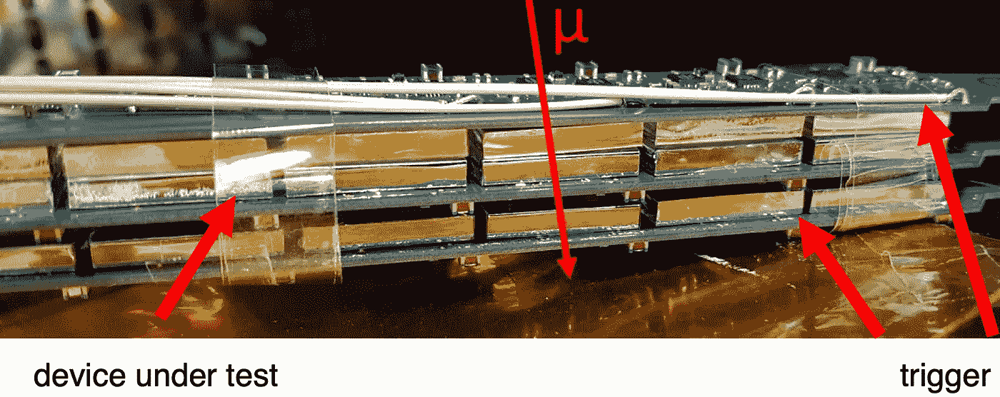
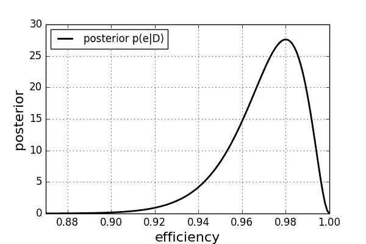
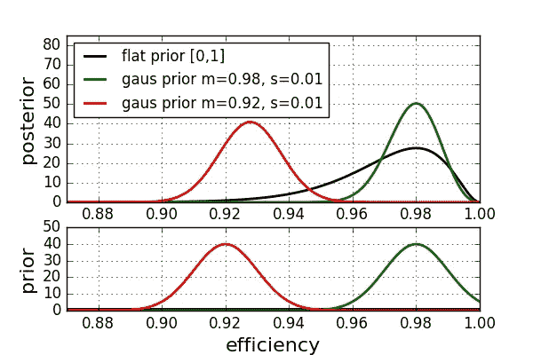
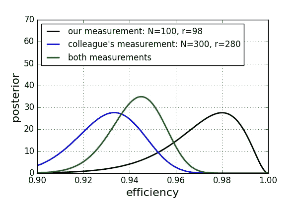
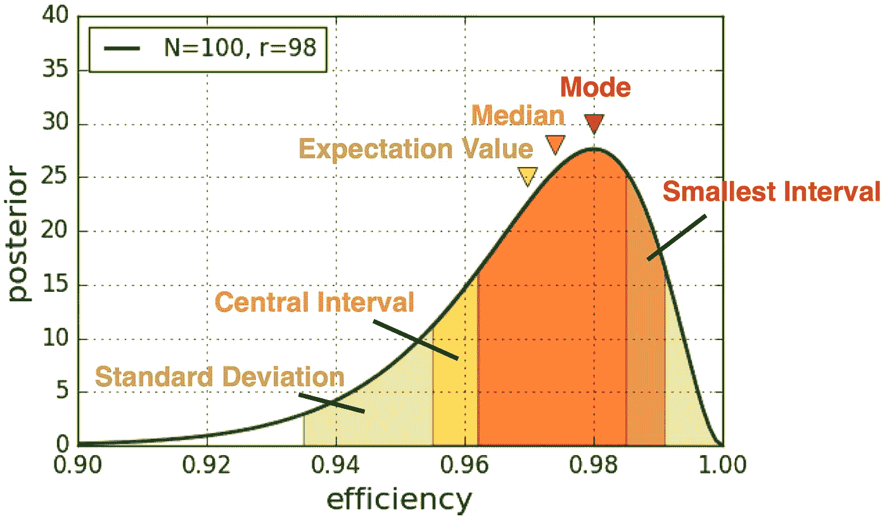

# 手动执行贝叶斯分析

> 原文：<https://towardsdatascience.com/performing-a-bayesian-analysis-by-hand-c589ab992916?source=collection_archive---------18----------------------->

## 概率论

## 现实生活中贝叶斯分析的逐步演练

# 介绍

与纯粹的频率分析方法相比，贝叶斯分析提供了从数据中获得更多洞察力的可能性。在这篇文章中，我将带你看一个真实生活中的例子，如何进行贝叶斯分析。我将演示当选择一个错误的先验时可能会出错，我们将看到如何总结我们的结果。为了让你阅读这篇文章，我假设你熟悉贝叶斯统计的基础和贝叶斯定理。

 [## 如何成为贝氏

### 频率主义者和贝叶斯统计的根本区别

towardsdatascience.com](/how-to-become-a-bayesian-fcaaf6302d68) 

## 方案

作为示例分析，我们将讨论一个来自物理实验室的真实生活问题。别担心，你不需要任何物理知识。我们想要确定粒子探测器的效率。粒子探测器是一种传感器，当某些粒子穿过它时，它可以产生可测量的信号。我们要评估的检测器效率是检测器实际测量穿越粒子的机会。为了测量这一点，我们将需要评估的检测器放在一个三明治结构的两个传感器之间。如果我们测量顶部和底部传感器中的信号，我们知道粒子也应该从中间穿过检测器。实验装置的图片如下所示。

我们想测量粒子探测器(被测设备)的效率。两个不同的传感器(触发器)放置在检测器的顶部和底部，以便检测穿过装置的粒子(在这种情况下是μ介子)。

为了测量，我们计算在一定时间内穿过的粒子数 *N* (由顶部和底部传感器报告)以及在我们的探测器 *r* 中测量的信号数。对于这个例子，我们假设 *N=100* 和 *r=98* 。

## 频繁结果

在频率主义方法中，我们可以使用我们的测量数据，并得出检测器效率为 *e = r/N = 98%* 的结论。这只能给我们一个点估计。如果要回答更复杂的问题，比如:*“探测器效率在 99%以上的概率是多少”*，那么就需要更复杂的分析。

# 贝叶斯分析

贝叶斯方法的目标是在给定我们的数据 *p(e|D)的情况下，推导出检测器效率的完整后验概率分布。*为了做到这一点，我们需要贝叶斯定理:

贝叶斯定理

我们将在下面讨论不同的术语。

## 概率模型/可能性: *p(D|e)*

在贝叶斯分析中，我们总是需要选择一个模型来描述我们想要分析的过程，称为可能性。对于我们的问题，我们可以将效率解释为在一定数量的尝试( *N* )中获得成功的机会( *r* )。这类问题，类似于确定硬币出现正面的几率，可以用**二项式分布**来建模:

二项分布

## 先前:p(e)

接下来，我们需要定义一个先验。这里，我们从最简单的选择开始，平坦先验。稍后我们将讨论不同的优先选择的影响。

## 边际可能性

边际可能性是贝叶斯定理的分母。幸运的是，它只是一个归一化常数，不依赖于效率。我们可以通过找到将后验概率归一化为 1 的常数来确定它的数值。

## 结果

现在我们可以根据贝叶斯定理计算后验概率。

N=100，r=98 且先验平坦的后验分布 p(e|D)

可以看到最可能的值是 *e=98%* 与直观的 frequentist 结果相同。但是我们在这里得到了更多的信息，因为我们得到了完整的后验概率分布。例如，我们可以看到分布是不对称的。低于 97%的效率比高于 99%的效率具有更高的可能性。对于这两种概率，我们可以给出精确的数字。我们是如何获得这些额外信息的？这是因为我们利用了更多的信息，也就是说**我们已经假设检测机的行为遵循二项式分布，以及平坦的先验分布**。

# 先验的影响

先验在贝叶斯分析中起着重要的作用。在下面，我们将看到如果我们改变它会发生什么。比方说，我们在检波器的数据手册中发现，效率可以假设为 98%左右的高斯分布，标准偏差为 *s=1%* 。然而，在旧版本的数据手册中，我们发现检波器的效率应呈高斯分布，约为 92%，具有相同的标准偏差 *s=1%* 。我们通过相应地改变先验来将这些信息合并到后验中。两种情况的结果如下所示。

不同先验的后验概率和先验概率

在这里，后验显示在顶部面板中，相应的先验显示在下面的面板中。黑色曲线显示了具有平坦先验的先前结果。当将先验改变为具有平均值 *m=98%* (绿色)的高斯先验时，后验峰值再次为 98%，并且与平坦先验的情况相比，我们的估计的置信度更强。先验支持我们的数据。虽然在平坦先验的情况下，低于95%的效率仍有合理的可能性，但现在几乎被排除了。从旧数据手册中获取效率达到 92%峰值的先验数据(红色)*，*，我们可以看到后验数据与其他两个数据有显著不同。最有可能的值是 93%左右，完全改变了我们的结果。怎么会这样呢？问题在于，由于选择了错误的先验，数据和先验彼此不一致。这个例子表明，选择一个错误的先验可能会有灾难性的后果。**始终评估先验、概率模型和后验之间的一致性非常重要。**

# 包含附加测量值

先验的另一个用例是附加测量。假设您的同事测量了相同的探测器。他测量了 *N1=300* 和 *r1=280* 。如何才能正确利用这些数据？我们可以用它作为我们分析的先验。结果如下所示。

使用先前的测量作为先验

您可以看到我们的测量值(黑色)和同事的测量值(蓝色)的后验分布，两者都使用平坦先验。如果我们使用同事的测量值作为我们分析的先验，我们会得到绿色曲线。绿色曲线最有可能的值在其他两条曲线之间，但由于我们同事的测量数据更多，更偏向蓝色曲线。此外，与其他两条曲线相比，绿色曲线的分布略窄。*旁注* : **得到的后验概率又是一个二项分布**。此外，我们将得出相同的后验概率，就好像我们将重复分析并假设只有一个测量值，其中 *N=N1+N2=400* 和 *r=r1+r2=378* 。如您所料，结果也与两次测量的执行顺序无关。这很容易通过分析来验证。

# 如何展示你的成果

计算后验概率后，我们现在要展示我们的结果。理想情况下，您希望显示完整的后验分布，因为这反映了完整的信息。然而，这并不总是可能的，您可能希望用一组值来总结它。通常你想给出一个点估计和一个区间来概括分布的宽度。有不同的方法来做这件事。受欢迎的选择包括:

*   期望值和标准偏差
*   中间和中央区间
*   模式和最小间隔

此外，我们需要选择区间中应该包含多少概率(通常使用:68%或 90%)。

对于正态分布，点估计和置信区间的三种选择给出相同的结果。然而，在我们的偏态分布的例子中，情况并非如此。

点估计和相应区间的不同组合，以总结后验概率

你可以看到这三个选择导致了不同的结果。这些都没有错或对，重要的是准确报告你使用了什么样的点估计以及你是如何构建区间的。这里我们可以说，例如，我们的后验概率的最可能值(模式)是 0.98，置信区间是 0.962-0.991(最小区间包括 68%的概率密度)。

# 结论

我们执行了一个完整的贝叶斯分析，从建立一个概率模型开始，选择适当的先验，一直到用点估计和相应的区间总结后验。贝叶斯方法的优点是我们可以获得完整的后验概率分布。这使我们能够优雅地结合先前的知识，例如制造商的信息，或以前的测量。此外，我们看到，选择错误的先验可能对我们的结果产生重大影响，这突出表明，在任何贝叶斯分析中，仔细选择先验并评估其与概率模型和后验的一致性都是非常重要的。

生成数字和图形的 python 笔记本可在此处找到:

 [## 比特桶

### 贮藏室ˌ仓库

bitbucket.org](https://bitbucket.org/chgraf/blog/src/master/Performing%20a%20Bayesian%20Analysis%20by%20Hand/)