# 使用正态方程执行线性回归

> 原文：<https://towardsdatascience.com/performing-linear-regression-using-the-normal-equation-6372ed3c57?source=collection_archive---------7----------------------->

## 并不总是需要运行优化算法来执行线性回归。你可以解一个特定的代数方程——正规方程——直接得到结果。尽管对于大数据集来说，它甚至还没有接近计算最优，但它仍然是值得注意的选项之一。


安托万·道特里在 [Unsplash](https://unsplash.com?utm_source=medium&utm_medium=referral) 上拍摄的照片

**1。简介**

线性回归是数据分析中最重要和最流行的预测技术之一。它也是最古老的——著名的 C.F .高斯在 19 世纪初用它在天文学中计算轨道。

其目标是通过计算最小化特定成本函数(误差)的回归函数参数，例如均方误差(MSE ),将最佳线(或超平面/平面)拟合到给定点(观察值)的集合。

提醒一下，下面有一个扩展形式的线性回归方程。

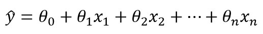

情商。1:线性回归方程

在矢量化形式中，它看起来像这样:

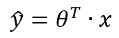

情商。2:矢量化形式的线性回归方程

其中θ是参数权重的向量。

通常，通过运行某种优化算法(例如梯度下降)来最小化成本函数，从而找到最佳模型参数。然而，也可以通过求解称为标准方程的代数方程来获得这些参数的值(权重)。其定义如下。

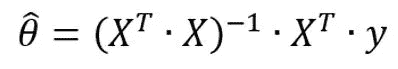

情商。3:正常方程

**2。手工计算**

在本文中，我们将对一个非常基本的情况进行线性回归，这样我们就可以避免冗长的手工计算。顺便说一下，如果你认为你需要刷新你的线性代数技能，互联网上有很多好的资源(例如 [YouTube 系列](https://www.youtube.com/watch?v=fNk_zzaMoSs&list=PLZHQObOWTQDPD3MizzM2xVFitgF8hE_ab)我推荐)。

在这个例子中，只有三个只有一个变量(X₁).)的点(观测值)在图表上，它们看起来像下面。

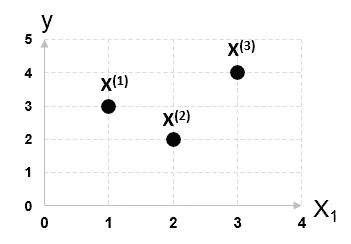

显示本例中使用的点的散点图

在这种情况下，线性回归方程具有以下形式:

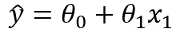

情商。4:本例的线性回归方程

特征(X)和标签(y)是:

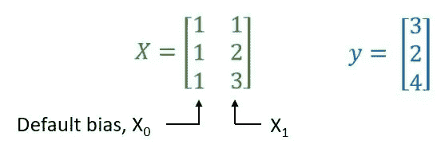

功能和标签矩阵

请注意，我们添加了一个默认偏置项 1，它将在计算过程中更新。不加这个项会导致一个错误的解。

**第一步:**矩阵 X 的转置

这是一个相对简单的任务——行变成新列。

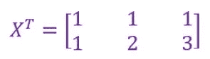

**步骤 2:** 转置矩阵与矩阵 X 相乘

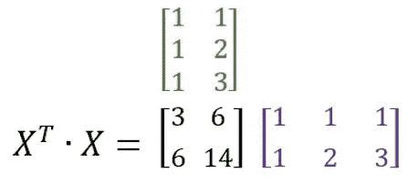

**步骤 3:** 对合成矩阵求逆

要对简单的 2x2 矩阵求逆，我们可以使用以下公式:

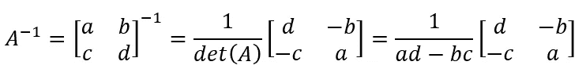

因此，我们得到:

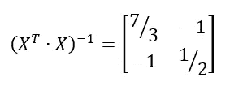

*注意:对于更大的矩阵(大于 3X3)，求逆变得更加麻烦，通常使用算法方法——比如高斯消去法。记住这一点很重要！*

**步骤 4:**X 转置的逆矩阵的乘法

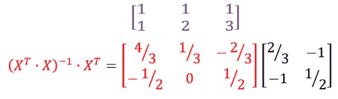

**第五步:**最终相乘得到最佳参数的向量

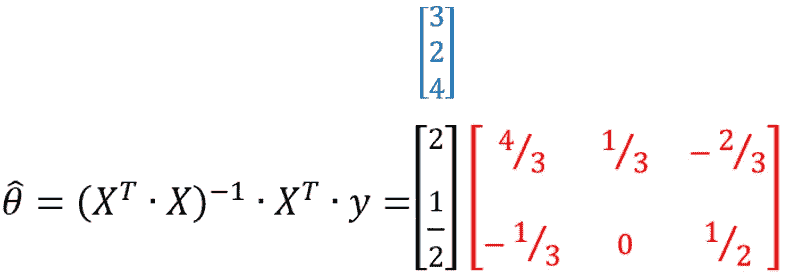

最后，我们的线性回归方程采用以下形式:

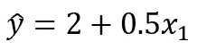

情商。5:具有最佳权重的线性回归方程

将这条线绘制到前面的图上，如下所示。

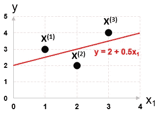

具有原始点和回归线的散点图(红色)

**3。用 Python 实现**

使用 [Numpy](https://numpy.org/) 库可以在 Python 中实现相同的计算，该库包含了 [numpy.linalg](https://numpy.org/doc/stable/reference/routines.linalg.html?highlight=linalg#module-numpy.linalg) 集合中的一组线性代数函数。

```
import numpy as npX = np.c_[[1,1,1],[1,2,3]] # defining features
y = np.c_[[1,3,2]] # defining labels
theta = np.linalg.inv(X.T.dot(X)).dot(X.T).dot(y) # normal equation
print(theta)
```

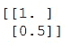

运行上述代码的结果

现在，我们可以定义我们想要预测其值的新要素。

```
X_new = np.c_[[1,1,1,1],[0, 0.5,1.5,4]]  # new features
```

通过实施等式 2，我们获得了预测值。

```
y_pred = X_new.dot(theta)  # making predictions
print(y_pred)
```


预测值

**4。备注**

如您所见，使用法线方程并在 Python 中实现它非常容易——它只有一行代码。那么为什么不常用呢？

问题在于它的[数值复杂度](https://en.wikipedia.org/wiki/Computational_complexity)。求解这个方程需要对一个矩阵求逆，这是一个计算量很大的操作——取决于实现方式，在[大 O 符号](https://en.wikipedia.org/wiki/Big_O_notation)中，它是 O(n)或略小。这意味着规模会可怕地扩大，实际上意味着当要素数量增加一倍时，计算时间会增加 2 = 8 倍。也有可能第二步的结果根本不可逆——导致大麻烦。这就是这种方法在实践中不常见的原因。

从好的方面来看，这种方法只需一步就能计算出来，你不必选择学习率参数。此外，就内存使用而言，这种方法是线性的 O(m ),这意味着它可以有效地存储大型数据集，如果它们只适合您的计算机内存的话。