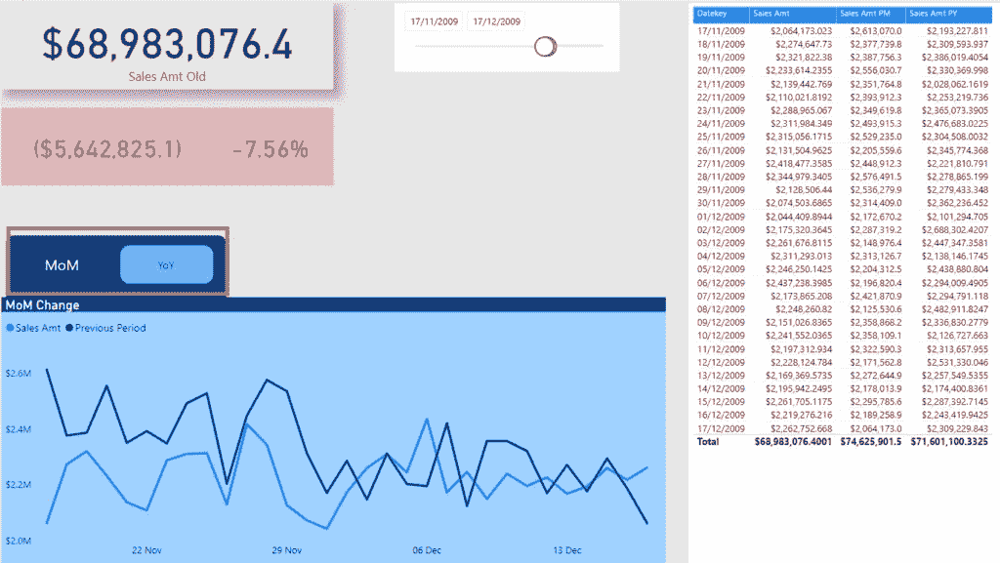

# 功率 BI 的周期比较

> 原文：<https://towardsdatascience.com/period-comparisons-in-power-bi-7cc46705d663?source=collection_archive---------8----------------------->

## 在 Power BI 中比较不同时间段变得容易！


像素上的全息照相术照片

就在最近，我在 LinkedIn 平台上遇到一个问题，是否有可能在 Power BI 中创建以下可视化:


因为一个常见的业务请求是在不同的时间段之间执行不同的比较，所以我认为 Power BI 在这方面有很大的优势。我已经解释了一些与时间智能相关的[基本计算，但显然有相当数量的用户并不十分熟悉它们。](/tiq-part-4-being-time-intelligent-in-power-bi-88171980b141)

首先，我要强调一个很棒的功能，叫做“快速测量”，在这里你可以获得多个常用计算的现成解决方案，例如:年初至今总计、本季度至今总计、本月至今总计、同比变化、滚动平均等。

为了让快速措施发挥作用，你需要有一个正确定义的[日期表](/tiq-part-3-ultimate-guide-to-date-dimension-creation-98b951ffa68c)。

但是，我们不会在这里使用快速措施来实现我们最初的目标，所以让我们切换到 Power BI 桌面并开始行动吧！像往常一样，我将使用 Contoso 数据库进行演示。

## 创建基本度量

第一步是创建一个基本度量来计算销售额:

```
Sales Amt = SUM(FactOnlineSales[SalesAmount])
```

我将立即创建另一个度量，它将计算相同的数字，但向后移动一个月:

```
Sales Amt PM = CALCULATE([Sales Amt],
                        DATEADD(DimDate[Datekey],-1,MONTH)
                        )
```

有多种不同的方法来计算这个度量，但我更喜欢使用 *DATEADD()* 函数，因为它给了我更多的灵活性来改变周期(这是一个官方借口:)…实际上，我来自 SQL 世界，其中 *DATEADD()* 是处理日期时最重要的函数之一)。

现在，当我选择 11 月 17 日和 12 月 17 日之间的日期时，我可以看到我的数字是如何相互关联的:


正如您可能注意到的，我们的公式工作得很好—正如预期的那样，我们看到 12 月 17 日的销售额 PM 与 11 月 17 日的销售额相匹配。此外，我们的折线图很好地显示了趋势，以便于比较，而左上角的卡片视觉效果显示了所选期间的销售额以及我们正在比较的两个期间之间的差异。

对于这些差异，我创建了两个额外的衡量标准:

```
Sales Amt Diff PM = [Sales Amt] - [Sales Amt PM]

Sales Amt Diff  PM % = DIVIDE([Sales Amt],[Sales Amt PM],BLANK()) - 1
```

下方的卡片是根据值有条件地格式化的，因此当我们的表现比前一时期差时，它会变成红色，而当结果相反时，它会显示绿色:


## 添加更多配料

现在，这很好，你也看到了我们如何轻松地回答最初的问题。然而，我想在这里添加一些更多的成分，使我们的用户能够在月环比和年同比之间进行选择。

在我们的示例中，如果我们再次选择 11 月 17 日和 12 月 17 日之间的日期，而不是显示前一个月的值(比较 12 月 17 日和 11 月 17 日),使用同比比较，我想比较 2009 年 12 月 17 日和 2008 年 12 月 17 日！

因此，让我们为此创建一个度量。同样，您可以使用不同的函数来实现这一点，如 *SAMEPERIODLASTYEAR()* 函数，但我想保持一致性，因此我将再次使用 DATEADD():

```
Sales Amt PY = CALCULATE([Sales Amt],
                        DATEADD(DimDate[Datekey],-1,YEAR)
                        )
```

与 MoM 计算相同，需要两个额外的指标来计算同比数据的差异:

```
Sales Amt Diff PY = [Sales Amt] - [Sales Amt PY]

Sales Amt Diff PY % = DIVIDE([Sales Amt],[Sales Amt PY],BLANK()) - 1
```

然后，我将创建两个书签，以便用户可以通过单击相应的按钮导航到 MoM 或 YoY:



默认情况下，他们应该看到 MoM 比较，但是一旦他们单击 YoY 按钮，报告看起来就会略有不同:


您可以注意到，卡片视觉效果中的数字发生了变化，以反映同比差异计算，而折线图也显示了不同的趋势！

在我们结束之前，这里是我们的报告的最后行为:


## 结论

正如我们所见，在时间智能计算方面，Power BI 是一个非常强大的工具。基本上，可以创建不同时期之间的各种比较—最常见的比较，甚至不需要编写一行 DAX！

如果您需要扩展内置的快速测量，有一整套有用的时间智能功能。你可以在这里更深入地查看所有这些[。](https://dax.guide/functions/date-time/)

感谢阅读！

[成为会员，阅读媒体上的每一个故事！](https://datamozart.medium.com/membership)

订阅[这里](http://eepurl.com/gOH8iP)获取更多有见地的数据文章！