# 语言模型的困惑

> 原文：<https://towardsdatascience.com/perplexity-in-language-models-87a196019a94?source=collection_archive---------1----------------------->

## 使用加权分支因子评估 NLP 模型

困惑度是自然语言处理中评估模型的一个有用的度量。本文将介绍它通常的两种定义方式以及它们背后的直觉。

# 概述

1.  **语言模型的快速回顾**
2.  **评估语言模型**
3.  **作为测试集的归一化逆概率的困惑** 3.1 测试集的概率
    3.2 归一化
    3.3 将所有这些集合在一起
4.  **作为交叉熵的指数的困惑** 4.1 语言模型的交叉熵
    4.2 加权分支因子:掷骰子
    4.3 加权分支因子:语言模型
5.  **总结**

# 1.语言模型的快速回顾

**语言模型**是给单词和句子分配概率的统计模型。通常，我们可能会试图猜测 ***中的下一个词*** w 在一个句子中给出的所有前一个词，通常称为 ***【历史】*** 。
例如，给定历史“晚餐我正在做 __ ”,下一个单词是“水泥”的概率是多少？下一个单词是“fajitas”的概率有多大？希望是 P(我正在做的晚餐用的 fajitas)>P(我正在做的晚餐用的水泥)。

我们也经常对我们的模型分配给由单词序列( *w_1，w_2，…，w_N* )组成的完整句子 *W* 的概率感兴趣。

例如，我们想要一个模型来分配更高的概率给真正的句子和语法正确的句子。

一个**unigram**模型只在单个单词的层面上起作用。给定单词序列 W，单字模型将输出概率:

其中个体概率 P(w_i)可以例如基于训练语料库中单词的频率来估计。

一个 **n-gram 模型**，相反，查看前(n-1)个单词来估计下一个。例如，三元模型会查看前面的两个单词，因此:

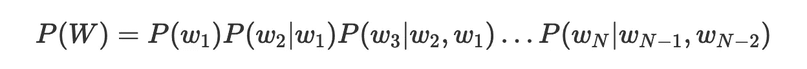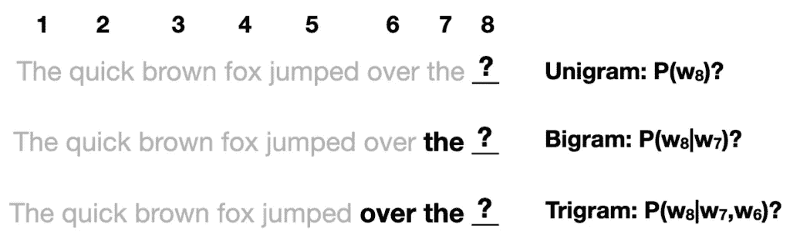

单字对单字

语言模型可以**嵌入**更复杂的系统中，以帮助执行语言任务，如翻译、分类、语音识别等。

# 2.评估语言模型

**困惑**是语言模型的**评估度量**。但是我们为什么要用它呢？为什么不能只看我们最终系统在我们关心的任务上的损失/精度？

事实上，我们可以使用两种不同的方法来评估和比较语言模型:

*   **外在评价**。这包括通过在实际的**任务**(例如机器翻译)中使用这些模型来评估它们，并查看它们的最终损失/准确性。这是最好的选择，因为这是切实看到不同模型如何影响我们感兴趣的任务的唯一方法。然而，由于它需要训练一个完整的系统，所以在计算上可能是昂贵和缓慢的。
*   **内在评价**。这包括找到一些度量标准来评估语言模型本身，而不考虑它将被用于的特定任务。虽然内在评估作为最终指标不如外在评估“好”，但它是快速比较模型的有用方式。**困惑是一种内在的评价方法。**

# 3.作为测试集的归一化逆概率的困惑

这可能是困惑最常见的定义。在这一节中，我们将看到它为什么有意义。

## 3.1 测试集的概率

首先，什么构成了一个好的语言模型？如前所述，我们希望我们的模型将高概率分配给真实且语法正确的句子，而将低概率分配给虚假、不正确或非常罕见的句子。假设我们的数据集由事实上真实和正确的句子组成，这意味着最佳模型将是为测试集分配**最高概率的模型。直观地说，如果一个模型给测试集分配了一个高概率，这意味着看到它**并不惊讶**(它没有*被它迷惑*，这意味着它对语言如何工作有很好的理解。**

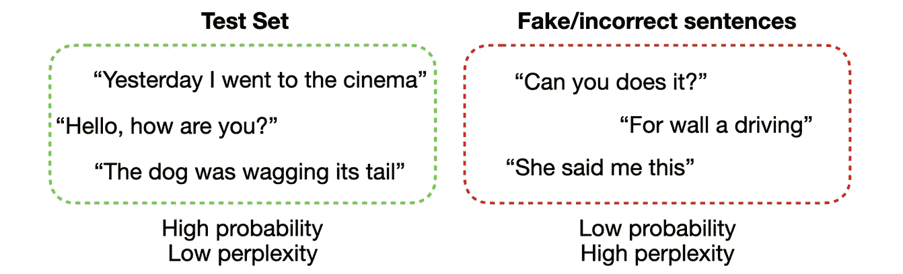

## 3.2 标准化

然而，值得注意的是数据集可以有**不同数量的句子**，句子可以有不同数量的单词。显然，添加更多的句子会带来更多的不确定性，所以在其他条件相同的情况下，一个较大的测试集比一个较小的测试集有更低的概率。理想情况下，我们希望有一个独立于数据集大小的指标。我们可以通过用总字数对测试集**的概率**进行归一化**来得到这个结果，这将给我们一个**每个单词的度量**。**

我们该怎么做？如果我们想要归一化的是一些项的总和，我们可以用它除以单词数来得到每个单词的度量。但是单词序列的概率是由乘积给出的。
例如，让我们来看一个 unigram 模型:

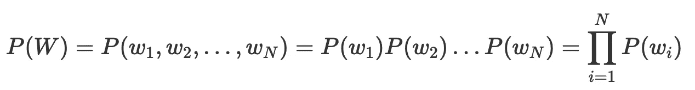

我们如何使这个概率正常化？通过查看对数概率更容易做到这一点，对数概率将乘积转换为总和:

我们现在可以通过除以 N 来标准化它，以获得每个单词的对数概率:

…然后通过指数运算删除日志:

我们可以看到，通过取第 N 个根，我们已经得到了**归一化。**

## 3.3 将所有内容整合在一起

现在回到我们最初的困惑等式，我们可以看到，我们可以将其解释为测试集、**的**、**的**逆概率，通过测试集中的字数**:**

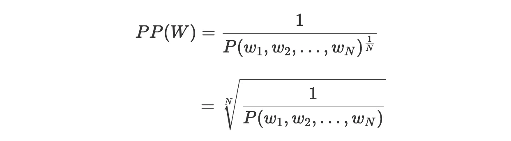

注意:

*   由于我们采用的是逆概率，较低的**复杂度**表示更好的**模型**
*   在这种情况下，W 是测试集。它包含了所有句子一个接一个的单词序列，包括句首和句尾标记，<sos>和<eos>。
    例如，一个包含两个句子的测试集应该是这样的:
    W = ( < SOS >，this，is，the，first，sentence，。，< EOS >，< SOS >，这个，是，那个，第二个，一个，。，< EOS > )
    N 是我们测试集中所有记号的计数，包括 SOS/ EOS 和标点符号。在上面的例子中，N = 16。如果我们愿意，我们也可以计算单个句子的困惑度，在这种情况下，W 将仅仅是那一个句子。</eos></sos>

# 4.作为交叉熵指数的困惑

**注**:如果你需要复习一下熵，我强烈推荐[这篇由 Sriram Vajapeyam 撰写的](https://arxiv.org/pdf/1405.2061.pdf)文献。

困惑也可以定义为交叉熵的指数:

首先，我们可以很容易地检查出这实际上等价于前面的定义:

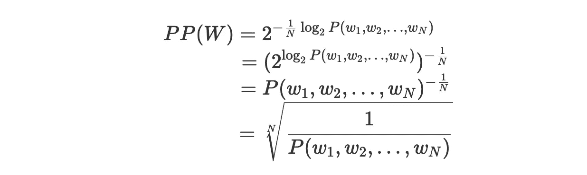

但是我们如何根据交叉熵来解释这个定义呢？

## 4.1 语言模型的交叉熵

我们知道熵可以解释为在变量中存储信息所需的*平均位数，它由下式给出:*

我们还知道，**交叉熵**由下式给出:

如果我们使用一个**估计的分布** q 来代替真实的概率分布 p，它可以被解释为在一个变量中存储信息所需的平均比特数。

在我们的例子中，p 是我们语言的真实分布，而 q 是我们的模型在训练集上估计的分布。显然，我们无法知道真正的 p，但给定足够长的单词序列 W(如此大的 N)，我们可以使用香农-麦克米兰-布雷曼定理来近似每个单词的交叉熵(有关更多细节，我推荐[【1】](https://web.stanford.edu/~jurafsky/slp3/3.pdf#page=21)和[【2】](http://www.inf.ed.ac.uk/teaching/courses/dil/slides/dil04.pdf#page=4)):

让我们重写这段代码，以便与上一节中使用的符号保持一致。给定长度为 N 的单词序列 W 和经过训练的语言模型 P，我们将交叉熵近似为:

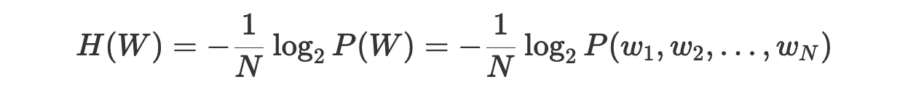

让我们再来看看我们对困惑的定义:

根据我们对交叉熵的了解，我们可以说 H(W) **是编码每个单词**所需的*平均*比特数。这意味着困惑度 *2^H(W)* 是可以使用***【w】*****位**编码的平均字数。

对此我们该如何解读？我们可以把困惑看作是**加权分支因子**。

## 4.2 加权分支系数:滚动模具

所以我们说:

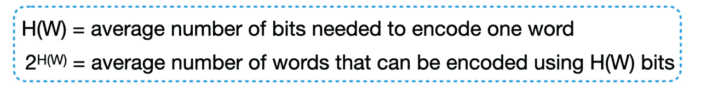

例如，如果我们发现 H(W) = 2，这意味着平均每个字需要 2 位来编码，使用 2 位我们可以编码 2 = 4 个字。

但这意味着什么呢？为了简单起见，让我们暂时忘记语言和文字，想象我们的模型实际上试图预测掷骰子的结果。普通模具有 6 个面，因此模具的**分支系数**为 6。分支因子简单地表明了当我们掷骰子时有多少可能的结果。

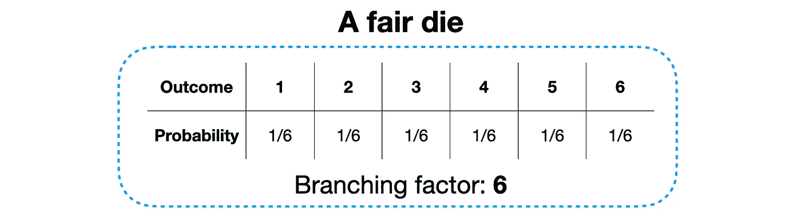

假设我们在这个公平骰子上训练我们的模型，模型知道我们每次掷骰子都有 1/6 的概率得到任何一方。然后，假设我们通过滚动骰子 10 次以上来创建一个测试集，我们获得了(高度缺乏想象力的)结果序列 T = {1，2，3，4，5，6，1，2，3，4}。我们的模型在这个测试集上的困惑是什么？

所以困惑符合分支因子。

现在让我们想象一下，我们有一个**不公平骰子**，它以 7/12 的概率掷出一个 6，所有其他面各有 1/12 的概率。我们再次在用这个不公平骰子创建的训练集上训练一个模型，以便它学习这些概率。然后，我们通过掷骰子 12 次来创建一个新的测试集 T:我们在 7 次掷骰子中得到 6，在剩下的 5 次掷骰子中得到其他数字。现在的困惑是什么？

**困惑度降低**。这是因为我们的模型现在知道滚动 6 比任何其他数字都更有可能，所以看到 1 就不那么“惊讶”了，而且由于测试集中的 6 比其他数字多，所以与测试集相关联的总体“惊讶”更低。*分支因子*仍然是 6，因为所有 6 个数字在任何掷骰子中都是可能的选项。然而， ***加权*分支因子**现在更低，因为一个选项比其他选项更有可能。这就好比说，在这些新的条件下，在每一次掷骰子时，我们的模型都是结果不确定的，就好像它必须在 4 个不同的选项中做出选择，而不是所有方面都有相同概率的 6 个选项。

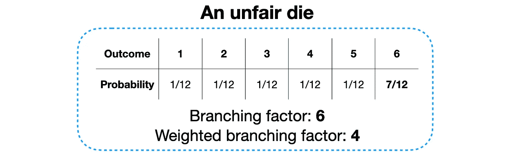

为了进一步澄清这一点，我们把它推到极致。假设我们现在有一个不公平的骰子，给出一个概率为 99%的 6，其他数字的概率各为 1/500。我们再次在这个骰子上训练模型，然后用 100 个骰子创建一个测试集，其中我们得到 6 99 次，另一个数字一次。现在的困惑是:

分支因子仍然是 6，但加权分支因子现在是 1，因为在每次掷骰子时，模型几乎可以确定它将是 6，这是理所当然的。因此，虽然从技术上来说*在每一次掷骰子时仍有 6 个可能的选项，但只有一个选项是最受欢迎的。*

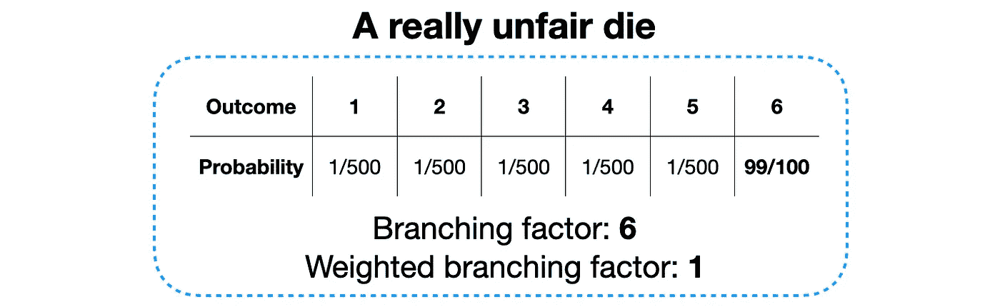

## 4.3 加权分支因子:语言模型

让我们把它与语言模型和交叉熵联系起来。

首先，如果我们有一个试图猜测下一个单词的语言模型，分支因子就是每个点上可能出现的单词的数量，也就是词汇量的大小。

我们之前说过，语言模型中的困惑是使用*【W】**位*可以编码的平均字数。我们现在可以看到，这仅仅代表了模型的平均分支因子**。正如我们之前所说，如果我们发现交叉熵值为 2，这表明困惑度为 4，这是“可以编码的平均字数”，这就是平均分支因子。所有这一切意味着，当**试图猜测下一个单词时，我们的模型** ***和*一样困惑，好像它必须在 4 个不同的单词**之间进行选择。**

# 5.摘要

*   困惑是用来判断一个语言模型有多好的度量标准
*   我们可以将困惑度定义为测试集、**的**逆概率，由**的字数归一化:**

*   或者，我们可以通过使用**交叉熵**来定义困惑度，其中交叉熵表示编码一个单词所需的平均比特数，而困惑度是可以用这些比特编码的单词数:

*   我们可以把困惑解释为加权分支因子。如果我们的困惑度是 100，这意味着每当模型试图猜测下一个单词时，它就像必须在 100 个单词之间进行选择一样困惑。

# 有用的参考资料

[1] Jurafsky，d .和 Martin，J. H. [语音和语言处理。第三章:N 元语言模型](https://web.stanford.edu/~jurafsky/slp3/3.pdf) *(草案)* (2019)。
【2】Koehn，P. [语言建模(二):平滑与回退](http://www.inf.ed.ac.uk/teaching/courses/dil/slides/dil04.pdf) (2006)。数据密集型语言学*(讲座幻灯片)*
【3】Vajapeyam，S. [理解信息的香农熵度量](https://arxiv.org/pdf/1405.2061.pdf) (2014)。
【4】Iacobelli，F. [困惑](https://www.youtube.com/watch?v=CTYqkWU8cBc)(2015)YouTube
【5】Lascarides，A. [语言模型:评估与平滑](https://www.inf.ed.ac.uk/teaching/courses/fnlp/lectures/04_slides-2x2.pdf) (2020)。自然语言处理基础*(讲座幻灯片)*
【6】毛，L. [熵，困惑及其应用](https://leimao.github.io/blog/Entropy-Perplexity/) (2019)。毛蕾的日志

发现这个故事有用吗？考虑 [*订阅*](https://chiaracampagnola.medium.com/membership) *到媒体支持写手！*