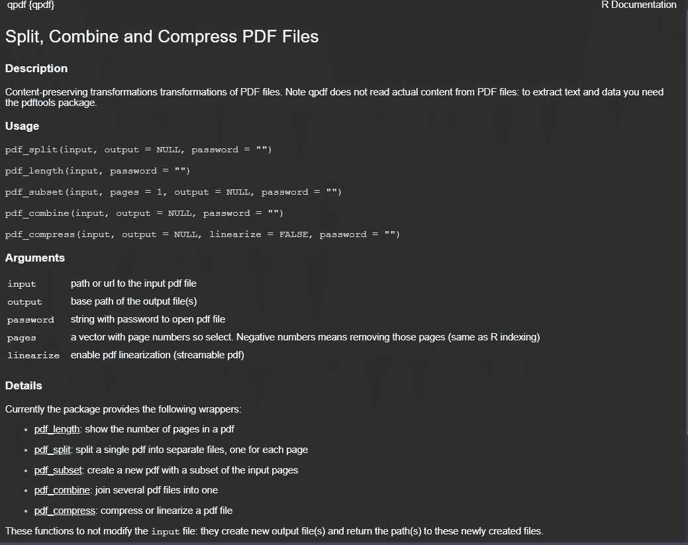

# 从 R 闪亮的应用程序中持久地存储和检索数据

> 原文：<https://towardsdatascience.com/persistently-storing-and-retrieving-data-from-r-shiny-apps-de56b996277e?source=collection_archive---------29----------------------->

## 在 R Shiny 中处理文件的高级指南(包括 pdf)


由 [Unsplash](https://unsplash.com?utm_source=medium&utm_medium=referral) 上的[Cup 先生/杨奇煜·巴拉](https://unsplash.com/@iammrcup?utm_source=medium&utm_medium=referral)拍摄

我的 [上一篇帖子](/creating-an-exam-archive-system-with-a-data-scientists-toolkit-a080d497a9a0?source=friends_link&sk=510d86233ad78639bc201243db31adc1)引起了相当多的人的兴趣，因为[我的上一个 R 闪亮应用](https://studentsofiiitbh.team/examarchive/)的新颖和创新性质。Shiny 的这个用例几乎是闻所未闻的，因为这根本不是 R Shiny 的设计初衷。然而，由于一些个人和专业原因，我决定在 R Shiny 中承担“为我的大学考试资源创建一个集中平台”的项目，在本文中，我将分享使用 R Shiny 处理文件时可能面临的最大障碍的解决方案。

# 问题:R Shiny 中的持久数据

每当你在 R Shiny 应用中处理持久数据存储时，你一定会看到 Dean Attali 的文章，尤其是这篇文章。本文涵盖了各种可能的场景。然而，我还想要更多，因为它仍然不符合我的要求。

> 我想要的是让用户上传任意数量的文件，然后让其他用户能够下载这些文件的功能。

当你使用 R Shiny 时，你会碰到函数`fileInput()`和`downloadHandler()`。这些函数只能帮助您处理临时文件(只要“会话”不变，这些文件就会保留)。为了持久地存储数据，我尝试将“临时”上传的文件导出到一个“*”的“配置文件中，并借助“ ***rdrop2*** ”，但这个过程非常缓慢。此外，由于我在处理 PDF 文件，连接 MongoDB 服务器或 MySQL 服务器并不是一个可行的选择。*

# *解决方案:本地存储*

*这整个磨难让我痛苦地明白了一件事。远程存储无法用于我的项目，而本地存储是可行的方法。*

*所以，如果你在互联网上寻找可用的资源，你最接近实现这一点的方法就是遵循[迪安的例子](https://deanattali.com/blog/shiny-persistent-data-storage/#local)。但是，这里他只是简单地使用了函数`write.csv()`并在函数的 path 参数中提供了本地存储路径名。这仍然让我们弄清楚如何将 PDF 文件“写入”到本地存储中的特定位置(www 文件夹)。*

*我在网上搜索处理 pdf 的 R 包，偶然发现了包“[***pdf tools***](https://cran.r-project.org/web/packages/pdftools/pdftools.pdf)”和*[***qpdf***](https://www.google.com/url?sa=t&rct=j&q=&esrc=s&source=web&cd=2&cad=rja&uact=8&ved=2ahUKEwjP9rfCirfpAhWhyDgGHVR-BMQQFjABegQIBBAB&url=https%3A%2F%2Fcran.r-project.org%2Fweb%2Fpackages%2Fqpdf%2Fqpdf.pdf&usg=AOvVaw261vHa3S4ICgNTl2-eiSwi)*。因为“qpdf”是“ ***pdftools*** ”包的一个要求，所以我决定只安装“ ***pdftools*** ”包。不幸的是，这个函数也没有为我们提供在给定的文件路径上“写 PDF”的功能。提供的功能“***【pdf tools】***如下。***

****

**“pdf tools”R 软件包的描述**

*****【qpdf】***包提供的功能如下。**

****

**“qpdf”R 包的描述**

**在这些函数中，引起我注意的是函数`pdf_subset()`，因为它有一个名为 ***输出*** 的参数。因此，这可能意味着通过输出参数将特定 PDF 文件的子集存储在指定的文件路径中。“ ***页面*** ”参数是使用上述`pdf_info()`函数(`pdf_info$pages`更具体)指定的。**

**瞧啊。！！我的这个小实验成功了，我获得了我想要的功能。下面是我实际部署的应用程序的代码片段，突出了我如何在我的应用程序中管理上传部分[。](https://studentsofiiitbh.team/examarchive/)**

**[https://gist . github . com/Hindu bale/5356 a 228372 B3 EC 8 Fe 08 ea 04 c 1802 b 71](https://gist.github.com/hinduBale/5356a228372b3ec8fe08ea04c1802b71)**

```
**output$upload_questionSet_button <- renderUI({                           validate(                             
need(input$display_name_ques != "", "Please enter the display name of the uploader")                           
 )                           
fileInput( inputId = "multi_sol_id",                                      label = "Please upload the question set available with you :) (PDFs only)",                                                       multiple = TRUE,                                                accept = c(".pdf"),                                        buttonLabel = "Upload Papers")       
})  
                                                observeEvent(input$multi_sol_id, {                           fileName_set <- sprintf("www/%s/questionSet_%s_%s.pdf", input$sem_select_mul,input$exam_select_mul, input$display_name_ques)                           pages_set <- pdf_info(input$multi_sol_id$datapath)$pages                           pdf_subset(input$multi_sol_id$datapath, 
           pages = 1:pages_set, 
           output = fileName_set)
})**
```

**现在，在文件被成功上传后，我需要一种方法来使用 R Shiny 从我的本地存储中下载资源。为此，我四处寻找，阅读官方文件，但毫无结果。在鼓捣了所有可用的选项并如饥似渴地阅读了互联网上的相关资料后，我从[这个堆栈溢出答案](https://stackoverflow.com/questions/33416557/r-shiny-download-existing-file?noredirect=1&lq=1)中得到了一点提示。因此，我使用了`file.copy()`函数，并将“ ***文件名*** ”和“ ***内容*** ”参数转换为函数来完成我的任务。**

**下面是我实际部署的应用程序[的代码片段，展示了我如何处理应用程序的下载部分。](https://studentsofiiitbh.team/examarchive/)**

**[https://gist . github . com/Hindu bale/eddf 858962865 f 43 F4 AC 152116 DC 84 e 3](https://gist.github.com/hinduBale/eddf858962865f43f4ac152116dc84e3)**

```
**output$download_single_qp_button <- renderUI({
    downloadBttn(
      outputId = "qp_down_sin", 
      label = "Download Question Paper :)", 
      style = "float", 
      color = "warning", 
      size = "lg", 
      no_outline = FALSE)                
  })

  output$qp_down_sin <- downloadHandler(
    filename <- function(){
      search_ques_fileName <- sprintf("www/%s/%s",
                                      input$sem_select_solution,
                                      input$avail_paper)
      return (search_ques_fileName)
    },
    content <- function(file) {
      file.copy(filename(), file)
    },
    contentType = "application/pdf"
  )**
```

# **结论:**

**因此，我们实际上已经能够完成我们计划要做的事情。当你解决一个问题时，它确实是令人兴奋的，不是吗！！**

****

**布鲁克·卡吉尔在 [Unsplash](https://unsplash.com?utm_source=medium&utm_medium=referral) 上拍摄的照片**

**当我解决这个问题的时候，我真的很想打我的屏幕很多次，因此我写了这篇文章，这样它可以挽救一个宝贵的生命，或者至少是一个宝贵的显示器😜**

**这里需要注意的一点是，在编写本文时，https://www.shinyapps.io/的没有提供本地存储的功能(至少在他们的空闲层中没有)。所以，如果你想获得本地存储的好处，你必须在你选择的云服务提供商上建立你自己的 R 服务器。**

**你也可以请我喝杯咖啡来支持我的工作。**

**谢谢你，祝你成功。**