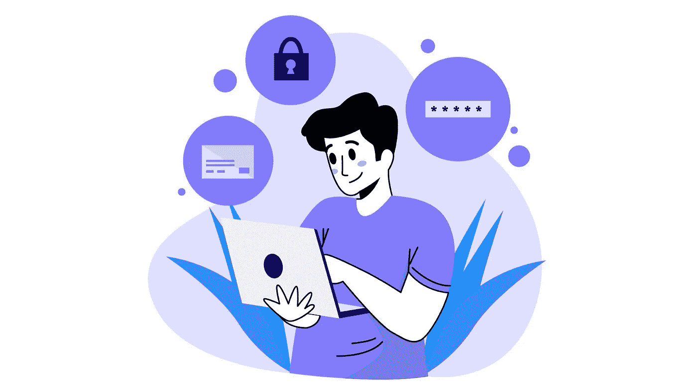
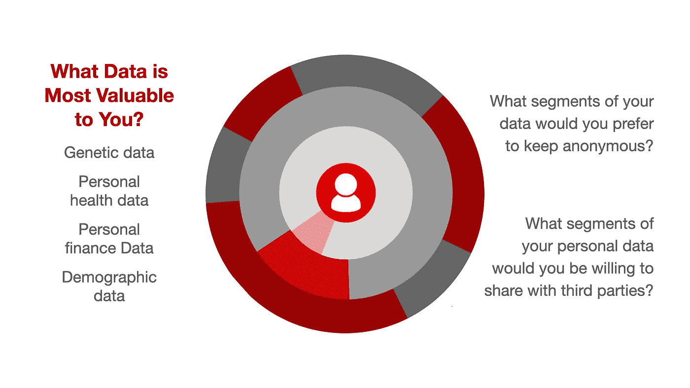

# 个人数据所有权:经济考虑

> 原文：<https://towardsdatascience.com/personal-data-ownership-economic-considerations-202e0933c63c?source=collection_archive---------54----------------------->

## 任何对避免冲突感兴趣的社会都需要一个清晰的财产规则体系。

我们之前的媒体[帖子](https://medium.com/prifina/personal-data-ownership-f3b62e6ed07d)描述了个人可以声称对其个人数据拥有所有权的情况。特别是，我们认为个人数据云中的数据应该被视为私有财产。概括来说，以下是我们从那篇文章中获得的主要内容:

*   这些数据可以手动添加到个人数据云中(直接上传个人文档的个人副本)，或者通过连接各种数据源，如可穿戴设备、在线账户、物联网设备等。(目前，根据欧盟的 GDPR 和加利福尼亚州的 CCPA，个人有权要求企业提供其客户数据的副本。)
*   一旦这些数据进入个人数据云，就会立即得到处理和“规范化”，使其成为一种独特的资产，比第三方收集的任何数据都更加准确和及时。
*   我们认为，在个人数据云中收集的此类数据应被视为财产法背景下的资产或“东西”(就像您银行账户中的证券或您加密钱包中的加密货币一样)。

> **这篇文章中的观点在发表于《哈佛法律与技术文摘杂志》(2021)** [**这里**](https://jolt.law.harvard.edu/digest/ownership-of-user-held-data-why-property-law-is-the-right-approach) **的法律评论文章中有进一步的解释。**

Frepik.com

# 缩小可以拥有的数据的范围

如前所述，个人数据所有权仅适用于个人在其个人数据云中保存的数据。在我们之前的文章中，我们也强调了个人声称对所有存在的个人数据拥有所有权是不合理的。由于不清楚什么数据应被视为“个人”数据，这种宽泛的主张是不合理的。

考虑到数据有很多层，这一点尤其正确。这种数据层可以根据(I)对个人私生活的敏感程度或接近程度来区分；(ii)谁拥有它(设备制造商、服务提供商、数据聚合商、政府或个人本身)；或(iii)个人是否可以访问该数据或影响该数据的使用方式。

以下是一些属于复杂、模糊类别的数据示例:国家税务机构收集的数据、联邦移民当局收集的个人数据、医疗服务提供商收集的医疗数据、雇主收集的员工数据、拼车服务提供商收集的位置和移动数据、关于性犯罪者名单的公共数据、托管平台用户手动提供的数据的社交网站。诸如此类。

Valto Loikkanen 和 Paulius Jurcys，Prifina。

# 客户数据的公司所有权

个人数据的收集及其在营销中的使用还有另一个层面。从广告业务的角度来看，寻求与客户建立联系的公司对以下数据层最感兴趣:

1.  **输入数据**:个人正在手动添加到某个平台的所有数据(想想你上传到 Instagram 账号的一张照片)；
2.  **元数据**:包含在某些信息片段中的数据。例如，如果你上传一张照片到 Instagram，那张照片也包含 GPS 数据(照片是在何时何地用什么相机拍摄的，等等。);
3.  **观察到的和可观察到的数据**:描述某些客户数据在平台中如何使用的数据(例如，有多少人喜欢你的 Instagram 照片)；
4.  **导出数据:**由服务提供商推断的关于用户的信息(例如，偏好、行为模式等。).

正如我们之前的[所示](https://medium.com/prifina/please-trust-us-this-is-all-your-data-we-have-5231ca6e0307)，即使法律要求服务提供商提供有关其收集的数据的非常详细的信息(这显然属于上述第 3 类和第 4 类)，他们也拒绝这样做。事实上，我们已经测试了几十个服务，并且发现如果用户能够获得一些输入数据的副本，那他们就是幸运的。

从我们早期的[研究](https://medium.com/prifina/prifina-releases-study-and-open-data-on-industry-reaction-to-ccpa-ce61edc0cb93)250 多名利益相关者对 CCPA 法规提案的评论中，我们了解到企业和服务提供商将他们收集的大部分客户数据视为专有数据或商业秘密。

# 个人数据所有权:法律视角

个人消费者普遍认为，我们每个人都应该拥有自己的数据。将个人数据所有权授予个人的道德理由非常充分。在过去的两个世纪中，一个坚实的哲学学派(由伊曼纽尔·康德完善)提出了一个论点，即个人与他们的个人财产有着独特而密切的联系。这里有一个相关的引用:

> 在把这个东西变成我自己的时候，我在它上面打上了我自己的印记；谁攻击它，谁就攻击我；打击打击着我，因为我就在其中。**财产不过是我的人身延伸到事物的外围。**—r·冯·杰林

这种个人联系在个人和他们不断产生的数据之间的关系中更加明显。然而，不管这种道德情感在社会成员中有多强烈，道德理论本身实际上是没有意义的，除非:

**(a)** 个人消费者拥有帮助他们编辑数据副本和控制数据使用方式的工具；

**(b)** 对这种所有权涵盖哪些种类的个人数据有明确的界定；和

个人数据所有权的授予有着坚实的经济基础。

关于(a)和(b)，建立在以用户为中心、用户持有的数据模型上的技术有助于实现这两个目标。然而，一些消费者数据权利倡导者认为，即使人们可以同意个人原则上应该拥有自己的个人数据，物权法体系也无法处理数据带来的复杂性。他们是正确的吗？

受过良好教育的律师可能会评论说，所有权既包括有形资产，也包括无形资产。这种资产分割的历史根源可以追溯到古典罗马法时代(公元前 250 年)，当时罗马人区分了有形的东西和无形的财产，前者是土地、牛和其他物质财产，后者是个人的权利和义务、其他类型的可继承资产和无形财产，如财产权

这种物质和非物质的体系在几乎所有的法律体系中都得到了继承。几乎所有的西方民主国家(除了德国和希腊的一些例外)都一致承认所有权的客体包括有形资产和无形资产。

对于那些需要进一步说明的人，这里有一些无形资产的例子，它们无疑被认为是个人所有权的客体:

1.  你银行账户里的钱；
2.  电；
3.  中介证券；
4.  知识产权(如版权、专利、商标、商业外观、商业秘密)；
5.  应收账款；
6.  浮动抵押；
7.  比特币和其他加密货币。

不言而喻，数据是一种新型资产，但这并不意味着它不能被视为所有权的对象。事实上，科技巨头已经确立了他们的立场，即他们在服务器上保存的所有数据都构成了专有资产和商业秘密。对于个人数据云中的个人独特数据集来说，也应该如此。

# 个人数据所有权:经济考虑

几个世纪以来，哲学家和律师试图阐明私有财产的哲学基础，并确立法律赋予个人的财产权。另一方面，经济学家的作用主要集中在解释私有财产的一般效用上。

从经济角度来看，对新型资产设定所有权需要:( a)对是否需要承认所有权提出强有力的理由;( b)澄清所有权保护的是什么，所有权存在哪些例外和限制，以及所有权权利受到侵犯的人可以获得哪些补救。在接下来的章节中，我们将从成本和收益的角度来分析处理个人数据所有权时出现的一些问题。

## 1.资源稀缺

经济学的主要目标是确定有限资源的最有效配置。这种稀缺性的概念在行动者每天必须做出的复杂经济决策中扮演着至关重要的角色。众所周知，在当前的经济环境下，许多品牌甚至难以理解其客户的基本特征，并正在寻找新的机会与个人消费者建立直接关系。然而，市场的不对称使这项任务变得困难(例如，缺乏工具和直接与消费者互动的高成本等)。

消费者信息的匮乏是消费市场的强大驱动力。在这方面，以用户为中心的用户持有数据模型有助于个人拥有自己的个人数据，并在与各种品牌和服务提供商的互动中激活这些数据，这些品牌和服务提供商渴望获得关于其客户的准确数据。这与脸书时代“要么接受，要么放弃”的情况有很大不同，在那种情况下，个人消费者必须无条件同意服务提供商的使用条款。在以用户为中心、用户持有的数据环境中，个人数据成为长期资产，为个人带来日常价值。

## 2.垄断

经济学家在评估授予新资产所有权的可能性时可能考虑的第二个问题与垄断问题有关。资产持有人是否可能获得市场垄断，从而对其他利益相关者产生不利影响？这种所有权将如何影响市场竞争？对手头的商品和服务质量会有什么影响？会涨价吗？最后，会不会出现增加市场准入难度的人为壁垒？

当前的数据生态系统由四大科技巨头主导:谷歌、亚马逊、脸书和苹果(还有更多大型参与者，但这些是最大和最知名的)。事实是，这四大技术巨头已经主宰了数据市场。他们在各种垂直行业的地位以及商业实践导致了欧盟和加利福尼亚州监管机构的干预，他们在各自的管辖范围内采用了 GDPR 和 CCPA。

GDPR 和 CCPA 赋予个人某些数据权利，如知情权、访问权、删除权、选择不出售数据的权利以及数据便携性权利。需要强调的是，GDPR 和 CCPA 都是公法(即立法)干预者，它们的主要目标是调整市场参与者之间的平衡(具体来说，是数据处理者和数据被处理的个人)。因此，GDPR 和 CCPA 不应与诸如财产权等私法文书相混淆，因为这些文书服务于非常不同的目的。

从经济学的角度来看，私法制度——如所有权——有两个主要目标:(a)界定个人与他们所拥有的财产之间的关系,( b)防止他人干预个人财产。作为资产的所有者，个人可以自由选择如何使用资产。所有民主制度都授予资产所有者四种“传统”权利:占有权、使用权、处置权和从资产中获取收益的权利(这些权利在罗马财产法的传统时期就已经存在)。

因此，作为个人持有数据的所有者，个人可以就如何利用其财产做出独立选择；他们可以决定第三方可以访问他们的数据的条件，并在他们认为合适的时候撤销权限。

## 3.创新的影响

从经济学的角度来看，研究授予新的产权将如何影响创新也很重要。为了给授予用户持有数据的所有权提供经济上的理由，我们需要研究价值是如何产生的。

传统的经济模式是基于垂直价值链的，其中价值是在分配的每一步增加的。然而，在以用户为中心的数据经济中，大多数决策都基于数据和人工智能工具，这些工具有助于实现流程自动化，并降低交互每一步的交易成本。在以用户为中心的数据经济中，交互的基础是为个人提供定制的个性化价值，同时更彻底地保护他们的隐私。与当前的生态系统相比，以用户为中心的环境也将有更少的进入壁垒，因为应用程序可以直接在用户持有的数据上运行。

以用户为中心、用户持有的数据模型为数据市场中的所有利益相关者带来了新的机遇:个人终于能够行使自主权并利用工具来控制个人数据的使用，而公司则有了直接与客户互动并提供新型定制产品和服务的新机遇。

此外，整个社会都受益于以用户为中心、用户持有的数据模型，因为它促进了新技术的实施，如边缘计算、机器学习、人工智能的个性化、差异隐私等。在社会公平方面，个人将知道他们的个人数据被安全地存储并由第三方负责任地使用，这增加了他们的授权和安全感。

## 4.保护范围

我们已经表明，在以用户为中心、用户持有的数据环境中，数据所有权仅扩展到个人可以主张事实排他性的个人数据部分(即，个人在个人数据云中持有的个人数据)。

一般来说，如果无法确定对某一物品/资产的事实上的排他性，则不应授予个人所有权。

从交易成本和可用补救措施的角度来看，授予财产权很重要。作为资产的所有者，个人或实体可以决定如何从资产中产生最大价值。财产法也给予物主最强有力的法律保护:物主可以寻求保护，对抗任何威胁要干预物品的第三方。(这不适用于合同义务的情况，在这种情况下，法律补救办法通常只在缔约各方之间存在)。

因此，财产权导致对合法所有者的更大保护，同时也有助于社会中更大的法律确定性。

在这篇文章中，我们只研究了个人数据所有权的一个狭窄部分:个人在其个人数据云中持有的数据的所有权。对于非用户持有的数据的使用，如防止新冠肺炎病毒传播的接触者追踪，显然需要进一步辩论。

# 向前迈进一步

我们可以通过查看特定的数据段来进一步推进关于数据的辩论，并确定它们是否可以归属于以下所有权类别之一:

Freepik.com

*   **受*个人财产*** 规则约束的数据:数据的使用由特定个人决定；
*   **受*集体财产* :** 规则约束的数据，其中数据的使用由特定群体或社区整体决定；和
*   **受*公共财产*系统**规则约束的数据:数据受规则约束，这些规则旨在使数据可供社会的任何和所有成员使用。界定财产所有权和分配的法律是合法期望的基础。就社会效用而言，承认用户持有数据的产权在多个方面都是有利的。一旦个人能够使用帮助他们控制个人数据的工具，数据的巨大价值将变得更加明显。因此，个人会变得更加依恋他们的数据。从本质上讲，明确的权利分配将为社会带来更多的确定性，一旦这些权利得到明确界定，对个人数据的尊重就会增加。
*   数据的实际价值可以通过多种方式获得。我们 Prifina 一直专注于开发人员主导的合作，开发人员可以根据用户持有的综合数据构建直接面向消费者的应用程序。你可以了解更多关于我们在 dev.prifina.com 的工作。