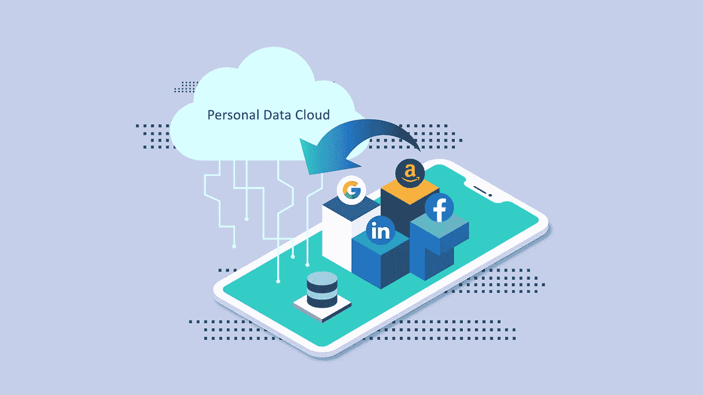
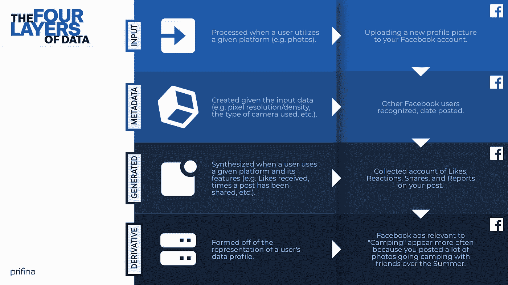
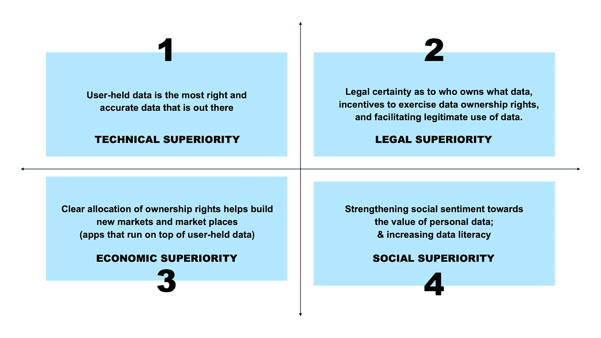

# 个人数据所有权

> 原文：<https://towardsdatascience.com/personal-data-ownership-f3b62e6ed07d?source=collection_archive---------20----------------------->

## 用户持有数据的个人所有权的法律、经济和政治原因。

“数据”和“隐私”是当今使用最频繁的流行语。接触追踪、监控和数据使用一直是决策者、经济学家和消费者权益倡导者争论的话题。

最突出的争论之一围绕着回答一个关键问题:谁应该拥有个人数据和由手机和智能设备产生的数据？我们中的绝大多数人都会同意，个人应该是他们生成的数据的所有者。

## **这篇文章中的观点在哈佛法律杂志&技术文摘(2021 年秋季)上发表的一篇法律评论文章中有更详细的解释——可在这里******访问。****

# **当前的方法:关注获取，而不是所有权**

**这可能会让您感到惊讶，但个人数据所有权(赋予个人拥有和控制其个人数据的权利)尚未在任何司法管辖区得到认可。法学界也不承认任何此类个人数据所有权。事实上，最受尊敬的法律思想家和智库认为，到目前为止，“没有任何法律原则或理论可以证明数据的专有财产权的分配是合理的。”**

**法律专家的主流观点是，我们不应该谈论所有权，而应该关注对数据的访问。这种方法在最近发布的[欧洲数据 2020 战略](https://ec.europa.eu/info/sites/info/files/communication-european-strategy-data-19feb2020_en.pdf)和[欧洲人工智能白皮书](https://ec.europa.eu/info/sites/info/files/commission-white-paper-artificial-intelligence-feb2020_en.pdf)中也受到了青睐。因此，许多计划是围绕各种组织(公司、研究机构、政府机构等)之间的数据可移植性和互操作性而建立的。).**

# **新兴技术正在改变关于个人数据所有权的争论**

**我们生活在一个有趣的时代，新技术正在改变我们生活的方方面面。这些新技术的出现为个人消费者(不仅仅是公司)控制他们的数据以及管理和控制这些数据的使用方式带来了新的机遇。**

**我们认为，必须根据这些新技术重新考虑个人数据所有权的问题，以及个人消费者是否应该对其个人数据拥有合法所有权。**

**更具体地说，我们认为，一旦接触到帮助个人在一个地点收集个人数据(姑且称之为“个人数据云”)并控制数据使用方式的技术解决方案，许多拒绝个人数据所有权想法的人将会改变主意。**

# **基于以用户为中心的数据模型的技术**

**目前，我们正在见证基于所谓的“以用户为中心”的数据模型的新技术解决方案的出现。以用户为中心的数据模型的主要前提是，个人在“个人数据云中”持有自己数据的主副本(可以把它想象成一个存放所有数据的 Dropbox 文件夹)。每个个人数据云都由组织数据的软件支持。**

**个人数据云中保存的所有数据来自两个来源之一。首先，一些数据是由个人手动添加的，比如上传的驾照、财务报表和每月账单的副本。第二，一些数据是从第三方数据聚合器或数据处理器收集的。这一过程是完全自动的，可以由“生活”在个人个人数据云中的软件来执行。从第三方服务提供商处检索个人数据是可能的，因为法律法规要求数据聚合器和数据处理器向个人提供公司收集的关于他们的所有数据的副本，如 GDPR 第 15(3)条“获得数据副本的权利”和 GDPR 第 20 条“数据便携性权利”所规定。**

****

**保利乌斯·尤尔西斯和金京培**

**通过能够在一个地方收集不同数据源的个人数据，个人实际上获得了对其数据的控制权。就像任何其他在线帐户一样，只有个人用户可以访问她的个人数据云(第三方只有在用户事先明确同意的情况下才能访问某些用户持有的数据)。此外，个人数据云中保存的数据会由嵌入个人云中的软件不断更新。收集在个人数据云中的数据也是“标准化的”，使用户易于阅读。**

**采用以用户为中心、用户持有的数据模型有三个重要的影响。**

## ****(a)所有权和控制权****

**首先，在以用户为中心的模式中，个人对如何使用数据以及与谁共享数据拥有最终控制权。这在法律上和实践中都适用。**

## ****(b)在客户事先明确同意的情况下访问客户数据****

**第二，公司将能够直接从客户那里获得有关他们客户的信息。这将通过每个人事先表达的同意来授予，并将允许个人决定什么数据用于什么目的(想想数字水印)。**

## ****(c)有数据的新机会****

**第三，以用户为中心、用户持有的数据模型为新型数据用途打开了新市场。将创建一种全新的应用程序，以帮助个人更好地了解他们的个人数据(“数据小工具”)并“激活”个人数据(例如，基于从网飞、Hulu、亚马逊 Prime video 和 IMDB 收集的数据生成的电影推荐)。从技术角度来看，最吸引人的方面是这些新的数据应用程序将在用户持有的数据之上本地运行(数据永远不会离开用户的云或设备，即使在应用程序中使用)。**

**在接下来的部分中，我们将讨论与授予个人消费者对个人数据的合法所有权相关的问题。**

## **(1)您拥有哪些数据？**

**在关于数据所有权的法律辩论中，定义可能属于个人的个人数据一直是一个历史性的问题。更具体地说，许多辩论都集中在什么样的数据是“个人”的，什么样的数据数据巨头可以声称是自己的。另一个挑战是，大量数据实际上掌握在服务提供商(谷歌、脸书等)手中。).**

**以用户为中心、用户持有的数据技术从非常实用的角度解决了这一难题。一旦数据“进入”个人数据云，它在物理上就处于个人的专有控制之下，因为除了个人之外，没有人可以访问云。**

> ***关于这个问题:*个人应该拥有哪些数据？
> *简而言之就是:* **个人数据云中的所有数据**。**

**一旦有关个人的数据被收集到个人数据云中，这些数据就会自动“规范化”(即统一和分类)，从而成为一个新的对象，具有自己独特的结构和布局。**

**然而，所有权问题的更长答案需要进一步澄清。如果我们分析科技公司的数据收集做法，可以识别出四层数据:(a)输入数据，由用户手动提供；元数据；(c)可观察和观察到的数据；以及(d)导出数据。**

**让我们以 Instagram 为例:如果你上传一张照片到你的个人 Instagram 账户，Instagram 能够生成四层数据:**

1.  ****输入数据:**个人手动添加的所有数据(例如，照片本身、照片说明、评论、标签等。);**
2.  ****照片中的元数据:**附在照片上的 GPS 数据，以及关于相机、分辨率和照片附带的其他信息的详细信息。**
3.  ****观察到的数据:**关于照片如何被使用的数据。这个数据既不是 Instagram 创造的，也不是个人创造的。同样清楚的是，个人无法访问它。**
4.  ****衍生数据**:基于上面提到的所有这三类数据，Instagram 使用推理来生成用户的信息档案(例如，偏好、行为模式、关于个人的数百种见解等)。).**

****

**丹尼尔·阿里和保罗·尤尔西斯，普里菲纳**

**目前，技术巨头声称他们合法拥有观察到的和衍生的数据(上面的第 3 类和第 4 类)。**

**然而，在以用户为中心的模式中,( a)个人能够通过行使其 GDPR 和 CCPA 权利从第三方服务提供商检索的数据，以及(b)存储在仅个人可访问的个人数据云中的数据，应被视为在个人的实际拥有和控制范围内。此外，由于数据是以独特的方式排列的，因此有可能声称个人也应被视为其合法的所有者。**

## **(2)个人拥有哪些权利？**

**法律学者一再质疑个人对其数据的权利范围。产权制度——版权或其他知识产权、商业秘密或新型的产权制度(所谓的*特殊权利*等等。—个人数据应归入哪个类别也受到了广泛讨论。似乎大多数作者都同意个人数据不属于任何一类。**

**实际拥有和控制是将个人数据定性为个人可以合法拥有的对象所需的核心缺失部分。然而，随着新的以用户为中心、用户持有的数据解决方案的出现，没有人反对在物权法中将此类数据归类为个人所有的物品。**

**诚然，每个国家的财产制度都不同，每个国家都有不同的要求，需要满足这些要求才能将一个物体视为财产法的“物”。例如，在英国普通法中，从严格的财产法角度来看，必须满足四个主要要求才能将一个物体视为"物":**确定性、排他性、控制和可转让性**(根据 Mummery LJ 在案件[*fair star*](http://www.bailii.org/ew/cases/EWCA/Civ/2013/886.html)【2013】EWCA Civ 886(2013 年 7 月 19 日)中的意见)。**

**保存在用户个人数据云中的数据满足所有这些要求:(a)可以确定地识别这些数据，(b)个人有权禁止他人访问这些数据，个人显然可以控制这些数据，以及(d)个人可以将这些数据分配或传输给任何第三方(如果她愿意)。**

**承认个人数据的所有权意味着个人拥有以下四项与所有权相关的“传统”权利:拥有个人数据的权利；按照自己的意愿使用和享受这些数据的权利；处置数据的权利；以及从个人数据中获取价值的权利。**

# **个人数据所有权是常识**

**个人应该拥有自己的个人数据是常识。大多数人会同意他们应该拥有自己的个人数据。**

**这一观点与数据技术公司(GAFA)对其收集的数据所持的观点一致。如果大公司可以声称他们长期收集的数据形成了专有资产和商业秘密，那么个人也应该能够声称他们对他们在个人数据云中聚集的数据拥有所有权。**

**最后，个人是个人数据云中个人数据的合法所有者，这一观点绝不需要对现有法律框架进行变革。相反，它应该被看作是由数字空间的发展引起的自然演变。**

# **实际影响**

**承认个人拥有自己的个人数据具有重要的社会、法律、经济和技术意义。**

****

**普里菲娜·保利乌斯·尤尔西斯**

**首先，用户持有的数据在技术上更优越:如前所述，用户持有的数据代表了关于个人的最准确的数据。这是最新的数据。没有任何其他组织比个人本身拥有更准确和可靠的数据。**

**第二，用户持有的数据在法律上是优先的。承认个人对数据的所有权解决了企业目前面临的许多问题。在以用户为中心的模式中，个人在事先明确同意的情况下，允许第三方服务提供商访问他们的数据。因此，组织将能够遵守数据最小化要求，并合法地访问和处理所有数据。**

**第三，用户持有的数据为企业创造了在用户持有的数据上构建新型应用的机会。这将使数字互动更加安全:数据泄露的可能性将会下降，因为集中服务器中保存的客户数据将会减少。此外，用户持有的数据将让公司做出更个性化的报价，并向客户提供定制服务。**

**最后，用户持有的数据具有社会优势。通过创建实用的工具，让个人对其个人数据进行粒度控制，个人将变得更懂数据。此外，与服务提供商的互动将更加平等，因为个人将设定第三方访问数据的条款。这可能有助于改变对个人数据价值的看法；个人数据将不再是一次性物品，而是一种能产生长期价值的资产。**

# **加入运动吧！**

**如果你有兴趣加入一个以用户为中心的社区，我想邀请你加入" [Liberty。平等。数据。](https://join.slack.com/t/libertyequalitydata/shared_invite/zt-ddr4t974-MCzsch4FSeux8DrFQ2atbQ)“懈怠组。**

**如果你有关于数据所有权或隐私的其他想法，并希望与我讨论，请评论这篇文章或直接与我联系。**