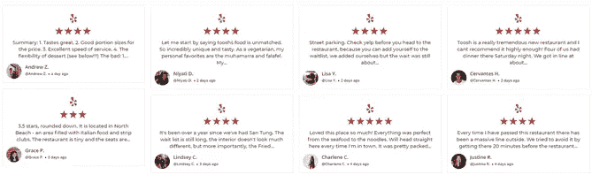
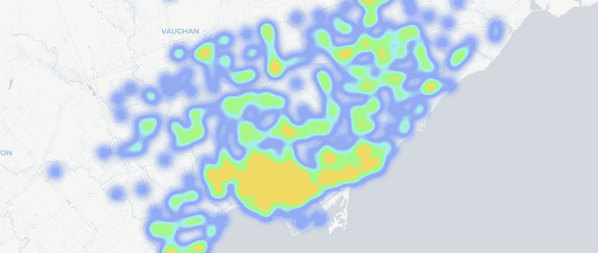
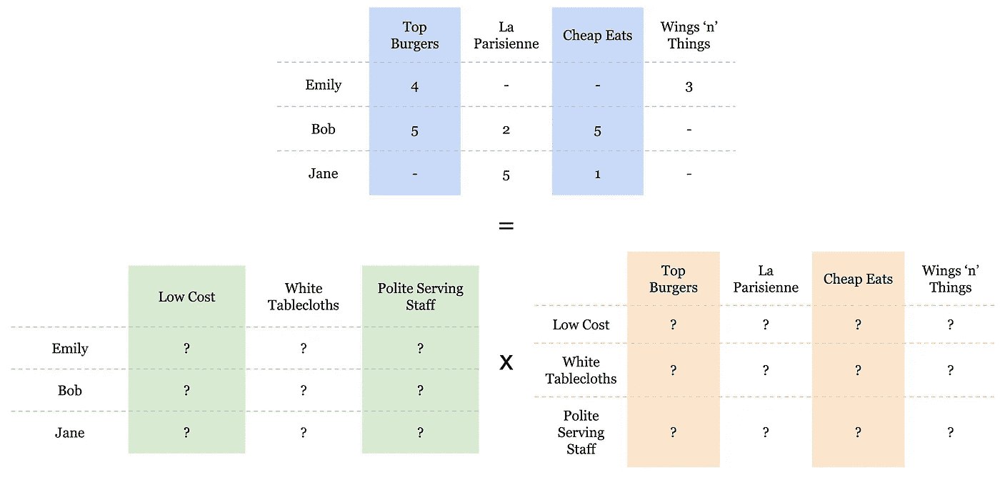
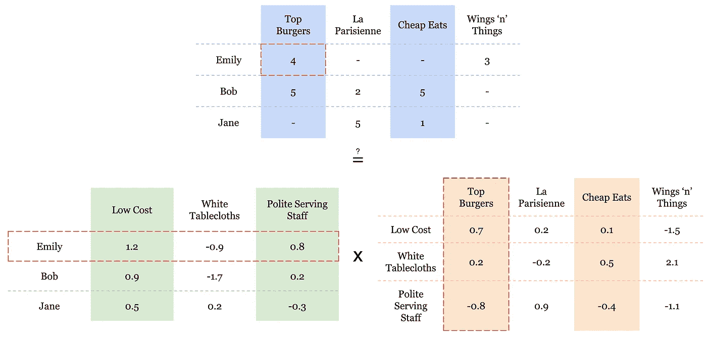
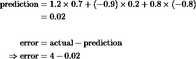
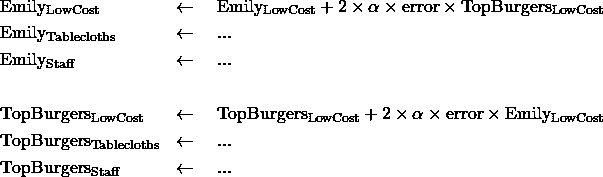
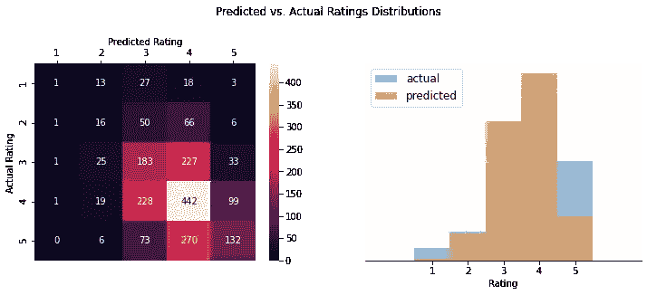

# 使用 FunkSVD 推荐个性化餐厅

> 原文：<https://towardsdatascience.com/personalised-restaurant-recommendations-using-funksvd-3beff200b01c?source=collection_archive---------63----------------------->

## 除了推荐顶级餐厅，我们还能做得更好吗？

多伦多的天际线相当惊人——但是食物有多好呢？(图片来自[维基共享资源](https://commons.wikimedia.org/wiki/File:Toronto_Skyline_May_2013.jpg))

2009 年 9 月，网飞[授予](https://netflixprize.com/)100 万美元的奖金，奖励一个开发了一种算法的团队，该算法将他们的评级预测提高了 10%以上。排在第三位的是由[西蒙·芬克](https://sifter.org/~simon/journal/20061211.html)——芬克 SVD 创作的个人作品。

在这篇文章中，我描述了我尝试使用 FunkSVD 根据用户的预览评论推荐餐馆。

我的目标——我能向用户提供更个性化的推荐，而不只是简单地推荐一个城市的顶级餐厅吗？

推荐引擎被世界各地的公司广泛使用:比如 AirBnB、网飞和 Spotify。像这样的公司的成功取决于他们向用户提供准确和中肯的推荐的能力(如果 Spotify 一直推荐你最不喜欢的音乐类型，你多久会回到它那里?))

这些推荐引擎通常从用户输入(例如，用户评级)中学习，但是该领域中的一个关键问题是:

> 当一个用户只给少数几个项目评分时，你如何预测每个项目的评分？

截图来自 [Yelp](https://www.yelp.co.uk/toronto)

为了调查这个问题，我使用 [Yelp 数据](https://www.kaggle.com/yelp-dataset/yelp-dataset?select=yelp_academic_dataset_business.json)来查看餐馆评论。以多伦多为例，那里有一千多家餐馆，但是 Yelp 的绝大多数用户给其中不到 10 家打了分。我们如何填补空白——预测他们所有的评论，以便我们可以推荐他们会喜欢的新餐馆？这就是 FunkSVD 的用武之地。

多伦多的餐厅位置

# 什么是 Funk SVD？

FunkSVD(其中 SVD 代表奇异值分解)是一种填充用户项目评级矩阵的方法。考虑下面不同餐厅的用户评分矩阵(蓝色)，最终目标是用预测填充未知评分，以便我们可以将这些预测中最高的作为我们的推荐。思考正在发生的事情的另一种方式是看下面的例子:

> 大多数喜欢顶级汉堡的用户也喜欢 Wings 'n' Things，但不喜欢 La Parisienne。
> 
> 如果我们知道凯特喜欢顶级汉堡，她很可能也喜欢鸡翅之类的东西。

我们这样做的方法是通过引入一组被称为潜在因素的中介实体。为了赋予这些内容，我们可以将它们视为用户可能喜欢或不喜欢的餐馆属性——每个潜在因素都是对餐馆进行评级的新尺度。例如，一家餐馆可能或多或少比较贵，或多或少可能使用白色桌布，等等。其中的每一个都可能与用户的评级有关，我们希望了解两件事:

*   每个餐厅与每个潜在因素的关联程度如何？
*   每个用户对每个潜在因素的关心程度如何？

给定这些信息，我们可以使用矩阵乘法来重建完整的*用户-餐厅评级矩阵:*

用户矩阵(绿色)和餐馆矩阵(橙色)相乘形成用户-餐馆评级矩阵(蓝色)。

因此，我们有一个攻击计划，计算每个餐馆和用户的每个潜在因素的值，然后乘以矩阵，以获得每个用户-餐馆对的预测评级。但是我们该如何着手呢？

这就是 FunkSVD 方法发挥作用的地方。首先，我们*猜测。*我们用随机数填充两个矩阵。然后我们一个接一个地检查我们已知的等级(蓝色),并根据需要上下移动绿色和橙色的猜测值，以接近真实的数字。我们对每个已知的评级都这样做，并多次迭代该过程，以接近用户和餐馆矩阵的稳定解决方案。这是*梯度下降的一个例子。*

下面我们展示迭代的一个步骤:

已经用随机值初始化的潜在因子矩阵

我们计算预测的评级(目前来看一点也不好，因为它是随机的)。

我们相应地微调红色突出显示的单元格中的每个值。我们微移的量与误差的*梯度*有关——也就是说，我们希望在最小化预测值和实际值之间差异的方向上微移它。

这里的左箭头←表示“用右边的值设置左边的值”

一旦这六个值被更新，算法就移动到下一个已知的评级，这里是 Emily 对 Wings‘n’Things 的评级，并重复上述步骤。学习速率 **𝛼** 决定了算法下山的速度，并且对于允许拟合的及时但受控的收敛是重要的。

一旦我们为每个已知的评级完成了一个完整的循环，我们就重复这个过程，直到与训练数据达到合适的拟合。

## 谈谈潜在因素

上面，我建议潜在的因素应该是用户和餐馆容易理解的属性。不幸的是，这过于简单化了。实际上，它们可能是一个完全任意的概念，只是碰巧描述了用户和餐馆之间的关系。模型使用的潜在变量的数量由您决定，但是太多的潜在变量将意味着模型*过度适应训练数据*，这将降低模型根据看不见的数据进行预测的能力。

# 它做得怎么样？

为了量化模型的表现，我将评论数据分成训练和测试子集。对于这样的评级数据，重要的是对时间顺序数据进行分割(这样模型就不会在已经从未来学习的情况下预测过去的评级)。为了实现这一点，2014-2018 年的评论被用作训练集，而 2019 年的评论被用作测试集。

下面，我绘制了预测值与实际值的*混淆矩阵*，以及它们在模型中的代表性分布(一个完美的模型将显示一个只有对角线条目的混淆矩阵)。

我们的模型似乎低估了极端情况下的评分

使用的关键评分指标是 2019 年预测和实际之间的误差平方和(SSE)。为了计算这一点，对于具有相关联的*实际*值的所有预测(即，具有 2019 年评论的用户-餐馆对)，我们计算预测和实际之间的差的平方。这些值的总和就是我们的 SSE。

这个度量标准可以很好地比较不同版本的模型，但实际上只是一个相对的度量。我们真正想知道的是——模型需要好到什么程度才能有用？

为了回答这个问题，我比较了模型中的 SSE 和通过简单地向每个用户推荐城市中的顶级餐馆计算的 SSE(或者更准确地说，每个用户对餐馆的预测评级只是餐馆的平均历史评级，没有考虑用户与餐馆的互动)。

在对模型进行了一点优化之后，通过调整潜在因素的数量、学习率和迭代次数，我得到了一个比天真地向每个用户推荐顶级点评餐厅(SSE *低 4*)略好*的模型。*

推荐器的输出是一个推荐餐馆的地图，上面有每个餐馆的预测评级和一个作为工具提示的 google 搜索链接。通过运行下面的代码笔，您可以看到一个示例建议。

对于那些没有做出足够数量的评论以从 FunkSVD 方法中受益的用户，推荐者依靠推荐城市中的顶级餐馆。它还允许最终用户进入某个餐馆，并接收对*相似*餐馆的推荐(由相似用户的相似评级定义)。

# 最后的想法

这种对 FunkSVD 餐厅推荐的初步尝试表明，不需要太多的优化，就可以预测出比预测每个餐厅平均值的简单方法更好的评级。

对于进一步的功能，允许最终用户通过其他上下文因素过滤结果将是有用的(因此也建立了基于知识的方法)。两个显而易见的因素是餐馆的位置(“帮我找两英里内我喜欢的餐馆”)和菜肴(“帮我找我喜欢的中国餐馆”)。

最后一个大声喊出来的是 [Numba](http://numba.pydata.org/) ，通过使用这个 python 库，对我现有的函数进行有限的修改，我能够将模型拟合的执行速度提高超过 400 倍的*!*如果你有正在运行的主要使用 *numpy* 核心函数的函数/循环，检查一下，看看它能让你的代码加速多少。

 [## Paul stub ley-LinkedIn 自由职业数据和决策科学家

### 我是一名经验丰富的数据科学家，在个人工作和管理团队方面都有卓有成效的工作经历。

www.linkedin.com](https://www.linkedin.com/in/paul-stubley-32b134100/) 

*如果你想联系我，你可以在* [*LinkedIn*](https://www.linkedin.com/in/paul-stubley) 上联系我。*如果你想看代码和分析，可以在*[*GitHub*](https://github.com/paul-stubley/Udacity/tree/master/Capstone_Project)*上查看。使用的数据是* [*Yelp 评论数据*](https://www.kaggle.com/yelp-dataset/yelp-dataset?select=yelp_academic_dataset_business.json) *。*