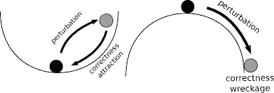

# 深层神经网络(DNN)训练中的扰动理论

> 原文：<https://towardsdatascience.com/perturbation-theory-in-deep-neural-network-dnn-training-adb4c20cab1b?source=collection_archive---------15----------------------->

消失梯度，鞍点，对抗训练

图 1:扰动可以帮助接近正确吸引点([来源](https://bit.ly/397GHwr))。

**先决条件**——这篇文章假设读者对神经网络架构有初步的了解，并训练过某种形式的深度网络，在此期间可能会面临一些与训练或模型鲁棒性相关的问题。

与训练相关的各种参数/组件(如梯度、重量、输入等)的小扰动或微移。可以影响 DNN 训练以克服可能遇到的一些问题，例如，*消失梯度*问题，*鞍点*陷阱，或者通过*对抗训练*创建健壮模型以避免恶意攻击等。

通常， [***微扰理论***](https://en.wikipedia.org/wiki/Perturbation_theory) 是研究一个系统中的微小变化，这种变化可能是由于第三个物体与该系统相互作用的结果。例如，天体(行星、月亮等)的运动。)太阳周围的物体受到其他行星/卫星的影响，尽管太阳的质量几乎是太阳系的 99.8%。几乎与此类似，在 DNN 训练中，其组件(梯度、权重、输入)中的小扰动被用于解决在训练过程中或从训练模型中可能遇到的一些问题。

> **免责声明**:需要非常明确的是，深度学习/机器学习中没有正式的扰动理论。然而，术语“扰动”的使用在机器学习文献中并不陌生。这经常被用来描述一个主体的包含部分的微移。这个博客是文学中扰动相关技术积累的结果。

# 消失梯度

神经网络只是一种近似函数的方法，它接受输入并产生输出。下面的最终训练的黑盒模型实际上是许多函数(f(g(x))的组合，即每个隐藏层代表组合系列中的一个函数，接着是非线性激活函数的组合，然后是隐藏层，等等；非线性激活函数是为了引入非线性，否则，它只是一系列矩阵乘法，可以简化为只能模拟线性函数的单个矩阵，对于该单个矩阵，仅仅一层就足够了。

神经网络参数(权重和偏差)用某一组初始值初始化。然后根据训练数据对这些进行更新。使用下降方向上的梯度来执行更新以找到最小值(实际上是局部最小值，因为函数是非凸的，并且不能保证达到全局最小值)，这在实践中不管网络的深度或复杂性如何都有效。

为了计算梯度，我们从最后一层的参数开始，然后向后传播(一个解决的说明[反向传播](https://mattmazur.com/2015/03/17/a-step-by-step-backpropagation-example/))到第一层的参数。当我们从最后一层移动到初始层时，每一层参数的梯度计算增加了乘法项的数量(函数组合的梯度)。许多项的这种相乘可以导致初始层的梯度消失(随着项的数量越来越深，项越来越多)，并且如果这些项的值在[0，1]的范围内，这是激活函数的变化率(即梯度，暂时忽略隐藏层的贡献，因为它们可能在该范围内，也可能不在该范围内)，例如，sigmoid (0，1/4)，双曲线正切(0，1)等。换句话说，在消失梯度中，最后一层的参数将学习得很好，但当我们向初始层移动时，梯度可能会开始消失或足够低，从而显著增加训练时间。为了避免这种情况，可以使用 ReLU 或其[变体](/avoiding-the-vanishing-gradients-problem-96183fd03343)或批量标准化，但这里我们将讨论梯度中的一点扰动(来自论文 [Neelakantan et al. (2015)](https://arxiv.org/abs/1511.06807) )也可以帮助缓解问题。

梯度中的*扰动是通过添加具有零均值的高斯分布噪声，并且**衰减方差-** 比固定方差更好地工作，此外，即使当**成本函数** (J)值接近收敛时，我们也不想要恒定扰动。这个过程也有助于避免过度拟合，并可以进一步降低训练损失。每个训练步骤 **t** 的扰动梯度计算如下:*

**

*其中训练步骤 **t** 的衰减方差(σ)为:*

**

*其中η (eta)的值通常取为 1(尽管可以调整，但必须在 0 和 1 之间)，γ参数设置为 0.55。*

*另外，这一过程实际上增加了培训过程的随机性，有助于避免早期学习过程中的**平稳期**。*

# *鞍点*

*它是曲线上的一个固定点，其形状是马鞍的形状(如图 2 所示的骑马)。例如，在损失函数最小化的曲线中，如果当其中一个轴固定时驻点是局部最小值，而当另一个轴固定时驻点是最大值，则驻点是[鞍点](https://www.youtube.com/watch?v=8aAU4r_pUUU)(不失一般性，为了解释的目的，我们将考虑三维曲线)。从鞍点开始，沿着一个轴的移动函数值增加，而在另一个轴上函数值减少，然而，对于一个点，最小值应该在它移动的所有方向上增加，而最大值在所有方向上减少。*

**

*图 2:马鞍形曲线([来源](http://theorangeduck.com/page/local-minima-saddle-points-plateaus)*

*有时，训练过程会停滞在鞍点，因为梯度评估为零，这导致权重参数(w)没有更新。为了[有效地逃离鞍点](http://www.offconvex.org/2017/07/19/saddle-efficiency/)可以扰动权重。权重 ***的扰动*** 取决于权重的梯度**，例如当梯度的 L2 范数小于某个恒定值 **c** 时，则应用扰动。扰动由下式给出:***

**

*其中 ***w*** *t* 是训练的第 **t** 次迭代的权重，并且 **ξ** *t* 是从以零为中心的具有适当小半径的球上均匀采样的。然而，没有必要添加均匀噪声，也可以使用高斯噪声，然而，这在经验上没有任何额外的优势。为了便于分析，使用了均匀噪声。同样，仅在梯度较小时添加噪声既不必要也不必要；由我们来决定何时以及如何扰动权重，例如，间歇扰动(每隔几个迭代，没有条件)也将工作，它具有多项式时间保证。*

# *对抗训练*

*字典将**对手**定义为`a force that opposes or attacks; an opponent; an enemy; a foe.`类似地，深度学习模型的一个对抗性例子将是恶意、垃圾或有毒的输入，它可以通过高度自信地预测不正确的输出来欺骗它发生故障。*

*为了使神经网络模型对这些对立的例子具有鲁棒性 [Goodfellow 等人](https://arxiv.org/abs/1412.6572)提出了 ***对输入*** 的扰动。扰动产生多个输入，这些输入是通过将具有符号值为**的梯度**(相对于训练输入计算)乘以常数值的输入相加而获得的。扰动图像的创建被给出为:*

**

*其中 x 是训练输入，xˇ是新的扰动图像，∇x(J)是损失函数(j)相对于训练输入 x 的梯度， **ϵ** 是预定的常数值，由于其有限的精度，小到足以被数据存储设备丢弃，并且如果输入为正，则**符号**函数输出 1，如果输入为负，则输出 1，如果输入为零，则输出 0。这项技术最近在美国专利法下获得了专利，你可以在这个[链接](http://www.freepatentsonline.com/10521718.html)中详细阅读。我强烈推荐它的阅读，以便更好地澄清，也作为一个软件算法专利是如何撰写的例子。*

*用扰动的输入训练网络扩展了输入分布的多元性。这使得网络对恶意输入具有鲁棒性，例如，它可以帮助避免图像分类任务中的像素攻击。*

# *结论*

*我们已经了解了扰动如何帮助解决与神经网络训练或训练模型相关的各种问题。这里，我们已经看到了与神经网络训练和训练模型相关的三个分量(梯度、权重、输入)的扰动；扰动，在梯度中是为了解决消失梯度问题，在权重中是为了避开鞍点，在输入中是为了避免恶意攻击。总的来说，不同方式的扰动起到了加强模型对抗各种不稳定性的作用，例如，它可以避免停留在正确性破坏点(图 1 ),因为该位置将通过扰动(输入、权重、梯度)进行测试，这将使模型接近正确性吸引点。*

*到目前为止，扰动主要是偶然的经验实验设计的直觉，以解决遇到的问题。如果干扰训练过程的一个组成部分直观上是有意义的，我们需要进行实验，并进一步根据经验验证它是否有助于缓解问题。然而，在未来，我们将在深度学习或机器学习中看到更多的扰动理论，这也可能得到理论保证的支持。*

***参考文献***

*[1].加入梯度噪音可以改善深度网络的学习。arXiv 预印本 arXiv:1511.06807 (2015)。*

*[2].金，迟，等。如何有效地避开鞍点。第 34 届国际机器学习会议录第 70 卷。JMLR。org，2017。*

*[3].古德菲勒、伊恩·j、黄邦贤·史伦斯和克里斯蒂安·塞格迪。"解释和利用对立的例子."arXiv 预印本 arXiv:1412.6572 (2014)。*