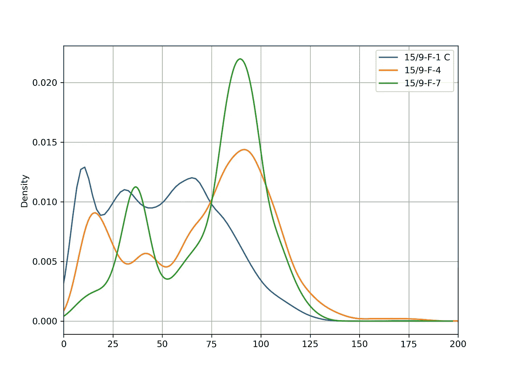

# 岩石物理学:Python 中的伽马射线归一化

> 原文：<https://towardsdatascience.com/petrophysics-gamma-ray-normalization-in-python-9a67a335dbd?source=collection_archive---------22----------------------->


麦克斯韦·尼尔森在 T2 的照片

## [实践教程](https://towardsdatascience.com/tagged/hands-on-tutorials)

测井数据的标准化是岩石物理工作流程中常见的常规过程，用于校正井间测井曲线的变化。这些变化可能是由许多不同的原因引起的，如不正确的工具校准、不同的工具年份和井眼环境条件的变化。

在本文中，我们将回顾:

*   什么是正常化
*   为什么我们要标准化测井数据
*   我们如何实现标准化
*   Python 中规范化的示例

## 什么是正常化？

标准化是重新标定或重新校准测井曲线的过程，以便它们与油田或区域内其他井的其他测井曲线一致。这可以通过对所需曲线应用单点标准化(线性移位)或两点标准化(“拉伸和挤压”)来实现。

标准化通常用于伽马射线测井，但也可用于中子孔隙度、体积密度、声波和自然电位测井。除非有足够的理由，否则电阻率测井一般不进行标准化(Shier，2004)。

在进行标准化之前，您应该与您的地层学家/地质学家进行讨论，并对您的数据进行彻底的质量控制，以了解是否有必要。**盲目地对数据应用归一化会导致地质变化和要素从数据中移除。所以要慎重考虑。Shier (2004)就如何对测井数据进行标准化提供了很好的讨论和指南，非常值得回顾。**

## 为什么我们要标准化我们的测井数据？

在一个区域内，通常假设相似的地质和地层单元应显示相似的最小和最大测井值以及相似的测井响应。然而，测井响应可能不同于测井井之间的预期模式有多种原因。这些可以包括:

*   钻孔环境的差异，如岩性变化
*   井眼形状的差异会影响测量，例如，井眼的扩大部分会有更多的井内流体，这会导致伽马射线测井的衰减，进而导致数值的降低
*   不正确地应用工具校准
*   测井工具技术和传感器随时间的变化
*   岩石的成岩变化
*   工具响应的漂移
*   来自多家服务公司的不同工具

执行标准化使我们能够在多口井之间进行有用的比较。这也使得批处理更加有效，尤其是在选择关键解释参数时。

此外，即使数据之前已经过井眼校正，也可以对数据进行归一化处理(Shier，2004)。这在处理不知道应用了何种校正的数据集时非常有用，尤其是在较旧的数据集中。

## 我们如何标准化测井数据？

标准化的工作流程通常包括在区域或油田内选择一口关键井，从中选择关键参数，并重新调整其他井的比例以进行匹配。

使用下面的等式，通过对测井数据进行简单的线性移位，可以实现标准化。这在我们知道数据有固定变化的情况下很有用，例如在不同岩性单元中记录中子孔隙度(Crain's Petrophysics，2020)。


更常见的是应用两点移位，由此数据被拉伸和压缩以匹配参考井。这经常应用于伽马射线数据。计算方法如下:


关键参数(从参考/关键点池中选择)可以是最小值或最大值。更常见的是，它们是从第 5 和第 95 百分位等百分位获得的值。如果使用最小值和最大值，您需要警惕异常值和异常读数。例如，如果参考井中的伽马射线读取 600 API 的单个值，并且它被用作参考最大值，那么它将延伸出被标准化到该范围的其他井。

# 使用 Python 的规范化示例

以下代码演练展示了一种使用 pandas 数据框架和 Volve 数据集(Equinor，2018)中的三口井标准化测井数据的方法。

您可以在 GitHub 上我的岩石物理学和 Python 系列的 **8 —曲线归一化. ipynb** 中找到这个例子的完整 Jupyter 笔记本，链接如下:

[](https://github.com/andymcdgeo/Petrophysics-Python-Series/) [## andymcdgeo/岩石物理学-Python-系列

### 本系列 Jupyter 笔记本将带您了解使用 Python 和岩石物理数据的各个方面。

github.com](https://github.com/andymcdgeo/Petrophysics-Python-Series/) 

## 设置库和加载数据

第一步是导入我们计划使用的所需库。在这种情况下，将是熊猫和 matplotlib 库。

```
import pandas as pd
import matplotlib.pyplot as plt
```

我们可以直接从 CSV 加载数据。在这个例子中，我使用了 Volve 数据集中的 3 个井的子集。

```
data = pd.read_csv('Data/VolveWells.csv')
```

然后，我们可以使用几个简单的命令来获取数据的详细信息:

```
data.head()
```

这将返回列标题和前 5 行数据:


我们可以立即看到在这个数据集中有哪些曲线，并且空值由 NaN(不是数字)值表示。这很好，意味着我们不需要替换价值观。

要检查数据中有哪些井，我们可以调用`unique()`方法:

```
data['WELL'].unique()
```

这将返回井名数组，如下所示:

```
array(['15/9-F-1 C', '15/9-F-4', '15/9-F-7'], dtype=object)
```

从这一初步探索中，我们可以说我们已经:

*   数据集内的 3 口井:15/9-F-1 C、15/9-F-4 和 15/9-F-7
*   没有必要将任何-999 值替换为空值
*   每口井 10 条测井曲线

## 绘制原始数据

在我们绘制数据之前，我们需要做的第一步是按照井列对数据框进行分组。这将使绘制柱状图变得更加容易。

```
wells = data.groupby('WELL')
wells.head()
```

我们可以看到，如果我们调用`wells.head()`，我们会得到一个分组数据帧，显示每个井的前 5 行。


比较分布和选择关键参数的最简单方法之一是使用直方图。在 Python 中，如果我们想看到分布线而不是条形，我们必须调用核密度估计(KDE)图，而不是直方图。使用我们的分组数据框架，我们可以循环通过每个井，将数据添加到图中，并在图例中显示正确的标签:

```
fig, ax = plt.subplots(figsize=(8,6))
for label, df in wells:
    df.GR.plot(kind ='kde', ax=ax, label=label)
    plt.xlim(0, 200)
plt.grid(True)
plt.legend()
plt.show()
```



从上面的图中，我们假设关键井是 15/9-F-7，我们将其他两口井标准化为这口井。

注意，分布似乎偏离了图的左侧，但是可以使用`min()`方法确认伽马射线曲线不存在低于 0 的值:

```
wells.min()
```


## 计算百分位数

如上所述，数据集可能包含错误值，这会影响曲线内的最小值和最大值。因此，一些解释者更喜欢将他们的标准化参数建立在百分位数的基础上。在这个例子中，我将使用第 5 和第 95 个百分点。

第一步是通过按井对数据进行分组，然后应用。quantile()方法应用于特定的列。在本例中，gr . quantile 函数接受一个小数值，因此值 0.05 相当于第 5 个百分位，0.95 相当于第 95 个百分位。

```
gr_percentile_05 = data.groupby('WELL')['GR'].quantile(0.05)
print(gr_percentile_05)
```

所以现在我们需要把它带回到我们的主数据框架中。我们可以使用`.map()`方法来做到这一点，该方法将合并共享一个公共列的两个数据序列。一旦它被映射，我们可以调用`.describe()`方法并确认它已经被添加到数据帧中。

```
data['05_PERC'] = data['WELL'].map(gr_percentile_05)
data.describe()
```

我们可以看到，我们上面计算的第 5 个百分位数的数据现在已经添加到数据帧的末尾。我们现在可以对第 95 百分位重复上述过程:

```
gr_percentile_95 = data.groupby('WELL')['GR'].quantile(0.95)
data['95_PERC'] = data['WELL'].map(gr_percentile_95)
data.describe()
```

## 创建标准化函数

在规范化我们的数据之前，我们必须首先创建一个可以多次调用的函数。提醒一下，我们使用的函数如下(Shier，2004):


```
def normalise(curve, ref_low, ref_high, well_low, well_high):
    return ref_low + ((ref_high - ref_low) * ((curve - well_low) / (well_high - well_low)))
```

使用上一步中计算的百分位数，我们可以设置我们的参考高值和低值:

```
key_well_low = 25.6464
key_well_high = 110.5413
```

为了将函数应用于每个值并为每个孔使用正确的百分位数，我们可以对 pandas 数据框架使用`.apply()`方法，然后对我们的自定义函数使用 lamda 函数。

```
data['GR_NORM'] = data.apply(lambda x: normalise(x['GR'], key_well_low, key_well_high, x['05_PERC'], x['95_PERC']), axis=1)
```

## 绘制标准化数据

为了查看最终的归一化数据，我们可以重用上面的代码来生成直方图。当我们这样做的时候，我们可以看到所有的曲线都被标准化为我们的参考井。

```
fig, ax = plt.subplots(figsize=(8,6))
for label, df in wells:
    df.GR_NORM.plot(kind ='kde', ax=ax, label=label)
    plt.xlim(0, 200)
plt.grid(True)
plt.legend()
plt.show()
```

我们现在有了标准化的伽马射线数据。当并排比较时，我们可以看到标准化对数据的影响。


# 结论

测井曲线的标准化是岩石物理工作流程中的一个重要步骤，可能有多种原因需要标准化，包括:工具校准不良、工具年份变化、岩性差异和井眼环境条件。

进行标准化使得多口井之间的比较更容易，并且在进行批处理时更容易选择关键的解释参数。

在本文中，我们介绍了如何使用 Python 对伽马射线测井进行简单的标准化。但是该方法同样适用于其他测井记录，通常需要注意的是，数据需要在事后进行感官检查。

# 参考

克雷恩岩石物理手册(2020 年)。可在:[https://www.spec2000.net/08-normalization.htm](https://www.spec2000.net/08-normalization.htm)

Equinor。(2018).公开所有 Volve 数据。可在:[https://www . equinor . com/en/news/14 jun 2018-discovery-volve-data . html](https://www.equinor.com/en/news/14jun2018-disclosing-volve-data.html)查阅

谢尔博士(2004 年)。测井标准化:方法和指南。岩石物理学，45(3)，268–280 页。