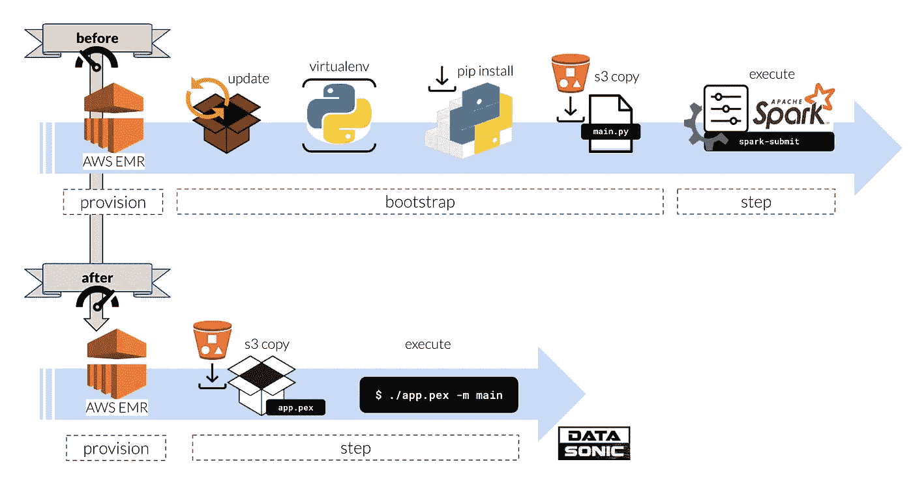
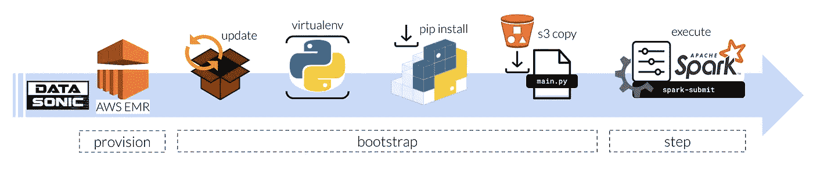
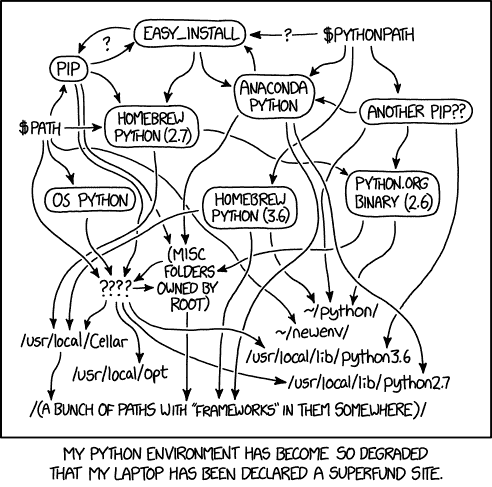
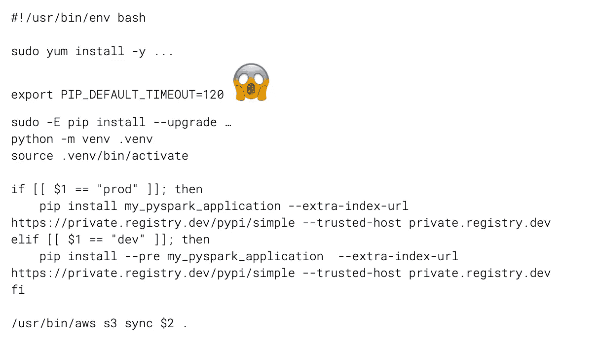
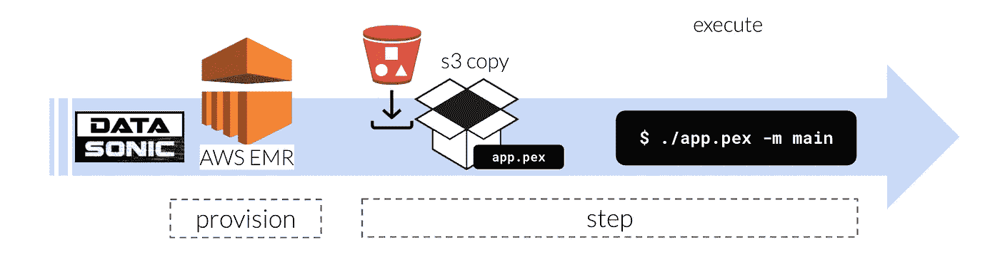
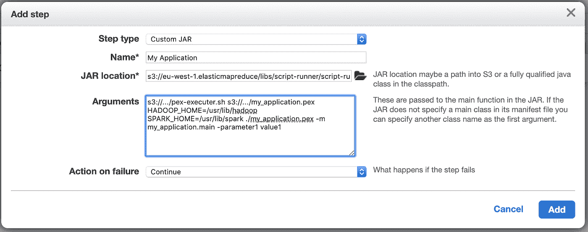

# PEX——AWS EMR 工作负载完美 PySpark 部署的秘方

> 原文：<https://towardsdatascience.com/pex-the-secret-sauce-for-the-perfect-pyspark-deployment-of-aws-emr-workloads-9aef0d8fa3a5?source=collection_archive---------9----------------------->

## 如何使用 PEX 加速 PySpark 应用程序在临时 AWS EMR 集群上的部署



[OC]

在大数据和数据科学领域，Spark 已经成为除深度学习之外的几乎所有事物的黄金标准:

*   用于数据湖的 ELT 取代了更传统的 ETL 范例
*   用于高级分析的 Spark SQL
*   一个用于数据科学的分布式批量计算框架，包括 Spark ML、GraphX、GeoSpark 等。
*   具有小批量流的近实时应用

虽然 Scala Spark API 在数据湖 ELT 工作负载和数据工程中发挥着重要作用，但数据科学和高级分析领域几乎完全是用 Python 编写的 PySpark 工作负载。大多数 Spark 工作负载都是在 AWS EMR 集群上执行的。一般的数据驱动型公司在数量同样惊人的短命 EMR 集群上轻松运行数百个每日 Spark 作业。

AWS Spot 实例具有吸引力的价格点已经建立了在非常短暂的 EMR 集群上运行 single Spark 作业的范例。EMR 提供短暂的计算资源，而 S3 为数据提供永久存储。使用由 100% Spot 实例组成的短暂 EMR 集群将这种模式推向极端是非常常见的，**神风特攻队风格**。

这种短暂的 PySpark 集群模式只有**一大痛点**:用 Python 包**引导 EMR 集群**。


https://www.flickr.com/photos/janpersiel/27706588173[(ɔ)](https://www.flickr.com/photos/janpersiel/27706588173)

# PySpark 在电子病历上的应用:坏与丑

在 EMR 上运行 PySpark 应用程序非常复杂。



[OC]

对于短暂的 EMR，我们必须在每次运行 PySpark 应用程序之前，根据我们的应用程序需求引导我们的集群。这应该是我们的 PySpark 应用程序包的一个简单的 pip 安装。但是现实远非如此简单。

1.  我们需要在 EMR 上安装和更新软件包，因为许多版本后面缺少默认安装。
2.  我们应该为我们的应用程序创建一个虚拟的 Python 环境，因为全局 Python 包会以奇怪的方式干扰。我们都去过那里。
3.  我们需要用 pip 安装我们的 PySpark 应用程序和需求
4.  我们需要从 S3 复制资产，例如 spark-submit 的 main.py 脚本
5.  最后，我们使用我们的**特定于应用程序的 spark 配置**调用 spark-submit 来最终运行我们的工作负载

**这种 EMR 方法有一些难点:**

1.  虽然我们实际上并不运行任何真正的工作负载，但是引导过程是为集群时间付费的。这对大型集群来说尤其重要！
2.  我们必须维护和下载不属于 Python 应用程序包的资产，例如 spark-submit main.py 脚本
3.  我们必须独立于 Python 应用程序包为我们的作业维护特定于应用程序的 Spark 配置，我们将 Python 应用程序包作为参数传递给 spark-submit 脚本。这些通常分散在 Jenkins 管道或气流 Dag 中，增加了维护 PySpark 应用程序的不必要的复杂性。
4.  打包和安装具有复杂依赖关系的 Python 应用程序会直接将您引向臭名昭著的依赖地狱。

考虑到 Python 的流行程度，Python 工具链远非理想，安装带有复杂依赖链和 pip 的包通常会导致众所周知的依赖地狱。不幸的是，pip 缺少一个强大的依赖解析器。



CC BY-NC 2.5，[https://xkcd.com/1987/](https://xkcd.com/1987/)

在商业数据科学团队中，通常还有第二层复杂性，即专有代码的**私有包索引**。我打赌你的私人包裹索引很慢。因此，您的 PySpark 应用程序的常见 EMR 引导脚本可能如下所示:



[OC]

如果运行 PySpark 应用程序像调用可执行文件一样简单**不是很好吗？无 pip 安装要求。没有主。py。没有火花-提交与火花内存配置搞乱詹金斯或气流。**

# 解决方案:PEX

PEX (Python 可执行文件)是一种文件格式和相关工具，用于创建类似于 virtualenv 的通用 Python 环境虚拟化解决方案。PEX 最初于 2011 年在 Twitter 上开发，用于将 Python 应用程序部署到生产中。PEX 文件是**自包含的** **可执行的** Python 虚拟环境。重点在于自包含和可执行性，这使得 PEX 文件非常适合应用程序部署到生产环境中。使用 PEX 文件，部署应用程序所需的唯一步骤是**复制文件**。不需要安装 pip，也不需要修改路径。

在 PEX 的帮助下，在 EMR 上运行 PySpark 应用程序不再需要任何引导！

*   PEX 大大简化了 PySpark 应用程序的运行
*   通过利用集群更早地运行我们的实际应用工作负载，而无需任何集群引导，从而节省资金。



[OC]

要创建 pex 归档，您可以使用 PEX 实用程序。您可以简单地安装它

```
pip install pex
```

当您在新的 Python 虚拟环境中执行此操作时，您可以使用 pex 来打包自身。以下命令使用名为“pex”的控制台脚本创建包含 pex 和请求的 pex 文件。将创建的可执行文件保存到~/bin/pex，您可以在任何 virtualenv 内部或外部使用 pex，就像您的路径上的任何其他可执行文件一样。

```
pex pex requests -c pex -o ~/bin/pex
```

PEX 有一个复杂之处:可执行文件包含一个自包含的 Python 虚拟环境，但不是 Python 解释器本身:PEX 可执行文件是依赖于平台的。目前，EMR 在 Linux 上运行 Python 3.6.10，你可以在 Mac 上开发。因此，通常最好使用 Docker 来创建可重复的结果。

构建与 EMR 兼容的 docker 映像，在 docker 容器中创建您的 PEX 归档:

```
FROM python:3.6-slim-busterRUN apt-get update && apt-get install -y --no-install-recommends \
  git \
 && rm -rf /var/lib/apt/lists/*RUN pip3 install pexRUN mkdir /app
WORKDIR /appENV PATH=/root/.local/bin:$PATH
```

如果您的组织使用私有包索引，例如 Artifactory，那么 PEX 显示了另一个弱点:在编写时，它没有通过 CLI 公开请求库的参数，这意味着当直接使用 PEX 解决包依赖关系时，我们不能为 pip 设置自定义网络超时。解决方法是使用舵手室。以下脚本可用于使用轮罩和带有自定义超时的私有包索引来构建 pex 归档:

```
#!/usr/bin/env bashpip3 download -r requirements.txt \
    --dest ./build/wheelhouse \
    --extra-index-url [https://private.registry.dev/pypi/simple](https://private.registry.dev/pypi/simple) \
    --trusted-host private.registry.dev \
    --timeout 120pex . -r requirements.txt \
    -o ./dist/my_application.pex \
    --platform manylinux2014-x86_64-cp-36-m \
    --no-index \
    -f ./build/wheelhouse
```

# 打包 PySpark 应用程序

我们的目标是打包一个完全自包含的 PySpark 应用程序，并在不需要 spark-submit 的情况下运行它。因此，我们的 Python 主函数必须创建一个 SparkSession:

```
if __name__ == "__main__":pex_file = os.path.basename([path for path in sys.path if path.endswith(".pex")][0])
    os.environ["PYSPARK_PYTHON"] = "./" + pex_filespark = (
        SparkSession.builder
        .master("yarn")
        .appName("my_spark_application")
        .config("spark.submit.deployMode", "client")
        .config("spark.yarn.dist.files", pex_file)
        .config("spark.executorEnv.PEX_ROOT", "./.pex")
        .config("spark.sql.shuffle.partitions", 4000)
        .config("spark.executor.memory", "1G")
        .enableHiveSupport()
        .getOrCreate()
    )
```

您可以将任何选项从您通常的 spark-submit 传递给 SparkSession builder。

这允许您在 PEX 可执行文件中执行 PySpark 应用程序，例如:

```
./my_application.pex -m my_application.main
```

# 执行 PEX 作为电子病历的一个步骤

最后一步是作为 EMR 步骤执行我们的 pex 应用程序。我们将使用脚本运行器和一个通用的瘦包装器作为一个步骤来执行 PEX。

脚本运行程序调用我们的瘦包装器，该包装器从 S3 提取一个 PEX 文件，并使用我们可能需要的所有环境变量和命令行参数来执行它。下面的脚本是一个你可以使用的名为 **pex-executor.sh** 的瘦包装器。只需将它放在 S3 上，即可供您的 EMR 集群使用:

```
#!/bin/bash
# Author: Jan Teichmann
# Version: 2020-02-10
# Wrapper to execute a PEX archive via an EMR Step
# Step type: Custom JAR
# JAR location: s3://eu-west-1.elasticmapreduce/libs/script-runner/script-runner.jar
# Arguments:
#      s3://.../pex-executer.sh 
#      s3://.../some-etl-job.pex 
#      HADOOP_HOME=/usr/lib/hadoop 
#      SPARK_HOME=/usr/lib/spark 
#      ./some-etl-job.pex -m package.module -fromdate=2020-04-20 -todate=2020-04-22aws s3 cp $1 .
chmod +x $(basename -- $1);shift;
eval "$@"
```

现在，您可以提交 EMR 步骤，例如通过 Airflow 的 EmrAddStepsOperator:

```
EmrAddStepsOperator(
    task_id="my_application",
    job_flow_id="my_emr_cluster_id",
    steps=[
        {
            "ActionOnFailure": "CONTINUE",
            "Name": "Run my_application Step",
            "HadoopJarStep": {
                "Args": [
                    "s3://.../pex-executer.sh",
                    "s3://.../my_application.pex",
                    "HADOOP_HOME=/usr/lib/hadoop",
                    "SPARK_HOME=/usr/lib/spark",
                    "./my_application.pex",
                    "-m",
                    "my_pyspark_application.main",
                    "-parameter1",
                    "value1" 
                ],
                "Jar": "s3://eu-west-1.elasticmapreduce/libs/script-runner/script-runner.jar",
            },
        }
    ],
    aws_conn_id="aws_default",
    dag=dag,
)
```

正如您在上面看到的，我们首先传递两条 s3 路径。第一个是我们的瘦包装器 pex-executor.sh，它将由 AWS script-runner.jar 执行。pex-executor 脚本将依次下载应用程序 pex 可执行文件。

我们还定义了 EMR 需要的两个环境变量 HADOOP_HOME 和 SPARK_HOME。您可以根据需要添加任何额外的环境变量。

然后，我们传递可执行文件的名称，并传递 Python 应用程序的任何 CLI 参数。

或者通过 EMR 控制台:



[OC]

# 摘要

PEX 允许我们将 PySpark 应用程序作为完全自包含的可执行文件运行，就像我们使用 Scala API 时，带有 uber-JAR 或 fat-JAR 的 Spark 应用程序允许的那样。

这极大地**简化了**使用 PySpark 和**的短暂 EMR 集群，节省了时间**和**节省了资金**，因为我们不必引导集群。

将 pex 可执行文件的创建打包到一个 Jenkins 管道中，您就拥有了一个强大的 DevOps 模式来构建包并将它们上传到 S3 进行部署。

然后，您可以安排您的 PySpark 应用程序，例如使用气流。因为您的 PEX 应用程序是完全自包含的，所以您将能够在 Airflow 中创建非常通用的 Dag，而不会导致任何应用程序逻辑和配置分散在多个平台和存储库中。

> 简单是最高级的复杂


Jan 是公司数据转型方面的成功思想领袖和顾问，拥有将数据科学大规模应用于商业生产的记录。他最近被 dataIQ 评为英国 100 位最具影响力的数据和分析从业者之一。

**在领英上连接:**[https://www.linkedin.com/in/janteichmann/](https://www.linkedin.com/in/janteichmann/)

**阅读其他文章:**[**https://medium.com/@jan.teichmann**](https://medium.com/@jan.teichmann)