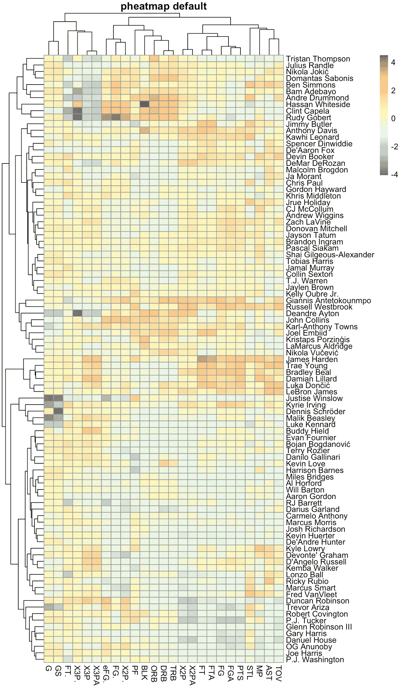

# Pheatmap 绘制了漂亮的热图

> 原文：<https://towardsdatascience.com/pheatmap-draws-pretty-heatmaps-483dab9a3cc?source=collection_archive---------2----------------------->

## 工具

## 如何用 r 中的 *pheatmap* 生成漂亮的热图的教程。


照片由[丹金](https://unsplash.com/@danielcgold?utm_source=medium&utm_medium=referral)在 [Unsplash](https://unsplash.com?utm_source=medium&utm_medium=referral) 上拍摄

eatmap 是数据科学家必备的数据可视化工具包之一。

在 **R** 中，有很多生成热图的包，比如[*heat map*](https://www.rdocumentation.org/packages/stats/versions/3.6.2/topics/heatmap)*()*，[*heat map . 2*](https://www.rdocumentation.org/packages/gplots/versions/3.0.3/topics/heatmap.2)*()*，以及*[*heat maply*](https://cran.r-project.org/web/packages/heatmaply/vignettes/heatmaply.html)*()*。不过我最喜欢的还是[***pheatmap***](https://www.rdocumentation.org/packages/pheatmap/versions/1.0.12/topics/pheatmap)***()***。我非常肯定你看完这篇帖子后会同意我的选择。*

*在这篇文章中，我将通过将这个强大的数据可视化包 ***pheatmap*** 应用到 *NBA 球员在*2019–2020*赛季的基本统计数据*中，来详细介绍这个包。*

*原始数据来自 [***篮球参考***](https://www.basketball-reference.com/leagues/NBA_2020_per_game.html) 。你可以手动下载数据集，也可以按照我之前的一篇文章[](https://www.basketball-reference.com/leagues/NBA_2020_per_game.html)*来*抓取数据*。**

**准备开始了吗？我们走吧。**

## **准备**

****语言:**R。
**包名:** [pheatmap](https://www.rdocumentation.org/packages/pheatmap/versions/1.0.12/topics/pheatmap) 。**

```
**install.packages("pheatmap")
library(pheatmap)**
```

****数据:**2019–2020 NBA 球员场均数据。**

```
**df = read.csv("../2019_2020_player_stats_pergame.csv")head(df)**
```

****

**我们正在处理的数据集的头(由 [Yufeng](https://medium.com/@jianan.jay.lin)**

**上面是我们正在处理的数据框的头部。你不明白列名是什么没关系，因为它们都是篮球的统计数据。不影响我们对热图绘制的探索。**

****数据清理:**过滤掉每场比赛上场时间少于 30 分钟的球员，删除赛季中被交易的球员的重复，并用 0 填充 NA 值。**

```
**df_filt = df[df$MP >= 30 ,]TOT_players = df_filt[df_filt$Tm == "TOT","Player"]df_used = df_filt[((df_filt$Player %in% TOT_players) & (df_filt$Tm == "TOT")) | (!(df_filt$Player %in% TOT_players)),]df_used[is.na(df_used)] = 0**
```

## **默认 pheatmap**

**首先，pheatmap 只接受数字矩阵对象作为输入。因此，我们需要通过删除分类数据的前 5 列，将数据帧的数字部分转换为矩阵。**

```
**df_num = as.matrix(df_used[,6:30])**
```

**由于矩阵的**行名**是热图中的默认行标签，我们最好通过避免数字索引使它们**有意义**。**

```
**rownames(df_num) = sapply(df_used$Player,**function**(x) strsplit(as.character(x),split = "\\\\")[[1]][1])**
```

**玩家数据的不同列在范围上有很大的变化，所以我们需要 ***缩放*** 它们以防止热图被大值所支配。**

```
**df_num_scale = scale(df_num)**
```

**R 中的 scale 函数对输入数据的列执行标准缩放，首先从列中减去列均值( ***居中步长*** )，然后将居中的列除以列标准差( ***缩放步长*** )。此函数用于将数据缩放至均值为 0、标准差为 1 的分布。**

**其方程如下所示，其中 **x** 为数据， **u** 为列均值， **s** 为列标准差。**

```
****z = (x — u) / s****
```

**您可以通过分别设置 ***center = FALSE*** 或 ***scale = FALSE*** 来关闭 R 中的*中心步进*或*比例步进*。让我们通过绘制缩放前后玩家每场比赛的积分密度来直观地了解缩放的效果。**

```
**plot(density(df$PTS),xlab = "Points Per Game",ylab="Density",main="Comparison between scaling data and raw data",col="red",lwd=3,ylim=c(0,0.45))lines(density(df_num_scale[,"PTS"]),col="blue",lwd=3)legend("topright",legend = c("raw","scaled"),col = c("red","blue"),lty = "solid",lwd=3)**
```

****

**[裕丰](https://medium.com/@jianan.jay.lin)对缩放和未缩放数据的比较**

**缩放后，数据准备好输入函数。**

**让我们看看默认的 pheatmap。**

```
**pheatmap(df_num_scale,main = "pheatmap default")**
```

****

**由[于峰](https://medium.com/@jianan.jay.lin)制作的热图**

**函数的默认行为包括 ***行和列*** 的层次聚类，在其中我们可以观察到相近位置的相似球员和统计类型。**

**例如，在热图的中间部分有一个超级*温暖区域*。对应的是一堆超级巨星，包括 ***詹姆斯·哈登、【卢卡·东契奇】、勒布朗詹姆斯、******达米恩·利拉德*** 。**

**如果要关闭聚类，可以将 ***cluster_cols*** 或 ***cluster_rows*** 设置为 **False** 。下面的代码取消了列聚类。**

```
**pheatmap(df_num_scale,cluster_cols = F,main = "pheatmap row cluster")**
```

****

**俞峰制作的热图**

## **值缩放**

**实际上，函数本身可以在热图中进行行列缩放。它主要用作跨行或列比较的可视化目的。以下代码显示了行缩放热图。**

```
**pheatmap(df_num_scale,scale = "row",main = "pheatmap row scaling")**
```

****

**由[于峰](https://medium.com/@jianan.jay.lin)制作的热图**

## **向行和列添加批注**

**注释功能是 pheatmap 最强大的特性之一。具体来说，您可以输入一个 ***独立数据帧*** ，并对热图矩阵的行或列进行注释。**

**例如，我用他们的位置注释了每个球员，使其成为一个数据框对象，并将其输入到 pheatmap 函数中。需要注意的一点是，根据您的注记目标，注记数据框的行名称必须与热图矩阵的行名称或列名称相匹配。**

```
**pos_df = data.frame("Pos" = df_used$Pos)
rownames(pos_df) = rownames(df_num) # name matching
pheatmap(df_num_scale,cluster_cols = F,annotation_row = pos_df,main = "pheatmap row annotation")**
```

****

**由[于峰](https://medium.com/@jianan.jay.lin)制作的热图**

**从热图中可以看到，还有一列颜色表示玩家的位置。**

**我们看到球员并没有按照他们的位置聚集在一起，这表明随着篮球的发展，球员的位置和他们的比赛类型之间的关系变得模糊了。**

**此外，我们还可以添加列注释。我用它们的分类来命名统计数据，包括*进攻*、*防守*和*其他*。**

```
**cat_df = data.frame("category" = c(rep("other",3),rep("Off",13),rep("Def",3),"Off",rep("Def",2),rep("other",2),"Off"))
rownames(cat_df) = colnames(df_num)**
```

**然后，我绘制了只带有列注释的热图。这次我只打开列集群。**

```
**pheatmap(df_num_scale,cluster_rows = F, annotation_col = cat_df,main = "pheatmap column annotation")**
```

****

**由[于峰](https://medium.com/@jianan.jay.lin)制作的热图**

**我们可以从热图中看到，与进攻相关的数据倾向于聚集在一起。**

## **将热图切割成碎片**

**我想介绍的最后一个功能是热图切割功能。有时，如果我们通过聚类来切割热图，会给出更清晰的可视化效果。**

**通过分割热图，独立的区块将代表其自身的人口。让我们看看下面这个例子中的行切割。**

```
**pheatmap(df_num_scale,cutree_rows = 4,main = "pheatmap row cut")**
```

****

**由[于峰](https://medium.com/@jianan.jay.lin)制作的热图**

**在代码中，我输入了`cutree_rows = 4`，这意味着将热图按行分割成 4 个集群。**

**前面提到的超星组出现在切割热图的第三块中。**

**我们可以对下面的列做类似的事情。**

```
**pheatmap(df_num_scale,cutree_cols = 4,main = "pheatmap column cut")**
```

****

**由[虞峰](https://medium.com/@jianan.jay.lin)制作的热图**

**通过这种方式，相似的统计数据显示得非常接近。**

**到目前为止，我已经了解了 pheatmap 的所有主要特性。当然，还有 ***包中更多的细节*** ，比如*调色板*，*聚类距离度量*等等。有兴趣的可以参考[功能手册](https://cran.r-project.org/web/packages/pheatmap/pheatmap.pdf)。**

**希望这篇教程能帮助你强化自己的可视化工具包。如果你喜欢读这篇文章，你也可以在我的其他文章中找到有趣的东西。**

**[](/hands-on-guidance-of-data-visualization-in-r-package-ggplot2-of-nba-players-stats-d812ed272d66) [## NBA 球员统计数据 R 包“ggplot2”中数据可视化的实践指导

### 应用于 NBA 数据的 R 数据可视化工具“ggplot2”的 6 分钟之旅。

towardsdatascience.com](/hands-on-guidance-of-data-visualization-in-r-package-ggplot2-of-nba-players-stats-d812ed272d66) [](/present-the-feature-importance-of-the-random-forest-classifier-99bb042be4cc) [## 给出了随机森林分类器的特征重要性

### 如何建立一个随机森林分类器，提取特征重要性，并漂亮地呈现出来。

towardsdatascience.com](/present-the-feature-importance-of-the-random-forest-classifier-99bb042be4cc) [](/whos-the-mvp-of-nba-this-season-3e347c66a40a) [## 谁是本赛季 NBA 的最有价值球员？

### 一个案例研究，展示一个机器学习项目从开始到结束的样子。

towardsdatascience.com](/whos-the-mvp-of-nba-this-season-3e347c66a40a) 

照片由[摩根塞申斯](https://unsplash.com/@morgansessions?utm_source=medium&utm_medium=referral)在 [Unsplash](https://unsplash.com?utm_source=medium&utm_medium=referral) 拍摄**