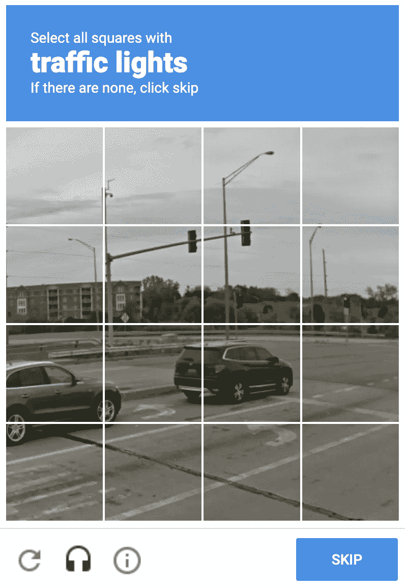

# 现象学:下一次人工智能浪潮

> 原文：<https://towardsdatascience.com/phenomenology-the-next-ai-wave-467a536ef7a5?source=collection_archive---------23----------------------->

## 现象科学如何帮助 AI 进行下一步的认知探索。

现象学之父埃德蒙德·胡塞尔。资料来源:literariness.org

如果你应该解释什么是桌子，你会惊讶地发现这有多难，尤其是当你在和一台电脑说话的时候。人工智能的下一个突破将会是——给人工智能带来现象学。我们可以尝试如下定义一个表:

*   桌子有四条腿:
*   桌子是由木头制成的；
*   桌子有一个平面；
*   桌子是长方形的；
*   桌子主要是用来吃饭或放东西的。[【1】](#_ftn1)

这不是一张桌子。资料来源:Roomandboard.com

大多数人对这个定义感到很舒服:一个有四条腿的物体，由木头制成，表面平坦呈长方形，主要用于用餐或放东西。然而，如果桌子是椭圆形的，放在底座上(而不是腿)等等，事情就变得复杂了。任何可以想象的用语言解释的方法都可能失败。

如果你曾经登录过 reCAPTCHA(“我不是机器人”)的网站，你应该知道计算机区分物体有多难。挑战应答测试用于确定用户是否是人类。呈现一系列图像，用户必须点击与文本相关联的相应图片。“交通灯”、“人行横道”、“汽车”，是一些常见的例子。

reCAPTCHA 试验。来源:谷歌。

reCAPTCHA 使用一套非常复杂的技术。然而，该算法并不关心对象的内在和客观定义，而是大多数人对它们的感知。大多数人点击的是真相更可能显化的内容。在正常曲线中，如果你在平均值的某个标准偏差范围内，你最有可能是人类。从这个意义上说，即使呈现的图像不是“交通灯”，而是看起来像“交通灯”，大多数人也会点击它，从而强化学习算法。

幸运的是，我们有现象学。

现象学是由埃德蒙德·胡塞尔首先提出的，它试图反思现象的结构和意识，并创建一个框架来科学地研究它们。它最重要的主题之一是所谓的想象变异。想象变异试图通过挑战来解构我们的固有观念和偏见。回到我们的表的例子，富有想象力的变化会问:

*   如果没有腿，还会是桌子吗？
*   如果不是木头做的，还会是桌子吗？
*   如果它没有平面，还会是桌子吗？
*   如果它不是长方形的，还会是桌子吗？
*   如果桌子不是主要用来吃饭或放东西的，那它还是桌子吗？

如果这些答案中有任何一个是否定的，那么，这个定义可能是错误的。

reCAPTCHA 可能专注于交通相关的挑战，这可能会给我们一个暗示，即其母公司谷歌将如何处理这些数据:上传到自动驾驶汽车中。全球每天都有数百万用户训练该算法。这些海量的数据可以帮助自动驾驶汽车确定要避开什么和遵循什么标志。在这种情况下，算法就像人类一样，不知道“交通灯”到底是什么(类似于模糊的表定义)，但它知道当它看到它时，它就是交通灯。

现象学的工作方向相反。而强化 AI algo 用的是“它是什么就是什么”，现象学则试图用系统的反思来研究经验和意识。因此，交通灯不仅仅是你所看到的，而是一系列有意识的体验，如判断、感知和情感。

一张桌子不仅仅是一张桌子，因为对观察者来说它看起来是一张桌子。一定还有别的原因。如果一张桌子仅仅是物理视觉属性的集合，一个盲人将不能描述或感觉一张桌子。人类将无法拒绝“看起来”是它们本来面目的事物。

如果你想知道字典上是怎么说的，桌子是“一件由固定在腿上的光滑平板组成的家具”[【2】](#_ftn2)。在你查的任何一本字典里，这个定义都是完全错误的。另一方面，谷歌有一个更好的字典:二进制字典。它不是用几个词来定义一个表格，而是有来自数百万用户的万亿字节的训练数据，这些数据准确地定义了什么是表格，什么不是。

这是未来主义词典。词语不会由*或其他词语*来定义，而是由一组复杂的情绪、图像和意识的数字数据来定义。一个简单的词，如“table ”,将是大量的数据，可以用文字(数百页，解释表格是什么)或潜在表格类型的几个图像呈现给读者。

自人工智能兴起以来，哲学一直是与技术不断融合的领域。将现象学引入 AI 可以帮助我们更好地理解如何建模和存储数据。人类的感知是如何脱离人工智能的，以及如何被调和。现象学是一个奇妙的领域，肯定会成为人工智能的基础部分。

[【1】](#_ftnref1)PHILO-notes——Youtube

[【2】](#_ftnref2)韦氏词典