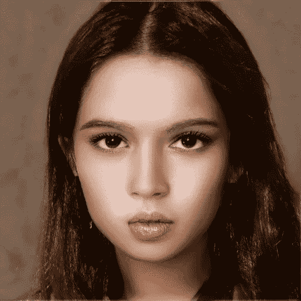

# Photoshop 神经化了

> 原文：<https://towardsdatascience.com/photoshop-goes-neural-c24244b6398?source=collection_archive---------2----------------------->

## Adobe 的 8 种神经过滤器及其替代品。

图片(截图)作者。

U**pdate v 22.0 for Photoshop(2020 年 10 月 20 日)**具有历史意义。它不仅仅是一些 bug 修复或 UI 增强。此次更新包括神经过滤器——基于 GAN 和神经网络的图像处理工具。最后，不仅数据科学家和人工智能研究人员可以从视觉领域的机器学习中受益，视觉艺术家、创意机构和所有与图像打交道的人也可以受益。

但是有这么闪亮吗？即使 Adobe 已经在其 Sensei 框架中使用了 ML 的强大功能(在内容感知缩放或变形剪切等方面)。)，但是这个创意垄断者能让我们相信他们的神经工具的质量吗？让我们先看看它，不带偏见，已经准备好了，因为我们同时[了解并使用了许多基于 GAN 的解决方案](/12-colab-notebooks-that-matter-e14ce1e3bdd0?source=friends_link&sk=3cae22488e4bff5f01a1e71fb01975c8)。我们是谁可以比较。

## 工具种类

正如你在标题中看到的，Adobe 正在推出越来越多的过滤器。目前，大约有一半是可用的，这可以通过智能人像来补偿，有许多参数可以尝试。您可以声明其余每个产品的测试状态:

图片(截图)作者

所以让我们开始吧！

# 特色过滤器

## 01.皮肤光滑

Adobe 神经过滤器的主要目标群体是创意机构，他们希望在效率方面受益于 ML。

> **免责声明**:对于本出版物中的肖像实验，我使用的是由[art breader](/artbreeder-draw-me-an-electric-sheep-841babe80b67?source=friends_link&sk=2fff2b9e102ce632d725e58bfa4c67dd)基于 StyleGAN/StyleGAN2 生成的图像。我尝试了“人体摄影”，结果也令人信服。出于版权和隐私的考虑，这里使用了人工智能生成的图像。

滤镜“**皮肤平滑**”(特色滤镜)肯定会受到摄影师的欢迎，他们希望以数字方式“修饰”他们的模型(我在这里保持中立，即使我更喜欢自然的面部特征，而不是大量修饰)。

皮肤平滑滤波器

你可以控制照片的模糊和平滑度。如你所见，每一个过滤器都经过评估——Adobe 正在收集所有过滤器的反馈，倾听用户的意见。协作开发是一件好事(我希望他们能实现用户的想法)。

这里有一个女性面孔的例子:

左:原始([卡夫卡少女](https://medium.com/merzazine/kafka-as-a-girl-beautiful-metamorphosis-5667ef88dec1?source=friends_link&sk=e1d0f6d1d15e37e63b03bade203d0bb3)，用[美术师](/artbreeder-draw-me-an-electric-sheep-841babe80b67?source=friends_link&sk=2fff2b9e102ce632d725e58bfa4c67dd)生成)，中:应用“皮肤平滑”，右:滤镜层//作者图像

男脸也行。

左:原始(用 Artbreeder 生成)，中:应用“皮肤平滑”，右:过滤层//作者的图像

围绕这样的相面神经实验[经常有争议](https://www.theverge.com/2019/12/20/21031255/facial-recognition-algorithm-bias-gender-race-age-federal-nest-investigation-analysis-amazon)。这个系统经常有偏差，对有色人种的图像效果不好。问题是在这些 ML 模型被训练的数据集中[缺少多样性](/diversity-is-what-we-need-98b5f09287c1?source=friends_link&sk=a18a8a475040ce30b213cb9abfd331fd)。这是最关键的问题之一，尤其是现在，因为我们正在为未来的人工智能系统建立训练基础。

Adobe 意识到了这些问题。**亚历山大·科斯丁**， *Adobe 负责创意云的工程副总裁*在接受 [The Verge](https://www.theverge.com/2020/10/20/21517616/adobe-photoshop-ai-neural-filters-beta-launch-machine-learning) 采访时表示:

> “我们面临的最大挑战之一是保持肤色，[……]这是一个非常敏感的领域。[……]如果它在太多的白人脸上训练它的算法[……]它的神经过滤器可能最终会将人工智能编辑的肖像推向更白的肤色”( [The Verge](https://www.theverge.com/2020/10/20/21517616/adobe-photoshop-ai-neural-filters-beta-launch-machine-learning) )

在我的实验中，我没有观察到这样的问题——要么它已经被修复，要么我们需要测试更多的图像。(在“固定”下，我将理解为在具有更大多样性的人脸数据集上对系统进行重新训练，这需要时间，但对于让 AI 更少偏见来说非常重要)。

左:原始(用 Artbreeder 生成)，中:“皮肤平滑”应用//作者的图像

> **优点** *快速简单的增加面部光滑度的方法。
> **缺点** *最终，偏颇的网络，有待更多的考验。

## 02.风格转移

另一款*精选滤镜*是一款[好旧](https://medium.com/merzazine/ai-creativity-style-transfer-and-you-can-do-it-as-well-970f5b381d96?source=friends_link&sk=258069284f2cca23ff929283c90fba0e)**风格转移**。

这个过滤器在本地 GPU 上运行。这里你有多种风格，都是预先设定好的。我当时数了 52 种风格。

当前更新于 2020 年 10 月 22 日测试//图片由作者提供

您还可以控制对目标图像的效果影响。

使用来自 good old(2018)[Style Transfer Colab Notebook](https://colab.research.google.com/github/tensorflow/lucid/blob/master/notebooks/differentiable-parameterizations/style_transfer_2d.ipynb)的图像，我试图将梵高的《星夜》的风格转移到伦敦的照片上。

下面是原始 Colab 笔记本的结果供参考，该笔记本使用 Tensorflow 的 **Lucid** :

来自[风格转移的令人信服的结果。大本钟图片:(](https://colab.research.google.com/github/tensorflow/lucid/blob/master/notebooks/differentiable-parameterizations/style_transfer_2d.ipynb)[tensor flow Lucid Repository](https://storage.googleapis.com/tensorflow-lucid/static/img/notebook-styletransfer-bigben.jpg)

对于我的 Photoshop 实验，我使用了相同风格的转移源图像(梵高的《星夜》)。幸运的是，它在提供的样式集合中可用——这里我们有第一个缺点:除了前面提到的 Colab 笔记本，Adobe Photoshop 不允许您上传您的图像以供样式转换参考(至少在当前版本中)。Adobe 的结果相当发人深省。

由 Adobe CC 进行的样式转换(具有不同的样式强度/画笔大小)，图像由作者提供

以下是其他一些尝试:

分别是:《黑客帝国》、《火影忍者》和《康定斯基》

在这个滤镜的特性中，你会发现风格强度和笔刷大小的调整。您可以模糊背景，甚至在样式转换期间保留目标图像的颜色。风格转移过滤器很有前途，提供了有用的功能，但是它的结果和你在“风格转移”下理解的相差甚远。有趣的是，几年前的 Lucid 表现更好。

> **优点**
> *简易概念滤镜
> *各种风格参考图片(目前:52 张)
> *风格力度、保色等可调功能。
> **缺点**
> *没有真正令人信服的结果
> *没有可能使用您的图像作为风格参考

到目前为止，这些是**特色滤镜**，但 Photoshop Neural Filter collection 提供了更多——其他滤镜处于开发状态“测试版”，但提供了一些有趣和令人惊讶的效果。

**另类:** [风格转移 Colab 笔记本](https://colab.research.google.com/github/tensorflow/lucid/blob/master/notebooks/differentiable-parameterizations/style_transfer_2d.ipynb)(根据 TensorFlow 的 Lucid 改编)。免费且效果不错，即使没有调节功能。

# 贝塔过滤器

## 03.智能肖像

这可能是目前 Photoshop 中最有趣的神经过滤器之一。

这里我们有一个基于 GAN 的面部图像中各种元素的处理。通过控制定义的层，你可以改变肖像的许多特征。对于熟悉 GAN 基应用的人来说，像 ArtBreeder 这样的层调整是众所周知的。最新版本的 Artbreeder 主要运行在 StyleGAN 上，甚至提供了更多不同的功能。

截图来自[art breader](https://artbreeder.com/i?k=ff0230395e349fb7118f)，(图片由作者提供)

对于我的进一步实验，我将使用 GAN 生成的图像(KafkaGirl)和一个现有人物的照片。

左图:[卡夫卡少女](https://medium.com/merzazine/kafka-as-a-girl-beautiful-metamorphosis-5667ef88dec1?source=friends_link&sk=e1d0f6d1d15e37e63b03bade203d0bb3)(图片由作者提供)，右图:[维姬·赫拉迪尼斯](https://unsplash.com/@vhladynets?utm_source=unsplash&utm_medium=referral&utm_content=creditCopyText)的照片

亚历山德鲁·科斯丁在推特上提到了原因:

正如我们将在下面看到的，的确**智能人像**在原始照片人像(Photoshop 主要用户的实际兴趣领域)上效果更好。

**凝视**

在 Photoshop 中，你可以校正人像的凝视，效果惊人的好。(恰恰这个功能在 Artbreeder 中还是缺失的)。

左:原始图像，右:凝视调整图像//作者提供的图像

最大限度地凝视原始照片。我想，你可以用不同的图像获得不同的结果。照片由[维姬·赫拉迪内斯](https://unsplash.com/@vhladynets?utm_source=unsplash&utm_medium=referral&utm_content=creditCopyText)

改变表情特征似乎还是有发展能力的。比如“幸福”。

**幸福**

虽然 art breader(style gan 2)稍微改变了面部的其他特征，并生成了和谐而真实的表情，但 Adobe 的神经过滤器几乎将微笑放在了一张具有逼真牙齿的脸上，但面部的其他部分仍然保持不变。

左:原创，中:Photoshop“快乐”，右:Artbreeder“快乐”

在原始照片的情况下，效果更好:

照片由[维姬·赫拉迪内斯](https://unsplash.com/@vhladynets?utm_source=unsplash&utm_medium=referral&utm_content=creditCopyText)拍摄

原因已经在上面提到了:“面部保留”是智能肖像的主要焦点，因为使用 Photoshop，创意人员应该改变面部的一些特征，但不是面部

**愤怒的**

由于跨层注意力，你输入的音量越大，ArtBreeder 的图像就越容易从原始图像中替换出来。然而，您可以通过重新调整其他图层来抵消这些意外的变化。“愤怒”似乎更复杂，难以修正(可能是因为 FFHQ，Flickr-Faces-HQ 数据集，StyleGAN2 上缺乏“愤怒”的图像)。

左:原创，中:Photoshop“生气”，右:Artbreeder“生气”

尽管如此，Artbreeder 在 StyleGAN 生成的图像上用情感力量做得更好。

这是人类的照片:

照片由[维姬·赫拉迪内斯](https://unsplash.com/@vhladynets?utm_source=unsplash&utm_medium=referral&utm_content=creditCopyText)拍摄

**面部年龄。**

这是 Artbreeder 仍然是赢家，至少关于合成 GAN 创造的脸。如果你把 Photoshop 中的调节器“面部年龄”移动到右边的极限，你会得到一个稍微老一点的女孩，有着几乎看不见的双下巴和旧的脖子皮肤。极限艺术培育者创造奇迹。

左:原创，中:Photoshop“面部年龄”，右:Artbreeder“年龄”

Photoshop 智能人像中的面部年龄处理确实比原始人类照片更好:

左:原文，中:年龄="-50% "，右:年龄= "+50% "，照片由 [Vicky Hladynets](https://unsplash.com/@vhladynets?utm_source=unsplash&utm_medium=referral&utm_content=creditCopyText) 拍摄

**头部方向**

这个功能在 Artbreeder 中仍然没有，可能是 Photoshop 的一个亮点，但它仍然可以改进。在这种情况下，我结合了头部方向和凝视:

左:原创，右:Photoshop“头部方向:50”+“凝视:50”。

改变后的图像有问题，比例或构图不太对。

使用人类照片可以获得更好的效果:

照片由 [Vicky Hladynets 拍摄](https://unsplash.com/@vhladynets?utm_source=unsplash&utm_medium=referral&utm_content=creditCopyText)

**光线方向**

这个功能是必不可少的，尤其是在拼贴画或把一个人放在另一张照片中的情况下。唉，这个功能目前有问题:随机像素跳出了构图。

左:原文，右:Photoshop“头部方向:50”+“凝视:50”+“光线方向:50”。

尽管如此，这个功能对 Photoshop 来说是非常重要的(可能是非常需要的),我确信，这个功能还会改进。

这种错误在人类照片上是看不到的:

照片由[维姬·赫拉迪尼斯](https://unsplash.com/@vhladynets?utm_source=unsplash&utm_medium=referral&utm_content=creditCopyText)拍摄

**其他功能**

智能肖像还有一些其他功能，在特定情况下很有用:

头发厚度让头发以非常自然的方式生长。

**放置**在背景之前移动头部——缺失的背景被内容敏感地填充(可能是修复)。

总而言之，智能肖像是使用神经网络的一个伟大开端，只是它仍然需要在各种情况下进行改进。

> **优点**
> *凝视、头部方向、位置、听觉厚度效果非常好——
> * Photoshop 可以受益于人工智能驱动的面部调整，这种趋势很有前途
> **缺点**
> *仍有很大的改进余地
> *功能上的变化很小

**备选** : [艺术育种](/artbreeder-draw-me-an-electric-sheep-841babe80b67?source=friends_link&sk=2fff2b9e102ce632d725e58bfa4c67dd)，肯定。即使它是由 StyleGAN 驱动的，但你可以上传现有的图像，并用所有 StyleGAN 生成的面部进行更改。唯一的问题是:有时上传的图像看起来与原始图像不同，我想这是由于与潜在空间的对齐。StyleGAn 似乎在“纠正”图像。

## 04.化妆转移

如果您想要将相同的化妆设置应用于不同的面部(反之亦然)，此功能非常有用。

左:目标图像，艺术培育者，中:化妆源图像，由[安德烈·萨金塞夫](https://unsplash.com/@zvandrei)拍摄/右:艺术培育者

在这个实验中，颜色并不真正对应于化妆源图像，可能还取决于源图像和目标图像。

## 05.深度感知薄雾

这个过滤器可以检测图像的遮挡，效果惊人的好。尤其是有透视效果的照片，在消失点附近播放，这样的效果更有表现力。

左:原始图像，右:作者在最大//图像上的深度感知模糊

在下一张剧院舞台模型的图片中，你甚至可以看到前景中结构的对比:

左:原始图像，右:作者在最大//图像上的深度感知模糊

在此图像中，您可以更好地区分背景和前景，并强调前面的对象:

左:原件，右:

作者照片。

不过，我更喜欢深度感知模糊而不是薄雾，以获得更好的照片表现力，这一功能已经在许多智能手机相机中使用。使用 Photoshop，你也可以做到这一点，但有几种变通方法(例如“[场模糊工具](https://www.digitaltrends.com/photography/how-to-blur-a-background-in-photoshop/)”)，但上面的这种方法可以非常有效地支持这种功能。

我想知道，人工智能驱动的 [3D 本·伯恩斯效果](/very-spatial-507aa847179d?source=friends_link&sk=dc49882dea2a713647ba0acc4189be95)或 [3D 摄影修复](/3d-photography-inpainting-exploring-art-with-ai-adb390a09810?source=friends_link&sk=82bf65322e49e5e713aaa785fbaa91e8)何时将由 Photoshop 实现——或者也由 After Effects 实现？

## 06.使…变成彩色

如果你正在寻找由 Jason Antic 实现的著名的 [DeOldify](/deoldify-gan-based-image-colorization-d9592704a57d?source=friends_link&sk=925195b692f4922b90814ff8cc537e1b) 版本，你可能会失望。

杰森本人最近表示:

的确，Adobe 没有使用 DeOldify。回到我的 DeOldify 实验，我被颜色的想象力震惊了。

为了比较，这里有一张黑白照片，#去彩色化，#彩色化。

左:原件(照片:弗拉基米尔·佩雷尔曼)，中:去彩色化，右:土坯彩色化

即使在 Adobe Colorize 的情况下，您可以调整颜色平衡，甚至定义*焦点颜色*和*场景颜色*，质量仍然有点暗淡。只需比较一下 DeOldify 赋予生命的花朵颜色的丰富程度——在 Photoshop 中，它仍然是一种简单的棕褐色。

**替代**:deol dify([GitHub](https://github.com/jantic/DeOldify)/[Colab Notebook](https://colab.research.google.com/github/jantic/DeOldify/blob/master/ImageColorizerColab.ipynb))或其在 [MyHeritage](https://www.myheritage.de/incolor) 中的实现。

## 07.超级变焦

“增强！”——我猜想德卡德用的是 Photoshop 的 SuperZoom。因为这种品质令人信服。

除了缩放功能，您还可以增强图像细节并消除 JPEG 伪像(如果您放大的是小的 JPG 低质量图像)。你也可以减少噪音和锐化图像。

如果你比较原始的“放大”图像及其所有像素伪像和增强的超放大图像，你可能会同意我的观点。

左:原创，Richt: SuperZoom //作者图片。

当然，仍然有新的神器，但锐度和形状都拍得非常好。

它还可以增强文本:

上图:原始照片，左:原始缩放，右:超级缩放(图片由作者提供)

## 08.JPEG 伪像消除

万一你要恢复数字图像，尤其是 jpg 文件，因为压缩过重而产生了伪像。Photoshop 在这里扮演着一个专业工具的角色——正如人们应该假设的那样。

比如我拍了这张照片，压缩到 50%:

这是工件的压缩缩放视图:

JPG 文物

没有 JPG 文物

如你所见，小故障已经消失，我们有适当的对比和模式。Here works ML for Adobe。

## 即将推出的过滤器

神经过滤器的其余部分仍在构建中——有几个非常有前途的功能，如

*   照片修复(去除噪声，带来清晰度和对比度)
*   灰尘、划痕和噪音减少
*   照片到草图
*   素描到肖像(使素描成为照片般逼真的图像)——在这两种情况下，它都可能基于 [CycleGAN](https://medium.com/merzazine/ai-creativity-visual-anarchist-realism-of-cyclegan-and-how-ai-cheats-on-developers-ab2b3cb9eb8d?source=friends_link&sk=310d2fba831b87177a99d793d94e6caa) 。
*   仅提及一些不可用但已宣布的神经过滤器。

# 结论

Photoshop 作为专业人员和创意人员的图像处理工具，开始直接使用 ML 模型和人工智能的力量。这仍然是一条很长的路，而且非常麻烦(甚至用户界面也有奇怪的行为)。但这是一个很好的开始。尽管如此，人工智能社区现有的实现和实验在质量上已经超过了 Photoshop 看看 StyleGAN2、[art breader](/artbreeder-draw-me-an-electric-sheep-841babe80b67?source=friends_link&sk=2fff2b9e102ce632d725e58bfa4c67dd)、 [DeOldify](/deoldify-gan-based-image-colorization-d9592704a57d?source=friends_link&sk=925195b692f4922b90814ff8cc537e1b) 、 [RunwayML](https://runwayml.com/) 套件。

人工智能世界正在走向创意词，创意词也越来越接近人工智能世界——两者之间从来没有边界。

机器学习和艺术、创造力和人工智能的共存激发并展示了我们未来充满希望的前景，这已经开始了。

> **更新日期:2020 年 10 月 23 日**。在亚历山德鲁·科斯丁发表了一些评论和信息后，这篇文章被更新了。