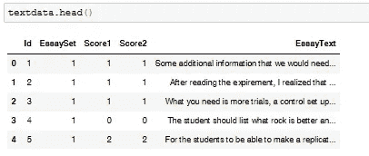
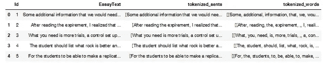
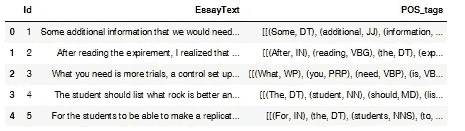
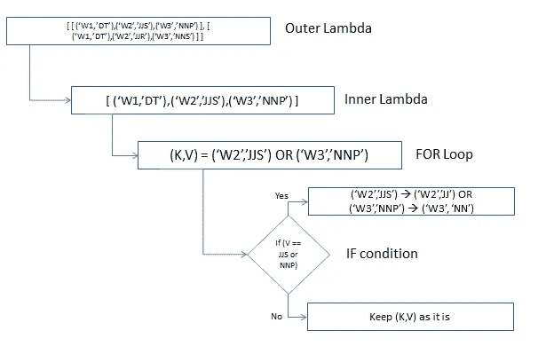

# Python 中的 NLP:从对话中提取意图

> 原文：<https://towardsdatascience.com/phrase-extraction-in-python-using-lists-tuples-and-lambda-functions-fa0d2eed6dbb?source=collection_archive---------24----------------------->

## 自然语言处理

我遇到的 python 最重要和最有用的特性之一是它的 Lambda 函数。就 Lambda 函数的使用而言，所有的在线课程都只是皮毛。然而，真实世界的用例需要对其特性的高级理解和实现。

在本文中，我们将看到 lambda 函数如何应用于包含复杂数据类型的列。我们将从基本操作开始，转到使用 lambda 函数的更高级的方法。我将给出一些例子，在这些例子中，我使用了 lambda 函数来处理一个数据帧，该数据帧由使用列表和元组的文本数据组成。

我将对从 Kaggle 的一个竞赛中获得的文本数据进行*词性*标记，以演示实现。

让我们开始吧。

# **基本面**

重要的事情先来。我快速复习了 python 中的列表、元组和 lambda 函数。

## *Python 中的列表*

List 是 python 中的一个集合。它允许你有重复的条目，它是有序的和可变的。python 中一个简单的列表例子。

```
mylist = [‘R’,’Python’,’Scala’,’Java’,’Go’,’SQL’]mylist[0:2]
#OR
mylist[:2]
***Out[1]:['R', 'Python']***# Negative Indexing
mylist[-1]
***Out[2]:'SQL'***
```

列表还有其他一些操作，但是这超出了本文的范围。您可以删除、添加或更改项目。您可以创建一个重复的列表或合并两个列表。如果你想学习更多关于这些函数的知识，有很好的在线教程。

## *Python 中的元组*

元组是一系列不可变的 Python 对象。元组和列表的主要区别在于元组是不可变的，并且使用圆括号而不是方括号。

```
mytuple = ('R','Python','Scala','Java','Go','SQL')mytuple[0:2]
#OR
mytuple[:2]***Out[3]:['R', 'Python']***mytuple[0] = 'Julia'

**TypeError: 'tuple' object does not support item assignment**
```

## Python 中的 Lambda

lambda 函数是一个小型匿名函数，它可以接受任意数量的参数，但只能有一个表达式。

语法:***λ参数:表达式***

下面是一个使用 lambda 函数将两个数相加的简单例子。如您所见，它极大地简化了为每个操作创建独立函数的操作。当处理大型数据集，并且您希望对数据集的整列应用函数时，它变得非常有用。

```
## Function to add 2 numbers **without LAMBDA** ## 
def addition(a,b):
   return a+baddition(3,5)
```

***Out【6】:8***

```
## Function to add 2 numbers **with** **LAMBDA** ##
 addition = lambda a,b:a+baddition(3,5)
```

***Out【7】:8***

# 深潜

现在我们已经对列表、元组和 lambda 函数有了基本的了解。让我们来做一个更真实的练习。

我已经从[这个](https://www.kaggle.com/c/essay-scoring/data)链接中提取了文本数据来做这个练习。最初的竞赛要求参与者对文本数据中的简短答案(EssayText)进行评分。下面是数据集的前 5 行。它由 **17207** 行数据组成。



短文文本数据( [Kaggle](https://www.kaggle.com/c/essay-scoring/data) )

在我们的案例中，我们不打算为论文评分建立一个机器学习模型。我们将在*‘essay text’*列上构建一个词性(POS)提取器函数。我们将在这些列上运行一系列操作，目标如下-

*   了解数据框上的列表和元组操作
*   用于数据帧的文本列的标记化和词性标注
*   使用 lambda 函数进行涉及列表和元组的复杂运算
*   python 中带有 FOR 循环和条件 IF 的嵌套 lambda 函数

1.  **分词** —第一步也是最重要的一步是**将文本数据分词**成单个单词。幸运的是，我们这里的数据已经是一个干净的文本，不像真实世界的 NLP 用例。这为我们节省了一些时间。我应用了两种类型的记号化-

> 句子标记化—它分隔文本中的各个句子。我使用了' \n '作为分隔符。
> 
> 单词标记化——它将句子分成单个单词。

下面是使用 **Lambda** 函数进行标记化的代码:

```
*## Tokenize Sentences based on \n character ##*
*textdata[“tokenized_sents”] = textdata[“EssayText”].apply(lambda row: row.splitlines())

## Tokenize Words ##
textdata[“tokenized_words”] = textdata[“tokenized_sents”].apply(lambda row: [nltk.word_tokenize(i) for i in row])**## Remove empty elements in list of list ##
textdata[“tokenized_words”] = textdata[“tokenized_words”].apply(lambda row: [x for x in row if x])**textdata.head()*
```

以上 3 个操作很好地利用了 lambda 函数，将函数应用于整个列。句子标记化根据' \n '字符分隔文本。

为了对单词进行标记，我们使用 NLTK 库中的 *word_tokenize* 函数。每行有多个句子，因此，FOR 循环用于迭代一行中的每个句子。

第三个操作从列表中删除空元素，该列表是作为句子和单词标记化的一部分生成的。

这是我们的数据框在标记化后的样子。我有意删除了未使用的列，如 *Score* 和 *Essayset*



句子和单词标记化后的数据框架—作者提供的图像

基于' \n '进行标记很容易，因为我们有一个现成的 python 函数 *splitlines()。*然而，在现实世界的场景中，你可能想要分割其他一些没有功能的角色。例如一个点或一个逗号。lambda 函数仍然使它变得简单。这是我如何用点符号做的-

```
*## Tokenize Sentences based on ‘.’ character ##
textdata[“tokenized_sents”] = textdata[“tokenized_sents”].apply(lambda row: [i.split(“.”) for i in row])*
```

这里我们使用嵌套迭代，其中对于 essaytext 列中已经在' \n '字符上标记化的每个值，将在'.'上进一步标记化性格。

**练习—你能通过使用 lambda 函数而不是 FOR 语句来尝试上面的方法吗？

滚动前先试一试。

```
*## Tokenize Sentences based on ‘.’ character ##
textdata[“tokenized_sents”] = textdata[“tokenized_sents”].apply(lambda row: list(map(lambda m: m.split('.'), row)))*
```

嵌套的 Lambda 函数。让我们把这个留到博客的后半部分。

**2。词性标注** —为了进行词性标注，我们将使用 NLTK 库提供的词性标注器。

```
*## Part-of-Speech Tagging for each word in the corpus ##
textdata[“POS_tags”] = textdata[“tokenized_words”].apply(lambda row: [nltk.pos_tag(i) for i in row])*
```

*代码解释*——它将 *pos_tag* 函数应用于每个单词，以确定其对应的词性。POS 标签作为元组列表的 ***列表存储在我们感兴趣的列中。对于这个特定的数据，元组列表就足够了，因为每个短文文本都是一个句子。然而，在你为每个文本选择多个句子的情况下，它将需要被存储为元组列表的列表。***



为文章文本中的每个单词生成的词性标签—按作者分类的图片

让我们仔细看看为第一篇短文文本生成的位置标签

```
[[('Some', 'DT'),
  ('additional', 'JJ'),
  ('information', 'NN'),
  ('that', 'IN'),
  ('we', 'PRP'),
  ('would', 'MD'),
  ('need', 'VB'),
  ('to', 'TO'),
  ('replicate', 'VB'),
  ('the', 'DT'),
  ('experiment', 'NN'),
  ('is', 'VBZ'),
  ('how', 'WRB'),
  ('much', 'JJ'),
  ('vinegar', 'NN'),
  ('should', 'MD'),
  ('be', 'VB'),
  ('placed', 'VBN'),
  ('in', 'IN'),
  ('each', 'DT'),
  ('identical', 'JJ'),
  ('container', 'NN'),
  (',', ','),
  ('how', 'WRB'),
  ('or', 'CC'),
  ('what', 'WP'),
  ('tool', 'NN'),
  ('to', 'TO'),
  ('use', 'VB'),
  ('to', 'TO'),
  ('measure', 'VB'),
  ('the', 'DT'),
  ('mass', 'NN'),
  ('of', 'IN'),
  ('the', 'DT'),
  ('four', 'CD'),
  ('different', 'JJ'),
  ('samples', 'NNS'),
  ('and', 'CC'),
  ('how', 'WRB'),
  ('much', 'JJ'),
  ('distilled', 'JJ'),
  ('water', 'NN'),
  ('to', 'TO'),
  ('use', 'VB'),
  ('to', 'TO'),
  ('rinse', 'VB'),
  ('the', 'DT'),
  ('four', 'CD'),
  ('samples', 'NNS'),
  ('after', 'IN'),
  ('taking', 'VBG'),
  ('them', 'PRP'),
  ('out', 'IN'),
  ('of', 'IN'),
  ('the', 'DT'),
  ('vinegar', 'NN'),
  ('.', '.')]]
```

该库在识别每个单词的词性方面做得很好。接下来，我们将对这个元组列表执行一些复杂的操作，以利用列表和元组上的 lambda 函数。

**3。过滤** —假设我们只对词类中包含名词、形容词和限定词的单词感兴趣。我们可以这样做-

```
## PoS of interest ##
pos_tags = [‘DT’,’NN’,’NNS’,’NNP’,’NNPS’,’JJ’,’JJR’,’JJS’]## Filter words for which the POS belongs to the ‘pos_tags’ list
textdata[“POS_tags”] = textdata[“POS_tags”].apply(lambda row: list(map(lambda m: [(x,y) for (x,y) in m if y in pos_tags], row)))
```

*代码解释*-*pos _ tags*列表包含我们想要过滤的所有 POS 代码。lambda 函数迭代每一行，内部 lambda 函数迭代每一行的多个句子，对于一个句子的每个元组列表(word，POSTag ), FOR 循环迭代检查元组中的第二个元素是否出现在 *pos_tags* 列表中。唷！

再读一遍，推荐。

详细的*位置标签*列表-

*   JJ 形容词“小”
*   JJR 形容词，比较级“较小”
*   JJS 形容词，最高级“最小的”
*   名词，单数“椅子”
*   NNS 名词复数“椅子”
*   NNP 专有名词，单数‘Boris’
*   NNPS 专有名词，复数“英国人”
*   DT 限定词

现在让我们检查一下第一篇文章的位置标签

```
[[('Some', 'DT'),
  ('additional', 'JJ'),
  ('information', 'NN'),
  ('the', 'DT'),
  ('experiment', 'NN'),
  ('much', 'JJ'),
  ('vinegar', 'NN'),
  ('each', 'DT'),
  ('identical', 'JJ'),
  ('container', 'NN'),
  ('tool', 'NN'),
  ('the', 'DT'),
  ('mass', 'NN'),
  ('the', 'DT'),
  ('different', 'JJ'),
  ('samples', 'NNS'),
  ('much', 'JJ'),
  ('distilled', 'JJ'),
  ('water', 'NN'),
  ('the', 'DT'),
  ('samples', 'NNS'),
  ('the', 'DT'),
  ('vinegar', 'NN')]]
```

它的工作，只有一行代码！难以置信！

**4。整理** —我想尝试的最后一个操作是根据单词的词性标签将它们组合在一起。也就是说，所有不同形式的名词将表示为“NN ”,所有不同形式的形容词将表示为“JJ ”,如下所示

```
[’NN’,’NNS’,’NNP’,’NNPS’] --> 'NN'
[’JJ’,’JJR’,’JJS’] --> 'JJ'
```

下面是我如何使用**嵌套 Lamda 函数**实现它的

```
## Types of NN and JJ tags ##
noun_tags = [‘NN’,’NNS’,’NNP’,’NNPS’]
adjective_tags = [‘JJ’,’JJR’,’JJS’]textdata[“POS_tags”] = textdata[“POS_tags”].apply(lambda row: list(map(lambda m: [(k,’NN’) if (v in noun_tags) else (k,v) for (k,v) in m], row)))textdata[“POS_tags”] = textdata[“POS_tags”].apply(lambda row: list(map(lambda m: [(k,’JJ’) if (v in adjective_tags) else (k,v) for (k,v) in m], row)))
```

*代码解释-* 所以，迭代数据帧中的每一行(使用外部 lambda)，然后迭代每一个句子(使用内部 lambda)，然后迭代每一个句子中的元组(使用 FOR loop)，如果元组的第二个元素出现在 noun _tags/形容词 _ tags 列表中，那么将第二个元素改为' NN'/'JJ '。图解-



校对的示意图(W = word)-按作者排序的图像

让我们检查一下第一篇文章的结果。

```
[[('Some', 'DT'),
  ('additional', 'JJ'),
  ('information', 'NN'),
  ('the', 'DT'),
  ('experiment', 'NN'),
  ('much', 'JJ'),
  ('vinegar', 'NN'),
  ('each', 'DT'),
  ('identical', 'JJ'),
  ('container', 'NN'),
  ('tool', 'NN'),
  ('the', 'DT'),
  ('mass', 'NN'),
  ('the', 'DT'),
  ('different', 'JJ'),
  ('samples', 'NN'),
  ('much', 'JJ'),
  ('distilled', 'JJ'),
  ('water', 'NN'),
  ('the', 'DT'),
  ('samples', 'NN'),
  ('the', 'DT'),
  ('vinegar', 'NN')]]
```

结果在意料之中。令人惊讶的是，如果我们试图将以 DT 开头、以 NN 结尾的单词作为词性标签进行分组，我们会得到一个有意义的短语。就像第一篇文章，我们可以提取-

```
*‘Some additional information’**‘each identical container’* *‘the vinegar’*
```

我就纳闷了，这能用在哪里！