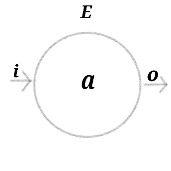

# 智力的物理理论

> 原文：<https://towardsdatascience.com/physical-theory-of-intelligence-865c51f445cf?source=collection_archive---------41----------------------->

## 1.0 版

## 摘要

多年来，我一直在寻找一个能统一我对智力和相关概念的理解的理论。在我遇到的这些框架中，大多数都有一些共同的核心思想，所以我一直试图将它们合并和提炼成一个更加正式和通用的框架。在这里，我想提出 PTI 来试图描述理解智力所需的基本块，在此基础上你可以描述相关的现象。

## 相关研究

让我们先来回顾一下不同领域是如何描述智力的。

在心理学中，可能最著名的理论是斯皮尔曼的一般智力或 *g* 因素。基于多项测试的因素分析，他得出结论，这些测试的分数非常相似。从那以后，心理学家试图描述和测量这一普遍因素，并创造了一系列智商测试来测量广泛的抽象认知能力。虽然这些测试现在被广泛使用，但它们薄弱的理论基础经常导致对结果的误解。

另一方面，一些心理学家试图将智力描述为一个由不同感觉模式、抽象层次或另一种划分心理能力的方式组成的组成系统，如 Thurstone 的初级心理能力、Gardner 的多元智能、Sternberg 的三元模型等。这些通常更具描述性，很少导致可测试的预测或实际测试，但它们捕捉了我们大脑更广泛的能力。

在哲学中，对意识的研究在相关概念中最受关注，但这种意识往往被归因于心理学家所描述的各种认知能力。在我看来，过去几十年中最重要的发展是从笛卡尔剧场/单演员描述模型到分布式计算系统的转变。

在神经科学中，在研究人员发现大脑由通过尖峰信号定期交流的单个神经元组成后，计算模型的发展成为一种趋势。我们已经很好地理解了神经元中尖峰脉冲是如何产生的，以及它们是如何传播的，但对于这种神经模型的回路如何能够代表我们的行为，我们仍然知之甚少。一些理论，如分级时间记忆，使用神经元网络作为基本元素，但这使多尺度分析和实验变得更加复杂。

在神经科学和哲学的边缘，你可以找到像信息整合理论和信息封闭理论这样的模型。IIT——在计算上很难，但对意识的医学研究有着有趣的预测和有希望的近似。ICT 在许多方面都很相似，简化了理论基础和计算，但它相当新，还没有得到很大的发展。

在经济学中，人类通常被建模为使用决策理论的理性主体。这些模型，像功能决策理论一样，非常善于描述代理人应该如何行动以最大化他们的报酬。然而，影响我们行为和个人偏好的大量因素使得很难将这些模型应用到现实世界的场景中。

所有这些研究激发了工程师们去制造能够独立思考的机器。如今，第一台计算机可能看起来像笨拙嘈杂的计算器，但很长一段时间，人们认为做代数需要大量的智力。人工智能工程的现代方法，如人工神经网络和决策树，在各种行业都有更广泛的应用范围，并且在十年前还被认为极其困难的问题上有望取得成果。虽然在严格的规则下通过图灵测试仍然是一个困难的问题，但人工智能生成的内容已经在一些领域与人类竞争，这一方向的研究经常会揭示令人兴奋的发现。

正如你可能看到的，关于智力的问题出现在许多领域，但不幸的是这项研究很少交叉。我相信一个简单的公共理论框架可以帮助解决这个问题。

## 代理人的边界

先说可观测宇宙*和某智能体***a***⊆***u***。一般来说，边界的选择是任意的，但人类、大脑、神经元、硬件和软件最受关注。 ***的补码 a*** 是一个环境 ***E*** ，它可以发送输入 ***i*** 并从 agent 接收输出 ***o*** 。此外，在某些情况下，出于研究或工程目的，构建抽象代理(如数学模型)是有意义的。*

**

*在最基本的层面上，输入和输出被表示为基本粒子，但在大多数情况下，将它们近似为化学物质、符号、电信号、单词或其他方式更有意义。*

*在某些情况下，定义智能体的边界可能相当简单，就像神经元有细胞膜或独立的芯片一样。在其他情况下，就像人类每天使用的所有设备塑造了我们相互交流的方式一样，有人触摸屏幕或发送信息之间出现了一个重要的区别，特别是在所有关于直接脑机接口的研究正在进行的情况下。软件和所有与大多数生产应用程序相关的系统也是如此，细胞、社会团体，甚至是量子态中的基本粒子，它们的边界可能还没有被完全理解。*

*此外，在大多数情况下，跟踪代理的所有输入和输出实际上是不可能的，因为每秒钟都有大量的信息以光子、声波、皮肤压力和其他方式出现。我想强调的是，我们通常不知道代理的完整内部状态，而只知道它发出的一些输出。因此，我们必须意识到干净的实验研究很少是可能的，并据此解释结果。*

## *代理的功能*

*假设代理的*输出不是完全随机的，并且依赖于输入。然后，我们可以将代理的行为建模为一个策略函数***a***(***I***)=***o***。此外，大多数代理根据其先前的状态而随时间变化，因此我们可以将它们表示为***a***(***I****ᵗ*)=***f****ᵃ*(***I****ᵗ*，***a***(**

**最简单的智能体我可以想象是一根抽象的理想电线，谁的策略是一个恒等式函数 ***一个***(***I***)=***I***。**

**我们非常清楚基本粒子和最小原子的行为，它们通常用波函数来描述。对于许多人工的和抽象的代理来说也是如此。然而，更大的分子、细胞、植物、动物和社会代理的政策要复杂得多，所以我们必须处理不同的模型和近似值。即使对代理的功能有一个完整的描述，分析也可能非常困难，就像拥有数十亿参数的现代人工神经网络一样。**

## **代理人的智能**

**假设*在我们观察***I***/***o***时遇到了一些问题，那么我们就可以用一些性能函数***p***(***I***， ***o*** 来估计它做得有多好。在许多情况下，测量值会随时间变化或具有随机性，因此通过一组观察值来计算性能更有意义。此外，在某些情况下，我们真正感兴趣的是相对分数，比如与人类相比，人工智能代理的智商或性能。***

**然后，我们可以将智力的大多数定义描述为一些性能函数。**

**也许最著名的智力指标是智商或智商，它是用来评估人类相对于同龄同龄人的认知表现的。在过去的一百年里，人们开发了一系列智商测试，并进行了大量实验来探索分数与我们生活不同方面之间的相关性。然而，尽管在某些情况下具有统计学意义，这些测试通常测量抽象问题的表现，这使得将结果外推至现实世界问题的空间非常小。此外，在公共领域对智商分数的误解导致了这种测试的声誉不佳，因此大多数心理学家逐渐转向开发更专业的测试。**

**无论如何，智商不是唯一的选择，我们还有各种各样的其他面向人类的测试，用于营销，招聘，医疗，教育和其他目的。一个特别有趣的例子是基于 IIT 的大脑活动意识水平测量。然而，即使是智商也相当不为人所知，而其他测试通常背后的研究就更少了。**

**在更大的范围内，从团体、公司到国家，社会代理人的绩效函数大多来自经济学，如利润、GDP 等。然而，基于成员数量、平均寿命、抑郁率、群体智商和其他社会因素的其他选项也存在。**

**对于人工代理，性能测量问题和解决方案在许多方面都非常相似。对于通常的硬件和软件，第一次测试通常只给出一个二进制输出，不管它是否工作。然后，子系统可能被一个接一个地检查，代理可能被输入过载或者得到特别棘手的输入，以及测试执行速度。一些开发人员甚至将测试作为软件工程的核心。**

**此外，自从晶体管和现代计算机出现以来，人们就一直在思考，如何才能让计算机达到人类水平的智能。最著名的是图灵测试，它主要测量计算机是否可以在书面对话中模仿随机的人类。但是，事实证明，对于短对话来说，这是一项相当容易的任务，随着人工代理能力的增长，开发出了更严格的版本。**

**特别是随着差分编程、统计建模和深度学习的兴起，许多新的性能指标被开发出来，以处理不确定的输出，并使用这些信息来训练这些代理。此外，许多人工智能研究人员正在对每个模型进行多重测试，以确保它们具有尽可能广泛的能力。总的来说，随着人工智能体处理越来越多的人类问题，它们的性能函数变得越来越相似。**

## **公共交通信息技术的问题**

**首先，当我试图把这个理论建立在物理学的基础上时，意识和智力的形而上学方面被完全抛弃了。此外，还有更难衡量的东西，比如艺术带来的审美愉悦、社交技能、道德判断的质量等等。**

**另一个常见的主题是一般智力。虽然心理学家试图提取和解释导致智力测试中许多变化的因素，人工智能工程师也试图建立更好的概括措施甚至人工一般智能，但我认为这最终是一个毫无意义的问题，因为智能体的表现与其环境中的特定问题密切相关。**